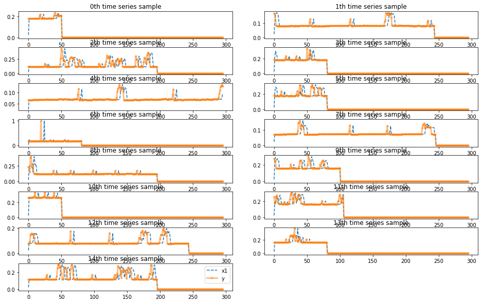
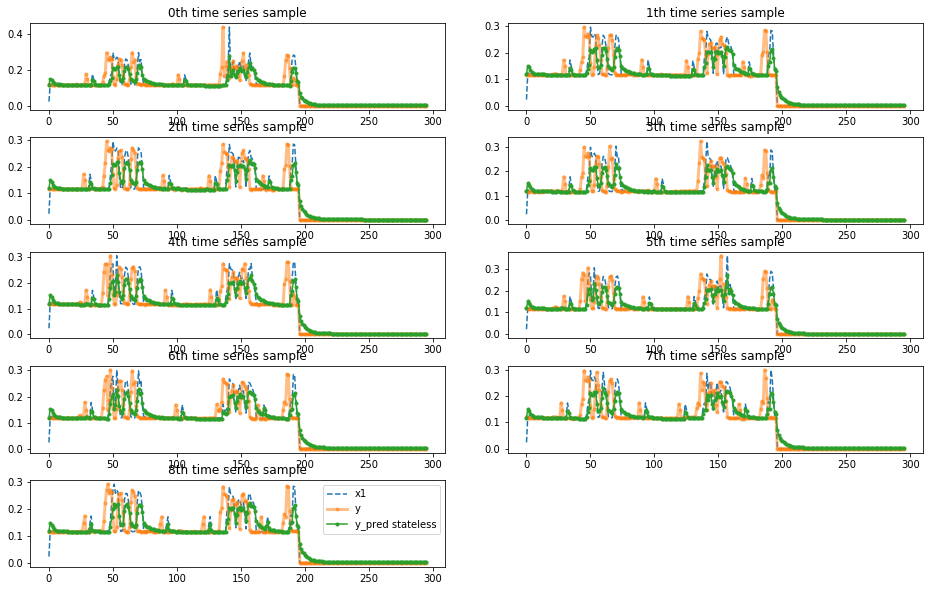
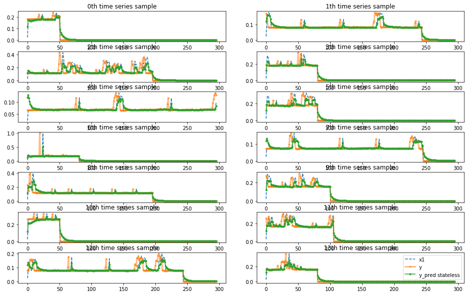

# Train LTSM model with time series data

Problem: predict lap time D laps in the future in a new event based on the historical event data.

In this experiment, we treat the lap time info for each car a time series and bulid lstm model on it.


```python
%matplotlib inline
%load_ext autoreload
%autoreload 2

import pandas as pd
import numpy as np
import matplotlib.pyplot as plt
from keras import models, layers
import time
from sklearn.preprocessing import MinMaxScaler
# to use only one GPU.
# use this on r-001
# otherwise comment
import os
os.environ["CUDA_VISIBLE_DEVICES"]="7"
from indycar.notebook import *
```

    Using TensorFlow backend.


### Load data and Initialization


```python
# predict D lap in the future
D = 5 
# hidden utnits for LSTM
hunits = 16
```


```python
#datalist = ['2017-all_completed_laps_diff.csv','2018-all_completed_laps_diff.csv' ]

#datalist = read_list('train_all.list')
datalist = read_list('train_completed.list')
scaler, dataset, dblens = load_data(datalist)

dataset.info(verbose=True)
print('dataset shape', dataset.shape)
```

    load data/Barber-2018-completed_laps_diff.csv, len=797
    load data/Gateway-2018-completed_laps_diff.csv, len=1992
    load data/Indy500-2017-completed_laps_diff.csv, len=3216
    load data/IndyGP-2018-completed_laps_diff.csv, len=1806
    load data/Iowa-2018-completed_laps_diff.csv, len=1505
    load data/LongBeach-2018-completed_laps_diff.csv, len=1204
    load data/Mid-Ohio-2018-completed_laps_diff.csv, len=1274
    load data/Phoenix-2018-completed_laps_diff.csv, len=2761
    load data/Pocono-2018-completed_laps_diff.csv, len=804
    load data/Portland-2018-completed_laps_diff.csv, len=1907
    load data/RoadAmerica-2018-completed_laps_diff.csv, len=1008
    load data/StPete-2018-completed_laps_diff.csv, len=1554
    load data/Texas-2018-completed_laps_diff.csv, len=2241
    load data/Toronto-2018-completed_laps_diff.csv, len=1290
    load data/Indy500-2018-completed_laps_diff.csv, len=3618
    <class 'pandas.core.frame.DataFrame'>
    Int64Index: 26977 entries, 0 to 3617
    Data columns (total 8 columns):
    Unnamed: 0        26977 non-null int64
    car_number        26977 non-null int64
    completed_laps    26977 non-null int64
    rank              26977 non-null int64
    elapsed_time      26977 non-null float64
    rank_diff         26977 non-null float64
    time_diff         26977 non-null float64
    dbid              26977 non-null int64
    dtypes: float64(3), int64(5)
    memory usage: 1.9 MB
    dataset shape (26977, 8)


```python
# generate train/test dataset

# post-padding with 0
X, y, w = generate_data(dataset, D=D, target='time')

total = np.sum(dblens)
ntrain = np.sum(dblens[:-1])
nval = int(dblens[-1] / 2)
print('train=%d, val=%d, test=%d'%(ntrain, nval, total-ntrain-nval))

X_train, X_val, X_test = X[:ntrain], X[ntrain:ntrain + nval], X[ntrain + nval:]
y_train, y_val, y_test = y[:ntrain], y[ntrain:ntrain + nval], y[ntrain + nval:]
#weights
w_train, w_val, w_test = w[:ntrain], w[ntrain:ntrain + nval], w[ntrain+nval:]
print('train shape:', X_train.shape)
```

    carNumber = 200, max T =301
    train=182, val=9, test=9
    train shape: (182, 296, 1)


```python
#
# plot one car time series for each event
#
firstcar = np.cumsum(dblens)
idx = [0]
idx.extend(list(firstcar)[:-1])
plot_examples(X[idx],y[idx],ypreds=None,nm_ypreds=None)
#plot_examples(X[:10],y[:10],ypreds=None,nm_ypreds=None)
```





```python

```

## Define model


```python
#
# https://fairyonice.github.io/Stateful-LSTM-model-training-in-Keras.html
#
def define_model(len_ts,
                 hidden_neurons = 10,
                 nfeature=1,
                 batch_size=None,
                 stateful=False):
    in_out_neurons = 1
    
    inp = layers.Input(batch_shape= (batch_size, len_ts, nfeature),
                       name="input")  

    rnn = layers.LSTM(hidden_neurons, 
                    return_sequences=True,
                    stateful=stateful,
                    name="RNN")(inp)

    dens = layers.TimeDistributed(layers.Dense(in_out_neurons,name="dense"))(rnn)
    model = models.Model(inputs=[inp],outputs=[dens])
    
    #model.compile(loss="mean_squared_error",
    #              sample_weight_mode="temporal",
    #              optimizer="rmsprop")
    
    model.compile(loss="mean_absolute_error",
                  sample_weight_mode="temporal",
                  optimizer="adam")
    
    return(model,(inp,rnn,dens))
```


```python

model_stateless, _ = define_model(
                    hidden_neurons = hunits,
                    len_ts = X_train.shape[1])
model_stateless.summary()
```

    Model: "model_1"
    _________________________________________________________________
    Layer (type)                 Output Shape              Param #   
    =================================================================
    input (InputLayer)           (None, 296, 1)            0         
    _________________________________________________________________
    RNN (LSTM)                   (None, 296, 16)           1152      
    _________________________________________________________________
    time_distributed_1 (TimeDist (None, 296, 1)            17        
    =================================================================
    Total params: 1,169
    Trainable params: 1,169
    Non-trainable params: 0
    _________________________________________________________________


### train for 500 epochs


```python
start = time.time()
history = model_stateless.fit(X_train,y_train,
                             batch_size=32,
                             shuffle=True,
                             epochs=500,
                             verbose=0,
                             sample_weight=w_train,
                             validation_data=(X_val,y_val,w_val))
end = time.time()
print("Time Took :{:3.2f} min".format( (end-start)/60 ))
for line in history.history.keys():
    plt.plot(history.history[line],marker='.',label=line)
plt.legend()
```

    WARNING:tensorflow:From /scratch/hpda/anaconda3/envs/predictor/lib/python3.7/site-packages/keras/backend/tensorflow_backend.py:422: The name tf.global_variables is deprecated. Please use tf.compat.v1.global_variables instead.
    
    Time Took :11.87 min


    <matplotlib.legend.Legend at 0x7f006c9ead68>


```python
y_pred_stateless = model_stateless.predict(X_test)
plot_examples(X_test,y_test,ypreds=[y_pred_stateless],nm_ypreds=["y_pred stateless"])
```





```python
lstmts_result = predict('lstmts', model_stateless, X_test, y_test, scaler)
print(lstmts_result[0][:10])
```

    lstmts model mae=0.023966, raw mae=5.392019, raw mape=12.039039
    [0.11803528 0.1512082  0.14446549 0.13344195 0.12642843 0.12338037
     0.12062842 0.11947159 0.11912063 0.11928044]


```python
lstmts_result[0][20:60], y_test[0,20:60].flatten()
```


    (array([0.11638539, 0.11656962, 0.11686633, 0.11608727, 0.11598805,
            0.11677881, 0.11762815, 0.1165043 , 0.11542702, 0.11554007,
            0.11619905, 0.11566739, 0.11676511, 0.11596856, 0.14449683,
            0.13704933, 0.12159518, 0.11783002, 0.11704488, 0.11667089,
            0.11620839, 0.11576194, 0.11545351, 0.11485803, 0.11481121,
            0.11462796, 0.11432807, 0.12250184, 0.1406858 , 0.1530005 ,
            0.21019684, 0.20333962, 0.20550498, 0.2163449 , 0.21691324,
            0.17179015, 0.14548936, 0.14043298, 0.1552192 , 0.19401091],
           dtype=float32),
     array([0.11888945, 0.12039819, 0.11779228, 0.11621398, 0.11709358,
            0.11854499, 0.11729048, 0.11990416, 0.11784673, 0.17677009,
            0.14786155, 0.11763872, 0.11587508, 0.11580218, 0.11570862,
            0.11550217, 0.11546328, 0.11569462, 0.11522149, 0.11592997,
            0.11601642, 0.11584641, 0.1329177 , 0.1663938 , 0.18295951,
            0.29718295, 0.260008  , 0.25856192, 0.27230061, 0.26281725,
            0.16239249, 0.11930236, 0.11868077, 0.15233444, 0.22798552,
            0.26191942, 0.25737098, 0.22701481, 0.17061201, 0.12207716]))


### train for 2000 epochs
It is amazing to see the capacity of the model, which predicts the pikes of crashes ''accurately''.
However, the performance goes worse in the cases of pitstops. They are totally ignored.
Overfitting must occur here.
To verify that, let''s train on data of a different event, such as train on 2017 and then test on 2018. 
Another idea is to modify the loss funtion to emphysize on pitstops.


```python
start = time.time()
history = model_stateless.fit(X_train,y_train,
                             batch_size=32,
                             shuffle=True,
                             epochs=2000,
                             verbose=0,
                             sample_weight=w_train,
                             validation_data=(X_val,y_val,w_val))
end = time.time()
print("Time Took :{:3.2f} min".format( (end-start)/60 ))
for line in history.history.keys():
    plt.plot(history.history[line],marker='.',label=line)
plt.legend()
```


```python
y_pred_stateless = model_stateless.predict(X_test)
plot_examples(X_test,y_test,ypreds=[y_pred_stateless],nm_ypreds=["y_pred stateless"])
```


```python
y_pred_stateless = model_stateless.predict(X_train)

idx_train = idx[:-1]

plot_examples(X_train[idx_train],y_train[idx_train],ypreds=[y_pred_stateless[idx_train]],nm_ypreds=["y_pred stateless"])
```





### conclusion

Obviously, the model capture the crashes in 2017 but failed in predicting what happens in 2018.

As crashes are not ''predictable'', we would like to train a model to capture the pitstops rather than the bigger
spikes caused by the ''random'' crashes.

In the next step, let''s try to modify the loss function to suppress the effects of crashes and emphysize on 
pitstops. After all, the ranking are influenced more by pitstops.


```python

```
