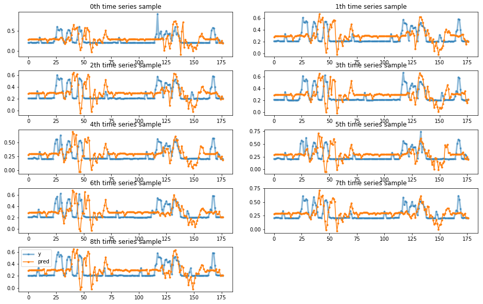
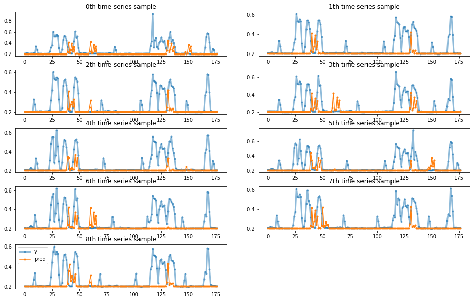
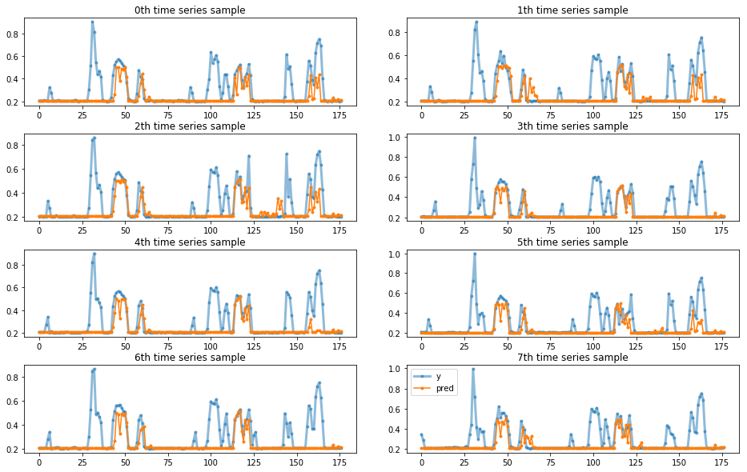
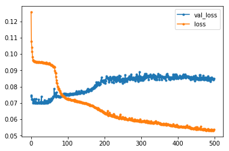
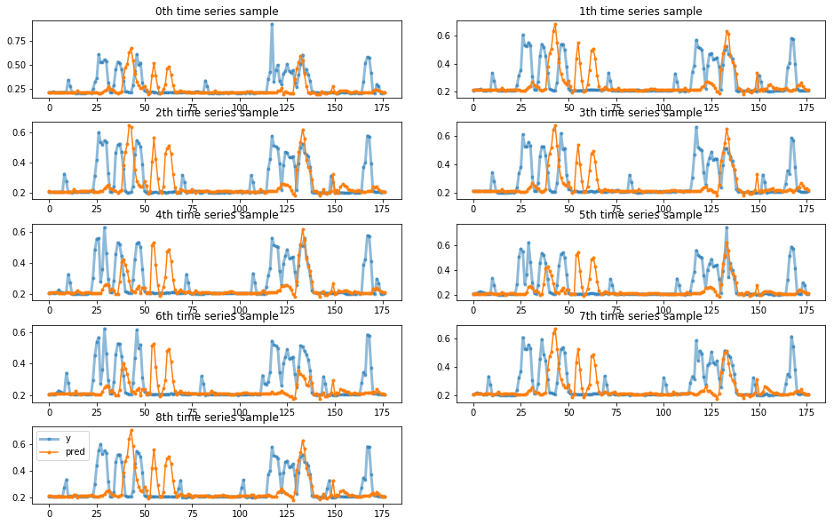
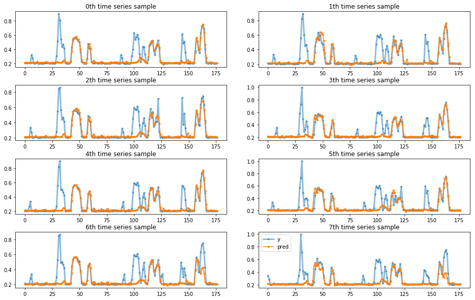

# Train supervised models

Problem: predict lap time D laps in the future in a new event based on the historical event data.

Baseline: extract time series for all the events, generate fixed length input and label pairs. These data can be then used in supervised models, including RF, SVR and NN.


```python
%matplotlib inline
%load_ext autoreload
%autoreload 2

import pandas as pd
import numpy as np
import matplotlib.pyplot as plt
from keras import models, layers
import time
from sklearn.preprocessing import MinMaxScaler
from sklearn.svm import SVR
from sklearn.ensemble import RandomForestRegressor
from sklearn import metrics
# to use only one GPU.
# use this on r-001
# otherwise comment
import os
os.environ["CUDA_VISIBLE_DEVICES"]="6"

from indycar.notebook import *

```

    Using TensorFlow backend.


### Load data and Initialization


```python
# predict D lap in the future
D = 5 
# hidden utnits for LSTM
hunits = 16
```


```python
#datalist = ['2017-all_completed_laps_diff.csv','2018-all_completed_laps_diff.csv' ]
datalist = ['2017-completed_laps_diff.csv','2018-completed_laps_diff.csv' ]
#datalist = read_list('train_all.list')
#datalist = read_list('train_completed.list')
scaler, dataset, dblens = load_data(datalist)

# get event idx
firstcar = np.cumsum(dblens)
event_idx = [0]
event_idx.extend(list(firstcar)[:-1])

dataset.info(verbose=True)
print('dataset shape', dataset.shape)
```

    load 2017-completed_laps_diff.csv, len=3216
    load 2018-completed_laps_diff.csv, len=3618
    <class 'pandas.core.frame.DataFrame'>
    Int64Index: 6834 entries, 0 to 3617
    Data columns (total 8 columns):
    Unnamed: 0        6834 non-null int64
    car_number        6834 non-null int64
    completed_laps    6834 non-null int64
    rank              6834 non-null int64
    elapsed_time      6834 non-null float64
    rank_diff         6834 non-null float64
    time_diff         6834 non-null float64
    dbid              6834 non-null int64
    dtypes: float64(3), int64(5)
    memory usage: 480.5 KB
    dataset shape (6834, 8)


```python
# generate train/test dataset

# post-padding with 0
X, y, w = generate_data(dataset, D=D, target='time')

total = np.sum(dblens)
ntrain = np.sum(dblens[:-1])
nval = int(dblens[-1] / 2)
print('train=%d, val=%d, test=%d'%(ntrain, nval, total-ntrain-nval))

X_train, X_val, X_test = X[:ntrain], X[ntrain:ntrain + nval], X[ntrain + nval:]
y_train, y_val, y_test = y[:ntrain], y[ntrain:ntrain + nval], y[ntrain + nval:]
#weights
w_train, w_val, w_test = w[:ntrain], w[ntrain:ntrain + nval], w[ntrain+nval:]
print('train shape:', X_train.shape)
```

    carNumber = 34, max T =201
    train=16, val=9, test=9
    train shape: (16, 196, 1)


### convert time series into vectors


```python
vec_len = 20
fv_x_train, fv_y_train, idx_train = generate_feature_vectors(X_train, y_train, w_train, vec_len)
fv_x_val, fv_y_val, idx_val = generate_feature_vectors(X_val, y_val, w_val, vec_len)
fv_x_test, fv_y_test, idx_test = generate_feature_vectors(X_test, y_test, w_test, vec_len)
#get event idx from idx array
first_in_event_idx = idx_train[event_idx[:-1]]
```


```python
fv_x_train.shape, fv_x_test.shape, idx_train.shape
```


    ((2832, 20), (1593, 20), (16,))


```python
#ts = X_train[0,:,0]
#ts[ts>0]
```


```python
#ts = X_train[0,:,0]
#np.sum(ts>0)
#fv_x_train[-1], fv_y_train[-1]
```


```python
#ts_y = y_train[0,:,0]
#ts_y[ts>0]
```


```python
#firstcar = np.cumsum(dblens)
#idx = [0]
#idx.extend(list(firstcar)[:-1])
#plot_examples(X[idx],y[idx],ypreds=None,nm_ypreds=None)
#plot_examples(X[:10],y[:10],ypreds=None,nm_ypreds=None)
```

## Define model


```python
#
# https://fairyonice.github.io/Stateful-LSTM-model-training-in-Keras.html
#
def lstm_model(len_ts,
                 hidden_neurons = 10,
                 nfeature=1,
                 batch_size=None,
                 stateful=False):
    in_out_neurons = 1
    
    inp = layers.Input(batch_shape= (batch_size, len_ts, nfeature),
                       name="input")  

    rnn = layers.LSTM(hidden_neurons, 
                    return_sequences=False,
                    stateful=stateful,
                    name="RNN")(inp)

    #dens = layers.TimeDistributed(layers.Dense(in_out_neurons,name="dense"))(rnn)
    dens = layers.Dense(in_out_neurons,name="dense")(rnn)
    model = models.Model(inputs=[inp],outputs=[dens])
    #model = models.Model(inputs=[inp],outputs=[rnn])
    
    #model.compile(loss="mean_squared_error",
    #              sample_weight_mode="temporal",
    #              optimizer="rmsprop")
    
    model.compile(loss="mean_absolute_error",
                  #sample_weight_mode="temporal",
                  optimizer="adam")
    
    return(model,(inp,rnn))

def svr_model():
    return SVR(kernel= 'rbf', C= 1e3, gamma= 0.1)

def rf_model():
    return RandomForestRegressor(max_depth=3, criterion='mae',random_state=0,
                             n_estimators=20, n_jobs=-1)


```

### SVR Model


```python
print(fv_y_test[:10])
# svm model
svm_model = svr_model()
print(svm_model)
model_svm = svm_model.fit(fv_x_train,fv_y_train)
svm_result = predict('svr',model_svm, fv_x_test, fv_y_test, scaler)
print(svm_result[0][:10])
```

    [0.20830371 0.21244506 0.21580858 0.20999909 0.2064805  0.20844144
     0.21167714 0.2088804  0.21470722 0.21012048]
    SVR(C=1000.0, cache_size=200, coef0=0.0, degree=3, epsilon=0.1, gamma=0.1,
      kernel='rbf', max_iter=-1, shrinking=True, tol=0.001, verbose=False)
    svr model mae=0.120831, raw mae=12.194428, raw mape=22.986108
    [0.28625341 0.29431208 0.29501985 0.29468427 0.29322646 0.29407536
     0.29637476 0.29561933 0.29200189 0.29080298]


```python
plot_vectors(fv_y_test,svm_result[0],idx_test)
```





    The final validation loss MAE is 0.120831


```python
plot_vectors(fv_y_train,y_train_pred,idx_train[:8])
```

### RF model


```python
# rf model
rf_ = rf_model()
print(rf_)
model_rf = rf_.fit(fv_x_train,fv_y_train)
rf_result = predict('rf', model_rf, fv_x_test, fv_y_test, scaler)
print(rf_result[0][:10])
```

    RandomForestRegressor(bootstrap=True, criterion='mae', max_depth=3,
               max_features='auto', max_leaf_nodes=None,
               min_impurity_decrease=0.0, min_impurity_split=None,
               min_samples_leaf=1, min_samples_split=2,
               min_weight_fraction_leaf=0.0, n_estimators=20, n_jobs=-1,
               oob_score=False, random_state=0, verbose=0, warm_start=False)
    rf model mae=0.071414, raw mae=7.207161, raw mape=8.751320
    [0.20487346 0.20487346 0.20487346 0.20487346 0.20487346 0.20487346
     0.20487346 0.20487346 0.20487346 0.20487346]


```python
plot_vectors(fv_y_test,rf_result[0],idx_test)
```





    The final validation loss MAE is 0.071414


```python
y_train_pred = model_rf.predict(fv_x_train)
plot_vectors(fv_y_train,y_train_pred,idx_train[:8])
```





    The final validation loss MAE is 0.072452


```python
plot_vectors(fv_y_train,y_train_pred,idx_train[:8])
```


    The final validation loss MAE is 0.053741


### LSTM model with short time-step


```python
#lstm model
model_lstm, _ = lstm_model(
                    hidden_neurons = hunits,
                    len_ts = vec_len)
model_lstm.summary()
start = time.time()
n,m = fv_x_train.shape
val_n, val_m = fv_x_val.shape
w_train = np.ones((n,m))
w_val = np.ones((val_n,val_m))

history = model_lstm.fit(fv_x_train.reshape((n,m,1)),fv_y_train.reshape((n,1)),
                             batch_size=128,
                             shuffle=True,
                             epochs=500,
                             verbose=0,
                             validation_data=(fv_x_val.reshape((val_n,val_m,1)),
                                              fv_y_val.reshape((val_n,1))))
                             #sample_weight=w_train,                    
                             #validation_data=(fv_x_val.reshape((val_n,val_m,1)),
                             #                 fv_y_val.reshape((val_n,1)),w_val))
end = time.time()
print("Time Took :{:3.2f} min".format( (end-start)/60 ))
```

    Model: "model_1"
    _________________________________________________________________
    Layer (type)                 Output Shape              Param #   
    =================================================================
    input (InputLayer)           (None, 20, 1)             0         
    _________________________________________________________________
    RNN (LSTM)                   (None, 16)                1152      
    _________________________________________________________________
    dense (Dense)                (None, 1)                 17        
    =================================================================
    Total params: 1,169
    Trainable params: 1,169
    Non-trainable params: 0
    _________________________________________________________________
    WARNING:tensorflow:From /scratch/hpda/anaconda3/envs/predictor/lib/python3.7/site-packages/keras/backend/tensorflow_backend.py:422: The name tf.global_variables is deprecated. Please use tf.compat.v1.global_variables instead.
    
    Time Took :4.39 min


```python
for line in history.history.keys():
    plt.plot(history.history[line],marker='.',label=line)
plt.legend()
```


    <matplotlib.legend.Legend at 0x7fd67e8012b0>





```python
#n,m = fv_x_test.shape
#y_pred = model.predict(fv_x_test.reshape((n,m,1)))
#y_pred.shape
lstm_result = predict('lstm', model_lstm, fv_x_test, fv_y_test, scaler)
print(lstm_result[0][:10])
plot_vectors(fv_y_test,lstm_result[0],idx_test)
```

    lstm model mae=0.079616, raw mae=8.034907, raw mape=11.904366
    [0.21109906 0.21132952 0.21108513 0.21114084 0.21064736 0.21099666
     0.21150999 0.21174599 0.2107068  0.21043348]





    The final validation loss MAE is 0.079616


```python
# training set
n,m = fv_x_train.shape
y_train_pred = model_lstm.predict(fv_x_train.reshape((n,m,1)))
plot_vectors(fv_y_train,y_train_pred,idx_train[:8])
```





    The final validation loss MAE is 0.053741


### Result Analysis


```python
mape = [x[3] for x in [svm_result, rf_result, lstm_result]]
namelist = ['svm','rf','lstm']
df=pd.DataFrame({'name':namelist, 'D=5':mape})
df
```


<div>
<style scoped>
    .dataframe tbody tr th:only-of-type {
        vertical-align: middle;
    }

    .dataframe tbody tr th {
        vertical-align: top;
    }

    .dataframe thead th {
        text-align: right;
    }
</style>
<table border="1" class="dataframe">
  <thead>
    <tr style="text-align: right;">
      <th></th>
      <th>name</th>
      <th>D=5</th>
    </tr>
  </thead>
  <tbody>
    <tr>
      <th>0</th>
      <td>svm</td>
      <td>22.986108</td>
    </tr>
    <tr>
      <th>1</th>
      <td>rf</td>
      <td>8.751320</td>
    </tr>
    <tr>
      <th>2</th>
      <td>lstm</td>
      <td>11.904366</td>
    </tr>
  </tbody>
</table>
</div>


### conclusion
RF works better than lstm and svr (in current parameters). 

MAPE is as high as 11%-15%.
