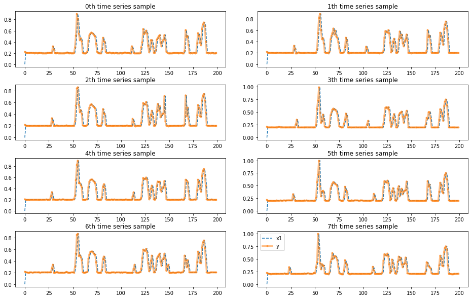
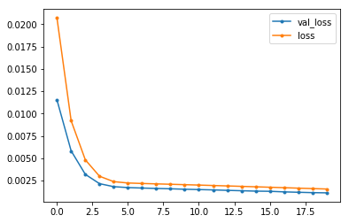
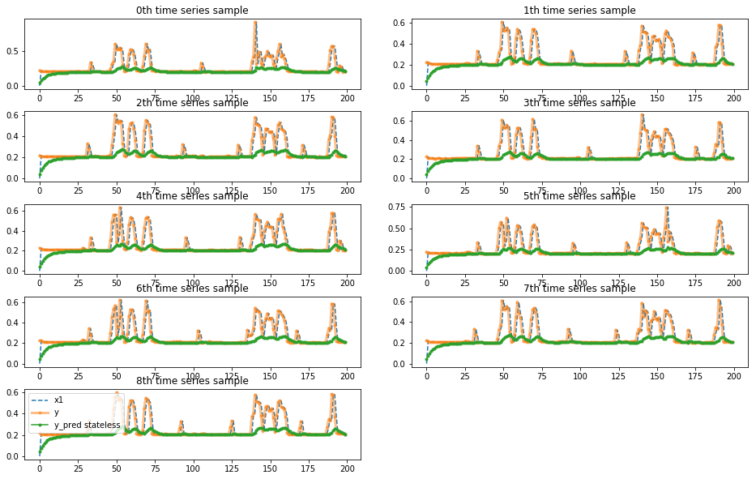
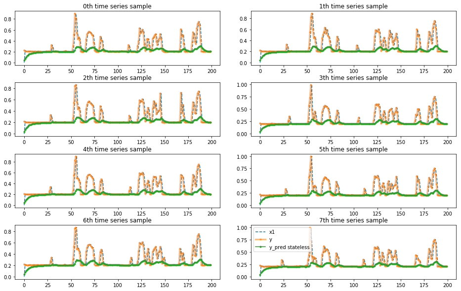

# Train LTSM model with time series data

Problem: predict lap time D laps in the future in a new event based on the historical event data.

In this experiment, we treat the lap time info for each car a time series and bulid lstm model on it.


```python
%matplotlib inline
%load_ext autoreload
%autoreload 2

import pandas as pd
import numpy as np
import matplotlib.pyplot as plt
from keras import models, layers
import time
from sklearn.preprocessing import MinMaxScaler
# to use only one GPU.
# use this on r-001
# otherwise comment
import os
os.environ["CUDA_VISIBLE_DEVICES"]="5"
from indycar.notebook import *
```

    Using TensorFlow backend.


### Load data and Initialization


```python
os.getcwd()
```


    '/scratch/hpda/indycar/predictor/notebook/CalculateRank'


```python
#datalist = ['2017-all_completed_laps_diff.csv','2018-all_completed_laps_diff.csv' ]
datalist = ['2017-Indy500-completed_laps_diff.csv','2018-Indy500-completed_laps_diff.csv' ]
flaglist = ['2017-Indy500-flagstatus.csv','2018-Indy500-flagstatus.csv' ]
#datalist = read_list('train_all.list')
#datalist = read_list('train_completed.list')

# predict D lap in the future
D = 1 
# hidden utnits for LSTM
hunits = 16
shuffle_flag = False
use_flag_status = True
epochs = 20
lossfunc='mse'  #; 'mse'

#model name: (shuffle)_(flaginfo)_(epochs)_(hunits)_(lossfunc)
model_name = 'lstmts_s%s_f%s_i%s_h%s_%s'%(1 if shuffle_flag else 0,
                            1 if use_flag_status else 0,
                            epochs, hunits, lossfunc)

output_prefix = 'indy500-train2017-test2018-completed_laps-M%s-D%d'%(model_name, D)
pred_outputfile = output_prefix + '-pred.csv'
model_outputfile = output_prefix + '-model.h5'
trainhist_outputfile = output_prefix + '-trainhist.jpg'


scaler, dataset, dblens = load_data(datalist)

dataset.info(verbose=True)
print('dataset shape', dataset.shape)
```

    load 2017-Indy500-completed_laps_diff.csv, len=3216
    load 2018-Indy500-completed_laps_diff.csv, len=3618
    <class 'pandas.core.frame.DataFrame'>
    Int64Index: 6834 entries, 0 to 3617
    Data columns (total 10 columns):
    MyIdx             6834 non-null int64
    car_number        6834 non-null int64
    completed_laps    6834 non-null int64
    rank              6834 non-null int64
    elapsed_time      6834 non-null float64
    rank_diff         6834 non-null float64
    time_diff         6834 non-null float64
    dbid              6834 non-null int64
    rank_diff_raw     6834 non-null float64
    time_diff_raw     6834 non-null float64
    dtypes: float64(5), int64(5)
    memory usage: 587.3 KB
    dataset shape (6834, 10)


```python
# generate train/test dataset

# post-padding with 0
X, y, w = generate_data(dataset, D=D, target='time', shuffle=shuffle_flag)
```

    carNumber = 34, max T =201


```python
def load_flaginfo(flaglist):
    flaginfo = []
    for f in flaglist:
        data = pd.read_csv(f)
        # 0 if yellow flag set
        flaginfo.append(np.array(data['track_status']!='Y'))
        
    return flaginfo
        
# weight set by flag status
if use_flag_status:
    laps = w.shape[1]
    flaginfo = load_flaginfo(flaglist)
    start, end = 0, 0
    for id,flagdata in enumerate(flaginfo):
        end = start + dblens[id]
        flag = flagdata[:laps].reshape((1,-1))
        nw = np.multiply(w[start:end,:], flag)
        w[start:end,:] = nw
        
        start = end
    
    #
    print('size of flaginfo', len(flaginfo[0]))
    flaginfo[1]
```

    size of flaginfo 201


```python
w[dblens[0]]
```


    array([1., 1., 1., 1., 1., 1., 1., 1., 1., 1., 1., 1., 1., 1., 1., 1., 1.,
           1., 1., 1., 1., 1., 1., 1., 1., 1., 1., 1., 1., 1., 1., 1., 1., 1.,
           1., 1., 1., 1., 1., 1., 1., 1., 1., 1., 1., 1., 1., 1., 0., 0., 0.,
           0., 0., 0., 0., 1., 1., 1., 0., 0., 0., 0., 0., 1., 1., 1., 1., 1.,
           0., 0., 0., 0., 0., 1., 1., 1., 1., 1., 1., 1., 1., 1., 1., 1., 1.,
           1., 1., 1., 1., 1., 1., 1., 1., 1., 1., 1., 1., 1., 1., 1., 1., 1.,
           1., 1., 1., 1., 1., 1., 1., 1., 1., 1., 1., 1., 1., 1., 1., 1., 1.,
           1., 1., 1., 1., 1., 1., 1., 1., 1., 1., 1., 1., 1., 1., 1., 1., 1.,
           1., 1., 1., 0., 0., 0., 0., 0., 0., 1., 0., 0., 0., 0., 0., 0., 0.,
           1., 0., 0., 0., 0., 0., 0., 0., 1., 1., 1., 1., 1., 1., 1., 1., 1.,
           1., 1., 1., 1., 1., 1., 1., 1., 1., 1., 1., 1., 1., 1., 1., 1., 1.,
           1., 0., 0., 0., 0., 0., 1., 1., 1., 1., 1., 1., 1.])


```python
#w = w*100 + 0.1
```


```python
# train/test split
total = np.sum(dblens)
ntrain = np.sum(dblens[:-1])
nval = int(dblens[-1] / 2)
print('train=%d, val=%d, test=%d'%(ntrain, nval, total-ntrain-nval))

X_train, X_val, X_test = X[:ntrain], X[ntrain:ntrain + nval], X[ntrain + nval:]
y_train, y_val, y_test = y[:ntrain], y[ntrain:ntrain + nval], y[ntrain + nval:]
#weights
w_train, w_val, w_test = w[:ntrain], w[ntrain:ntrain + nval], w[ntrain+nval:]
print('train shape:', X_train.shape)
```

    train=16, val=9, test=9
    train shape: (16, 200, 1)


```python
#
# plot one car time series for each event
#
idx = np.arange(8)
plot_examples(X[idx],y[idx],ypreds=None,nm_ypreds=None)
#plot_examples(X[:10],y[:10],ypreds=None,nm_ypreds=None)
```





```python

```

## Define model


```python
#
# https://fairyonice.github.io/Stateful-LSTM-model-training-in-Keras.html
#
def define_model(len_ts,
                 hidden_neurons = 10,
                 nfeature=1,
                 batch_size=None,
                 stateful=False,
                 lossfunc='mse'):
    in_out_neurons = 1
    
    inp = layers.Input(batch_shape= (batch_size, len_ts, nfeature),
                       name="input")  

    rnn = layers.LSTM(hidden_neurons, 
                    return_sequences=True,
                    stateful=stateful,
                    name="RNN")(inp)

    dens = layers.TimeDistributed(layers.Dense(in_out_neurons,name="dense"))(rnn)
    model = models.Model(inputs=[inp],outputs=[dens])
    
    if lossfunc == 'mae':
        model.compile(loss="mean_absolute_error",
                  sample_weight_mode="temporal",
                  optimizer="adam")
    elif lossfunc == 'mse':
        model.compile(loss="mean_squared_error",
                  sample_weight_mode="temporal",
                  optimizer="rmsprop")
    else:
        print('error, loss func not support yet', losssfunc)
    
    
    return(model,(inp,rnn,dens))
```


```python

model_stateless, _ = define_model(
                    hidden_neurons = hunits,
                    len_ts = X_train.shape[1],
                    lossfunc=lossfunc)
model_stateless.summary()
```

    Model: "model_1"
    _________________________________________________________________
    Layer (type)                 Output Shape              Param #   
    =================================================================
    input (InputLayer)           (None, 200, 1)            0         
    _________________________________________________________________
    RNN (LSTM)                   (None, 200, 16)           1152      
    _________________________________________________________________
    time_distributed_1 (TimeDist (None, 200, 1)            17        
    =================================================================
    Total params: 1,169
    Trainable params: 1,169
    Non-trainable params: 0
    _________________________________________________________________


### train for 500 epochs


```python
start = time.time()
history = model_stateless.fit(X_train,y_train,
                             batch_size=8,
                             shuffle=True,
                             epochs=epochs,
                             verbose=0,
                             sample_weight=w_train,
                             validation_data=(X_val,y_val,w_val))
end = time.time()
print("Time Took :{:3.2f} min".format( (end-start)/60 ))
```

    WARNING:tensorflow:From /scratch/hpda/anaconda3/envs/predictor/lib/python3.7/site-packages/keras/backend/tensorflow_backend.py:422: The name tf.global_variables is deprecated. Please use tf.compat.v1.global_variables instead.
    
    Time Took :0.37 min


```python
for line in history.history.keys():
    plt.plot(history.history[line],marker='.',label=line)
plt.legend()
plt.savefig(trainhist_outputfile)
```





```python
y_pred_stateless = model_stateless.predict(X_test)
plot_examples(X_test,y_test,ypreds=[y_pred_stateless],nm_ypreds=["y_pred stateless"])
```





```python
lstmts_result = predict('lstmts', model_stateless, X_test, y_test, scaler)
print(lstmts_result[0][:10])
```

    lstmts model mae=0.061562, raw mae=6.212937, raw mape=8.150617
    [0.04250263 0.07524392 0.10097302 0.1211072  0.13680094 0.14912985
     0.1582685  0.16529226 0.17077726 0.1751999 ]


```python
lstmts_result[0][20:60], y_test[0,20:60].flatten()
```


    (array([0.1942588 , 0.19520414, 0.19615918, 0.196756  , 0.19737247,
            0.19820447, 0.19913374, 0.19949684, 0.19960122, 0.1998616 ,
            0.20031242, 0.20049268, 0.20108554, 0.20123112, 0.21052462,
            0.21278203, 0.21016388, 0.20795554, 0.20604831, 0.20449917,
            0.20329732, 0.20243345, 0.20188637, 0.20147185, 0.201341  ,
            0.20130928, 0.20130843, 0.20399928, 0.21116506, 0.21905072,
            0.24262527, 0.25393927, 0.2629429 , 0.27164924, 0.27622586,
            0.2632829 , 0.24730262, 0.23482391, 0.23042724, 0.23901984],
           dtype=float32),
     array([0.20909393, 0.21083341, 0.20747088, 0.20830371, 0.21244506,
            0.21580858, 0.20999909, 0.2064805 , 0.20844144, 0.21167714,
            0.2088804 , 0.21470722, 0.21012048, 0.34148144, 0.2770341 ,
            0.20965675, 0.20572496, 0.20556246, 0.20535388, 0.20489362,
            0.20480692, 0.20532267, 0.20426789, 0.20584734, 0.20604006,
            0.20566105, 0.24371898, 0.31834903, 0.35527984, 0.60992418,
            0.5270481 , 0.52382429, 0.55445266, 0.53331091, 0.3094287 ,
            0.21336558, 0.21197985, 0.28700575, 0.4556587 , 0.53130934]))


```python
#save result
#def save_pred_result(lstmts_result[0], scaler):
Y_pred = lstmts_result[1]
df = pd.DataFrame({'pred':Y_pred[:,1]})
df.to_csv(pred_outputfile)

# save format
# carno -> predicts(lap times)
```


```python
#save model
model_stateless.save(model_outputfile)
```

### Result Analysis

It is amazing to see the capacity of the model, which predicts the pikes of crashes ''accurately''.
However, the performance goes worse in the cases of pitstops. They are totally ignored.
Overfitting must occur here.
To verify that, let''s train on data of a different event, such as train on 2017 and then test on 2018. 
Another idea is to modify the loss funtion to emphysize on pitstops.


```python
y_pred_stateless = model_stateless.predict(X_train)

#idx_train = idx[:-1]
idx_train = np.arange(8)
plot_examples(X_train[idx_train],y_train[idx_train],ypreds=[y_pred_stateless[idx_train]],nm_ypreds=["y_pred stateless"])
```





### conclusion


```python

```
