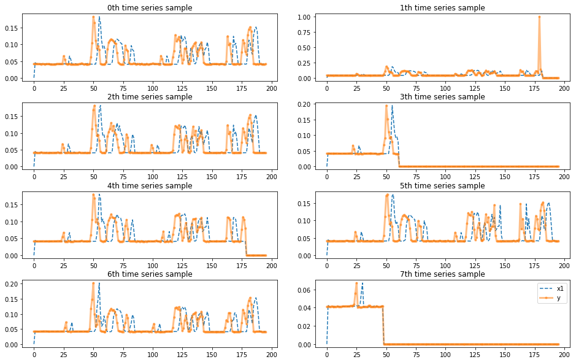
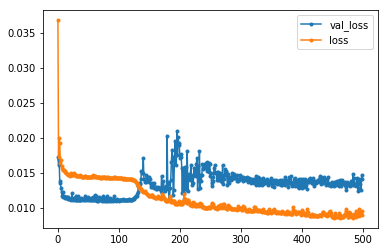
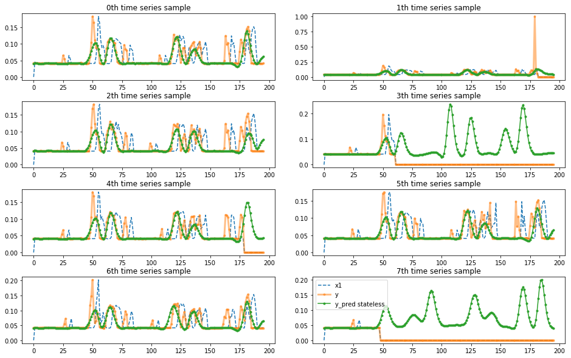

# Train LTSM model with time series data

Problem: predict lap time D laps in the future in a new event based on the historical event data.

In this experiment, we treat the lap time info for each car a time series and bulid lstm model on it.


```python
%matplotlib inline
%load_ext autoreload
%autoreload 2

import pandas as pd
import numpy as np
import matplotlib.pyplot as plt
from keras import models, layers
import time
from sklearn.preprocessing import MinMaxScaler
# to use only one GPU.
# use this on r-001
# otherwise comment
import os
os.environ["CUDA_VISIBLE_DEVICES"]="7"
from indycar.notebook import *
```

    Using TensorFlow backend.


### Load data and Initialization


```python
# predict D lap in the future
D = 5 
# hidden utnits for LSTM
hunits = 16
```


```python
datalist = ['2017-all_completed_laps_diff.csv','2018-all_completed_laps_diff.csv' ]
#datalist = read_list('train_all.list')
#datalist = read_list('train_completed.list')
scaler, dataset, dblens = load_data(datalist)

dataset.info(verbose=True)
print('dataset shape', dataset.shape)
```

    load 2017-all_completed_laps_diff.csv, len=5650
    load 2018-all_completed_laps_diff.csv, len=5769
    <class 'pandas.core.frame.DataFrame'>
    Int64Index: 11419 entries, 0 to 5768
    Data columns (total 8 columns):
    Unnamed: 0        11419 non-null int64
    car_number        11419 non-null int64
    completed_laps    11419 non-null int64
    rank              11419 non-null int64
    elapsed_time      11419 non-null float64
    rank_diff         11419 non-null float64
    time_diff         11419 non-null float64
    dbid              11419 non-null int64
    dtypes: float64(3), int64(5)
    memory usage: 802.9 KB
    dataset shape (11419, 8)


```python
# generate train/test dataset

# post-padding with 0
X, y, w = generate_data(dataset, D=D, target='time')

total = np.sum(dblens)
ntrain = np.sum(dblens[:-1])
nval = int(dblens[-1] / 2)
print('train=%d, val=%d, test=%d'%(ntrain, nval, total-ntrain-nval))

X_train, X_val, X_test = X[:ntrain], X[ntrain:ntrain + nval], X[ntrain + nval:]
y_train, y_val, y_test = y[:ntrain], y[ntrain:ntrain + nval], y[ntrain + nval:]
#weights
w_train, w_val, w_test = w[:ntrain], w[ntrain:ntrain + nval], w[ntrain+nval:]
print('train shape:', X_train.shape)
```

    carNumber = 66, max T =201
    train=33, val=16, test=17
    train shape: (33, 196, 1)


```python
#
# plot one car time series for each event
#
idx = np.arange(8)
plot_examples(X[idx],y[idx],ypreds=None,nm_ypreds=None)
#plot_examples(X[:10],y[:10],ypreds=None,nm_ypreds=None)
```





```python

```

## Define model


```python
#
# https://fairyonice.github.io/Stateful-LSTM-model-training-in-Keras.html
#
def define_model(len_ts,
                 hidden_neurons = 10,
                 nfeature=1,
                 batch_size=None,
                 stateful=False):
    in_out_neurons = 1
    
    inp = layers.Input(batch_shape= (batch_size, len_ts, nfeature),
                       name="input")  

    rnn = layers.LSTM(hidden_neurons, 
                    return_sequences=True,
                    stateful=stateful,
                    name="RNN")(inp)

    dens = layers.TimeDistributed(layers.Dense(in_out_neurons,name="dense"))(rnn)
    model = models.Model(inputs=[inp],outputs=[dens])
    
    #model.compile(loss="mean_squared_error",
    #              sample_weight_mode="temporal",
    #              optimizer="rmsprop")
    
    model.compile(loss="mean_absolute_error",
                  sample_weight_mode="temporal",
                  optimizer="adam")
    
    return(model,(inp,rnn,dens))
```


```python

model_stateless, _ = define_model(
                    hidden_neurons = hunits,
                    len_ts = X_train.shape[1])
model_stateless.summary()
```

    Model: "model_1"
    _________________________________________________________________
    Layer (type)                 Output Shape              Param #   
    =================================================================
    input (InputLayer)           (None, 196, 1)            0         
    _________________________________________________________________
    RNN (LSTM)                   (None, 196, 16)           1152      
    _________________________________________________________________
    time_distributed_1 (TimeDist (None, 196, 1)            17        
    =================================================================
    Total params: 1,169
    Trainable params: 1,169
    Non-trainable params: 0
    _________________________________________________________________


### train for 500 epochs


```python
start = time.time()
history = model_stateless.fit(X_train,y_train,
                             batch_size=8,
                             shuffle=True,
                             epochs=500,
                             verbose=0,
                             sample_weight=w_train,
                             validation_data=(X_val,y_val,w_val))
end = time.time()
print("Time Took :{:3.2f} min".format( (end-start)/60 ))
for line in history.history.keys():
    plt.plot(history.history[line],marker='.',label=line)
plt.legend()
```

    WARNING:tensorflow:From /scratch/hpda/anaconda3/envs/predictor/lib/python3.7/site-packages/keras/backend/tensorflow_backend.py:422: The name tf.global_variables is deprecated. Please use tf.compat.v1.global_variables instead.
    
    Time Took :7.28 min


    <matplotlib.legend.Legend at 0x7f8136f7f828>





```python
y_pred_stateless = model_stateless.predict(X_test)
plot_examples(X_test,y_test,ypreds=[y_pred_stateless],nm_ypreds=["y_pred stateless"])
```


```python
lstmts_result = predict('lstmts', model_stateless, X_test, y_test, scaler)
print(lstmts_result[0][:10])
```

    lstmts model mae=0.024604, raw mae=12.225181, raw mape=12.020914
    [0.04034573 0.04203084 0.04202824 0.04147708 0.04093631 0.04061466
     0.04055327 0.04069139 0.04094954 0.04125318]


```python
lstmts_result[0][20:60], y_test[0,20:60].flatten()
```


    (array([0.04096603, 0.04081705, 0.04070094, 0.04061542, 0.04056596,
            0.04055591, 0.04059064, 0.04065905, 0.0407589 , 0.0408835 ,
            0.0410402 , 0.04124089, 0.04137488, 0.04129262, 0.04118973,
            0.04126387, 0.04134577, 0.04134229, 0.04121292, 0.04096934,
            0.04067821, 0.04048774, 0.04064462, 0.04150708, 0.04353421,
            0.0472357 , 0.05303152, 0.06103523, 0.07061838, 0.07929087,
            0.08365439, 0.08334997, 0.08003947, 0.07622869, 0.07250074,
            0.0704689 , 0.07302056, 0.08039662, 0.08956417, 0.09752458],
           dtype=float32),
     array([0.04128915, 0.04203723, 0.04218204, 0.0427196 , 0.0424318 ,
            0.0447173 , 0.05790411, 0.06814519, 0.04212297, 0.04138324,
            0.04116839, 0.04126188, 0.04110077, 0.04113609, 0.04154072,
            0.04126762, 0.04162133, 0.04139743, 0.04169076, 0.04152996,
            0.04156477, 0.04155421, 0.04187139, 0.06037075, 0.10033803,
            0.11871622, 0.121206  , 0.10557288, 0.11063817, 0.10718014,
            0.07199025, 0.04340942, 0.04192251, 0.04551761, 0.09580033,
            0.1059604 , 0.10643538, 0.09516154, 0.07680789, 0.04238068]))


### Result Analysis

It is amazing to see the capacity of the model, which predicts the pikes of crashes ''accurately''.
However, the performance goes worse in the cases of pitstops. They are totally ignored.
Overfitting must occur here.
To verify that, let''s train on data of a different event, such as train on 2017 and then test on 2018. 
Another idea is to modify the loss funtion to emphysize on pitstops.


```python
y_pred_stateless = model_stateless.predict(X_train)

#idx_train = idx[:-1]
idx_train = np.arange(8)
plot_examples(X_train[idx_train],y_train[idx_train],ypreds=[y_pred_stateless[idx_train]],nm_ypreds=["y_pred stateless"])
```





### conclusion

raw mae=12.225181, raw mape=12.020914

it's worse when compared with the model trained with completed cards(lstmts_201702018-completedcars)

