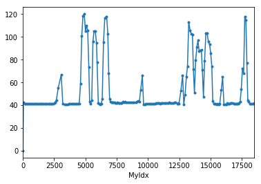

# Imports


```python
%matplotlib inline

import pandas as pd
import numpy as np
import matplotlib.pyplot as plt


# to use only one GPU.
# use this on r-001
# otherwise comment
import os
os.environ["CUDA_VISIBLE_DEVICES"]="7"

```

## Load Data


```python
import os
os.getcwd()

```


    '/scratch/hpda/indycar/predictor/notebook'


```python
#
# parameters
#
#year = '2017'
year = '2018'
#event = 'Toronto'
event = 'Indy500'

inputfile = 'C_'+ event +'-' + year + '-final.csv'
outputprefix = year +'-' + event + '-'
dataset = pd.read_csv(inputfile)
dataset.info(verbose=True)
```

    <class 'pandas.core.frame.DataFrame'>
    RangeIndex: 18500 entries, 0 to 18499
    Data columns (total 21 columns):
    rank                    18500 non-null int64
    car_number              18500 non-null int64
    unique_id               18500 non-null object
    completed_laps          18500 non-null int64
    elapsed_time            18500 non-null float64
    last_laptime            18500 non-null float64
    lap_status              18500 non-null object
    best_laptime            18500 non-null float64
    best_lap                18500 non-null object
    time_behind_leader      18500 non-null float64
    laps_behind_leade       18500 non-null object
    time_behind_prec        18500 non-null float64
    laps_behind_prec        18500 non-null object
    overall_rank            18500 non-null object
    overall_best_laptime    18500 non-null float64
    current_status          18500 non-null object
    track_status            18500 non-null object
    pit_stop_count          18500 non-null object
    last_pitted_lap         18500 non-null object
    start_position          18500 non-null object
    laps_led                18500 non-null object
    dtypes: float64(6), int64(3), object(12)
    memory usage: 3.0+ MB


### The Problem

According to the document of the log protocols, we have information on rank as below:

+ "Race results are based on laps led and crossing order." (Results protocol definition)
+ "Rank based on best time or race position, updated at each timeline during race" (\$O overall results)


To understand the relationship between rank and elapsed time, we have the following assumptions:

1. Rank is calculated by the elapsed time when car crosses the start-finish line. The order of the cars for the same lap number is its rank.
2. Indy500 have multiple sections (timelines), therefore, rank of a car may change during one lap.


#### laptime analysis


```python
# the lap gap between the cars
#
# in the final lap, the gap is only 1
#
','.join([str(x) for x in dataset.completed_laps])
```


    '0,0,0,0,0,0,0,0,0,0,0,0,0,0,0,0,0,0,0,0,0,0,0,0,0,0,0,0,0,0,0,0,0,0,0,0,1,1,1,1,0,0,0,0,0,0,0,0,0,0,0,0,0,0,0,0,0,0,0,0,0,0,0,0,0,0,0,0,0,1,1,0,1,1,1,0,0,1,1,0,0,0,0,1,1,0,0,1,1,1,1,0,0,1,1,1,1,1,1,0,1,1,1,1,1,0,0,0,0,0,1,1,1,1,1,2,1,1,1,1,1,1,1,1,1,1,1,1,1,1,1,1,1,1,1,1,1,1,1,1,1,1,1,1,1,1,1,1,2,2,2,1,2,2,1,1,2,2,1,2,2,2,1,2,1,2,2,1,2,2,1,2,2,2,1,2,2,1,1,2,2,1,1,1,2,2,1,1,1,2,2,2,2,2,1,2,2,2,3,3,2,2,2,2,2,2,2,2,2,2,2,2,2,2,2,2,2,2,2,2,2,2,2,2,2,2,2,2,2,2,2,3,2,3,3,3,2,3,3,2,3,2,3,3,2,3,2,3,2,2,3,3,2,3,3,3,3,2,3,3,2,3,3,2,3,3,2,3,2,3,3,2,3,3,3,3,2,3,4,4,3,3,3,3,3,3,3,3,3,3,3,3,3,3,3,3,3,3,3,3,3,3,3,3,3,3,3,3,3,3,3,4,3,4,4,4,3,4,4,3,4,3,4,4,3,4,3,4,3,4,3,4,4,3,3,4,4,3,4,4,4,3,4,4,3,4,4,3,4,4,3,4,4,4,3,3,4,4,3,4,5,5,4,4,4,4,4,4,4,4,4,4,4,4,4,4,4,4,4,4,4,4,4,4,4,4,4,4,4,4,4,4,4,5,4,5,5,4,5,5,4,5,4,5,5,4,5,4,5,5,4,5,4,5,4,5,4,5,5,4,5,5,4,5,4,5,5,5,4,5,5,4,5,5,4,5,5,5,4,5,5,6,6,5,5,5,5,5,5,5,5,5,5,5,5,5,5,5,5,5,5,5,5,5,5,5,5,5,5,5,5,5,5,5,6,5,6,6,5,6,5,6,5,6,6,5,6,5,6,6,5,6,5,6,5,6,6,5,6,5,6,6,5,6,5,6,6,5,6,5,6,6,6,5,6,6,5,6,6,5,6,6,5,6,7,6,6,6,6,6,6,6,6,6,6,6,6,6,6,6,6,6,6,6,6,6,6,6,6,6,6,6,6,6,6,6,6,7,7,6,7,6,7,7,6,7,6,7,6,7,6,7,7,6,7,6,7,6,7,6,7,7,6,7,6,7,7,6,7,7,6,7,6,7,6,7,7,7,6,7,6,7,7,6,7,7,6,7,7,8,7,7,7,7,7,7,7,7,7,7,7,7,7,7,7,7,7,7,7,7,7,7,7,7,7,7,7,7,7,7,7,7,8,7,8,8,7,8,7,8,7,8,7,8,7,8,7,8,8,7,8,8,7,8,7,8,7,7,8,8,7,8,8,7,8,8,7,8,8,7,8,8,8,7,8,7,8,8,7,8,8,7,8,8,9,8,8,8,8,8,8,8,8,8,8,8,8,8,8,8,8,8,8,8,8,8,8,8,8,8,8,8,8,8,8,8,8,9,8,9,8,9,9,8,9,8,9,8,9,8,9,8,9,8,9,8,9,9,8,9,9,8,9,9,8,9,9,8,9,9,8,9,9,8,9,8,9,8,9,8,9,8,9,9,8,9,9,8,9,9,10,9,9,9,9,9,9,9,9,9,9,9,9,9,9,9,9,9,9,9,9,9,9,9,9,9,9,9,9,9,9,9,9,10,9,10,9,10,9,10,10,9,10,9,10,9,10,10,9,10,9,10,9,10,9,10,10,9,10,9,10,9,10,10,9,10,9,10,10,9,10,10,9,10,9,10,9,10,9,10,9,10,10,9,10,10,9,10,11,10,10,10,10,10,10,10,10,10,10,10,10,10,10,10,10,10,10,10,10,10,10,10,10,10,10,10,10,10,10,10,10,11,10,11,10,11,10,11,11,10,11,10,11,10,11,10,11,10,11,10,11,10,11,10,11,11,10,11,11,10,11,10,10,11,11,10,11,11,10,11,10,11,11,10,11,10,11,11,10,11,11,10,11,11,10,11,12,11,11,11,11,11,11,11,11,11,11,11,11,11,11,11,11,11,11,11,11,11,11,11,11,11,11,11,11,11,11,11,11,12,11,12,11,12,11,12,12,11,12,12,11,12,11,12,12,11,12,12,11,12,11,12,12,11,12,11,12,11,12,12,11,12,12,11,12,11,12,12,11,12,11,12,11,12,12,12,12,11,12,11,12,13,12,12,12,12,12,12,12,12,12,12,12,12,12,12,12,12,12,12,12,12,12,12,12,12,12,12,12,12,12,12,12,12,13,12,13,12,13,12,13,12,13,12,13,12,13,12,13,12,13,12,13,12,13,13,12,13,13,12,13,12,13,12,13,12,13,12,13,12,13,13,12,13,12,13,13,12,13,12,13,12,13,12,13,13,13,12,13,13,14,13,13,13,13,13,13,13,13,13,13,13,13,13,13,13,13,13,13,13,13,13,13,13,13,13,13,13,13,13,13,13,13,14,13,14,13,14,13,14,13,14,13,14,13,14,13,14,13,14,14,13,14,13,14,13,14,14,13,14,13,14,14,13,14,13,14,14,13,14,13,14,13,14,14,13,14,13,14,13,14,14,13,14,14,13,14,13,14,15,14,14,14,14,14,14,14,14,14,14,14,14,14,14,14,14,14,14,14,14,14,14,14,14,14,14,14,14,14,14,14,14,15,14,15,14,15,14,15,14,15,14,15,14,15,14,15,14,15,14,15,14,15,15,14,15,14,15,14,15,15,14,15,14,15,14,15,15,14,15,14,15,14,15,14,15,15,14,15,14,15,14,15,15,14,15,15,14,15,16,15,15,15,15,15,15,15,15,15,15,15,15,15,15,15,15,15,15,15,15,15,15,15,15,15,15,15,15,15,15,15,15,16,15,16,15,16,15,16,15,16,15,16,15,16,15,16,15,16,15,16,15,16,16,15,16,15,16,15,16,16,15,16,15,16,15,16,15,16,15,16,15,16,15,16,15,16,16,15,16,15,16,15,16,16,15,16,16,15,16,17,16,16,16,16,16,16,16,16,16,16,16,16,16,16,16,16,16,16,16,16,16,16,16,16,16,16,16,16,16,16,16,16,17,16,17,16,17,16,17,17,16,17,16,17,16,17,16,17,16,17,16,17,17,16,17,17,16,17,17,16,17,16,17,16,17,16,17,16,17,17,16,17,16,17,17,16,17,16,17,16,17,17,16,17,17,16,17,18,17,17,17,17,17,17,17,17,17,17,17,17,17,17,17,17,17,17,17,17,17,17,17,17,17,17,17,17,17,17,17,17,18,17,18,17,18,17,18,17,18,17,18,17,18,17,18,17,18,17,18,17,18,17,18,17,18,17,18,17,18,18,17,18,17,18,17,18,18,17,18,18,17,18,17,18,18,17,18,18,17,18,18,17,18,18,17,18,19,18,18,18,18,18,18,18,18,18,18,18,18,18,18,18,18,18,18,18,18,18,18,18,18,18,18,18,18,18,18,18,18,19,18,19,18,19,18,19,18,19,18,19,18,19,18,19,18,19,18,19,18,19,18,19,18,19,18,19,18,19,19,18,19,18,19,18,19,19,18,19,19,18,19,19,18,19,18,19,18,19,19,19,18,19,18,19,18,19,20,19,19,19,19,19,19,19,19,19,19,19,19,19,19,19,19,19,19,19,19,19,19,19,19,19,19,19,19,19,19,19,19,20,19,20,19,20,19,20,19,20,19,20,19,20,19,20,19,20,19,20,19,20,19,20,19,20,19,20,19,20,20,19,20,19,20,19,20,20,19,20,20,19,20,19,20,20,19,20,19,20,20,19,20,19,20,20,19,20,21,20,20,20,20,20,20,20,20,20,20,20,20,20,20,20,20,20,20,20,20,20,20,20,20,20,20,20,20,20,20,20,20,21,20,21,20,21,20,21,20,21,20,21,20,21,20,21,20,21,20,21,20,21,20,21,20,21,21,20,21,21,20,21,20,21,20,21,21,20,21,21,20,21,20,21,21,20,21,20,21,20,21,21,20,21,21,20,21,22,21,21,21,21,21,21,21,21,21,21,21,21,21,21,21,21,21,21,21,21,21,21,21,21,21,21,21,21,21,21,21,21,22,21,22,21,22,21,22,21,22,21,22,21,22,21,22,21,22,21,22,21,22,21,22,21,22,22,21,22,22,21,22,21,22,21,22,21,22,21,22,22,21,22,21,22,21,22,21,22,21,22,21,22,21,22,22,21,22,21,22,23,22,22,22,22,22,22,22,22,22,22,22,22,22,22,22,22,22,22,22,22,22,22,22,22,22,22,22,22,22,22,22,22,23,22,23,22,23,22,23,22,23,22,23,22,23,22,23,22,23,23,22,23,22,23,22,23,23,22,23,23,22,23,22,23,22,23,22,23,22,23,23,22,23,23,22,23,22,23,22,23,22,23,22,23,22,23,23,22,23,24,23,23,23,23,23,23,23,23,23,23,23,23,23,23,23,23,23,23,23,23,23,23,23,23,23,23,23,23,23,23,23,23,24,23,24,23,24,23,24,23,24,23,24,23,24,23,24,23,24,23,24,23,24,24,23,24,23,23,24,23,24,24,24,23,24,24,23,24,23,24,23,24,23,24,24,23,24,23,24,24,23,24,23,24,23,24,24,23,24,25,24,24,24,24,24,24,24,24,24,24,24,24,24,24,24,24,24,24,24,24,24,24,24,24,24,24,24,24,24,24,24,24,25,24,25,24,25,24,25,24,25,24,25,24,25,24,25,24,25,24,25,24,25,25,24,25,24,25,24,25,25,24,25,25,24,25,25,24,25,25,24,25,25,24,25,24,25,24,25,24,25,24,25,24,25,25,24,25,26,25,25,25,25,25,25,25,25,25,25,25,25,25,25,25,25,25,25,25,25,25,25,25,25,25,25,25,25,25,25,25,25,26,25,26,25,26,25,26,25,26,25,26,25,26,25,26,25,26,25,26,25,26,26,25,26,25,26,25,26,26,25,26,25,26,25,26,26,25,26,25,25,26,26,26,25,26,25,26,25,26,25,26,26,25,26,26,25,26,27,26,26,26,26,26,26,26,26,26,26,26,26,26,26,26,26,26,26,26,26,26,26,26,26,26,26,26,26,26,26,26,26,27,26,27,26,27,26,27,27,26,27,26,27,26,27,26,27,26,27,26,27,27,26,27,26,27,27,26,27,27,26,27,26,27,26,26,27,26,26,27,27,26,27,27,26,26,27,26,27,26,27,26,27,26,27,26,27,27,26,27,28,27,27,27,27,27,27,27,27,27,27,27,27,27,27,27,27,27,27,27,27,27,27,27,27,27,27,27,27,27,27,27,27,28,27,28,27,28,27,28,27,28,27,28,27,28,27,28,27,28,27,28,27,28,28,27,28,27,28,27,28,28,27,28,27,28,27,28,27,28,27,28,27,27,28,27,27,27,28,27,27,28,27,28,28,28,28,28,27,28,28,27,29,28,28,28,28,28,28,28,28,28,28,28,28,28,28,28,28,28,28,28,28,28,28,28,28,28,28,28,28,28,28,28,28,29,28,29,29,28,29,29,28,29,28,29,28,29,28,29,28,29,28,29,29,28,28,29,29,28,28,29,29,28,28,29,28,28,29,28,28,29,28,28,29,28,29,28,29,28,29,28,29,28,28,29,28,28,28,28,29,28,29,29,29,29,28,28,30,29,30,30,29,29,29,29,29,29,29,29,29,29,29,29,29,29,29,29,29,29,29,29,29,29,29,29,29,29,29,29,29,30,29,30,29,30,29,29,30,29,29,30,29,29,30,29,29,30,29,29,30,30,29,30,29,30,29,30,30,29,30,29,30,30,29,30,29,30,29,29,30,29,29,30,29,29,30,29,29,30,29,29,30,30,29,29,29,30,30,29,29,30,29,29,31,30,30,30,29,30,30,30,30,30,30,29,30,30,30,30,29,30,30,30,30,30,30,29,30,30,30,31,30,30,30,30,30,30,30,30,31,31,30,30,30,30,31,30,30,30,30,31,30,30,30,30,31,30,30,30,30,30,29,31,30,31,31,30,30,30,31,30,30,31,31,30,30,30,31,31,30,30,30,31,31,30,30,30,31,30,30,30,31,30,30,31,31,30,30,31,30,30,31,30,30,31,30,30,31,30,31,30,30,31,31,30,30,31,30,30,32,31,31,31,31,31,31,30,31,30,31,31,30,31,31,31,31,31,31,31,31,31,30,31,31,31,31,31,31,31,31,31,31,31,30,30,30,32,32,31,31,31,31,31,31,31,31,32,31,32,31,32,32,31,32,31,31,31,31,31,32,32,31,31,31,31,31,32,31,31,31,31,31,32,31,31,31,31,31,31,30,32,32,31,31,31,31,31,31,30,32,31,31,31,31,31,31,31,32,31,32,31,31,31,31,31,31,31,32,32,31,31,31,31,31,31,32,31,31,31,31,31,31,32,31,32,32,31,31,31,31,32,31,31,31,31,32,31,31,31,31,32,31,31,31,31,33,32,32,32,32,32,32,32,32,32,32,32,32,31,32,32,32,31,30,32,31,32,31,32,32,32,32,32,32,32,32,31,31,31,32,31,31,31,31,32,32,31,32,31,33,32,32,32,32,32,32,32,33,33,32,32,32,32,32,32,32,33,32,32,32,32,32,32,32,32,33,32,32,32,32,32,32,32,32,33,32,32,32,32,32,32,32,32,33,32,32,32,32,32,32,32,32,33,32,32,32,32,32,32,32,32,32,33,32,32,32,32,32,32,32,32,32,33,32,32,32,32,32,32,32,32,32,32,33,33,33,32,32,32,32,32,32,32,32,33,32,32,32,32,32,32,32,32,32,33,32,32,32,32,32,32,32,32,33,33,32,32,32,32,32,31,32,32,31,33,32,32,32,32,32,32,33,33,32,33,33,33,32,32,32,33,32,32,33,32,32,33,32,32,34,33,33,33,33,33,33,33,33,33,33,33,33,33,33,33,33,33,33,32,33,33,32,33,33,33,33,33,33,32,32,32,32,33,32,32,33,32,32,33,32,34,33,33,33,33,33,33,34,34,33,33,33,33,33,33,33,33,34,33,33,33,33,33,33,33,33,33,34,34,33,33,33,33,33,33,33,33,33,34,33,34,33,33,33,33,33,33,33,33,34,33,33,33,33,33,33,32,33,33,33,33,33,32,34,34,33,33,33,33,33,33,33,33,33,33,34,34,33,33,33,33,33,33,33,33,33,33,33,33,34,33,33,33,33,33,33,33,33,33,33,33,33,34,33,33,33,33,33,33,33,33,33,33,33,33,34,33,34,33,34,34,33,33,34,33,33,34,33,33,33,33,33,33,34,33,33,34,33,33,34,33,33,33,33,34,34,33,33,33,35,34,34,34,34,34,34,34,34,34,33,34,34,33,34,34,34,33,35,34,34,34,33,34,33,34,34,34,34,33,35,35,34,34,34,34,34,34,35,34,34,34,33,34,33,34,34,34,34,35,34,34,34,34,34,35,34,34,34,34,34,35,33,33,33,34,34,34,33,33,35,34,34,34,34,35,35,35,34,34,34,33,34,34,35,34,34,34,35,34,34,34,35,34,34,34,35,34,35,34,34,34,34,34,34,35,34,34,34,34,34,34,35,35,34,35,34,34,34,34,34,35,35,35,34,34,34,34,36,35,35,35,35,35,35,35,35,35,35,35,35,35,35,35,35,35,35,35,35,34,35,35,34,35,35,34,34,34,34,34,34,34,34,36,35,36,36,35,36,35,35,34,36,35,35,34,36,35,35,35,35,35,34,34,36,36,35,35,36,36,35,35,35,34,34,36,36,35,35,36,35,35,35,34,36,35,35,35,36,35,35,35,36,36,35,35,35,36,36,35,35,35,36,36,35,35,36,35,35,36,35,37,36,36,36,36,36,36,36,36,36,36,36,36,36,36,36,34,36,35,36,36,36,36,35,35,36,36,35,36,35,35,35,35,36,37,36,35,35,37,37,36,37,36,36,35,37,36,36,35,37,36,36,36,35,36,37,36,35,37,37,36,37,36,36,37,36,35,37,36,37,36,36,35,37,36,37,36,37,37,36,37,36,37,36,37,37,37,36,38,37,37,37,37,37,37,37,37,37,37,37,37,37,37,37,35,37,36,37,37,37,37,36,36,37,37,36,36,36,36,36,37,38,37,36,36,38,38,37,38,37,37,36,36,38,37,37,36,36,38,37,37,36,36,37,36,36,37,37,38,37,36,38,37,38,36,38,37,38,37,37,38,38,37,36,37,36,38,37,38,37,38,38,37,38,38,37,38,38,37,38,37,39,38,38,38,38,38,38,38,38,38,38,38,38,38,38,38,36,38,37,38,38,38,38,37,37,38,37,38,38,39,38,37,37,37,37,37,37,39,39,38,39,38,38,37,39,38,38,37,39,38,38,38,37,38,37,38,39,38,37,39,38,37,39,38,39,38,39,39,38,38,37,39,38,37,38,39,38,39,38,39,39,38,39,39,38,39,38,39,39,38,40,39,39,39,39,39,39,39,39,39,39,39,39,39,39,39,37,39,38,39,39,39,39,38,38,39,38,39,39,38,38,38,38,38,38,40,39,40,40,39,40,39,39,38,40,39,39,38,40,39,39,38,38,39,39,38,39,40,39,38,40,38,39,40,39,40,40,39,40,39,40,39,39,38,39,38,40,39,40,39,40,39,40,39,40,40,39,40,40,39,40,39,41,40,40,40,40,40,40,40,40,40,40,40,40,40,40,40,38,40,39,40,40,40,40,39,39,39,40,39,40,39,40,39,39,39,39,41,40,41,40,41,40,41,40,40,39,41,40,40,39,41,40,40,39,40,40,39,40,39,41,41,39,40,41,40,41,41,40,41,40,40,39,41,40,39,40,41,40,41,40,41,40,41,40,41,40,41,40,41,40,41,41,40,42,41,41,41,41,41,41,41,41,41,41,41,41,41,41,41,39,41,40,41,41,41,41,40,40,40,40,41,40,41,40,41,42,41,40,40,40,42,41,42,41,42,41,41,42,41,40,41,40,42,41,41,40,41,40,40,41,41,40,42,42,41,40,42,41,42,41,42,42,41,41,40,42,41,41,40,42,41,42,41,42,41,42,41,42,41,42,41,42,41,42,42,41,43,42,42,42,42,42,42,42,42,42,42,42,42,42,42,42,40,42,42,42,42,42,41,41,41,42,41,42,42,41,41,41,41,41,41,43,42,43,43,42,43,42,42,43,42,41,42,41,43,42,42,41,42,41,42,41,42,43,42,41,43,41,43,42,43,43,42,43,42,42,41,43,42,41,42,43,42,43,42,43,42,43,42,43,42,43,42,43,42,43,42,43,42,44,43,43,43,43,43,43,43,43,43,43,43,43,43,43,43,41,43,42,43,43,43,43,42,42,42,42,43,42,43,43,44,43,42,42,42,42,44,43,44,44,43,43,42,44,43,43,42,44,43,43,42,43,42,43,43,44,43,42,44,42,43,44,44,43,44,44,43,43,44,43,42,43,42,44,43,44,43,44,43,44,43,44,43,44,43,44,43,44,44,43,45,44,44,44,44,44,44,44,44,44,44,44,44,44,44,44,42,44,43,44,44,44,44,43,43,43,43,44,43,44,44,43,43,43,43,45,44,45,45,44,45,44,44,45,44,43,44,43,45,44,44,43,44,43,44,43,43,45,44,45,44,43,45,43,45,44,45,45,44,44,43,45,44,43,44,45,44,45,44,45,45,44,45,44,45,44,45,44,45,44,45,44,46,45,45,45,45,45,45,45,45,45,45,45,45,45,45,45,43,45,44,44,45,45,45,45,44,44,44,45,44,45,45,44,44,44,44,46,45,46,46,45,46,45,45,44,46,45,45,44,46,45,45,44,45,44,45,44,46,46,45,46,46,45,44,45,44,46,46,45,45,46,45,44,45,46,45,44,46,45,46,46,45,46,45,46,45,46,45,46,46,45,47,46,46,46,46,46,46,46,46,46,46,46,46,46,46,46,44,46,46,46,46,46,45,45,45,46,45,46,45,46,47,46,45,45,45,45,45,47,46,47,46,47,46,46,45,47,46,46,45,47,46,46,45,46,45,46,45,47,47,46,47,46,45,47,46,47,46,46,47,46,46,45,45,47,46,45,46,45,47,46,47,46,46,47,46,46,47,46,46,47,46,46,47,46,46,47,46,46,47,46,46,48,47,47,47,47,47,47,47,47,47,47,47,47,47,47,46,45,47,45,46,47,47,47,47,46,46,47,47,47,46,46,46,46,48,47,46,46,48,47,48,47,48,47,47,46,46,48,47,47,46,46,48,47,47,46,46,47,46,46,47,46,46,48,47,48,47,48,47,46,45,48,47,48,47,48,47,47,46,46,48,47,47,46,46,48,47,48,47,48,47,48,47,48,47,48,47,48,47,48,47,49,48,48,48,48,48,48,48,48,48,48,48,48,48,48,46,46,48,45,47,48,48,48,48,47,47,48,47,48,48,47,47,47,47,47,49,48,49,48,49,49,48,48,49,48,47,48,49,48,47,48,47,48,47,48,47,49,49,48,49,48,47,46,49,49,48,49,48,48,47,49,48,47,48,49,48,49,49,49,48,49,49,48,49,49,45,48,46,45,45,49,48,49,48,49,49,48,50,49,49,49,49,49,49,49,49,49,49,49,49,49,49,49,49,46,47,49,45,48,49,49,49,49,49,49,49,49,49,49,48,50,50,48,49,50,50,50,49,50,49,49,48,49,48,50,50,49,50,50,49,49,49,49,49,49,49,49,49,49,50,49,49,50,49,49,50,49,49,50,49,50,49,50,49,50,50,49,50,49,50,50,49,45,45,50,49,50,49,50,49,50,49,50,49,50,49,49,50,50,49,51,50,50,50,50,50,50,50,50,50,50,50,50,50,50,46,49,45,50,50,50,51,50,50,50,50,50,50,50,50,50,50,50,50,50,51,50,51,51,50,50,50,51,50,51,50,50,51,51,50,50,51,50,51,51,50,50,50,50,51,50,51,50,51,51,50,51,51,51,50,51,46,51,50,51,50,45,51,50,51,50,51,50,51,50,51,51,50,50,51,50,51,50,45,52,51,51,51,51,51,51,51,51,51,51,51,51,51,51,46,50,51,45,51,51,51,51,51,51,51,51,51,51,51,51,51,51,52,52,51,52,52,51,52,51,52,52,51,52,51,52,51,52,52,51,52,51,52,51,52,52,51,52,51,52,52,51,52,52,51,52,52,51,52,51,52,52,51,52,51,52,51,51,52,51,52,51,45,45,53,52,52,52,52,52,52,52,52,52,52,52,52,52,52,46,51,52,45,52,52,52,52,52,52,52,52,52,52,52,52,52,52,53,53,52,53,53,52,53,52,53,52,53,52,53,53,52,53,52,53,52,53,53,52,53,52,53,52,53,53,53,52,53,53,52,53,52,53,52,52,52,52,52,52,52,53,52,53,52,52,45,53,53,52,52,52,53,53,52,52,53,52,45,45,54,53,53,53,53,53,53,53,53,53,53,53,53,53,53,46,52,53,45,53,53,53,53,53,53,53,53,53,53,53,53,53,53,54,53,54,54,53,54,53,54,54,53,54,53,54,53,54,53,54,53,54,53,54,54,53,54,53,54,54,53,54,54,53,54,54,54,53,54,53,53,54,54,53,53,54,53,53,54,53,53,53,53,54,53,54,53,53,54,53,45,55,54,54,54,54,54,54,54,54,54,54,54,54,54,54,46,53,54,45,54,54,54,54,54,54,54,54,54,54,54,54,54,54,55,55,55,54,55,55,55,54,55,55,55,54,55,55,55,54,55,55,54,55,55,55,55,54,55,55,55,54,55,55,55,54,55,55,54,54,55,55,54,55,54,45,56,55,55,55,55,55,46,54,45,55,55,56,55,55,55,55,55,55,55,55,55,55,55,55,55,55,55,56,56,56,56,56,55,55,55,55,55,55,55,55,56,56,56,55,55,56,56,56,56,56,55,56,56,55,56,56,56,55,56,56,55,56,56,56,55,55,56,56,55,55,56,56,55,56,55,45,57,56,56,56,56,56,56,56,56,56,56,56,56,56,56,46,55,56,45,56,56,56,56,56,56,56,56,56,56,56,56,56,56,57,56,57,56,56,57,57,56,57,57,57,57,56,56,57,57,56,57,57,56,56,57,57,57,57,56,56,57,57,56,56,57,57,57,57,57,56,57,56,56,57,57,57,56,56,56,57,56,57,56,45,58,57,57,57,57,57,57,57,57,57,57,57,57,57,57,46,56,57,45,57,57,57,57,57,57,57,57,57,57,57,57,57,57,58,57,58,57,58,57,58,58,57,58,57,58,58,57,58,57,58,57,58,57,58,57,58,57,58,57,58,57,58,57,58,58,57,58,57,57,58,57,57,57,58,57,58,57,58,58,57,57,58,57,57,58,57,57,57,58,57,57,58,57,57,45,45,59,59,58,58,58,58,58,58,58,58,58,58,58,58,58,46,57,58,45,58,58,58,58,58,58,58,58,58,57,58,58,58,58,59,58,59,58,59,58,59,58,59,59,58,59,58,59,58,59,58,59,58,59,58,59,59,58,59,58,59,59,58,59,59,58,59,58,59,58,59,58,59,59,58,59,58,59,58,58,57,59,58,59,58,45,46,57,45,46,45,60,59,59,59,59,59,59,59,59,59,59,59,59,59,59,46,58,59,45,59,59,59,59,59,59,59,59,59,57,59,59,59,59,60,60,59,60,59,60,59,60,59,60,60,59,60,59,60,59,60,59,60,59,60,59,60,59,60,59,60,59,60,59,60,60,60,59,60,60,59,59,60,59,59,60,60,59,59,59,59,60,59,59,59,59,60,59,59,59,60,59,45,60,59,46,45,46,45,61,60,60,60,60,60,60,60,60,60,60,60,60,60,60,46,59,60,45,60,60,60,60,60,60,60,60,60,57,60,60,60,60,61,60,61,60,61,60,61,61,60,61,60,61,61,60,61,60,61,60,61,60,61,60,61,60,61,61,60,61,60,61,61,60,61,60,61,60,61,60,61,60,61,60,61,60,61,60,61,60,60,61,60,61,46,45,60,45,46,62,61,61,61,61,61,61,61,61,61,61,61,61,61,61,46,60,61,45,61,61,61,61,61,61,61,61,61,57,61,61,61,61,62,61,62,61,62,61,62,61,62,61,62,61,62,62,61,62,61,62,62,61,62,62,61,62,62,61,62,61,62,62,61,62,61,62,62,61,62,62,61,62,61,62,61,62,61,62,61,61,45,62,61,46,45,63,63,63,63,63,63,62,62,62,62,62,62,62,62,62,46,61,62,45,62,62,62,62,62,62,62,62,62,57,62,62,62,62,63,63,63,63,62,63,63,63,62,63,63,63,63,63,63,63,62,63,63,63,62,63,63,63,63,62,63,62,62,63,62,45,46,64,64,63,63,63,63,63,63,63,63,63,63,63,63,63,46,62,63,45,63,63,63,63,63,63,63,63,63,57,63,63,63,63,64,64,64,63,63,64,63,63,64,63,64,64,64,64,63,64,64,63,63,64,64,64,64,64,63,63,64,64,64,64,63,64,64,64,64,63,64,63,64,63,64,63,45,46,65,65,64,64,64,64,64,64,64,64,64,64,64,64,64,46,63,64,45,64,64,64,64,64,64,64,64,64,57,64,64,64,64,65,65,64,65,65,64,65,64,65,64,64,65,65,65,64,65,65,65,64,65,65,64,65,65,64,65,65,64,65,65,65,65,64,65,65,64,64,65,65,64,65,64,45,66,66,65,65,65,65,65,65,65,65,65,65,65,65,65,46,64,65,45,65,65,65,65,65,65,65,65,65,57,65,65,65,65,66,66,65,66,65,66,65,66,66,65,66,66,65,66,65,66,66,66,65,66,66,66,65,66,66,65,66,65,66,66,65,66,66,65,66,66,65,65,66,65,66,65,66,65,45,67,66,66,66,66,66,66,66,66,66,66,66,66,66,66,46,65,66,45,66,66,66,66,66,66,66,66,66,57,66,66,66,66,67,66,67,67,66,67,66,67,66,67,67,66,67,67,66,67,67,66,67,67,67,66,67,67,66,67,67,66,67,66,67,67,66,67,67,66,67,67,66,66,67,67,66,67,66,45,68,67,67,67,67,67,67,67,67,67,67,67,67,67,67,46,66,67,45,67,67,67,67,67,67,67,67,67,57,67,67,67,67,68,67,68,67,68,67,68,67,68,67,68,68,67,68,67,68,67,68,67,68,67,68,68,67,68,67,68,67,67,68,67,67,68,67,67,68,67,67,68,68,67,67,68,67,67,68,68,67,67,68,67,67,46,45,67,68,67,67,68,67,67,68,67,67,67,46,45,46,45,69,68,68,68,68,68,67,68,68,68,68,68,68,68,68,46,67,68,45,68,68,68,68,68,68,68,68,68,57,68,68,68,68,69,68,69,68,69,68,69,69,68,69,68,69,69,68,69,69,68,69,69,68,69,69,68,69,68,69,68,69,69,68,69,68,69,68,69,68,69,69,68,69,68,68,69,67,68,69,68,69,68,46,45,57,46,45,57,70,69,69,69,69,69,67,69,69,69,69,69,69,69,69,46,68,69,45,69,69,69,69,69,69,69,69,69,57,69,69,69,69,70,70,69,69,70,70,69,69,70,69,69,69,70,69,69,69,70,70,70,69,69,70,70,70,69,70,70,69,69,69,70,69,69,69,69,70,69,69,69,69,70,70,69,69,69,69,69,69,69,70,69,69,69,69,69,69,69,69,70,69,69,69,69,69,69,69,69,70,69,70,69,70,69,70,70,69,70,70,69,46,45,57,46,45,57,46,45,57,71,70,70,70,70,70,67,70,70,70,70,70,70,70,70,46,69,70,45,70,70,70,70,70,70,70,70,70,57,70,70,70,70,71,70,71,71,70,71,70,71,70,71,70,71,70,71,70,70,71,70,70,71,71,71,70,70,70,71,70,70,70,71,70,70,70,71,70,70,70,71,70,70,70,70,71,70,70,70,71,71,70,70,71,70,70,71,71,70,70,71,70,71,71,70,71,70,71,70,46,45,57,46,45,57,72,71,71,71,71,71,67,71,71,71,71,71,71,71,71,46,70,71,45,71,71,71,71,71,71,71,71,71,57,71,71,71,71,72,72,71,72,71,72,71,72,72,71,72,72,71,72,71,72,72,71,72,71,72,71,72,72,71,72,71,71,72,71,72,71,72,71,72,71,72,71,72,71,72,71,72,71,72,71,72,72,71,46,45,57,46,45,57,73,73,73,73,73,72,72,72,67,72,72,72,72,72,72,46,71,72,45,72,72,72,72,72,72,72,72,72,57,72,72,72,72,73,73,73,73,73,73,72,73,73,73,73,73,73,73,72,72,73,73,73,73,73,72,73,73,72,73,73,73,72,46,45,57,74,74,74,74,73,73,73,67,73,73,73,73,73,73,73,46,72,73,45,73,73,73,73,73,73,73,73,73,57,73,73,73,73,74,74,73,74,74,73,74,74,73,73,73,73,73,73,74,74,74,74,73,74,74,73,74,74,74,74,73,73,74,74,73,74,73,73,74,74,74,74,74,73,46,45,57,75,75,75,74,74,74,74,67,74,74,74,74,74,74,74,46,73,74,45,74,74,74,74,74,74,74,74,74,57,74,74,74,74,75,75,74,75,74,75,75,75,74,75,74,75,75,74,74,75,75,74,75,75,75,74,75,75,75,74,74,75,74,74,75,74,75,75,75,74,74,75,75,75,74,46,45,57,76,76,76,75,75,75,75,67,75,75,75,75,75,75,75,46,74,75,45,75,75,75,75,75,75,75,75,75,57,75,75,75,75,76,75,76,76,75,76,75,76,76,75,76,75,76,76,76,75,76,76,75,76,75,76,76,75,76,76,75,76,75,75,76,76,76,75,75,76,76,75,75,76,76,75,46,45,57,77,77,76,76,76,76,76,67,76,76,76,76,76,76,76,46,75,76,45,76,76,76,76,76,76,76,76,76,57,76,76,76,76,77,77,76,77,77,76,77,76,77,77,76,77,76,77,77,77,76,76,77,76,77,77,76,77,76,76,77,77,77,76,76,77,77,77,77,76,77,77,76,77,77,76,46,45,78,78,77,77,77,77,77,67,77,77,77,77,77,77,77,46,76,77,45,77,77,77,77,77,77,77,77,77,57,77,77,77,77,78,77,78,78,77,78,77,78,77,78,78,77,78,78,77,78,78,77,78,78,77,78,78,77,78,78,77,78,77,77,78,77,77,78,78,77,77,78,77,77,78,78,78,77,78,77,46,45,79,78,78,78,78,78,78,67,78,78,78,78,78,78,78,46,77,78,45,78,78,78,78,78,78,78,78,78,57,78,78,78,78,79,79,78,79,78,79,79,78,79,78,79,79,78,79,79,78,79,78,79,79,78,79,79,78,79,78,79,79,78,79,78,78,79,78,79,79,78,79,78,79,79,78,79,79,78,46,45,80,79,79,79,79,79,79,67,79,79,79,79,79,79,79,46,78,79,45,79,79,79,79,79,79,79,79,79,57,79,79,79,79,80,79,80,80,79,80,79,80,79,80,80,79,80,79,80,80,79,80,79,80,80,79,80,80,79,80,79,80,80,79,80,79,79,80,79,80,80,79,80,79,80,79,79,80,80,79,80,79,46,45,81,80,80,80,80,80,80,67,80,80,80,80,80,80,80,46,79,80,45,80,80,80,80,80,80,80,80,80,57,80,80,80,80,81,81,80,81,80,81,81,80,81,81,80,81,80,81,81,80,81,81,80,81,80,81,81,80,81,80,81,81,80,81,80,80,81,80,81,81,80,81,80,81,80,81,80,80,81,81,80,46,45,82,81,81,81,81,81,81,67,81,81,81,81,81,81,81,46,80,81,45,81,81,81,81,81,81,81,81,81,57,81,81,81,81,82,81,82,81,82,82,81,82,81,82,81,82,82,81,82,81,82,81,82,81,82,82,81,82,82,81,82,81,82,82,81,82,81,81,82,81,82,82,81,82,81,82,81,82,81,82,81,81,82,81,46,45,83,82,82,82,82,82,82,67,82,82,82,82,82,82,82,46,81,82,45,82,82,82,82,82,82,82,82,82,57,82,82,82,82,83,82,83,82,83,82,83,83,82,83,83,82,83,83,82,83,82,83,83,82,83,82,83,83,82,83,82,83,82,83,83,82,82,83,82,83,82,82,83,83,82,83,82,83,82,83,82,46,45,83,82,84,83,83,83,83,83,83,67,83,83,83,83,83,83,83,46,82,83,45,83,83,83,83,83,83,83,83,83,57,83,83,83,83,84,83,84,83,84,83,84,83,84,83,84,84,83,84,83,84,84,83,84,83,84,83,84,84,84,83,84,83,84,84,83,84,83,83,84,84,83,84,83,84,83,84,84,83,84,83,46,45,84,83,85,84,84,84,84,84,84,67,84,84,84,84,84,84,84,46,83,84,45,84,84,84,84,84,84,84,84,84,57,84,84,84,84,85,84,85,85,84,85,85,84,85,84,84,85,85,84,85,85,85,84,85,84,85,85,84,85,84,85,84,85,85,84,85,84,84,85,85,84,85,85,84,85,84,85,84,46,45,85,84,85,84,86,85,85,85,85,85,85,67,85,85,85,85,85,85,85,46,84,85,45,85,85,85,85,85,85,85,85,85,57,85,85,85,85,86,85,86,85,86,85,86,85,86,85,86,85,86,85,86,86,85,86,86,85,86,85,86,86,86,85,86,85,86,86,85,86,85,85,86,86,85,86,85,86,86,85,86,85,46,45,86,85,86,85,87,86,86,86,86,86,86,67,86,86,86,86,86,86,86,46,85,86,45,86,86,86,86,86,86,86,86,86,57,86,86,86,86,87,86,87,86,87,86,87,87,86,87,86,87,87,86,87,87,86,87,86,87,87,87,86,87,86,87,87,86,87,86,87,86,86,87,87,86,87,86,87,87,87,86,46,45,87,86,87,86,88,87,87,87,87,87,87,67,87,87,87,87,87,87,87,46,86,87,45,87,87,87,87,87,87,87,87,87,57,87,87,87,87,88,87,88,87,88,87,88,87,88,87,88,87,88,87,88,88,87,88,87,88,87,88,88,87,88,88,88,87,88,87,88,88,87,88,87,87,87,88,87,88,87,88,87,88,88,87,46,45,88,87,89,88,88,88,88,88,88,67,88,88,88,88,88,88,88,46,87,88,45,88,88,88,88,88,88,88,88,87,57,88,88,88,88,89,88,89,89,88,88,87,89,89,88,89,88,89,89,88,89,89,88,89,88,89,88,89,89,88,89,88,89,89,88,89,89,88,88,89,89,88,89,88,89,88,89,89,88,46,45,89,88,90,89,89,89,67,89,89,46,88,45,89,89,89,89,88,57,90,89,89,89,89,89,89,89,89,90,89,89,89,89,89,89,89,89,89,89,89,89,89,90,90,89,89,90,89,89,90,89,90,90,89,90,90,89,90,89,90,89,90,90,89,90,90,89,90,89,90,89,89,90,90,89,89,90,89,88,90,89,90,90,89,89,90,89,46,45,57,90,89,89,91,90,90,90,90,90,67,90,90,90,90,90,90,90,90,46,89,90,45,90,90,90,90,90,90,90,90,89,57,90,90,90,90,91,90,91,90,91,91,90,91,90,91,91,90,90,91,91,90,90,91,90,90,90,91,91,90,90,90,91,90,90,90,91,90,90,90,91,91,90,90,90,91,90,90,90,91,90,90,90,90,89,91,90,90,90,91,90,90,90,46,45,57,91,91,91,90,90,90,91,90,90,91,90,90,91,90,92,91,91,91,67,91,91,91,46,90,91,45,91,89,57,91,92,91,91,91,91,91,91,91,91,91,91,91,92,91,91,91,91,91,91,91,91,91,92,91,91,91,90,92,91,92,91,91,92,92,91,91,92,91,91,92,91,91,92,91,91,92,92,91,91,92,91,91,92,92,91,92,91,92,91,91,92,91,91,90,92,92,91,92,91,46,45,92,92,91,92,91,91,92,91,91,57,93,92,92,92,92,92,67,92,92,92,92,92,92,92,91,46,91,92,45,92,92,92,92,92,92,92,92,90,57,92,92,92,92,93,92,92,93,92,92,91,93,92,92,91,93,92,92,93,93,93,92,92,93,92,92,92,92,93,93,92,92,92,92,93,92,92,92,92,92,93,92,92,92,92,92,93,92,92,92,92,92,46,45,92,93,92,92,92,92,92,92,91,93,92,92,92,92,92,92,93,93,92,92,92,92,92,92,93,92,92,92,92,92,92,93,93,92,92,92,92,92,93,92,92,92,92,92,93,92,57,93,92,93,92,94,93,93,93,93,93,67,93,93,93,93,93,93,93,92,46,93,45,93,93,92,93,93,93,93,93,91,57,93,93,93,93,93,92,92,92,94,93,93,92,94,94,93,93,93,93,94,93,93,93,93,94,93,93,93,93,94,93,93,93,93,94,93,93,93,93,94,94,93,93,93,93,94,93,93,93,93,94,93,93,92,94,93,93,93,94,94,93,93,93,93,94,93,93,94,94,93,93,94,93,93,94,93,93,93,94,93,93,93,94,93,46,45,57,94,93,93,93,94,93,93,93,93,94,94,93,93,95,94,94,94,67,94,94,46,93,45,93,94,93,57,94,94,95,94,94,94,94,94,94,94,94,94,94,94,94,94,95,94,94,94,94,94,94,94,94,94,94,94,95,94,94,94,94,94,94,95,94,94,94,94,94,93,94,95,95,94,94,94,94,94,94,94,93,95,94,94,94,94,94,94,95,94,94,94,94,94,94,95,95,94,94,94,94,94,95,95,95,94,94,94,94,94,95,94,94,94,94,94,95,95,94,94,94,94,94,95,94,94,94,94,94,95,94,95,94,94,95,95,94,94,46,45,57,95,94,94,95,94,95,95,94,94,96,95,95,95,67,95,95,95,46,94,45,95,94,95,95,94,57,95,95,95,95,95,95,96,95,95,95,95,95,95,95,95,95,96,95,95,95,94,95,95,95,96,95,95,95,95,96,95,95,95,95,94,96,95,95,95,96,95,95,95,96,95,95,95,96,95,95,95,95,95,96,95,95,95,95,96,96,95,95,95,95,96,96,96,95,95,95,95,96,95,95,95,95,96,95,95,95,95,96,96,95,95,95,96,95,46,45,57,96,95,95,95,96,95,96,95,95,95,96,95,95,95,96,95,95,97,96,96,96,95,67,96,96,46,96,45,95,96,96,95,57,97,96,96,96,96,95,96,96,96,96,96,97,96,96,95,96,96,96,96,96,95,96,96,96,96,97,96,96,96,95,96,96,95,97,96,96,97,97,96,96,97,97,96,97,97,97,96,96,97,97,96,96,97,97,97,96,97,96,46,45,57,97,96,96,96,97,96,96,96,97,96,96,96,97,97,96,96,96,97,96,97,96,98,97,97,97,97,97,96,67,97,97,97,97,97,97,97,97,46,97,45,97,97,96,97,97,97,97,97,95,57,97,97,97,96,98,98,97,96,97,98,97,97,96,98,97,98,98,97,98,97,98,98,98,97,97,98,98,97,97,97,98,97,97,97,97,97,98,97,97,97,97,98,97,97,98,98,98,97,97,46,45,57,96,98,97,97,98,98,97,98,98,97,98,97,99,98,98,98,98,98,67,98,98,98,98,98,98,98,98,46,97,98,45,98,98,97,98,98,98,98,98,96,57,98,98,98,98,97,97,99,99,99,98,99,98,99,98,99,99,98,99,99,99,98,99,99,99,98,98,97,96,99,98,99,99,98,98,46,45,57,99,98,98,98,98,96,99,98,98,98,99,98,98,98,99,99,98,98,98,99,98,98,98,100,99,99,99,99,99,67,99,99,98,99,99,99,99,99,46,99,45,98,99,98,99,99,99,99,99,96,57,99,99,99,99,98,98,98,98,100,99,100,99,100,99,100,97,100,99,100,99,100,99,99,98,98,99,98,100,100,100,99,100,100,100,99,99,98,100,99,100,100,99,46,45,100,99,100,99,100,99,100,99,100,99,100,99,57,101,100,100,100,100,100,99,67,100,100,99,100,100,100,100,100,46,98,100,45,100,99,100,100,100,100,100,97,57,100,100,100,100,99,99,101,100,99,97,101,100,100,101,100,100,101,98,100,100,101,101,100,100,100,99,100,99,101,100,100,100,100,101,100,101,101,101,100,100,101,100,100,101,100,100,99,100,101,101,100,100,101,100,100,46,45,101,100,100,101,100,100,101,100,100,101,100,100,101,100,100,57,102,101,101,101,101,101,100,67,101,101,101,101,101,101,101,46,99,101,45,100,101,100,101,101,100,101,101,98,57,101,101,101,101,100,100,102,100,101,98,101,102,100,101,102,101,102,101,99,101,102,100,101,102,101,101,100,102,101,102,101,101,102,102,101,101,101,102,101,101,101,102,101,101,101,100,102,102,101,101,102,102,101,101,46,45,102,102,101,101,102,102,101,101,102,101,57,103,102,102,102,102,102,67,102,102,102,102,102,102,102,46,100,102,45,102,101,102,102,101,102,102,99,57,102,102,102,102,101,101,101,101,103,102,101,99,103,102,103,102,103,102,102,100,101,101,103,102,103,102,102,101,101,103,102,103,102,103,102,103,102,102,101,103,102,102,101,103,102,102,103,102,102,103,102,102,46,45,103,102,102,103,103,102,102,103,102,102,103,102,102,103,102,102,57,104,103,103,103,103,103,67,103,103,103,103,103,103,103,46,101,103,45,103,102,103,103,103,103,100,57,103,103,102,103,102,102,102,102,102,102,100,104,103,104,103,103,102,104,103,103,103,102,101,104,104,103,103,103,104,103,102,103,104,104,103,103,104,103,103,103,102,104,103,103,103,102,104,103,103,104,103,103,104,104,103,103,46,45,104,103,103,104,104,103,104,103,104,103,104,103,105,104,104,104,104,104,67,104,104,104,104,104,104,104,46,102,104,45,104,103,104,104,104,104,101,57,104,104,103,104,103,103,103,103,103,103,101,105,104,105,104,105,104,104,103,103,105,104,105,104,104,105,102,105,104,103,103,105,105,104,104,103,103,105,104,104,104,103,105,105,104,105,104,105,104,46,45,105,105,104,105,105,104,104,105,104,104,105,104,104,104,102,105,104,57,106,105,105,105,105,105,105,104,67,105,105,46,104,105,45,104,105,105,105,105,104,102,57,105,104,105,105,105,105,106,105,105,105,105,105,105,105,105,105,104,106,105,105,105,105,105,103,106,106,105,105,105,105,105,105,106,105,104,105,105,105,105,105,106,105,105,105,105,105,105,104,105,104,106,105,106,106,105,105,105,105,106,106,105,105,105,105,106,106,106,105,105,106,105,105,106,105,105,106,105,105,106,105,105,46,45,106,105,106,105,105,103,106,105,57,107,106,106,106,106,106,105,67,106,106,105,106,106,106,106,46,106,45,105,106,106,106,106,106,106,103,57,106,106,106,105,106,105,105,105,107,106,106,105,107,106,107,106,107,106,104,107,106,105,106,107,106,106,106,105,107,106,106,107,106,106,107,106,106,106,107,106,106,106,107,106,106,106,106,107,106,106,106,106,107,107,106,106,106,106,107,106,106,106,106,107,106,46,45,107,106,107,106,106,106,106,104,107,107,106,106,57,107,108,107,107,67,107,46,45,106,106,107,104,57,107,107,107,106,107,107,107,106,107,107,107,107,106,107,106,107,107,106,107,107,107,107,107,107,108,107,107,106,108,107,107,108,107,107,108,107,107,108,107,105,106,107,107,108,107,107,107,106,108,108,107,108,107,108,107,108,108,107,108,108,107,108,107,108,107,108,107,46,45,108,107,108,107,107,108,107,105,108,107,57,109,108,108,108,108,67,108,108,108,108,108,108,108,108,46,108,45,107,108,108,107,108,107,108,108,105,57,108,108,108,108,107,107,107,107,108,107,109,108,109,108,109,108,109,108,108,107,109,108,108,107,108,106,107,109,109,109,108,108,109,109,108,108,109,108,108,109,108,108,109,108,108,109,108,108,109,108,108,109,108,108,46,45,109,109,108,108,108,106,109,108,108,109,108,108,109,110,109,109,109,109,67,109,109,109,109,109,109,109,109,46,109,45,108,109,109,108,109,109,109,106,57,109,109,109,109,108,108,108,108,108,109,108,110,109,110,109,110,109,110,109,109,108,110,109,109,108,109,108,110,110,109,110,109,110,110,109,110,110,109,110,109,110,109,110,109,110,109,46,45,57,110,109,109,110,109,109,110,109,110,109,110,109,111,110,110,110,110,110,109,67,110,110,110,110,110,110,110,110,46,109,110,45,109,110,110,110,109,110,110,106,57,110,110,110,109,110,109,111,110,111,110,111,110,111,110,110,109,111,110,110,109,110,109,111,111,111,110,107,111,111,110,111,110,111,111,110,111,111,110,111,110,111,110,46,45,111,110,111,110,111,110,111,110,112,111,111,111,111,67,111,111,111,111,111,111,111,111,46,109,111,45,110,111,111,110,111,111,111,107,57,111,111,111,111,110,110,110,110,111,110,112,111,112,112,111,112,111,111,110,112,111,111,110,111,112,111,112,112,111,112,111,112,112,111,112,112,111,112,111,112,111,112,111,112,111,46,45,57,112,111,108,112,111,112,111,112,111,113,112,112,112,112,112,111,67,112,112,112,112,112,112,112,112,46,109,112,45,111,112,112,112,111,112,112,108,57,112,112,112,111,112,111,113,112,113,113,112,113,112,112,111,113,112,112,111,112,113,113,112,113,112,113,112,113,112,113,112,113,113,112,113,112,113,112,113,112,113,112,46,45,57,113,112,109,113,112,113,112,113,112,114,113,113,113,113,113,112,67,113,113,113,113,113,113,113,113,46,109,113,45,112,113,113,113,112,113,113,109,57,113,113,113,112,113,112,114,113,114,113,114,113,114,113,113,112,114,113,113,112,113,114,114,113,114,113,114,113,114,113,114,113,114,114,113,114,113,114,113,114,114,113,46,45,57,114,113,110,114,113,109,114,113,114,113,115,114,114,114,114,67,114,114,114,114,114,114,114,114,46,109,114,45,113,114,114,113,114,113,114,114,110,57,114,114,114,113,114,113,113,114,113,115,114,115,115,114,115,114,114,113,115,114,114,113,114,115,114,110,115,114,115,115,114,115,115,114,115,115,114,115,115,114,115,114,115,114,67,46,45,57,115,114,111,115,114,115,114,115,114,116,115,115,115,115,67,115,115,115,115,115,115,115,115,46,109,115,45,114,115,115,114,115,115,115,111,57,115,115,115,114,115,114,114,114,115,114,116,115,116,115,116,115,116,115,115,114,116,115,115,114,115,111,116,115,116,116,115,116,115,116,115,116,115,116,115,116,115,116,116,115,116,116,115,67,46,45,57,116,115,112,116,115,116,115,116,115,117,116,116,116,116,67,116,116,116,116,116,116,116,116,46,109,116,45,115,116,116,115,116,116,116,112,57,116,116,116,115,116,115,115,115,116,115,117,117,116,117,116,117,116,116,115,117,116,116,115,116,112,117,116,117,117,116,117,116,117,116,117,116,117,117,116,117,116,117,117,116,117,116,67,46,45,57,117,116,113,117,116,117,116,117,118,117,117,117,117,67,117,117,117,117,117,117,117,117,46,109,117,45,116,117,117,116,117,117,117,113,57,117,117,117,116,117,116,116,116,117,116,118,117,118,117,118,117,118,117,117,116,118,117,117,116,117,113,118,117,118,118,117,118,117,118,117,118,117,118,117,118,117,118,117,118,117,118,118,117,67,46,45,57,118,117,114,118,117,118,118,117,119,118,118,118,118,67,118,118,118,118,118,118,118,118,46,109,118,45,117,118,118,117,118,118,118,114,57,118,118,118,117,118,117,117,117,118,117,119,118,119,119,118,119,118,118,117,119,118,118,117,118,114,119,118,119,119,118,119,118,119,118,119,118,119,118,119,118,119,119,109,118,119,119,118,46,45,57,119,118,110,119,119,118,119,115,120,119,119,119,119,67,119,119,119,119,119,119,119,119,46,110,119,45,118,119,119,118,119,119,119,115,57,119,119,119,119,118,118,118,118,119,118,120,119,120,119,120,119,120,119,119,118,120,119,119,118,119,115,120,119,120,120,119,120,119,120,120,119,120,119,120,120,119,120,119,120,120,119,67,46,45,57,120,119,120,119,120,119,120,119,120,116,121,120,120,120,120,67,120,120,120,120,120,120,120,120,46,110,120,45,119,120,120,120,120,119,120,120,116,57,120,120,120,120,119,119,119,121,120,121,120,121,120,121,120,119,120,121,120,120,119,120,116,121,121,120,120,121,120,120,121,121,120,120,121,120,120,121,121,120,120,121,120,120,121,121,120,120,121,120,120,67,46,45,57,121,120,121,121,120,121,120,121,120,122,117,121,121,121,121,120,67,121,121,121,121,121,121,121,121,46,110,121,45,120,121,121,121,121,120,121,121,57,121,121,121,121,122,121,120,120,122,122,121,122,121,121,120,122,121,121,120,121,117,122,121,122,121,122,121,122,121,122,121,122,121,122,122,121,122,121,122,122,121,122,121,67,46,45,57,122,121,121,122,121,121,122,121,121,122,121,121,123,122,122,122,122,121,67,122,122,122,122,122,122,122,121,46,110,122,45,121,122,122,122,122,121,122,122,117,57,122,122,122,122,121,121,123,122,123,118,123,123,122,121,122,121,121,123,122,122,121,121,122,121,122,118,123,122,123,122,123,122,123,123,122,123,123,122,123,122,123,123,122,123,122,123,122,46,45,57,67,123,122,123,122,123,122,123,122,124,123,123,123,123,67,123,123,123,123,123,123,123,46,110,123,45,122,123,123,123,123,122,123,123,118,57,123,123,123,122,122,123,122,122,124,124,123,124,123,124,119,123,123,122,124,123,123,122,123,122,123,124,123,119,124,123,124,123,124,123,124,123,124,124,123,124,123,124,124,124,123,46,45,57,67,124,124,123,123,124,123,123,124,123,123,125,124,124,124,124,67,124,124,124,124,124,124,124,46,110,124,45,123,124,123,124,124,124,124,119,57,124,124,124,123,123,124,123,123,125,125,125,124,123,123,125,124,124,123,123,124,123,124,123,124,123,124,125,125,124,124,125,124,124,124,125,124,124,124,125,124,125,125,124,124,125,124,124,125,125,124,124,125,124,124,67,46,45,57,125,124,124,125,124,124,125,125,124,124,126,125,125,125,125,67,125,125,125,125,125,125,125,46,110,125,45,124,125,125,124,125,125,119,57,125,125,125,125,124,124,124,124,124,124,125,124,126,126,120,126,125,126,125,125,124,125,125,124,124,125,124,120,126,126,125,126,125,126,125,126,126,125,125,125,126,125,120,125,126,126,125,125,126,125,125,46,45,57,67,126,125,125,126,125,125,126,125,125,126,125,125,127,126,126,126,126,67,126,126,126,126,125,126,126,46,110,126,45,126,125,126,125,126,126,120,57,126,126,126,125,125,125,126,125,125,125,125,127,127,126,126,127,126,126,126,125,126,125,125,126,125,125,126,125,125,126,125,127,126,126,127,126,125,127,126,121,127,126,126,127,126,126,127,126,127,126,121,126,127,127,126,126,127,126,126,46,45,57,127,126,127,126,127,126,127,126,127,126,128,127,127,127,127,67,127,127,127,127,126,127,127,46,110,127,45,126,127,126,127,127,127,121,57,127,127,127,126,126,126,126,127,126,126,128,127,127,127,126,127,126,127,126,127,126,127,126,128,127,127,126,128,128,127,127,128,127,127,122,128,127,127,128,127,127,128,127,128,127,122,127,128,128,127,127,128,127,127,46,45,57,128,127,127,127,128,127,127,127,128,128,127,127,127,128,127,128,127,127,129,128,128,67,128,127,127,128,46,110,128,45,128,128,128,127,128,128,122,57,128,127,128,128,127,127,127,127,128,128,128,128,128,127,128,127,127,128,128,127,127,128,127,127,129,128,128,127,127,128,127,127,128,129,128,128,127,129,128,128,128,129,123,128,128,128,129,128,128,128,129,128,129,128,128,123,128,129,128,128,128,129,129,128,128,128,46,45,57,129,128,128,128,129,128,128,128,129,128,128,128,129,128,128,128,129,128,128,128,129,128,129,128,129,128,128,129,128,128,67,129,129,128,128,128,129,128,129,129,128,128,130,129,129,128,67,129,129,129,46,110,129,45,129,128,129,129,123,57,129,129,129,129,129,129,129,129,129,129,129,129,129,129,128,129,124,130,129,129,129,129,129,129,130,129,129,129,129,129,124,129,130,130,130,129,129,129,129,130,130,129,129,129,129,130,129,129,130,130,129,129,130,130,129,129,129,130,129,129,129,130,129,129,129,130,129,129,129,130,129,129,129,130,129,130,130,129,46,45,57,130,129,130,129,67,130,129,129,129,130,131,130,130,130,130,129,67,130,130,130,130,130,130,130,130,46,110,130,45,129,130,130,130,130,130,130,124,57,130,130,130,130,129,125,131,130,129,130,129,130,125,130,131,131,130,130,130,130,131,130,130,130,130,131,131,130,130,130,130,130,131,130,130,130,130,130,131,130,130,130,130,130,131,131,130,130,130,130,130,131,130,130,130,131,130,130,130,130,130,129,131,130,130,130,130,130,125,131,130,130,130,130,130,46,45,57,131,130,131,131,130,130,130,130,131,130,130,130,130,67,131,130,131,131,130,130,131,132,131,131,131,131,67,131,131,130,131,131,131,131,131,46,110,131,45,131,130,131,131,131,131,131,125,57,131,131,131,131,130,130,126,132,131,131,132,132,132,130,130,131,131,130,132,131,131,132,131,132,131,132,131,132,131,132,132,131,132,131,131,130,132,131,131,126,132,131,46,45,57,132,131,131,131,132,131,131,131,132,131,131,131,67,132,132,131,131,131,132,131,131,131,132,131,132,131,133,127,132,132,67,132,131,132,132,46,110,132,45,131,132,131,132,57,132,131,132,132,132,133,132,132,132,131,132,132,132,132,133,133,132,132,132,132,132,132,132,132,132,131,133,133,132,133,132,133,132,133,132,133,133,132,133,132,133,132,132,131,133,132,132,127,133,132,133,132,133,132,133,132,67,46,45,57,133,132,132,133,132,133,133,132,133,132,134,133,133,133,133,67,133,133,132,133,133,133,133,133,46,110,133,45,132,133,132,133,133,133,133,133,127,57,133,133,133,133,132,128,133,134,132,133,134,134,133,133,132,134,133,133,134,133,133,134,133,133,134,133,133,134,134,133,133,134,134,133,133,133,132,134,133,133,133,128,134,133,133,133,134,133,133,133,134,133,133,133,46,45,57,134,134,133,133,134,133,133,67,134,133,133,133,134,134,133,133,129,134,135,134,134,134,67,133,134,134,46,110,134,45,134,133,129,57,135,135,134,134,134,133,134,134,134,133,134,133,134,134,134,135,134,134,134,134,134,134,134,134,134,135,134,134,135,134,134,135,134,134,135,135,135,134,135,135,134,134,133,133,135,134,134,133,134,129,135,135,134,135,134,135,135,134,135,134,67,46,45,57,135,134,135,134,134,135,134,135,130,136,135,135,135,135,135,67,135,135,134,135,135,135,135,135,46,110,135,45,134,135,135,135,135,135,135,130,57,135,135,135,136,136,135,134,135,136,134,134,135,136,136,135,135,136,136,135,135,135,136,135,135,135,136,135,135,135,135,134,136,135,135,135,135,134,130,136,136,135,135,135,136,135,135,135,136,136,135,135,135,136,135,135,135,135,136,135,130,67,46,45,57,136,135,135,136,135,136,135,131,136,137,136,136,136,136,136,67,136,136,135,136,136,136,136,136,46,110,136,45,136,136,136,136,136,136,131,57,136,136,135,137,136,136,136,137,135,136,136,135,135,135,137,137,136,136,137,136,136,137,137,136,136,137,136,136,136,135,135,137,136,136,136,135,135,137,137,136,136,136,135,137,136,136,137,136,136,137,136,136,137,136,137,136,136,131,137,136,136,137,136,136,67,46,45,57,137,136,136,137,136,137,132,136,138,137,137,136,67,137,46,110,45,136,137,136,137,132,57,137,136,138,137,137,137,137,137,137,137,137,137,137,137,137,138,137,137,137,137,138,137,137,137,137,137,138,137,137,137,138,138,137,137,138,137,137,137,136,138,137,137,137,136,138,137,137,138,137,137,138,137,137,138,137,137,138,137,138,137,137,137,137,132,136,67,46,45,57,138,137,137,137,138,137,137,137,138,137,137,137,137,132,138,137,137,138,137,137,133,138,137,137,46,45,57,139,138,138,138,138,137,67,138,138,137,138,138,138,138,138,46,110,138,45,138,138,138,138,138,133,57,138,138,138,138,137,137,137,137,137,139,138,139,138,139,138,139,138,139,138,139,138,139,138,138,137,137,139,138,138,137,137,139,138,139,138,139,138,139,138,67,46,45,57,139,138,138,138,137,137,139,138,138,139,138,139,138,139,138,138,137,133,139,138,139,138,67,46,45,57,134,139,138,137,46,45,57,67,140,139,139,139,139,139,137,138,67,139,139,139,139,139,139,139,46,110,139,45,138,139,139,139,138,139,139,134,57,139,139,139,138,140,139,140,140,139,140,139,140,139,140,140,139,139,138,140,139,139,140,139,138,140,139,140,140,139,140,139,139,138,140,139,139,140,140,139,140,139,139,140,139,140,139,140,135,139,46,45,57,67,46,45,57,67,46,45,57,140,139,141,137,139,67,140,140,46,110,45,139,140,140,135,57,140,140,140,140,140,141,140,140,140,140,140,140,139,141,140,140,140,140,140,140,140,140,140,139,140,140,140,141,140,140,141,141,140,140,140,140,139,141,140,140,140,140,141,141,141,140,140,139,140,141,140,140,140,141,140,141,140,140,140,139,141,141,140,140,140,141,140,140,140,141,140,140,140,141,141,140,140,136,140,46,45,57,141,140,140,67,46,45,57,141,140,67,46,45,57,141,140,142,141,141,141,137,140,67,141,141,141,141,141,141,141,141,46,110,141,45,140,141,141,141,141,141,141,136,57,141,141,141,140,142,141,142,141,142,141,141,142,141,141,141,140,140,142,141,141,141,142,141,141,141,140,142,141,141,141,142,141,141,141,142,141,141,141,141,140,142,141,141,141,142,142,141,141,141,142,141,141,141,142,142,141,141,141,137,142,142,141,141,142,141,141,142,141,142,141,46,45,57,67,142,141,46,45,57,67,46,45,57,143,143,142,142,137,141,67,142,142,142,142,142,142,142,142,46,110,142,45,141,142,142,142,142,142,142,137,57,142,142,142,143,142,143,142,141,143,142,142,141,141,143,142,142,141,143,143,142,143,142,143,142,143,142,141,143,142,143,143,142,143,142,143,142,143,142,143,142,143,142,143,143,142,143,142,67,46,45,57,142,110,67,46,110,45,137,57,138,137,144,143,143,143,137,142,67,143,143,143,143,143,143,143,143,46,110,143,45,142,143,143,143,143,143,143,138,57,143,143,143,144,143,142,142,144,143,144,143,144,143,143,142,144,143,143,144,143,142,144,143,144,143,144,143,143,142,144,143,144,144,143,144,143,144,143,144,144,143,144,143,144,143,144,143,144,144,143,143,138,67,46,110,45,57,139,67,46,45,57,110,145,145,145,145,144,137,143,67,144,144,144,144,144,144,144,46,110,144,45,143,144,144,144,144,144,144,139,57,144,144,144,143,145,145,144,144,144,143,145,145,145,145,144,145,145,145,145,145,145,145,145,144,144,143,145,145,145,145,144,144,139,140,67,46,45,57,110,146,145,145,145,137,144,67,145,145,145,145,145,145,145,145,46,110,145,45,144,145,145,145,145,145,145,140,57,145,145,145,146,145,144,144,146,145,146,145,146,145,145,145,145,145,145,144,144,146,145,145,146,145,145,146,145,145,145,144,146,146,146,145,145,146,146,146,145,145,145,145,145,146,146,145,145,146,145,145,145,144,146,145,145,145,146,146,145,145,145,145,140,146,145,145,141,67,46,45,57,110,67,46,45,57,145,147,146,146,146,137,145,67,145,146,146,146,146,146,146,146,46,110,146,45,146,146,146,146,146,146,141,57,146,146,146,147,146,145,145,147,146,147,147,146,145,146,145,145,147,146,147,146,147,146,146,145,145,147,146,147,147,146,147,146,147,147,146,147,146,146,147,146,147,146,146,145,145,147,146,147,147,146,145,146,141,147,146,142,67,46,45,57,110,67,46,45,57,110,67,46,45,57,148,147,147,147,137,146,67,145,147,147,147,147,147,147,147,46,110,147,45,146,147,147,147,147,147,147,142,57,147,147,147,148,147,148,147,148,147,148,147,147,146,146,146,148,147,148,147,148,147,147,146,148,147,148,148,148,147,148,147,148,147,147,148,148,148,147,147,148,147,146,148,148,147,147,148,147,143,67,46,45,57,110,67,46,45,57,110,149,148,148,148,137,147,67,145,148,148,148,148,148,148,148,46,110,148,45,147,148,148,148,148,148,148,143,57,148,148,148,149,148,147,149,148,149,148,147,149,148,148,147,149,149,148,149,148,148,147,149,149,148,149,148,149,149,148,149,148,149,149,148,149,148,148,147,149,148,149,148,149,148,148,149,148,144,67,46,45,57,110,67,46,45,57,146,144,145,144,150,149,149,149,137,148,67,145,149,149,149,149,149,149,149,46,110,149,45,148,149,149,149,149,148,149,149,144,57,149,149,149,150,149,150,149,148,150,149,150,149,149,150,148,149,150,149,150,149,149,150,149,148,150,149,150,150,149,150,149,150,149,150,149,150,149,150,149,149,148,150,149,150,149,150,149,149,150,149,145,67,46,45,57,110,67,46,45,57,110,151,150,150,150,137,149,67,145,150,150,150,150,150,150,150,46,110,150,45,149,150,150,150,150,150,150,145,57,150,150,150,151,150,149,151,150,149,151,151,150,150,149,151,150,151,150,151,150,150,149,151,151,150,151,150,151,150,151,151,150,151,151,150,151,151,150,151,150,151,150,151,150,150,149,146,145,67,46,110,45,57,150,146,137,67,46,110,45,57,137,152,151,151,151,137,150,67,145,151,151,151,151,151,151,151,46,110,151,45,150,151,151,151,151,151,151,146,57,151,151,151,152,151,150,152,151,152,150,151,152,151,151,150,152,151,152,152,151,151,150,152,152,151,152,152,152,151,152,151,152,151,152,151,152,152,152,151,151,151,150,152,151,151,147,151,147,152,151,67,46,110,45,57,137,67,46,110,45,57,153,152,152,152,137,151,67,145,152,152,152,152,152,152,152,46,110,152,45,151,152,152,152,152,151,152,152,147,57,152,152,152,151,153,153,153,153,152,152,151,153,153,153,152,153,153,153,152,153,153,153,152,151,153,153,153,153,153,152,152,151,153,152,148,152,153,152,67,46,110,45,57,137,154,153,153,153,137,152,67,145,153,153,153,153,153,153,153,46,110,153,45,152,153,153,153,153,153,153,148,57,153,153,153,154,153,152,152,154,154,153,153,153,154,153,152,154,154,154,153,153,153,153,153,153,153,153,153,154,153,153,154,154,154,153,153,153,152,154,154,153,154,153,153,153,154,154,154,153,154,153,153,152,154,153,153,149,154,153,67,46,110,45,57,137,67,46,110,45,57,137,155,154,154,154,137,153,67,145,154,154,154,154,154,154,154,46,110,154,45,153,154,154,154,154,154,154,149,57,154,154,154,155,154,155,154,155,154,153,153,154,155,153,154,155,154,154,154,155,155,154,155,154,155,155,154,155,154,154,153,155,154,154,155,154,154,155,155,154,154,155,154,154,155,154,154,154,153,155,154,154,154,149,150,155,154,154,67,46,110,45,57,154,137,67,46,110,45,57,137,67,46,110,45,57,156,155,155,155,137,154,67,145,155,155,155,155,155,155,155,46,110,155,45,155,155,155,154,154,155,155,150,57,155,155,155,154,156,154,155,156,155,156,155,155,154,154,156,155,156,155,156,155,156,155,156,155,156,156,156,155,155,154,154,156,155,156,155,156,156,155,156,155,156,155,155,154,154,156,155,155,154,150,151,156,155,67,46,110,45,57,137,67,46,110,45,57,137,67,46,110,45,57,157,156,156,156,137,155,67,145,156,156,156,156,156,156,156,46,110,156,45,155,156,156,156,154,156,156,151,57,156,156,156,157,157,156,157,156,155,156,155,155,157,156,157,156,157,156,156,157,157,157,156,156,157,156,156,157,157,156,156,157,156,156,157,156,156,156,155,157,156,156,156,155,152,157,156,156,157,156,156,156,156,67,46,110,45,57,157,156,156,137,157,156,67,46,110,45,57,137,67,46,110,45,57,158,157,157,157,137,156,67,145,157,157,157,157,157,157,157,46,110,157,45,156,157,157,157,154,157,157,152,57,157,157,157,158,157,158,158,157,157,156,156,156,158,157,158,158,157,158,157,158,157,158,157,158,157,158,157,158,157,158,157,158,157,157,156,156,153,158,157,157,157,157,156,157,158,157,157,158,157,157,158,157,157,67,46,110,45,57,158,157,137,67,46,110,45,57,137,67,46,110,45,57,159,158,158,158,137,157,67,145,158,158,158,158,158,158,158,46,110,158,45,158,158,158,154,158,158,153,57,158,158,158,157,159,158,159,159,158,157,158,157,157,159,159,158,159,158,159,158,159,159,158,159,158,159,158,159,158,159,159,158,158,157,154,159,159,158,157,158,159,158,159,158,159,158,158,67,46,110,45,57,137,67,46,110,45,57,137,160,159,159,159,137,158,67,145,159,159,159,159,159,159,159,46,110,159,45,158,159,159,159,154,159,159,154,57,159,159,159,158,160,158,159,160,159,160,159,159,158,160,160,159,160,159,159,160,160,159,159,160,159,159,160,159,160,160,159,160,160,159,159,155,154,158,160,159,159,158,160,159,159,160,160,159,159,159,155,160,159,137,67,46,110,45,57,145,137,67,46,110,45,57,145,161,160,160,160,137,159,67,145,160,160,160,160,160,160,160,46,110,160,45,160,160,160,154,160,160,155,57,160,160,160,159,161,161,161,161,161,160,160,159,159,159,161,161,161,161,160,161,161,161,161,160,160,160,159,161,156,161,160,161,160,159,160,161,161,160,160,156,161,160,137,67,145,46,110,45,57,162,162,161,161,137,160,67,145,161,161,161,161,161,161,161,46,110,161,45,160,161,161,161,154,160,161,161,156,57,161,161,161,160,162,162,161,162,161,162,162,161,161,162,162,161,161,161,161,161,161,160,162,162,162,162,161,161,161,161,161,162,162,161,162,161,161,162,160,161,162,162,157,161,161,157,162,161,137,67,46,110,45,57,145,163,163,163,162,162,137,161,67,145,162,162,162,162,162,162,162,46,110,162,45,162,162,162,154,162,162,157,57,162,162,161,163,163,161,161,162,163,162,163,163,163,162,162,161,163,163,163,163,162,163,162,163,162,162,161,161,163,163,162,162,161,163,163,162,162,158,163,162,137,67,46,110,45,57,145,164,164,164,163,163,137,162,67,145,163,163,163,163,163,163,163,46,110,163,45,162,163,163,163,154,162,163,163,158,57,163,163,164,164,163,162,164,163,164,164,163,164,163,162,163,164,163,164,163,163,164,164,164,164,163,163,162,163,162,164,164,164,164,163,163,159,164,163,137,67,46,110,45,57,165,165,165,164,164,137,163,67,145,164,164,164,164,164,164,164,46,110,164,45,164,164,164,154,163,164,164,159,57,164,164,165,165,163,164,165,164,163,165,165,164,165,164,164,165,164,163,165,164,165,164,165,165,164,165,164,164,163,164,163,165,165,164,165,165,164,164,159,160,165,164,137,67,46,110,45,57,166,165,165,165,137,164,67,145,165,165,165,165,165,165,165,46,110,165,45,165,165,165,154,164,165,165,160,57,165,165,165,166,166,165,166,166,165,166,165,164,164,166,166,165,166,165,165,166,165,164,166,166,165,166,165,166,166,165,165,164,165,166,165,164,166,166,165,166,165,165,160,161,166,165,137,67,46,110,45,57,167,166,166,166,137,165,67,145,166,166,166,166,166,166,166,46,110,166,45,165,166,166,166,154,165,166,166,161,57,166,166,166,165,167,166,167,167,166,167,167,166,167,166,167,167,166,166,165,167,166,167,166,166,167,166,167,167,166,167,166,166,166,165,167,166,167,167,166,167,166,166,167,162,166,137,67,46,110,45,57,168,167,167,167,137,166,67,145,167,167,167,167,167,167,167,46,110,167,45,167,167,167,154,166,167,167,162,57,167,167,167,168,166,167,166,168,168,167,168,168,167,168,167,168,167,168,167,167,166,168,167,167,168,167,167,168,167,167,168,167,167,168,167,167,167,166,167,166,168,167,167,168,167,167,168,168,167,167,167,162,168,167,167,163,137,67,46,110,45,57,168,167,169,168,168,168,137,167,67,145,168,168,168,168,168,168,168,46,110,168,45,168,168,168,154,167,168,168,163,57,168,168,168,169,168,167,169,169,168,167,169,168,169,168,169,169,168,169,168,168,167,169,168,169,168,169,168,169,168,169,168,168,167,168,169,168,167,169,168,169,169,168,168,163,169,168,164,137,67,46,110,45,57,170,169,169,169,137,168,67,145,169,169,169,169,169,169,169,46,110,169,45,169,169,169,154,169,168,164,57,169,169,169,170,168,168,169,170,170,169,168,170,169,170,169,169,168,170,169,169,169,170,169,169,169,169,168,170,169,169,169,170,169,169,169,170,170,169,169,169,169,168,168,169,170,169,169,169,168,170,170,169,169,170,170,170,169,169,164,170,169,165,137,67,46,110,45,57,171,170,170,170,137,169,67,145,170,170,170,170,46,110,45,170,170,154,170,169,165,57,170,170,171,171,170,170,170,170,170,171,170,170,169,170,169,171,170,170,169,170,169,170,171,170,170,171,170,170,170,169,171,170,171,170,170,171,171,170,170,170,170,169,171,170,170,171,170,170,170,171,171,170,170,170,170,170,171,170,170,170,170,165,166,137,67,46,110,45,57,171,170,172,171,171,171,137,170,67,145,171,171,171,170,171,171,171,46,110,171,45,170,171,171,171,154,171,170,166,57,171,171,171,172,171,171,172,171,170,170,170,172,171,171,171,170,172,171,171,171,171,170,172,171,171,171,171,172,171,171,171,171,171,171,170,171,172,171,171,171,171,171,170,172,172,172,171,171,171,171,172,171,171,171,171,172,171,172,171,171,137,67,145,46,110,45,57,172,171,171,171,166,167,172,171,172,171,171,173,172,172,137,67,145,171,46,110,45,171,154,167,57,172,172,172,172,171,172,172,172,172,172,172,171,172,171,172,173,172,172,172,172,172,172,171,171,171,171,171,173,172,172,172,172,171,172,171,173,172,173,172,172,173,172,172,172,171,172,173,172,171,172,173,173,173,172,172,172,173,172,137,67,145,46,110,45,57,172,173,172,172,172,172,167,173,172,172,172,172,168,173,172,172,173,172,172,172,173,172,172,172,174,173,173,173,173,137,172,67,145,172,173,173,46,110,45,172,173,172,154,172,172,168,57,173,172,173,173,172,173,173,172,173,173,173,174,173,173,173,173,173,172,172,173,172,173,172,174,173,173,173,174,173,173,173,173,172,173,172,174,173,173,173,174,174,174,173,173,173,174,173,137,67,145,46,110,45,57,173,174,174,173,173,168,173,174,173,174,173,173,169,174,173,173,174,173,174,173,174,173,174,175,174,137,67,145,174,174,173,46,110,174,45,173,154,174,174,169,57,174,174,174,173,173,174,173,173,174,174,173,174,174,174,174,174,174,174,173,175,174,174,175,174,173,175,174,174,173,174,175,174,173,175,175,174,175,174,137,67,145,46,110,45,57,175,174,174,174,175,175,174,169,174,175,175,174,175,174,175,174,175,175,170,174,175,174,175,174,175,174,176,175,175,175,137,67,145,175,175,175,175,175,46,110,175,45,174,175,175,154,174,175,170,57,175,174,176,175,175,175,175,175,175,175,175,175,174,175,174,175,176,175,175,175,175,176,176,176,175,175,175,176,175,176,175,175,176,175,175,175,176,175,175,175,175,170,176,176,176,175,176,175,176,175,176,175,175,176,175,137,67,145,46,110,45,57,176,171,175,176,175,176,175,176,177,177,176,176,176,176,137,176,67,145,176,176,176,176,176,176,176,46,110,45,176,176,176,154,175,176,171,57,176,176,176,175,176,175,175,176,175,177,176,177,177,177,176,177,176,176,177,176,176,177,176,176,176,171,177,177,176,176,176,177,176,176,177,177,176,176,177,176,176,177,176,177,176,177,176,137,67,145,46,110,45,57,172,177,176,177,176,178,178,177,177,177,177,177,137,176,67,145,177,177,177,177,177,177,177,46,110,45,176,177,177,177,154,176,177,172,57,177,177,177,177,176,176,178,177,178,178,177,178,177,177,176,178,178,177,178,177,178,177,178,177,177,178,177,172,178,178,177,178,178,177,178,177,178,177,137,67,145,46,110,45,57,178,173,177,178,177,179,179,178,178,178,178,137,67,145,178,178,178,178,178,178,178,46,110,45,178,178,178,154,177,178,173,57,178,178,178,177,178,177,177,177,178,177,179,178,179,178,179,178,178,179,178,179,178,179,178,179,178,179,179,178,178,177,173,179,178,179,179,178,179,179,178,179,178,179,178,137,67,145,46,110,45,57,179,178,179,178,174,178,174,180,179,137,67,145,179,46,110,179,45,179,179,154,178,179,174,57,179,178,179,179,178,179,179,179,178,178,179,179,179,179,179,179,178,179,180,179,179,179,179,180,179,179,180,179,179,180,179,179,180,179,179,180,179,179,180,179,179,180,179,179,180,179,179,180,179,179,178,180,180,179,180,180,179,180,179,180,179,180,179,137,67,145,46,110,45,57,180,179,180,179,175,179,175,181,180,180,180,180,137,67,145,180,180,180,180,180,180,180,46,110,180,45,180,180,180,154,179,180,175,57,180,180,180,179,180,179,179,179,181,180,181,180,181,180,181,181,180,181,180,181,180,181,180,181,180,180,179,179,181,180,180,181,181,180,180,181,181,180,180,181,180,180,181,180,179,180,180,137,67,145,46,110,45,57,181,180,180,181,180,180,181,180,180,176,182,181,181,181,181,137,180,67,145,181,181,181,181,181,181,181,46,110,181,45,180,181,181,181,154,180,181,176,57,181,181,181,180,181,180,182,181,182,181,182,181,182,181,181,182,181,181,182,182,182,181,182,181,181,180,182,182,181,182,181,182,182,181,182,181,137,67,145,46,110,45,57,182,181,182,181,182,181,182,181,181,180,176,183,177,182,182,182,182,137,181,67,145,182,182,182,182,182,182,182,46,110,182,45,181,182,182,182,154,180,182,57,182,182,182,181,182,181,181,177,183,182,183,182,183,183,182,183,182,183,182,182,183,183,183,182,182,181,183,182,183,183,182,183,183,182,183,182,137,67,145,46,110,45,57,183,182,183,182,183,182,183,182,182,181,184,183,183,183,183,137,182,67,145,183,183,183,183,183,183,183,46,110,183,45,182,183,183,183,154,181,183,177,57,183,183,183,182,183,182,182,178,184,183,184,183,184,184,183,184,184,183,184,183,184,183,183,184,183,183,182,184,184,183,184,183,184,184,183,184,183,137,67,46,110,45,57,184,183,184,183,145,184,183,184,183,183,182,185,184,184,184,184,137,67,145,184,184,184,184,184,184,184,46,110,184,45,183,184,184,184,154,182,184,178,57,184,184,184,183,183,184,183,183,178,185,184,179,185,184,185,184,184,185,184,185,184,185,185,184,185,184,185,184,184,183,185,184,185,185,184,185,185,184,185,184,137,67,46,110,45,57,185,184,185,184,185,184,185,184,145,184,183,186,185,185,185,185,137,67,145,185,185,185,185,185,185,185,46,110,185,45,184,185,185,185,154,183,185,179,57,185,185,185,184,184,185,184,184,179,186,185,186,185,186,185,186,186,185,186,186,185,186,185,186,185,184,185,186,186,185,186,186,186,185,137,67,145,46,110,45,57,186,185,186,185,186,185,186,185,186,185,185,184,187,186,186,186,186,137,67,145,186,186,186,186,186,186,186,46,110,186,45,185,186,186,186,154,184,186,179,57,186,186,186,185,186,185,185,185,187,186,180,187,186,187,186,187,186,187,187,186,187,186,187,186,186,185,187,187,187,186,187,187,186,186,137,67,46,110,45,57,187,187,186,187,187,186,187,187,186,145,186,185,188,187,187,187,187,137,67,145,187,187,187,187,187,187,187,46,110,187,45,186,187,187,187,154,185,187,180,57,187,187,187,186,186,186,180,188,187,188,187,188,187,188,188,187,188,187,188,187,188,187,181,187,186,137,67,46,110,45,57,187,186,188,187,187,188,188,187,188,187,187,188,187,187,188,187,187,188,187,187,188,187,187,188,187,187,188,187,187,187,186,145,137,67,46,110,45,57,189,187,188,188,188,188,137,67,145,188,187,188,188,188,188,188,46,110,188,45,188,188,188,154,188,181,57,188,188,188,187,189,187,188,187,187,189,188,189,188,189,188,189,188,189,188,137,67,145,46,110,45,57,189,188,189,188,182,188,187,187,187,189,188,189,189,188,189,188,188,189,187,187,188,189,188,189,188,189,188,189,188,189,188,188,187,187,137,67,46,110,45,57,145,137,67,46,110,45,57,145,190,189,189,189,189,137,67,145,189,187,189,189,189,189,189,46,110,189,45,188,189,189,189,154,187,189,182,57,189,189,189,188,188,188,187,182,190,189,190,190,189,190,190,189,190,189,190,189,190,189,183,190,189,189,188,189,190,190,190,189,190,189,190,189,190,189,190,189,190,190,189,189,188,137,67,145,46,110,45,57,137,67,145,46,110,45,57,137,67,145,46,110,45,57,191,189,190,190,190,190,137,67,145,190,187,190,190,190,190,190,46,110,190,45,189,190,190,190,154,190,183,57,190,190,190,189,191,191,190,189,191,190,191,191,190,191,190,191,190,191,190,190,189,184,190,189,191,190,191,191,190,190,191,191,191,190,191,190,190,191,190,190,189,191,190,191,190,137,67,46,110,45,57,145,137,67,46,110,45,57,145,137,67,46,110,45,57,145,192,191,191,191,191,137,190,67,145,191,187,191,191,191,191,191,46,110,191,45,190,191,191,191,154,189,191,184,57,191,191,191,190,192,192,191,192,191,192,190,191,192,191,192,192,191,192,191,192,191,192,192,191,192,185,191,192,191,190,191,190,192,191,192,191,192,191,190,191,192,192,191,191,190,137,67,46,110,45,57,145,137,67,46,110,45,57,145,193,193,193,193,193,192,192,192,137,191,67,145,187,192,192,192,192,192,46,110,192,45,191,192,192,154,190,192,185,57,192,192,191,193,193,193,193,192,193,193,193,192,193,193,192,193,193,192,193,191,193,193,192,191,191,192,192,186,191,137,67,145,46,110,45,57,194,194,193,193,193,193,137,192,67,145,193,187,193,193,193,193,193,46,110,193,45,192,193,193,154,191,193,193,186,57,193,193,194,194,193,194,194,193,192,194,194,194,193,194,194,194,193,193,194,194,194,193,193,194,193,194,194,194,192,193,193,192,193,192,187,137,67,46,110,45,57,195,195,194,194,194,194,137,193,67,145,194,187,194,194,194,194,194,46,110,194,45,193,194,194,154,192,194,194,187,57,194,194,195,194,195,195,194,195,195,194,193,195,195,194,195,194,194,194,195,195,195,194,194,195,195,194,194,194,194,195,195,195,193,194,193,194,194,193,194,193,188,187,195,194,137,67,145,46,110,45,57,196,195,137,194,67,145,187,195,46,110,195,45,194,195,154,193,195,195,188,57,195,195,196,195,195,195,195,195,195,195,196,196,195,195,195,195,195,195,195,196,196,195,195,195,194,196,195,195,195,196,195,195,195,196,195,195,195,195,196,195,195,195,196,196,196,195,195,195,196,195,195,195,196,196,194,195,195,188,195,195,195,195,194,189,196,195,196,195,137,67,145,46,110,45,57,196,195,197,196,196,196,137,195,67,145,196,187,196,196,196,196,196,46,110,196,45,195,196,196,196,154,194,196,196,189,57,196,196,196,195,197,196,196,197,197,196,196,197,197,196,196,197,196,196,197,196,196,197,197,196,196,196,197,197,196,196,196,197,197,196,196,196,195,196,195,189,196,195,195,190,197,197,196,196,195,137,67,145,46,110,45,57,197,196,197,196,197,196,198,197,197,197,137,196,67,145,197,187,197,197,197,197,197,46,110,197,45,197,197,197,154,195,197,197,190,57,197,197,197,196,196,198,197,198,197,198,198,197,198,198,197,198,197,198,197,197,198,197,198,197,198,198,197,198,196,197,190,197,197,196,191,137,67,145,46,110,45,57,198,197,197,197,198,197,197,197,198,197,198,197,197,199,198,198,198,137,197,67,145,198,187,198,198,197,198,198,46,110,198,45,196,198,198,198,154,196,198,198,191,57,198,198,198,197,196,199,198,197,199,198,199,198,197,198,199,199,198,199,198,199,198,199,198,199,198,199,198,199,199,198,199,197,198,191,198,198,197,192,137,67,145,46,110,45,57,199,198,199,198,199,198,199,200,199,199,199,137,198,67,145,199,187,199,199,198,199,199,46,110,199,45,197,199,199,199,154,197,199,199,192,57,199,199,199,198,200,199,197,198,200,200,199,199,200,200,198,199,200,199,200,199,200,199,200,199,200,199,200,199,200,200,199,198,199,199,198,192,193,137,67,145,46,110,45,57,200,199,200,199,200,199,200,199'


#### Rank Analysis


```python
alldata = dataset.copy()
rankdata = alldata.rename_axis('MyIdx').sort_values(by=['elapsed_time','MyIdx'], ascending=True)
```

Observation 1: rank is sorted by elapsed time except for lap 0.


```python
def verify_rank(rankdata):
    """rank is sorted by elapsed time
    """
    for lap in range(np.max(rankdata.completed_laps)):
        # time_behind_leader > 0
        # onelap = rankdata[rankdata.completed_laps == lap][rankdata.time_behind_leader > 0]
        
        # just select the first one when data sorted by MyIdx already
        onelap = rankdata[rankdata.completed_laps == lap]
        onelap = onelap.drop_duplicates(subset=['car_number', 'completed_laps'], keep='first')
        
        #check the rank
        lastrank = 1
        for rank in onelap['rank']:
            if rank - lastrank ==0 or rank -lastrank == 1:
                lastrank = rank
            else:
                #error
                print('error in lap[%d]:%s'%(lap, ','.join([str(x) for x in onelap['rank']])))
                break

```


```python
verify_rank(rankdata)
```

    error in lap[0]:1,2,3,5,4,6,9,8,7,10,12,11,14,13,15,16,17,18,19,20,21,23,22,24,27,26,30,25,29,32,28,31,33


```python
lap = 0
#onelap = rankdata[rankdata.completed_laps == lap][rankdata.time_behind_leader > 0]
onelap = rankdata[rankdata.completed_laps == lap]
#onelap = onelap.drop_duplicates(subset=['car_number', 'completed_laps'], keep='first')
onelap
```


<div>
<style scoped>
    .dataframe tbody tr th:only-of-type {
        vertical-align: middle;
    }

    .dataframe tbody tr th {
        vertical-align: top;
    }

    .dataframe thead th {
        text-align: right;
    }
</style>
<table border="1" class="dataframe">
  <thead>
    <tr style="text-align: right;">
      <th></th>
      <th>rank</th>
      <th>car_number</th>
      <th>unique_id</th>
      <th>completed_laps</th>
      <th>elapsed_time</th>
      <th>last_laptime</th>
      <th>lap_status</th>
      <th>best_laptime</th>
      <th>best_lap</th>
      <th>time_behind_leader</th>
      <th>...</th>
      <th>time_behind_prec</th>
      <th>laps_behind_prec</th>
      <th>overall_rank</th>
      <th>overall_best_laptime</th>
      <th>current_status</th>
      <th>track_status</th>
      <th>pit_stop_count</th>
      <th>last_pitted_lap</th>
      <th>start_position</th>
      <th>laps_led</th>
    </tr>
    <tr>
      <th>MyIdx</th>
      <th></th>
      <th></th>
      <th></th>
      <th></th>
      <th></th>
      <th></th>
      <th></th>
      <th></th>
      <th></th>
      <th></th>
      <th></th>
      <th></th>
      <th></th>
      <th></th>
      <th></th>
      <th></th>
      <th></th>
      <th></th>
      <th></th>
      <th></th>
      <th></th>
    </tr>
  </thead>
  <tbody>
    <tr>
      <th>0</th>
      <td>1</td>
      <td>20</td>
      <td>0</td>
      <td>0</td>
      <td>0.0000</td>
      <td>91.4880</td>
      <td>T</td>
      <td>0.0</td>
      <td>0</td>
      <td>0.0000</td>
      <td>...</td>
      <td>0.0000</td>
      <td>0</td>
      <td>1</td>
      <td>0.0</td>
      <td>Active</td>
      <td>G</td>
      <td>0</td>
      <td>0</td>
      <td>1</td>
      <td>0</td>
    </tr>
    <tr>
      <th>1</th>
      <td>2</td>
      <td>22</td>
      <td>1</td>
      <td>0</td>
      <td>0.1120</td>
      <td>91.0722</td>
      <td>T</td>
      <td>0.0</td>
      <td>0</td>
      <td>0.1120</td>
      <td>...</td>
      <td>0.1120</td>
      <td>0</td>
      <td>2</td>
      <td>0.0</td>
      <td>Active</td>
      <td>G</td>
      <td>0</td>
      <td>0</td>
      <td>2</td>
      <td>0</td>
    </tr>
    <tr>
      <th>2</th>
      <td>3</td>
      <td>12</td>
      <td>2</td>
      <td>0</td>
      <td>0.2247</td>
      <td>90.2903</td>
      <td>T</td>
      <td>0.0</td>
      <td>0</td>
      <td>0.2247</td>
      <td>...</td>
      <td>0.1127</td>
      <td>0</td>
      <td>3</td>
      <td>0.0</td>
      <td>Active</td>
      <td>G</td>
      <td>0</td>
      <td>0</td>
      <td>3</td>
      <td>0</td>
    </tr>
    <tr>
      <th>4</th>
      <td>5</td>
      <td>18</td>
      <td>4</td>
      <td>0</td>
      <td>0.3152</td>
      <td>89.3432</td>
      <td>T</td>
      <td>0.0</td>
      <td>0</td>
      <td>0.3152</td>
      <td>...</td>
      <td>0.0000</td>
      <td>0</td>
      <td>5</td>
      <td>0.0</td>
      <td>Active</td>
      <td>G</td>
      <td>0</td>
      <td>0</td>
      <td>5</td>
      <td>0</td>
    </tr>
    <tr>
      <th>40</th>
      <td>5</td>
      <td>18</td>
      <td>4</td>
      <td>0</td>
      <td>0.3152</td>
      <td>89.3432</td>
      <td>T</td>
      <td>0.0</td>
      <td>0</td>
      <td>0.0000</td>
      <td>...</td>
      <td>0.0000</td>
      <td>1</td>
      <td>5</td>
      <td>0.0</td>
      <td>Active</td>
      <td>G</td>
      <td>0</td>
      <td>0</td>
      <td>5</td>
      <td>0</td>
    </tr>
    <tr>
      <th>3</th>
      <td>4</td>
      <td>1</td>
      <td>3</td>
      <td>0</td>
      <td>0.4150</td>
      <td>89.7686</td>
      <td>T</td>
      <td>0.0</td>
      <td>0</td>
      <td>0.4150</td>
      <td>...</td>
      <td>0.1903</td>
      <td>0</td>
      <td>4</td>
      <td>0.0</td>
      <td>Active</td>
      <td>G</td>
      <td>0</td>
      <td>0</td>
      <td>4</td>
      <td>0</td>
    </tr>
    <tr>
      <th>5</th>
      <td>6</td>
      <td>21</td>
      <td>5</td>
      <td>0</td>
      <td>0.4757</td>
      <td>88.2831</td>
      <td>T</td>
      <td>0.0</td>
      <td>0</td>
      <td>0.4757</td>
      <td>...</td>
      <td>0.1605</td>
      <td>0</td>
      <td>6</td>
      <td>0.0</td>
      <td>Active</td>
      <td>G</td>
      <td>0</td>
      <td>0</td>
      <td>6</td>
      <td>0</td>
    </tr>
    <tr>
      <th>41</th>
      <td>6</td>
      <td>21</td>
      <td>5</td>
      <td>0</td>
      <td>0.4757</td>
      <td>88.2831</td>
      <td>T</td>
      <td>0.0</td>
      <td>0</td>
      <td>0.0000</td>
      <td>...</td>
      <td>0.1605</td>
      <td>0</td>
      <td>6</td>
      <td>0.0</td>
      <td>Active</td>
      <td>G</td>
      <td>0</td>
      <td>0</td>
      <td>6</td>
      <td>0</td>
    </tr>
    <tr>
      <th>6</th>
      <td>9</td>
      <td>9</td>
      <td>8</td>
      <td>0</td>
      <td>0.9168</td>
      <td>85.0895</td>
      <td>T</td>
      <td>0.0</td>
      <td>0</td>
      <td>0.9168</td>
      <td>...</td>
      <td>0.9168</td>
      <td>0</td>
      <td>9</td>
      <td>0.0</td>
      <td>Active</td>
      <td>G</td>
      <td>0</td>
      <td>0</td>
      <td>9</td>
      <td>0</td>
    </tr>
    <tr>
      <th>12</th>
      <td>9</td>
      <td>9</td>
      <td>8</td>
      <td>0</td>
      <td>0.9168</td>
      <td>85.0895</td>
      <td>T</td>
      <td>0.0</td>
      <td>0</td>
      <td>0.9168</td>
      <td>...</td>
      <td>0.0000</td>
      <td>0</td>
      <td>9</td>
      <td>0.0</td>
      <td>Active</td>
      <td>G</td>
      <td>0</td>
      <td>0</td>
      <td>9</td>
      <td>0</td>
    </tr>
    <tr>
      <th>44</th>
      <td>9</td>
      <td>9</td>
      <td>8</td>
      <td>0</td>
      <td>0.9168</td>
      <td>85.0895</td>
      <td>T</td>
      <td>0.0</td>
      <td>0</td>
      <td>0.0000</td>
      <td>...</td>
      <td>0.0000</td>
      <td>0</td>
      <td>9</td>
      <td>0.0</td>
      <td>Active</td>
      <td>G</td>
      <td>0</td>
      <td>0</td>
      <td>9</td>
      <td>0</td>
    </tr>
    <tr>
      <th>8</th>
      <td>8</td>
      <td>3</td>
      <td>7</td>
      <td>0</td>
      <td>0.9523</td>
      <td>85.8539</td>
      <td>T</td>
      <td>0.0</td>
      <td>0</td>
      <td>0.9523</td>
      <td>...</td>
      <td>0.0000</td>
      <td>0</td>
      <td>8</td>
      <td>0.0</td>
      <td>Active</td>
      <td>G</td>
      <td>0</td>
      <td>0</td>
      <td>8</td>
      <td>0</td>
    </tr>
    <tr>
      <th>43</th>
      <td>8</td>
      <td>3</td>
      <td>7</td>
      <td>0</td>
      <td>0.9523</td>
      <td>85.8539</td>
      <td>T</td>
      <td>0.0</td>
      <td>0</td>
      <td>0.0000</td>
      <td>...</td>
      <td>0.0000</td>
      <td>0</td>
      <td>8</td>
      <td>0.0</td>
      <td>Active</td>
      <td>G</td>
      <td>0</td>
      <td>0</td>
      <td>8</td>
      <td>0</td>
    </tr>
    <tr>
      <th>7</th>
      <td>7</td>
      <td>13</td>
      <td>6</td>
      <td>0</td>
      <td>0.9676</td>
      <td>87.6776</td>
      <td>T</td>
      <td>0.0</td>
      <td>0</td>
      <td>0.9676</td>
      <td>...</td>
      <td>0.4919</td>
      <td>0</td>
      <td>7</td>
      <td>0.0</td>
      <td>Active</td>
      <td>G</td>
      <td>0</td>
      <td>0</td>
      <td>7</td>
      <td>0</td>
    </tr>
    <tr>
      <th>42</th>
      <td>7</td>
      <td>13</td>
      <td>6</td>
      <td>0</td>
      <td>0.9676</td>
      <td>87.6776</td>
      <td>T</td>
      <td>0.0</td>
      <td>0</td>
      <td>0.0000</td>
      <td>...</td>
      <td>0.4919</td>
      <td>0</td>
      <td>7</td>
      <td>0.0</td>
      <td>Active</td>
      <td>G</td>
      <td>0</td>
      <td>0</td>
      <td>7</td>
      <td>0</td>
    </tr>
    <tr>
      <th>71</th>
      <td>7</td>
      <td>13</td>
      <td>6</td>
      <td>0</td>
      <td>0.9676</td>
      <td>87.6776</td>
      <td>T</td>
      <td>0.0</td>
      <td>0</td>
      <td>0.0000</td>
      <td>...</td>
      <td>0.0000</td>
      <td>1</td>
      <td>7</td>
      <td>0.0</td>
      <td>Active</td>
      <td>G</td>
      <td>0</td>
      <td>0</td>
      <td>7</td>
      <td>0</td>
    </tr>
    <tr>
      <th>75</th>
      <td>10</td>
      <td>13</td>
      <td>6</td>
      <td>0</td>
      <td>0.9676</td>
      <td>87.6776</td>
      <td>T</td>
      <td>0.0</td>
      <td>0</td>
      <td>0.0000</td>
      <td>...</td>
      <td>0.0000</td>
      <td>1</td>
      <td>A</td>
      <td>0.0</td>
      <td>Active</td>
      <td>G</td>
      <td>0</td>
      <td>0</td>
      <td>7</td>
      <td>0</td>
    </tr>
    <tr>
      <th>79</th>
      <td>12</td>
      <td>13</td>
      <td>6</td>
      <td>0</td>
      <td>0.9676</td>
      <td>87.6776</td>
      <td>T</td>
      <td>0.0</td>
      <td>0</td>
      <td>0.0000</td>
      <td>...</td>
      <td>0.0000</td>
      <td>1</td>
      <td>C</td>
      <td>0.0</td>
      <td>Active</td>
      <td>G</td>
      <td>0</td>
      <td>0</td>
      <td>7</td>
      <td>0</td>
    </tr>
    <tr>
      <th>9</th>
      <td>10</td>
      <td>14</td>
      <td>9</td>
      <td>0</td>
      <td>1.2565</td>
      <td>84.5179</td>
      <td>T</td>
      <td>0.0</td>
      <td>0</td>
      <td>1.2565</td>
      <td>...</td>
      <td>0.3397</td>
      <td>0</td>
      <td>A</td>
      <td>0.0</td>
      <td>Active</td>
      <td>G</td>
      <td>0</td>
      <td>0</td>
      <td>A</td>
      <td>0</td>
    </tr>
    <tr>
      <th>45</th>
      <td>10</td>
      <td>14</td>
      <td>9</td>
      <td>0</td>
      <td>1.2565</td>
      <td>84.5179</td>
      <td>T</td>
      <td>0.0</td>
      <td>0</td>
      <td>0.0000</td>
      <td>...</td>
      <td>0.3397</td>
      <td>0</td>
      <td>A</td>
      <td>0.0</td>
      <td>Active</td>
      <td>G</td>
      <td>0</td>
      <td>0</td>
      <td>A</td>
      <td>0</td>
    </tr>
    <tr>
      <th>11</th>
      <td>12</td>
      <td>98</td>
      <td>B</td>
      <td>0</td>
      <td>1.2978</td>
      <td>82.8362</td>
      <td>T</td>
      <td>0.0</td>
      <td>0</td>
      <td>1.2978</td>
      <td>...</td>
      <td>0.0000</td>
      <td>0</td>
      <td>C</td>
      <td>0.0</td>
      <td>Active</td>
      <td>G</td>
      <td>0</td>
      <td>0</td>
      <td>C</td>
      <td>0</td>
    </tr>
    <tr>
      <th>47</th>
      <td>12</td>
      <td>98</td>
      <td>B</td>
      <td>0</td>
      <td>1.2978</td>
      <td>82.8362</td>
      <td>T</td>
      <td>0.0</td>
      <td>0</td>
      <td>0.0000</td>
      <td>...</td>
      <td>0.0000</td>
      <td>0</td>
      <td>C</td>
      <td>0.0</td>
      <td>Active</td>
      <td>G</td>
      <td>0</td>
      <td>0</td>
      <td>C</td>
      <td>0</td>
    </tr>
    <tr>
      <th>10</th>
      <td>11</td>
      <td>4</td>
      <td>A</td>
      <td>0</td>
      <td>1.4313</td>
      <td>83.9523</td>
      <td>T</td>
      <td>0.0</td>
      <td>0</td>
      <td>1.4313</td>
      <td>...</td>
      <td>0.1748</td>
      <td>0</td>
      <td>B</td>
      <td>0.0</td>
      <td>Active</td>
      <td>G</td>
      <td>0</td>
      <td>0</td>
      <td>B</td>
      <td>0</td>
    </tr>
    <tr>
      <th>46</th>
      <td>11</td>
      <td>4</td>
      <td>A</td>
      <td>0</td>
      <td>1.4313</td>
      <td>83.9523</td>
      <td>T</td>
      <td>0.0</td>
      <td>0</td>
      <td>0.0000</td>
      <td>...</td>
      <td>0.1748</td>
      <td>0</td>
      <td>B</td>
      <td>0.0</td>
      <td>Active</td>
      <td>G</td>
      <td>0</td>
      <td>0</td>
      <td>B</td>
      <td>0</td>
    </tr>
    <tr>
      <th>76</th>
      <td>11</td>
      <td>4</td>
      <td>A</td>
      <td>0</td>
      <td>1.4313</td>
      <td>83.9523</td>
      <td>T</td>
      <td>0.0</td>
      <td>0</td>
      <td>0.0000</td>
      <td>...</td>
      <td>0.4637</td>
      <td>0</td>
      <td>B</td>
      <td>0.0</td>
      <td>Active</td>
      <td>G</td>
      <td>0</td>
      <td>0</td>
      <td>B</td>
      <td>0</td>
    </tr>
    <tr>
      <th>80</th>
      <td>13</td>
      <td>4</td>
      <td>A</td>
      <td>0</td>
      <td>1.4313</td>
      <td>83.9523</td>
      <td>T</td>
      <td>0.0</td>
      <td>0</td>
      <td>0.0000</td>
      <td>...</td>
      <td>0.4637</td>
      <td>0</td>
      <td>D</td>
      <td>0.0</td>
      <td>Active</td>
      <td>G</td>
      <td>0</td>
      <td>0</td>
      <td>B</td>
      <td>0</td>
    </tr>
    <tr>
      <th>85</th>
      <td>14</td>
      <td>4</td>
      <td>A</td>
      <td>0</td>
      <td>1.4313</td>
      <td>83.9523</td>
      <td>T</td>
      <td>0.0</td>
      <td>0</td>
      <td>0.0000</td>
      <td>...</td>
      <td>0.0000</td>
      <td>1</td>
      <td>E</td>
      <td>0.0</td>
      <td>Active</td>
      <td>G</td>
      <td>0</td>
      <td>0</td>
      <td>B</td>
      <td>0</td>
    </tr>
    <tr>
      <th>14</th>
      <td>14</td>
      <td>28</td>
      <td>D</td>
      <td>0</td>
      <td>1.9621</td>
      <td>81.0943</td>
      <td>T</td>
      <td>0.0</td>
      <td>0</td>
      <td>1.9621</td>
      <td>...</td>
      <td>0.0000</td>
      <td>0</td>
      <td>E</td>
      <td>0.0</td>
      <td>Active</td>
      <td>G</td>
      <td>0</td>
      <td>0</td>
      <td>E</td>
      <td>0</td>
    </tr>
    <tr>
      <th>49</th>
      <td>14</td>
      <td>28</td>
      <td>D</td>
      <td>0</td>
      <td>1.9621</td>
      <td>81.0943</td>
      <td>T</td>
      <td>0.0</td>
      <td>0</td>
      <td>0.0000</td>
      <td>...</td>
      <td>0.0000</td>
      <td>0</td>
      <td>E</td>
      <td>0.0</td>
      <td>Active</td>
      <td>G</td>
      <td>0</td>
      <td>0</td>
      <td>E</td>
      <td>0</td>
    </tr>
    <tr>
      <th>13</th>
      <td>13</td>
      <td>19</td>
      <td>C</td>
      <td>0</td>
      <td>2.1557</td>
      <td>83.0375</td>
      <td>T</td>
      <td>0.0</td>
      <td>0</td>
      <td>2.1557</td>
      <td>...</td>
      <td>0.8579</td>
      <td>0</td>
      <td>D</td>
      <td>0.0</td>
      <td>Active</td>
      <td>G</td>
      <td>0</td>
      <td>0</td>
      <td>D</td>
      <td>0</td>
    </tr>
    <tr>
      <th>...</th>
      <td>...</td>
      <td>...</td>
      <td>...</td>
      <td>...</td>
      <td>...</td>
      <td>...</td>
      <td>...</td>
      <td>...</td>
      <td>...</td>
      <td>...</td>
      <td>...</td>
      <td>...</td>
      <td>...</td>
      <td>...</td>
      <td>...</td>
      <td>...</td>
      <td>...</td>
      <td>...</td>
      <td>...</td>
      <td>...</td>
      <td>...</td>
    </tr>
    <tr>
      <th>22</th>
      <td>22</td>
      <td>88</td>
      <td>15</td>
      <td>0</td>
      <td>3.8406</td>
      <td>74.6630</td>
      <td>T</td>
      <td>0.0</td>
      <td>0</td>
      <td>3.8406</td>
      <td>...</td>
      <td>0.4893</td>
      <td>0</td>
      <td>16</td>
      <td>0.0</td>
      <td>Active</td>
      <td>G</td>
      <td>0</td>
      <td>0</td>
      <td>16</td>
      <td>0</td>
    </tr>
    <tr>
      <th>57</th>
      <td>22</td>
      <td>88</td>
      <td>15</td>
      <td>0</td>
      <td>3.8406</td>
      <td>74.6630</td>
      <td>T</td>
      <td>0.0</td>
      <td>0</td>
      <td>0.0000</td>
      <td>...</td>
      <td>0.4893</td>
      <td>0</td>
      <td>16</td>
      <td>0.0</td>
      <td>Active</td>
      <td>G</td>
      <td>0</td>
      <td>0</td>
      <td>16</td>
      <td>0</td>
    </tr>
    <tr>
      <th>24</th>
      <td>24</td>
      <td>24</td>
      <td>17</td>
      <td>0</td>
      <td>3.9122</td>
      <td>72.8550</td>
      <td>T</td>
      <td>0.0</td>
      <td>0</td>
      <td>3.9122</td>
      <td>...</td>
      <td>0.1662</td>
      <td>0</td>
      <td>18</td>
      <td>0.0</td>
      <td>Active</td>
      <td>G</td>
      <td>0</td>
      <td>0</td>
      <td>18</td>
      <td>0</td>
    </tr>
    <tr>
      <th>59</th>
      <td>24</td>
      <td>24</td>
      <td>17</td>
      <td>0</td>
      <td>3.9122</td>
      <td>72.8550</td>
      <td>T</td>
      <td>0.0</td>
      <td>0</td>
      <td>0.0000</td>
      <td>...</td>
      <td>0.1662</td>
      <td>0</td>
      <td>18</td>
      <td>0.0</td>
      <td>Active</td>
      <td>G</td>
      <td>0</td>
      <td>0</td>
      <td>18</td>
      <td>0</td>
    </tr>
    <tr>
      <th>99</th>
      <td>24</td>
      <td>24</td>
      <td>17</td>
      <td>0</td>
      <td>3.9122</td>
      <td>72.8550</td>
      <td>T</td>
      <td>0.0</td>
      <td>0</td>
      <td>0.0000</td>
      <td>...</td>
      <td>0.0000</td>
      <td>1</td>
      <td>18</td>
      <td>0.0</td>
      <td>Active</td>
      <td>G</td>
      <td>0</td>
      <td>0</td>
      <td>18</td>
      <td>0</td>
    </tr>
    <tr>
      <th>27</th>
      <td>27</td>
      <td>66</td>
      <td>1A</td>
      <td>0</td>
      <td>4.2688</td>
      <td>69.9619</td>
      <td>T</td>
      <td>0.0</td>
      <td>0</td>
      <td>4.2688</td>
      <td>...</td>
      <td>0.0000</td>
      <td>0</td>
      <td>1B</td>
      <td>0.0</td>
      <td>Active</td>
      <td>G</td>
      <td>0</td>
      <td>0</td>
      <td>1B</td>
      <td>0</td>
    </tr>
    <tr>
      <th>62</th>
      <td>27</td>
      <td>66</td>
      <td>1A</td>
      <td>0</td>
      <td>4.2688</td>
      <td>69.9619</td>
      <td>T</td>
      <td>0.0</td>
      <td>0</td>
      <td>0.0000</td>
      <td>...</td>
      <td>0.0000</td>
      <td>0</td>
      <td>1B</td>
      <td>0.0</td>
      <td>Active</td>
      <td>G</td>
      <td>0</td>
      <td>0</td>
      <td>1B</td>
      <td>0</td>
    </tr>
    <tr>
      <th>26</th>
      <td>26</td>
      <td>64</td>
      <td>19</td>
      <td>0</td>
      <td>4.2945</td>
      <td>71.3916</td>
      <td>T</td>
      <td>0.0</td>
      <td>0</td>
      <td>4.2945</td>
      <td>...</td>
      <td>0.0000</td>
      <td>0</td>
      <td>1A</td>
      <td>0.0</td>
      <td>Active</td>
      <td>G</td>
      <td>0</td>
      <td>0</td>
      <td>1A</td>
      <td>0</td>
    </tr>
    <tr>
      <th>61</th>
      <td>26</td>
      <td>64</td>
      <td>19</td>
      <td>0</td>
      <td>4.2945</td>
      <td>71.3916</td>
      <td>T</td>
      <td>0.0</td>
      <td>0</td>
      <td>0.0000</td>
      <td>...</td>
      <td>0.0000</td>
      <td>0</td>
      <td>1A</td>
      <td>0.0</td>
      <td>Active</td>
      <td>G</td>
      <td>0</td>
      <td>0</td>
      <td>1A</td>
      <td>0</td>
    </tr>
    <tr>
      <th>29</th>
      <td>30</td>
      <td>15</td>
      <td>1D</td>
      <td>0</td>
      <td>4.3010</td>
      <td>66.6294</td>
      <td>T</td>
      <td>0.0</td>
      <td>0</td>
      <td>4.3010</td>
      <td>...</td>
      <td>0.0000</td>
      <td>0</td>
      <td>1E</td>
      <td>0.0</td>
      <td>Active</td>
      <td>G</td>
      <td>0</td>
      <td>0</td>
      <td>1E</td>
      <td>0</td>
    </tr>
    <tr>
      <th>65</th>
      <td>30</td>
      <td>15</td>
      <td>1D</td>
      <td>0</td>
      <td>4.3010</td>
      <td>66.6294</td>
      <td>T</td>
      <td>0.0</td>
      <td>0</td>
      <td>0.0000</td>
      <td>...</td>
      <td>0.0000</td>
      <td>0</td>
      <td>1E</td>
      <td>0.0</td>
      <td>Active</td>
      <td>G</td>
      <td>0</td>
      <td>0</td>
      <td>1E</td>
      <td>0</td>
    </tr>
    <tr>
      <th>25</th>
      <td>25</td>
      <td>26</td>
      <td>18</td>
      <td>0</td>
      <td>4.4716</td>
      <td>72.7880</td>
      <td>T</td>
      <td>0.0</td>
      <td>0</td>
      <td>4.4716</td>
      <td>...</td>
      <td>0.5594</td>
      <td>0</td>
      <td>19</td>
      <td>0.0</td>
      <td>Active</td>
      <td>G</td>
      <td>0</td>
      <td>0</td>
      <td>19</td>
      <td>0</td>
    </tr>
    <tr>
      <th>60</th>
      <td>25</td>
      <td>26</td>
      <td>18</td>
      <td>0</td>
      <td>4.4716</td>
      <td>72.7880</td>
      <td>T</td>
      <td>0.0</td>
      <td>0</td>
      <td>0.0000</td>
      <td>...</td>
      <td>0.5594</td>
      <td>0</td>
      <td>19</td>
      <td>0.0</td>
      <td>Active</td>
      <td>G</td>
      <td>0</td>
      <td>0</td>
      <td>19</td>
      <td>0</td>
    </tr>
    <tr>
      <th>105</th>
      <td>29</td>
      <td>26</td>
      <td>18</td>
      <td>0</td>
      <td>4.4716</td>
      <td>72.7880</td>
      <td>T</td>
      <td>0.0</td>
      <td>0</td>
      <td>0.0000</td>
      <td>...</td>
      <td>0.0000</td>
      <td>1</td>
      <td>1D</td>
      <td>0.0</td>
      <td>Active</td>
      <td>G</td>
      <td>0</td>
      <td>0</td>
      <td>19</td>
      <td>0</td>
    </tr>
    <tr>
      <th>28</th>
      <td>29</td>
      <td>10</td>
      <td>1C</td>
      <td>0</td>
      <td>4.4898</td>
      <td>67.9516</td>
      <td>T</td>
      <td>0.0</td>
      <td>0</td>
      <td>4.4898</td>
      <td>...</td>
      <td>4.4898</td>
      <td>0</td>
      <td>1D</td>
      <td>0.0</td>
      <td>Active</td>
      <td>G</td>
      <td>0</td>
      <td>0</td>
      <td>1D</td>
      <td>0</td>
    </tr>
    <tr>
      <th>34</th>
      <td>29</td>
      <td>10</td>
      <td>1C</td>
      <td>0</td>
      <td>4.4898</td>
      <td>67.9516</td>
      <td>T</td>
      <td>0.0</td>
      <td>0</td>
      <td>4.4898</td>
      <td>...</td>
      <td>0.0000</td>
      <td>0</td>
      <td>1D</td>
      <td>0.0</td>
      <td>Active</td>
      <td>G</td>
      <td>0</td>
      <td>0</td>
      <td>1D</td>
      <td>0</td>
    </tr>
    <tr>
      <th>64</th>
      <td>29</td>
      <td>10</td>
      <td>1C</td>
      <td>0</td>
      <td>4.4898</td>
      <td>67.9516</td>
      <td>T</td>
      <td>0.0</td>
      <td>0</td>
      <td>0.0000</td>
      <td>...</td>
      <td>0.0000</td>
      <td>0</td>
      <td>1D</td>
      <td>0.0</td>
      <td>Active</td>
      <td>G</td>
      <td>0</td>
      <td>0</td>
      <td>1D</td>
      <td>0</td>
    </tr>
    <tr>
      <th>107</th>
      <td>31</td>
      <td>10</td>
      <td>1C</td>
      <td>0</td>
      <td>4.4898</td>
      <td>67.9516</td>
      <td>T</td>
      <td>0.0</td>
      <td>0</td>
      <td>0.0000</td>
      <td>...</td>
      <td>0.0000</td>
      <td>0</td>
      <td>1F</td>
      <td>0.0</td>
      <td>Active</td>
      <td>G</td>
      <td>0</td>
      <td>0</td>
      <td>1D</td>
      <td>0</td>
    </tr>
    <tr>
      <th>30</th>
      <td>32</td>
      <td>27</td>
      <td>1F</td>
      <td>0</td>
      <td>4.5005</td>
      <td>65.5831</td>
      <td>T</td>
      <td>0.0</td>
      <td>0</td>
      <td>4.5005</td>
      <td>...</td>
      <td>4.5005</td>
      <td>0</td>
      <td>20</td>
      <td>0.0</td>
      <td>Active</td>
      <td>G</td>
      <td>0</td>
      <td>0</td>
      <td>20</td>
      <td>0</td>
    </tr>
    <tr>
      <th>35</th>
      <td>32</td>
      <td>27</td>
      <td>1F</td>
      <td>0</td>
      <td>4.5005</td>
      <td>65.5831</td>
      <td>T</td>
      <td>0.0</td>
      <td>0</td>
      <td>4.5005</td>
      <td>...</td>
      <td>0.0000</td>
      <td>0</td>
      <td>20</td>
      <td>0.0</td>
      <td>Active</td>
      <td>G</td>
      <td>0</td>
      <td>0</td>
      <td>20</td>
      <td>0</td>
    </tr>
    <tr>
      <th>67</th>
      <td>32</td>
      <td>27</td>
      <td>1F</td>
      <td>0</td>
      <td>4.5005</td>
      <td>65.5831</td>
      <td>T</td>
      <td>0.0</td>
      <td>0</td>
      <td>0.0000</td>
      <td>...</td>
      <td>0.0000</td>
      <td>0</td>
      <td>20</td>
      <td>0.0</td>
      <td>Active</td>
      <td>G</td>
      <td>0</td>
      <td>0</td>
      <td>20</td>
      <td>0</td>
    </tr>
    <tr>
      <th>31</th>
      <td>28</td>
      <td>7</td>
      <td>1B</td>
      <td>0</td>
      <td>4.5830</td>
      <td>68.2146</td>
      <td>T</td>
      <td>0.0</td>
      <td>0</td>
      <td>4.5830</td>
      <td>...</td>
      <td>0.3142</td>
      <td>0</td>
      <td>1C</td>
      <td>0.0</td>
      <td>Active</td>
      <td>G</td>
      <td>0</td>
      <td>0</td>
      <td>1C</td>
      <td>0</td>
    </tr>
    <tr>
      <th>63</th>
      <td>28</td>
      <td>7</td>
      <td>1B</td>
      <td>0</td>
      <td>4.5830</td>
      <td>68.2146</td>
      <td>T</td>
      <td>0.0</td>
      <td>0</td>
      <td>0.0000</td>
      <td>...</td>
      <td>0.3142</td>
      <td>0</td>
      <td>1C</td>
      <td>0.0</td>
      <td>Active</td>
      <td>G</td>
      <td>0</td>
      <td>0</td>
      <td>1C</td>
      <td>0</td>
    </tr>
    <tr>
      <th>106</th>
      <td>30</td>
      <td>7</td>
      <td>1B</td>
      <td>0</td>
      <td>4.5830</td>
      <td>68.2146</td>
      <td>T</td>
      <td>0.0</td>
      <td>0</td>
      <td>0.0000</td>
      <td>...</td>
      <td>0.1114</td>
      <td>0</td>
      <td>1E</td>
      <td>0.0</td>
      <td>Active</td>
      <td>G</td>
      <td>0</td>
      <td>0</td>
      <td>1C</td>
      <td>0</td>
    </tr>
    <tr>
      <th>32</th>
      <td>31</td>
      <td>60</td>
      <td>1E</td>
      <td>0</td>
      <td>4.6914</td>
      <td>66.2050</td>
      <td>T</td>
      <td>0.0</td>
      <td>0</td>
      <td>4.6914</td>
      <td>...</td>
      <td>0.3904</td>
      <td>0</td>
      <td>1F</td>
      <td>0.0</td>
      <td>Active</td>
      <td>G</td>
      <td>0</td>
      <td>0</td>
      <td>1F</td>
      <td>0</td>
    </tr>
    <tr>
      <th>66</th>
      <td>31</td>
      <td>60</td>
      <td>1E</td>
      <td>0</td>
      <td>4.6914</td>
      <td>66.2050</td>
      <td>T</td>
      <td>0.0</td>
      <td>0</td>
      <td>0.0000</td>
      <td>...</td>
      <td>0.3904</td>
      <td>0</td>
      <td>1F</td>
      <td>0.0</td>
      <td>Active</td>
      <td>G</td>
      <td>0</td>
      <td>0</td>
      <td>1F</td>
      <td>0</td>
    </tr>
    <tr>
      <th>108</th>
      <td>32</td>
      <td>60</td>
      <td>1E</td>
      <td>0</td>
      <td>4.6914</td>
      <td>66.2050</td>
      <td>T</td>
      <td>0.0</td>
      <td>0</td>
      <td>0.0000</td>
      <td>...</td>
      <td>0.2016</td>
      <td>0</td>
      <td>20</td>
      <td>0.0</td>
      <td>Active</td>
      <td>G</td>
      <td>0</td>
      <td>0</td>
      <td>1F</td>
      <td>0</td>
    </tr>
    <tr>
      <th>33</th>
      <td>33</td>
      <td>17</td>
      <td>20</td>
      <td>0</td>
      <td>4.7338</td>
      <td>64.9142</td>
      <td>T</td>
      <td>0.0</td>
      <td>0</td>
      <td>4.7338</td>
      <td>...</td>
      <td>0.2333</td>
      <td>0</td>
      <td>21</td>
      <td>0.0</td>
      <td>Active</td>
      <td>G</td>
      <td>0</td>
      <td>0</td>
      <td>21</td>
      <td>0</td>
    </tr>
    <tr>
      <th>68</th>
      <td>33</td>
      <td>17</td>
      <td>20</td>
      <td>0</td>
      <td>4.7338</td>
      <td>64.9142</td>
      <td>T</td>
      <td>0.0</td>
      <td>0</td>
      <td>0.0000</td>
      <td>...</td>
      <td>0.2333</td>
      <td>0</td>
      <td>21</td>
      <td>0.0</td>
      <td>Active</td>
      <td>G</td>
      <td>0</td>
      <td>0</td>
      <td>21</td>
      <td>0</td>
    </tr>
    <tr>
      <th>109</th>
      <td>33</td>
      <td>17</td>
      <td>20</td>
      <td>0</td>
      <td>4.7338</td>
      <td>64.9142</td>
      <td>T</td>
      <td>0.0</td>
      <td>0</td>
      <td>0.0000</td>
      <td>...</td>
      <td>0.0424</td>
      <td>0</td>
      <td>21</td>
      <td>0.0</td>
      <td>Active</td>
      <td>G</td>
      <td>0</td>
      <td>0</td>
      <td>21</td>
      <td>0</td>
    </tr>
  </tbody>
</table>
<p>82 rows × 21 columns</p>
</div>


Obseration 2: rank dynamically changes, maybe multiple times in one lap.


```python
#
# pitstop for car1 at lap=100 , 32
#
#rankdata[rankdata.completed_laps > 0][rankdata.car_number==1][rankdata.lap_status=='P']
rankdata[(rankdata.completed_laps >= 99) & (rankdata.completed_laps <= 105)][rankdata.car_number==1]
```

    /scratch/hpda/anaconda3/envs/predictor/lib/python3.7/site-packages/ipykernel_launcher.py:5: UserWarning: Boolean Series key will be reindexed to match DataFrame index.
      """


<div>
<style scoped>
    .dataframe tbody tr th:only-of-type {
        vertical-align: middle;
    }

    .dataframe tbody tr th {
        vertical-align: top;
    }

    .dataframe thead th {
        text-align: right;
    }
</style>
<table border="1" class="dataframe">
  <thead>
    <tr style="text-align: right;">
      <th></th>
      <th>rank</th>
      <th>car_number</th>
      <th>unique_id</th>
      <th>completed_laps</th>
      <th>elapsed_time</th>
      <th>last_laptime</th>
      <th>lap_status</th>
      <th>best_laptime</th>
      <th>best_lap</th>
      <th>time_behind_leader</th>
      <th>...</th>
      <th>time_behind_prec</th>
      <th>laps_behind_prec</th>
      <th>overall_rank</th>
      <th>overall_best_laptime</th>
      <th>current_status</th>
      <th>track_status</th>
      <th>pit_stop_count</th>
      <th>last_pitted_lap</th>
      <th>start_position</th>
      <th>laps_led</th>
    </tr>
    <tr>
      <th>MyIdx</th>
      <th></th>
      <th></th>
      <th></th>
      <th></th>
      <th></th>
      <th></th>
      <th></th>
      <th></th>
      <th></th>
      <th></th>
      <th></th>
      <th></th>
      <th></th>
      <th></th>
      <th></th>
      <th></th>
      <th></th>
      <th></th>
      <th></th>
      <th></th>
      <th></th>
    </tr>
  </thead>
  <tbody>
    <tr>
      <th>9209</th>
      <td>3</td>
      <td>1</td>
      <td>3</td>
      <td>99</td>
      <td>5202.3002</td>
      <td>43.5844</td>
      <td>T</td>
      <td>40.7755</td>
      <td>24</td>
      <td>3.5092</td>
      <td>...</td>
      <td>0.4666</td>
      <td>0</td>
      <td>3</td>
      <td>40.7755</td>
      <td>Active</td>
      <td>G</td>
      <td>3</td>
      <td>46</td>
      <td>4</td>
      <td>1</td>
    </tr>
    <tr>
      <th>9266</th>
      <td>3</td>
      <td>1</td>
      <td>3</td>
      <td>99</td>
      <td>5202.3002</td>
      <td>43.5844</td>
      <td>T</td>
      <td>40.7755</td>
      <td>24</td>
      <td>0.0000</td>
      <td>...</td>
      <td>0.4666</td>
      <td>0</td>
      <td>3</td>
      <td>40.7755</td>
      <td>Active</td>
      <td>G</td>
      <td>3</td>
      <td>46</td>
      <td>4</td>
      <td>1</td>
    </tr>
    <tr>
      <th>9299</th>
      <td>3</td>
      <td>1</td>
      <td>3</td>
      <td>99</td>
      <td>5202.3002</td>
      <td>43.5844</td>
      <td>T</td>
      <td>40.7755</td>
      <td>24</td>
      <td>0.0000</td>
      <td>...</td>
      <td>0.0000</td>
      <td>1</td>
      <td>3</td>
      <td>40.7755</td>
      <td>Active</td>
      <td>G</td>
      <td>3</td>
      <td>46</td>
      <td>4</td>
      <td>1</td>
    </tr>
    <tr>
      <th>9300</th>
      <td>3</td>
      <td>1</td>
      <td>3</td>
      <td>100</td>
      <td>5245.1617</td>
      <td>42.8615</td>
      <td>T</td>
      <td>40.7755</td>
      <td>24</td>
      <td>4.4989</td>
      <td>...</td>
      <td>1.1345</td>
      <td>0</td>
      <td>3</td>
      <td>40.7755</td>
      <td>Active</td>
      <td>G</td>
      <td>3</td>
      <td>46</td>
      <td>4</td>
      <td>1</td>
    </tr>
    <tr>
      <th>9351</th>
      <td>3</td>
      <td>1</td>
      <td>3</td>
      <td>100</td>
      <td>5245.1617</td>
      <td>42.8615</td>
      <td>T</td>
      <td>40.7755</td>
      <td>24</td>
      <td>0.0000</td>
      <td>...</td>
      <td>1.1345</td>
      <td>0</td>
      <td>3</td>
      <td>40.7755</td>
      <td>Active</td>
      <td>G</td>
      <td>3</td>
      <td>46</td>
      <td>4</td>
      <td>1</td>
    </tr>
    <tr>
      <th>9383</th>
      <td>3</td>
      <td>1</td>
      <td>3</td>
      <td>100</td>
      <td>5245.1617</td>
      <td>42.8615</td>
      <td>T</td>
      <td>40.7755</td>
      <td>24</td>
      <td>0.0000</td>
      <td>...</td>
      <td>0.0000</td>
      <td>1</td>
      <td>3</td>
      <td>40.7755</td>
      <td>Active</td>
      <td>G</td>
      <td>3</td>
      <td>46</td>
      <td>4</td>
      <td>1</td>
    </tr>
    <tr>
      <th>9387</th>
      <td>4</td>
      <td>1</td>
      <td>3</td>
      <td>100</td>
      <td>5245.1617</td>
      <td>42.8615</td>
      <td>T</td>
      <td>40.7755</td>
      <td>24</td>
      <td>0.0000</td>
      <td>...</td>
      <td>0.0000</td>
      <td>1</td>
      <td>4</td>
      <td>40.7755</td>
      <td>Active</td>
      <td>G</td>
      <td>3</td>
      <td>46</td>
      <td>4</td>
      <td>1</td>
    </tr>
    <tr>
      <th>9390</th>
      <td>5</td>
      <td>1</td>
      <td>3</td>
      <td>100</td>
      <td>5245.1617</td>
      <td>42.8615</td>
      <td>T</td>
      <td>40.7755</td>
      <td>24</td>
      <td>0.0000</td>
      <td>...</td>
      <td>0.0000</td>
      <td>1</td>
      <td>5</td>
      <td>40.7755</td>
      <td>Active</td>
      <td>G</td>
      <td>3</td>
      <td>46</td>
      <td>4</td>
      <td>1</td>
    </tr>
    <tr>
      <th>9394</th>
      <td>6</td>
      <td>1</td>
      <td>3</td>
      <td>100</td>
      <td>5245.1617</td>
      <td>42.8615</td>
      <td>T</td>
      <td>40.7755</td>
      <td>24</td>
      <td>0.0000</td>
      <td>...</td>
      <td>0.0000</td>
      <td>1</td>
      <td>6</td>
      <td>40.7755</td>
      <td>Active</td>
      <td>G</td>
      <td>3</td>
      <td>46</td>
      <td>4</td>
      <td>1</td>
    </tr>
    <tr>
      <th>9398</th>
      <td>8</td>
      <td>1</td>
      <td>3</td>
      <td>100</td>
      <td>5245.1617</td>
      <td>42.8615</td>
      <td>T</td>
      <td>40.7755</td>
      <td>24</td>
      <td>0.0000</td>
      <td>...</td>
      <td>0.0000</td>
      <td>1</td>
      <td>8</td>
      <td>40.7755</td>
      <td>Active</td>
      <td>G</td>
      <td>3</td>
      <td>46</td>
      <td>4</td>
      <td>1</td>
    </tr>
    <tr>
      <th>9406</th>
      <td>9</td>
      <td>1</td>
      <td>3</td>
      <td>100</td>
      <td>5245.1617</td>
      <td>42.8615</td>
      <td>T</td>
      <td>40.7755</td>
      <td>24</td>
      <td>0.0000</td>
      <td>...</td>
      <td>0.0000</td>
      <td>1</td>
      <td>9</td>
      <td>40.7755</td>
      <td>Active</td>
      <td>G</td>
      <td>3</td>
      <td>46</td>
      <td>4</td>
      <td>1</td>
    </tr>
    <tr>
      <th>9409</th>
      <td>9</td>
      <td>1</td>
      <td>3</td>
      <td>101</td>
      <td>5298.8290</td>
      <td>53.6673</td>
      <td>P</td>
      <td>40.7755</td>
      <td>24</td>
      <td>16.4345</td>
      <td>...</td>
      <td>1.0314</td>
      <td>0</td>
      <td>9</td>
      <td>40.7755</td>
      <td>Active</td>
      <td>G</td>
      <td>4</td>
      <td>65</td>
      <td>4</td>
      <td>1</td>
    </tr>
    <tr>
      <th>9453</th>
      <td>9</td>
      <td>1</td>
      <td>3</td>
      <td>101</td>
      <td>5298.8290</td>
      <td>53.6673</td>
      <td>P</td>
      <td>40.7755</td>
      <td>24</td>
      <td>0.0000</td>
      <td>...</td>
      <td>1.0314</td>
      <td>0</td>
      <td>9</td>
      <td>40.7755</td>
      <td>Active</td>
      <td>G</td>
      <td>4</td>
      <td>65</td>
      <td>4</td>
      <td>1</td>
    </tr>
    <tr>
      <th>9506</th>
      <td>9</td>
      <td>1</td>
      <td>3</td>
      <td>101</td>
      <td>5298.8290</td>
      <td>53.6673</td>
      <td>P</td>
      <td>40.7755</td>
      <td>24</td>
      <td>0.0000</td>
      <td>...</td>
      <td>0.0000</td>
      <td>1</td>
      <td>9</td>
      <td>40.7755</td>
      <td>Active</td>
      <td>G</td>
      <td>4</td>
      <td>65</td>
      <td>4</td>
      <td>1</td>
    </tr>
    <tr>
      <th>9508</th>
      <td>10</td>
      <td>1</td>
      <td>3</td>
      <td>101</td>
      <td>5298.8290</td>
      <td>53.6673</td>
      <td>P</td>
      <td>40.7755</td>
      <td>24</td>
      <td>0.0000</td>
      <td>...</td>
      <td>0.0000</td>
      <td>1</td>
      <td>A</td>
      <td>40.7755</td>
      <td>Active</td>
      <td>G</td>
      <td>4</td>
      <td>65</td>
      <td>4</td>
      <td>1</td>
    </tr>
    <tr>
      <th>9512</th>
      <td>12</td>
      <td>1</td>
      <td>3</td>
      <td>101</td>
      <td>5298.8290</td>
      <td>53.6673</td>
      <td>P</td>
      <td>40.7755</td>
      <td>24</td>
      <td>0.0000</td>
      <td>...</td>
      <td>0.0000</td>
      <td>1</td>
      <td>C</td>
      <td>40.7755</td>
      <td>Active</td>
      <td>G</td>
      <td>4</td>
      <td>65</td>
      <td>4</td>
      <td>1</td>
    </tr>
    <tr>
      <th>9516</th>
      <td>13</td>
      <td>1</td>
      <td>3</td>
      <td>101</td>
      <td>5298.8290</td>
      <td>53.6673</td>
      <td>P</td>
      <td>40.7755</td>
      <td>24</td>
      <td>0.0000</td>
      <td>...</td>
      <td>0.0000</td>
      <td>1</td>
      <td>D</td>
      <td>40.7755</td>
      <td>Active</td>
      <td>G</td>
      <td>4</td>
      <td>65</td>
      <td>4</td>
      <td>1</td>
    </tr>
    <tr>
      <th>9521</th>
      <td>14</td>
      <td>1</td>
      <td>3</td>
      <td>101</td>
      <td>5298.8290</td>
      <td>53.6673</td>
      <td>P</td>
      <td>40.7755</td>
      <td>24</td>
      <td>0.0000</td>
      <td>...</td>
      <td>0.0000</td>
      <td>1</td>
      <td>E</td>
      <td>40.7755</td>
      <td>Active</td>
      <td>G</td>
      <td>4</td>
      <td>65</td>
      <td>4</td>
      <td>1</td>
    </tr>
    <tr>
      <th>9526</th>
      <td>16</td>
      <td>1</td>
      <td>3</td>
      <td>101</td>
      <td>5298.8290</td>
      <td>53.6673</td>
      <td>P</td>
      <td>40.7755</td>
      <td>24</td>
      <td>0.0000</td>
      <td>...</td>
      <td>0.0000</td>
      <td>1</td>
      <td>10</td>
      <td>40.7755</td>
      <td>Active</td>
      <td>G</td>
      <td>4</td>
      <td>65</td>
      <td>4</td>
      <td>1</td>
    </tr>
    <tr>
      <th>9530</th>
      <td>18</td>
      <td>1</td>
      <td>3</td>
      <td>101</td>
      <td>5298.8290</td>
      <td>53.6673</td>
      <td>P</td>
      <td>40.7755</td>
      <td>24</td>
      <td>0.0000</td>
      <td>...</td>
      <td>0.0000</td>
      <td>1</td>
      <td>12</td>
      <td>40.7755</td>
      <td>Active</td>
      <td>G</td>
      <td>4</td>
      <td>65</td>
      <td>4</td>
      <td>1</td>
    </tr>
    <tr>
      <th>9536</th>
      <td>20</td>
      <td>1</td>
      <td>3</td>
      <td>101</td>
      <td>5298.8290</td>
      <td>53.6673</td>
      <td>P</td>
      <td>40.7755</td>
      <td>24</td>
      <td>0.0000</td>
      <td>...</td>
      <td>0.0000</td>
      <td>1</td>
      <td>14</td>
      <td>40.7755</td>
      <td>Active</td>
      <td>G</td>
      <td>4</td>
      <td>65</td>
      <td>4</td>
      <td>1</td>
    </tr>
    <tr>
      <th>9540</th>
      <td>22</td>
      <td>1</td>
      <td>3</td>
      <td>101</td>
      <td>5298.8290</td>
      <td>53.6673</td>
      <td>P</td>
      <td>40.7755</td>
      <td>24</td>
      <td>0.0000</td>
      <td>...</td>
      <td>0.0000</td>
      <td>1</td>
      <td>16</td>
      <td>40.7755</td>
      <td>Active</td>
      <td>G</td>
      <td>4</td>
      <td>65</td>
      <td>4</td>
      <td>1</td>
    </tr>
    <tr>
      <th>9542</th>
      <td>22</td>
      <td>1</td>
      <td>3</td>
      <td>102</td>
      <td>5364.8266</td>
      <td>65.9976</td>
      <td>T</td>
      <td>40.7755</td>
      <td>24</td>
      <td>40.7941</td>
      <td>...</td>
      <td>7.0062</td>
      <td>0</td>
      <td>16</td>
      <td>40.7755</td>
      <td>Active</td>
      <td>G</td>
      <td>4</td>
      <td>65</td>
      <td>4</td>
      <td>1</td>
    </tr>
    <tr>
      <th>9549</th>
      <td>22</td>
      <td>1</td>
      <td>3</td>
      <td>102</td>
      <td>5364.8266</td>
      <td>65.9976</td>
      <td>T</td>
      <td>40.7755</td>
      <td>24</td>
      <td>0.0000</td>
      <td>...</td>
      <td>7.0062</td>
      <td>0</td>
      <td>16</td>
      <td>40.7755</td>
      <td>Active</td>
      <td>G</td>
      <td>4</td>
      <td>65</td>
      <td>4</td>
      <td>1</td>
    </tr>
    <tr>
      <th>9637</th>
      <td>22</td>
      <td>1</td>
      <td>3</td>
      <td>102</td>
      <td>5364.8266</td>
      <td>65.9976</td>
      <td>T</td>
      <td>40.7755</td>
      <td>24</td>
      <td>0.0000</td>
      <td>...</td>
      <td>19.5907</td>
      <td>0</td>
      <td>16</td>
      <td>40.7755</td>
      <td>Active</td>
      <td>G</td>
      <td>4</td>
      <td>65</td>
      <td>4</td>
      <td>1</td>
    </tr>
    <tr>
      <th>9639</th>
      <td>21</td>
      <td>1</td>
      <td>3</td>
      <td>103</td>
      <td>5405.7836</td>
      <td>40.9570</td>
      <td>T</td>
      <td>40.7755</td>
      <td>24</td>
      <td>40.1528</td>
      <td>...</td>
      <td>6.5247</td>
      <td>0</td>
      <td>15</td>
      <td>40.7755</td>
      <td>Active</td>
      <td>G</td>
      <td>4</td>
      <td>65</td>
      <td>4</td>
      <td>1</td>
    </tr>
    <tr>
      <th>9647</th>
      <td>21</td>
      <td>1</td>
      <td>3</td>
      <td>103</td>
      <td>5405.7836</td>
      <td>40.9570</td>
      <td>T</td>
      <td>40.7755</td>
      <td>24</td>
      <td>0.0000</td>
      <td>...</td>
      <td>6.5247</td>
      <td>0</td>
      <td>15</td>
      <td>40.7755</td>
      <td>Active</td>
      <td>G</td>
      <td>4</td>
      <td>65</td>
      <td>4</td>
      <td>1</td>
    </tr>
    <tr>
      <th>9736</th>
      <td>21</td>
      <td>1</td>
      <td>3</td>
      <td>103</td>
      <td>5405.7836</td>
      <td>40.9570</td>
      <td>T</td>
      <td>40.7755</td>
      <td>24</td>
      <td>0.0000</td>
      <td>...</td>
      <td>0.0000</td>
      <td>1</td>
      <td>15</td>
      <td>40.7755</td>
      <td>Active</td>
      <td>G</td>
      <td>4</td>
      <td>65</td>
      <td>4</td>
      <td>1</td>
    </tr>
    <tr>
      <th>9737</th>
      <td>21</td>
      <td>1</td>
      <td>3</td>
      <td>104</td>
      <td>5446.6600</td>
      <td>40.8764</td>
      <td>T</td>
      <td>40.7755</td>
      <td>24</td>
      <td>39.0569</td>
      <td>...</td>
      <td>6.1824</td>
      <td>0</td>
      <td>15</td>
      <td>40.7755</td>
      <td>Active</td>
      <td>G</td>
      <td>4</td>
      <td>65</td>
      <td>4</td>
      <td>1</td>
    </tr>
    <tr>
      <th>9743</th>
      <td>21</td>
      <td>1</td>
      <td>3</td>
      <td>104</td>
      <td>5446.6600</td>
      <td>40.8764</td>
      <td>T</td>
      <td>40.7755</td>
      <td>24</td>
      <td>0.0000</td>
      <td>...</td>
      <td>6.1824</td>
      <td>0</td>
      <td>15</td>
      <td>40.7755</td>
      <td>Active</td>
      <td>G</td>
      <td>4</td>
      <td>65</td>
      <td>4</td>
      <td>1</td>
    </tr>
    <tr>
      <th>9821</th>
      <td>21</td>
      <td>1</td>
      <td>3</td>
      <td>104</td>
      <td>5446.6600</td>
      <td>40.8764</td>
      <td>T</td>
      <td>40.7755</td>
      <td>24</td>
      <td>0.0000</td>
      <td>...</td>
      <td>8.1010</td>
      <td>0</td>
      <td>15</td>
      <td>40.7755</td>
      <td>Active</td>
      <td>G</td>
      <td>4</td>
      <td>65</td>
      <td>4</td>
      <td>1</td>
    </tr>
    <tr>
      <th>9823</th>
      <td>20</td>
      <td>1</td>
      <td>3</td>
      <td>105</td>
      <td>5487.7905</td>
      <td>41.1305</td>
      <td>T</td>
      <td>40.7755</td>
      <td>24</td>
      <td>38.1097</td>
      <td>...</td>
      <td>5.9332</td>
      <td>0</td>
      <td>14</td>
      <td>40.7755</td>
      <td>Active</td>
      <td>G</td>
      <td>4</td>
      <td>65</td>
      <td>4</td>
      <td>1</td>
    </tr>
    <tr>
      <th>9839</th>
      <td>20</td>
      <td>1</td>
      <td>3</td>
      <td>105</td>
      <td>5487.7905</td>
      <td>41.1305</td>
      <td>T</td>
      <td>40.7755</td>
      <td>24</td>
      <td>0.0000</td>
      <td>...</td>
      <td>5.9332</td>
      <td>0</td>
      <td>14</td>
      <td>40.7755</td>
      <td>Active</td>
      <td>G</td>
      <td>4</td>
      <td>65</td>
      <td>4</td>
      <td>1</td>
    </tr>
    <tr>
      <th>9933</th>
      <td>20</td>
      <td>1</td>
      <td>3</td>
      <td>105</td>
      <td>5487.7905</td>
      <td>41.1305</td>
      <td>T</td>
      <td>40.7755</td>
      <td>24</td>
      <td>0.0000</td>
      <td>...</td>
      <td>23.7440</td>
      <td>0</td>
      <td>14</td>
      <td>40.7755</td>
      <td>Active</td>
      <td>G</td>
      <td>4</td>
      <td>65</td>
      <td>4</td>
      <td>1</td>
    </tr>
  </tbody>
</table>
<p>34 rows × 21 columns</p>
</div>


```python
rankdata[(rankdata.completed_laps >= 30) & (rankdata.completed_laps <= 35)][rankdata.car_number==1]

```

    /scratch/hpda/anaconda3/envs/predictor/lib/python3.7/site-packages/ipykernel_launcher.py:1: UserWarning: Boolean Series key will be reindexed to match DataFrame index.
      """Entry point for launching an IPython kernel.


<div>
<style scoped>
    .dataframe tbody tr th:only-of-type {
        vertical-align: middle;
    }

    .dataframe tbody tr th {
        vertical-align: top;
    }

    .dataframe thead th {
        text-align: right;
    }
</style>
<table border="1" class="dataframe">
  <thead>
    <tr style="text-align: right;">
      <th></th>
      <th>rank</th>
      <th>car_number</th>
      <th>unique_id</th>
      <th>completed_laps</th>
      <th>elapsed_time</th>
      <th>last_laptime</th>
      <th>lap_status</th>
      <th>best_laptime</th>
      <th>best_lap</th>
      <th>time_behind_leader</th>
      <th>...</th>
      <th>time_behind_prec</th>
      <th>laps_behind_prec</th>
      <th>overall_rank</th>
      <th>overall_best_laptime</th>
      <th>current_status</th>
      <th>track_status</th>
      <th>pit_stop_count</th>
      <th>last_pitted_lap</th>
      <th>start_position</th>
      <th>laps_led</th>
    </tr>
    <tr>
      <th>MyIdx</th>
      <th></th>
      <th></th>
      <th></th>
      <th></th>
      <th></th>
      <th></th>
      <th></th>
      <th></th>
      <th></th>
      <th></th>
      <th></th>
      <th></th>
      <th></th>
      <th></th>
      <th></th>
      <th></th>
      <th></th>
      <th></th>
      <th></th>
      <th></th>
      <th></th>
    </tr>
  </thead>
  <tbody>
    <tr>
      <th>2579</th>
      <td>2</td>
      <td>1</td>
      <td>3</td>
      <td>30</td>
      <td>1242.6444</td>
      <td>42.7758</td>
      <td>T</td>
      <td>41.0717</td>
      <td>5</td>
      <td>0.6026</td>
      <td>...</td>
      <td>0.6026</td>
      <td>0</td>
      <td>2</td>
      <td>41.0717</td>
      <td>Active</td>
      <td>G</td>
      <td>0</td>
      <td>0</td>
      <td>4</td>
      <td>0</td>
    </tr>
    <tr>
      <th>2673</th>
      <td>1</td>
      <td>1</td>
      <td>3</td>
      <td>31</td>
      <td>1287.2535</td>
      <td>44.6091</td>
      <td>T</td>
      <td>41.0717</td>
      <td>5</td>
      <td>0.0000</td>
      <td>...</td>
      <td>0.0000</td>
      <td>0</td>
      <td>1</td>
      <td>41.0717</td>
      <td>Active</td>
      <td>G</td>
      <td>0</td>
      <td>0</td>
      <td>4</td>
      <td>1</td>
    </tr>
    <tr>
      <th>2792</th>
      <td>2</td>
      <td>1</td>
      <td>3</td>
      <td>31</td>
      <td>1287.2535</td>
      <td>44.6091</td>
      <td>T</td>
      <td>41.0717</td>
      <td>5</td>
      <td>0.0000</td>
      <td>...</td>
      <td>0.0000</td>
      <td>1</td>
      <td>2</td>
      <td>41.0717</td>
      <td>Active</td>
      <td>G</td>
      <td>0</td>
      <td>0</td>
      <td>4</td>
      <td>1</td>
    </tr>
    <tr>
      <th>2827</th>
      <td>3</td>
      <td>1</td>
      <td>3</td>
      <td>32</td>
      <td>1342.5738</td>
      <td>55.3203</td>
      <td>P</td>
      <td>41.0717</td>
      <td>5</td>
      <td>9.8879</td>
      <td>...</td>
      <td>0.3524</td>
      <td>0</td>
      <td>3</td>
      <td>41.0717</td>
      <td>Active</td>
      <td>G</td>
      <td>1</td>
      <td>20</td>
      <td>4</td>
      <td>1</td>
    </tr>
    <tr>
      <th>2939</th>
      <td>3</td>
      <td>1</td>
      <td>3</td>
      <td>32</td>
      <td>1342.5738</td>
      <td>55.3203</td>
      <td>P</td>
      <td>41.0717</td>
      <td>5</td>
      <td>0.0000</td>
      <td>...</td>
      <td>0.3524</td>
      <td>0</td>
      <td>3</td>
      <td>41.0717</td>
      <td>Active</td>
      <td>G</td>
      <td>1</td>
      <td>20</td>
      <td>4</td>
      <td>1</td>
    </tr>
    <tr>
      <th>2981</th>
      <td>4</td>
      <td>1</td>
      <td>3</td>
      <td>32</td>
      <td>1342.5738</td>
      <td>55.3203</td>
      <td>P</td>
      <td>41.0717</td>
      <td>5</td>
      <td>0.0000</td>
      <td>...</td>
      <td>0.3524</td>
      <td>0</td>
      <td>4</td>
      <td>41.0717</td>
      <td>Active</td>
      <td>G</td>
      <td>1</td>
      <td>20</td>
      <td>4</td>
      <td>1</td>
    </tr>
    <tr>
      <th>2990</th>
      <td>5</td>
      <td>1</td>
      <td>3</td>
      <td>32</td>
      <td>1342.5738</td>
      <td>55.3203</td>
      <td>P</td>
      <td>41.0717</td>
      <td>5</td>
      <td>0.0000</td>
      <td>...</td>
      <td>0.0000</td>
      <td>1</td>
      <td>5</td>
      <td>41.0717</td>
      <td>Active</td>
      <td>G</td>
      <td>1</td>
      <td>20</td>
      <td>4</td>
      <td>1</td>
    </tr>
    <tr>
      <th>2998</th>
      <td>6</td>
      <td>1</td>
      <td>3</td>
      <td>32</td>
      <td>1342.5738</td>
      <td>55.3203</td>
      <td>P</td>
      <td>41.0717</td>
      <td>5</td>
      <td>0.0000</td>
      <td>...</td>
      <td>0.0000</td>
      <td>1</td>
      <td>6</td>
      <td>41.0717</td>
      <td>Active</td>
      <td>G</td>
      <td>1</td>
      <td>20</td>
      <td>4</td>
      <td>1</td>
    </tr>
    <tr>
      <th>3007</th>
      <td>7</td>
      <td>1</td>
      <td>3</td>
      <td>32</td>
      <td>1342.5738</td>
      <td>55.3203</td>
      <td>P</td>
      <td>41.0717</td>
      <td>5</td>
      <td>0.0000</td>
      <td>...</td>
      <td>0.0000</td>
      <td>1</td>
      <td>7</td>
      <td>41.0717</td>
      <td>Active</td>
      <td>G</td>
      <td>1</td>
      <td>20</td>
      <td>4</td>
      <td>1</td>
    </tr>
    <tr>
      <th>3016</th>
      <td>8</td>
      <td>1</td>
      <td>3</td>
      <td>32</td>
      <td>1342.5738</td>
      <td>55.3203</td>
      <td>P</td>
      <td>41.0717</td>
      <td>5</td>
      <td>0.0000</td>
      <td>...</td>
      <td>0.0000</td>
      <td>1</td>
      <td>8</td>
      <td>41.0717</td>
      <td>Active</td>
      <td>G</td>
      <td>1</td>
      <td>20</td>
      <td>4</td>
      <td>1</td>
    </tr>
    <tr>
      <th>3025</th>
      <td>9</td>
      <td>1</td>
      <td>3</td>
      <td>32</td>
      <td>1342.5738</td>
      <td>55.3203</td>
      <td>P</td>
      <td>41.0717</td>
      <td>5</td>
      <td>0.0000</td>
      <td>...</td>
      <td>0.0000</td>
      <td>1</td>
      <td>9</td>
      <td>41.0717</td>
      <td>Active</td>
      <td>G</td>
      <td>1</td>
      <td>20</td>
      <td>4</td>
      <td>1</td>
    </tr>
    <tr>
      <th>3035</th>
      <td>10</td>
      <td>1</td>
      <td>3</td>
      <td>32</td>
      <td>1342.5738</td>
      <td>55.3203</td>
      <td>P</td>
      <td>41.0717</td>
      <td>5</td>
      <td>0.0000</td>
      <td>...</td>
      <td>0.0000</td>
      <td>1</td>
      <td>A</td>
      <td>41.0717</td>
      <td>Active</td>
      <td>G</td>
      <td>1</td>
      <td>20</td>
      <td>4</td>
      <td>1</td>
    </tr>
    <tr>
      <th>3044</th>
      <td>11</td>
      <td>1</td>
      <td>3</td>
      <td>32</td>
      <td>1342.5738</td>
      <td>55.3203</td>
      <td>P</td>
      <td>41.0717</td>
      <td>5</td>
      <td>0.0000</td>
      <td>...</td>
      <td>0.0000</td>
      <td>1</td>
      <td>B</td>
      <td>41.0717</td>
      <td>Active</td>
      <td>G</td>
      <td>1</td>
      <td>20</td>
      <td>4</td>
      <td>1</td>
    </tr>
    <tr>
      <th>3055</th>
      <td>12</td>
      <td>1</td>
      <td>3</td>
      <td>32</td>
      <td>1342.5738</td>
      <td>55.3203</td>
      <td>P</td>
      <td>41.0717</td>
      <td>5</td>
      <td>0.0000</td>
      <td>...</td>
      <td>0.0000</td>
      <td>1</td>
      <td>C</td>
      <td>41.0717</td>
      <td>Active</td>
      <td>G</td>
      <td>1</td>
      <td>20</td>
      <td>4</td>
      <td>1</td>
    </tr>
    <tr>
      <th>3064</th>
      <td>13</td>
      <td>1</td>
      <td>3</td>
      <td>33</td>
      <td>1409.5082</td>
      <td>66.9344</td>
      <td>T</td>
      <td>41.0717</td>
      <td>5</td>
      <td>33.9997</td>
      <td>...</td>
      <td>0.4653</td>
      <td>0</td>
      <td>D</td>
      <td>41.0717</td>
      <td>Active</td>
      <td>G</td>
      <td>1</td>
      <td>20</td>
      <td>4</td>
      <td>1</td>
    </tr>
    <tr>
      <th>3133</th>
      <td>13</td>
      <td>1</td>
      <td>3</td>
      <td>33</td>
      <td>1409.5082</td>
      <td>66.9344</td>
      <td>T</td>
      <td>41.0717</td>
      <td>5</td>
      <td>0.0000</td>
      <td>...</td>
      <td>0.4653</td>
      <td>0</td>
      <td>D</td>
      <td>41.0717</td>
      <td>Active</td>
      <td>G</td>
      <td>1</td>
      <td>20</td>
      <td>4</td>
      <td>1</td>
    </tr>
    <tr>
      <th>3187</th>
      <td>5</td>
      <td>1</td>
      <td>3</td>
      <td>34</td>
      <td>1450.6142</td>
      <td>41.1060</td>
      <td>T</td>
      <td>41.0717</td>
      <td>5</td>
      <td>20.3990</td>
      <td>...</td>
      <td>1.6642</td>
      <td>0</td>
      <td>5</td>
      <td>41.0717</td>
      <td>Active</td>
      <td>G</td>
      <td>1</td>
      <td>20</td>
      <td>4</td>
      <td>1</td>
    </tr>
    <tr>
      <th>3321</th>
      <td>5</td>
      <td>1</td>
      <td>3</td>
      <td>34</td>
      <td>1450.6142</td>
      <td>41.1060</td>
      <td>T</td>
      <td>41.0717</td>
      <td>5</td>
      <td>0.0000</td>
      <td>...</td>
      <td>1.6642</td>
      <td>0</td>
      <td>5</td>
      <td>41.0717</td>
      <td>Active</td>
      <td>G</td>
      <td>1</td>
      <td>20</td>
      <td>4</td>
      <td>1</td>
    </tr>
    <tr>
      <th>3339</th>
      <td>5</td>
      <td>1</td>
      <td>3</td>
      <td>34</td>
      <td>1450.6142</td>
      <td>41.1060</td>
      <td>T</td>
      <td>41.0717</td>
      <td>5</td>
      <td>0.0000</td>
      <td>...</td>
      <td>8.8770</td>
      <td>0</td>
      <td>5</td>
      <td>41.0717</td>
      <td>Active</td>
      <td>G</td>
      <td>1</td>
      <td>20</td>
      <td>4</td>
      <td>1</td>
    </tr>
    <tr>
      <th>3349</th>
      <td>3</td>
      <td>1</td>
      <td>3</td>
      <td>35</td>
      <td>1491.4108</td>
      <td>40.7966</td>
      <td>T</td>
      <td>40.7966</td>
      <td>23</td>
      <td>2.9675</td>
      <td>...</td>
      <td>1.9933</td>
      <td>0</td>
      <td>3</td>
      <td>40.7966</td>
      <td>Active</td>
      <td>G</td>
      <td>1</td>
      <td>20</td>
      <td>4</td>
      <td>1</td>
    </tr>
    <tr>
      <th>3450</th>
      <td>3</td>
      <td>1</td>
      <td>3</td>
      <td>35</td>
      <td>1491.4108</td>
      <td>40.7966</td>
      <td>T</td>
      <td>40.7966</td>
      <td>23</td>
      <td>0.0000</td>
      <td>...</td>
      <td>1.9933</td>
      <td>0</td>
      <td>3</td>
      <td>40.7966</td>
      <td>Active</td>
      <td>G</td>
      <td>1</td>
      <td>20</td>
      <td>4</td>
      <td>1</td>
    </tr>
    <tr>
      <th>3483</th>
      <td>3</td>
      <td>1</td>
      <td>3</td>
      <td>35</td>
      <td>1491.4108</td>
      <td>40.7966</td>
      <td>T</td>
      <td>40.7966</td>
      <td>23</td>
      <td>0.0000</td>
      <td>...</td>
      <td>0.0000</td>
      <td>1</td>
      <td>3</td>
      <td>40.7966</td>
      <td>Active</td>
      <td>G</td>
      <td>1</td>
      <td>20</td>
      <td>4</td>
      <td>1</td>
    </tr>
  </tbody>
</table>
<p>22 rows × 21 columns</p>
</div>


```python
rankdata[rankdata.completed_laps > 0][rankdata.car_number==1][rankdata.lap_status=='P']
```

    /scratch/hpda/anaconda3/envs/predictor/lib/python3.7/site-packages/ipykernel_launcher.py:1: UserWarning: Boolean Series key will be reindexed to match DataFrame index.
      """Entry point for launching an IPython kernel.


<div>
<style scoped>
    .dataframe tbody tr th:only-of-type {
        vertical-align: middle;
    }

    .dataframe tbody tr th {
        vertical-align: top;
    }

    .dataframe thead th {
        text-align: right;
    }
</style>
<table border="1" class="dataframe">
  <thead>
    <tr style="text-align: right;">
      <th></th>
      <th>rank</th>
      <th>car_number</th>
      <th>unique_id</th>
      <th>completed_laps</th>
      <th>elapsed_time</th>
      <th>last_laptime</th>
      <th>lap_status</th>
      <th>best_laptime</th>
      <th>best_lap</th>
      <th>time_behind_leader</th>
      <th>...</th>
      <th>time_behind_prec</th>
      <th>laps_behind_prec</th>
      <th>overall_rank</th>
      <th>overall_best_laptime</th>
      <th>current_status</th>
      <th>track_status</th>
      <th>pit_stop_count</th>
      <th>last_pitted_lap</th>
      <th>start_position</th>
      <th>laps_led</th>
    </tr>
    <tr>
      <th>MyIdx</th>
      <th></th>
      <th></th>
      <th></th>
      <th></th>
      <th></th>
      <th></th>
      <th></th>
      <th></th>
      <th></th>
      <th></th>
      <th></th>
      <th></th>
      <th></th>
      <th></th>
      <th></th>
      <th></th>
      <th></th>
      <th></th>
      <th></th>
      <th></th>
      <th></th>
    </tr>
  </thead>
  <tbody>
    <tr>
      <th>2827</th>
      <td>3</td>
      <td>1</td>
      <td>3</td>
      <td>32</td>
      <td>1342.5738</td>
      <td>55.3203</td>
      <td>P</td>
      <td>41.0717</td>
      <td>5</td>
      <td>9.8879</td>
      <td>...</td>
      <td>0.3524</td>
      <td>0</td>
      <td>3</td>
      <td>41.0717</td>
      <td>Active</td>
      <td>G</td>
      <td>1</td>
      <td>20</td>
      <td>4</td>
      <td>1</td>
    </tr>
    <tr>
      <th>2939</th>
      <td>3</td>
      <td>1</td>
      <td>3</td>
      <td>32</td>
      <td>1342.5738</td>
      <td>55.3203</td>
      <td>P</td>
      <td>41.0717</td>
      <td>5</td>
      <td>0.0000</td>
      <td>...</td>
      <td>0.3524</td>
      <td>0</td>
      <td>3</td>
      <td>41.0717</td>
      <td>Active</td>
      <td>G</td>
      <td>1</td>
      <td>20</td>
      <td>4</td>
      <td>1</td>
    </tr>
    <tr>
      <th>2981</th>
      <td>4</td>
      <td>1</td>
      <td>3</td>
      <td>32</td>
      <td>1342.5738</td>
      <td>55.3203</td>
      <td>P</td>
      <td>41.0717</td>
      <td>5</td>
      <td>0.0000</td>
      <td>...</td>
      <td>0.3524</td>
      <td>0</td>
      <td>4</td>
      <td>41.0717</td>
      <td>Active</td>
      <td>G</td>
      <td>1</td>
      <td>20</td>
      <td>4</td>
      <td>1</td>
    </tr>
    <tr>
      <th>2990</th>
      <td>5</td>
      <td>1</td>
      <td>3</td>
      <td>32</td>
      <td>1342.5738</td>
      <td>55.3203</td>
      <td>P</td>
      <td>41.0717</td>
      <td>5</td>
      <td>0.0000</td>
      <td>...</td>
      <td>0.0000</td>
      <td>1</td>
      <td>5</td>
      <td>41.0717</td>
      <td>Active</td>
      <td>G</td>
      <td>1</td>
      <td>20</td>
      <td>4</td>
      <td>1</td>
    </tr>
    <tr>
      <th>2998</th>
      <td>6</td>
      <td>1</td>
      <td>3</td>
      <td>32</td>
      <td>1342.5738</td>
      <td>55.3203</td>
      <td>P</td>
      <td>41.0717</td>
      <td>5</td>
      <td>0.0000</td>
      <td>...</td>
      <td>0.0000</td>
      <td>1</td>
      <td>6</td>
      <td>41.0717</td>
      <td>Active</td>
      <td>G</td>
      <td>1</td>
      <td>20</td>
      <td>4</td>
      <td>1</td>
    </tr>
    <tr>
      <th>3007</th>
      <td>7</td>
      <td>1</td>
      <td>3</td>
      <td>32</td>
      <td>1342.5738</td>
      <td>55.3203</td>
      <td>P</td>
      <td>41.0717</td>
      <td>5</td>
      <td>0.0000</td>
      <td>...</td>
      <td>0.0000</td>
      <td>1</td>
      <td>7</td>
      <td>41.0717</td>
      <td>Active</td>
      <td>G</td>
      <td>1</td>
      <td>20</td>
      <td>4</td>
      <td>1</td>
    </tr>
    <tr>
      <th>3016</th>
      <td>8</td>
      <td>1</td>
      <td>3</td>
      <td>32</td>
      <td>1342.5738</td>
      <td>55.3203</td>
      <td>P</td>
      <td>41.0717</td>
      <td>5</td>
      <td>0.0000</td>
      <td>...</td>
      <td>0.0000</td>
      <td>1</td>
      <td>8</td>
      <td>41.0717</td>
      <td>Active</td>
      <td>G</td>
      <td>1</td>
      <td>20</td>
      <td>4</td>
      <td>1</td>
    </tr>
    <tr>
      <th>3025</th>
      <td>9</td>
      <td>1</td>
      <td>3</td>
      <td>32</td>
      <td>1342.5738</td>
      <td>55.3203</td>
      <td>P</td>
      <td>41.0717</td>
      <td>5</td>
      <td>0.0000</td>
      <td>...</td>
      <td>0.0000</td>
      <td>1</td>
      <td>9</td>
      <td>41.0717</td>
      <td>Active</td>
      <td>G</td>
      <td>1</td>
      <td>20</td>
      <td>4</td>
      <td>1</td>
    </tr>
    <tr>
      <th>3035</th>
      <td>10</td>
      <td>1</td>
      <td>3</td>
      <td>32</td>
      <td>1342.5738</td>
      <td>55.3203</td>
      <td>P</td>
      <td>41.0717</td>
      <td>5</td>
      <td>0.0000</td>
      <td>...</td>
      <td>0.0000</td>
      <td>1</td>
      <td>A</td>
      <td>41.0717</td>
      <td>Active</td>
      <td>G</td>
      <td>1</td>
      <td>20</td>
      <td>4</td>
      <td>1</td>
    </tr>
    <tr>
      <th>3044</th>
      <td>11</td>
      <td>1</td>
      <td>3</td>
      <td>32</td>
      <td>1342.5738</td>
      <td>55.3203</td>
      <td>P</td>
      <td>41.0717</td>
      <td>5</td>
      <td>0.0000</td>
      <td>...</td>
      <td>0.0000</td>
      <td>1</td>
      <td>B</td>
      <td>41.0717</td>
      <td>Active</td>
      <td>G</td>
      <td>1</td>
      <td>20</td>
      <td>4</td>
      <td>1</td>
    </tr>
    <tr>
      <th>3055</th>
      <td>12</td>
      <td>1</td>
      <td>3</td>
      <td>32</td>
      <td>1342.5738</td>
      <td>55.3203</td>
      <td>P</td>
      <td>41.0717</td>
      <td>5</td>
      <td>0.0000</td>
      <td>...</td>
      <td>0.0000</td>
      <td>1</td>
      <td>C</td>
      <td>41.0717</td>
      <td>Active</td>
      <td>G</td>
      <td>1</td>
      <td>20</td>
      <td>4</td>
      <td>1</td>
    </tr>
    <tr>
      <th>4796</th>
      <td>3</td>
      <td>1</td>
      <td>3</td>
      <td>50</td>
      <td>2263.4804</td>
      <td>118.2944</td>
      <td>P</td>
      <td>40.7755</td>
      <td>24</td>
      <td>1.1763</td>
      <td>...</td>
      <td>0.4094</td>
      <td>0</td>
      <td>3</td>
      <td>40.7755</td>
      <td>Active</td>
      <td>Y</td>
      <td>2</td>
      <td>32</td>
      <td>4</td>
      <td>1</td>
    </tr>
    <tr>
      <th>4869</th>
      <td>4</td>
      <td>1</td>
      <td>3</td>
      <td>50</td>
      <td>2263.4804</td>
      <td>118.2944</td>
      <td>P</td>
      <td>40.7755</td>
      <td>24</td>
      <td>0.0000</td>
      <td>...</td>
      <td>0.4094</td>
      <td>0</td>
      <td>4</td>
      <td>40.7755</td>
      <td>Active</td>
      <td>Y</td>
      <td>2</td>
      <td>32</td>
      <td>4</td>
      <td>1</td>
    </tr>
    <tr>
      <th>4901</th>
      <td>4</td>
      <td>1</td>
      <td>3</td>
      <td>50</td>
      <td>2263.4804</td>
      <td>118.2944</td>
      <td>P</td>
      <td>40.7755</td>
      <td>24</td>
      <td>0.0000</td>
      <td>...</td>
      <td>0.0000</td>
      <td>1</td>
      <td>4</td>
      <td>40.7755</td>
      <td>Active</td>
      <td>Y</td>
      <td>2</td>
      <td>32</td>
      <td>4</td>
      <td>1</td>
    </tr>
    <tr>
      <th>6541</th>
      <td>9</td>
      <td>1</td>
      <td>3</td>
      <td>70</td>
      <td>3806.6396</td>
      <td>116.6222</td>
      <td>P</td>
      <td>40.7755</td>
      <td>24</td>
      <td>5.1985</td>
      <td>...</td>
      <td>0.7746</td>
      <td>0</td>
      <td>9</td>
      <td>40.7755</td>
      <td>Active</td>
      <td>Y</td>
      <td>3</td>
      <td>46</td>
      <td>4</td>
      <td>1</td>
    </tr>
    <tr>
      <th>6615</th>
      <td>9</td>
      <td>1</td>
      <td>3</td>
      <td>70</td>
      <td>3806.6396</td>
      <td>116.6222</td>
      <td>P</td>
      <td>40.7755</td>
      <td>24</td>
      <td>0.0000</td>
      <td>...</td>
      <td>0.7746</td>
      <td>0</td>
      <td>9</td>
      <td>40.7755</td>
      <td>Active</td>
      <td>Y</td>
      <td>3</td>
      <td>46</td>
      <td>4</td>
      <td>1</td>
    </tr>
    <tr>
      <th>6657</th>
      <td>9</td>
      <td>1</td>
      <td>3</td>
      <td>70</td>
      <td>3806.6396</td>
      <td>116.6222</td>
      <td>P</td>
      <td>40.7755</td>
      <td>24</td>
      <td>0.0000</td>
      <td>...</td>
      <td>0.0000</td>
      <td>1</td>
      <td>9</td>
      <td>40.7755</td>
      <td>Active</td>
      <td>Y</td>
      <td>3</td>
      <td>46</td>
      <td>4</td>
      <td>1</td>
    </tr>
    <tr>
      <th>6659</th>
      <td>10</td>
      <td>1</td>
      <td>3</td>
      <td>70</td>
      <td>3806.6396</td>
      <td>116.6222</td>
      <td>P</td>
      <td>40.7755</td>
      <td>24</td>
      <td>0.0000</td>
      <td>...</td>
      <td>0.0000</td>
      <td>1</td>
      <td>A</td>
      <td>40.7755</td>
      <td>Active</td>
      <td>Y</td>
      <td>3</td>
      <td>46</td>
      <td>4</td>
      <td>1</td>
    </tr>
    <tr>
      <th>6662</th>
      <td>11</td>
      <td>1</td>
      <td>3</td>
      <td>70</td>
      <td>3806.6396</td>
      <td>116.6222</td>
      <td>P</td>
      <td>40.7755</td>
      <td>24</td>
      <td>0.0000</td>
      <td>...</td>
      <td>0.0000</td>
      <td>1</td>
      <td>B</td>
      <td>40.7755</td>
      <td>Active</td>
      <td>Y</td>
      <td>3</td>
      <td>46</td>
      <td>4</td>
      <td>1</td>
    </tr>
    <tr>
      <th>6667</th>
      <td>14</td>
      <td>1</td>
      <td>3</td>
      <td>70</td>
      <td>3806.6396</td>
      <td>116.6222</td>
      <td>P</td>
      <td>40.7755</td>
      <td>24</td>
      <td>0.0000</td>
      <td>...</td>
      <td>0.0000</td>
      <td>1</td>
      <td>E</td>
      <td>40.7755</td>
      <td>Active</td>
      <td>Y</td>
      <td>3</td>
      <td>46</td>
      <td>4</td>
      <td>1</td>
    </tr>
    <tr>
      <th>6671</th>
      <td>15</td>
      <td>1</td>
      <td>3</td>
      <td>70</td>
      <td>3806.6396</td>
      <td>116.6222</td>
      <td>P</td>
      <td>40.7755</td>
      <td>24</td>
      <td>0.0000</td>
      <td>...</td>
      <td>0.0000</td>
      <td>1</td>
      <td>F</td>
      <td>40.7755</td>
      <td>Active</td>
      <td>Y</td>
      <td>3</td>
      <td>46</td>
      <td>4</td>
      <td>1</td>
    </tr>
    <tr>
      <th>6675</th>
      <td>16</td>
      <td>1</td>
      <td>3</td>
      <td>70</td>
      <td>3806.6396</td>
      <td>116.6222</td>
      <td>P</td>
      <td>40.7755</td>
      <td>24</td>
      <td>0.0000</td>
      <td>...</td>
      <td>0.0000</td>
      <td>1</td>
      <td>10</td>
      <td>40.7755</td>
      <td>Active</td>
      <td>Y</td>
      <td>3</td>
      <td>46</td>
      <td>4</td>
      <td>1</td>
    </tr>
    <tr>
      <th>6679</th>
      <td>17</td>
      <td>1</td>
      <td>3</td>
      <td>70</td>
      <td>3806.6396</td>
      <td>116.6222</td>
      <td>P</td>
      <td>40.7755</td>
      <td>24</td>
      <td>0.0000</td>
      <td>...</td>
      <td>0.0000</td>
      <td>1</td>
      <td>11</td>
      <td>40.7755</td>
      <td>Active</td>
      <td>Y</td>
      <td>3</td>
      <td>46</td>
      <td>4</td>
      <td>1</td>
    </tr>
    <tr>
      <th>6683</th>
      <td>18</td>
      <td>1</td>
      <td>3</td>
      <td>70</td>
      <td>3806.6396</td>
      <td>116.6222</td>
      <td>P</td>
      <td>40.7755</td>
      <td>24</td>
      <td>0.0000</td>
      <td>...</td>
      <td>0.0000</td>
      <td>1</td>
      <td>12</td>
      <td>40.7755</td>
      <td>Active</td>
      <td>Y</td>
      <td>3</td>
      <td>46</td>
      <td>4</td>
      <td>1</td>
    </tr>
    <tr>
      <th>6688</th>
      <td>19</td>
      <td>1</td>
      <td>3</td>
      <td>70</td>
      <td>3806.6396</td>
      <td>116.6222</td>
      <td>P</td>
      <td>40.7755</td>
      <td>24</td>
      <td>0.0000</td>
      <td>...</td>
      <td>0.0000</td>
      <td>1</td>
      <td>13</td>
      <td>40.7755</td>
      <td>Active</td>
      <td>Y</td>
      <td>3</td>
      <td>46</td>
      <td>4</td>
      <td>1</td>
    </tr>
    <tr>
      <th>9409</th>
      <td>9</td>
      <td>1</td>
      <td>3</td>
      <td>101</td>
      <td>5298.8290</td>
      <td>53.6673</td>
      <td>P</td>
      <td>40.7755</td>
      <td>24</td>
      <td>16.4345</td>
      <td>...</td>
      <td>1.0314</td>
      <td>0</td>
      <td>9</td>
      <td>40.7755</td>
      <td>Active</td>
      <td>G</td>
      <td>4</td>
      <td>65</td>
      <td>4</td>
      <td>1</td>
    </tr>
    <tr>
      <th>9453</th>
      <td>9</td>
      <td>1</td>
      <td>3</td>
      <td>101</td>
      <td>5298.8290</td>
      <td>53.6673</td>
      <td>P</td>
      <td>40.7755</td>
      <td>24</td>
      <td>0.0000</td>
      <td>...</td>
      <td>1.0314</td>
      <td>0</td>
      <td>9</td>
      <td>40.7755</td>
      <td>Active</td>
      <td>G</td>
      <td>4</td>
      <td>65</td>
      <td>4</td>
      <td>1</td>
    </tr>
    <tr>
      <th>9506</th>
      <td>9</td>
      <td>1</td>
      <td>3</td>
      <td>101</td>
      <td>5298.8290</td>
      <td>53.6673</td>
      <td>P</td>
      <td>40.7755</td>
      <td>24</td>
      <td>0.0000</td>
      <td>...</td>
      <td>0.0000</td>
      <td>1</td>
      <td>9</td>
      <td>40.7755</td>
      <td>Active</td>
      <td>G</td>
      <td>4</td>
      <td>65</td>
      <td>4</td>
      <td>1</td>
    </tr>
    <tr>
      <th>9508</th>
      <td>10</td>
      <td>1</td>
      <td>3</td>
      <td>101</td>
      <td>5298.8290</td>
      <td>53.6673</td>
      <td>P</td>
      <td>40.7755</td>
      <td>24</td>
      <td>0.0000</td>
      <td>...</td>
      <td>0.0000</td>
      <td>1</td>
      <td>A</td>
      <td>40.7755</td>
      <td>Active</td>
      <td>G</td>
      <td>4</td>
      <td>65</td>
      <td>4</td>
      <td>1</td>
    </tr>
    <tr>
      <th>9512</th>
      <td>12</td>
      <td>1</td>
      <td>3</td>
      <td>101</td>
      <td>5298.8290</td>
      <td>53.6673</td>
      <td>P</td>
      <td>40.7755</td>
      <td>24</td>
      <td>0.0000</td>
      <td>...</td>
      <td>0.0000</td>
      <td>1</td>
      <td>C</td>
      <td>40.7755</td>
      <td>Active</td>
      <td>G</td>
      <td>4</td>
      <td>65</td>
      <td>4</td>
      <td>1</td>
    </tr>
    <tr>
      <th>9516</th>
      <td>13</td>
      <td>1</td>
      <td>3</td>
      <td>101</td>
      <td>5298.8290</td>
      <td>53.6673</td>
      <td>P</td>
      <td>40.7755</td>
      <td>24</td>
      <td>0.0000</td>
      <td>...</td>
      <td>0.0000</td>
      <td>1</td>
      <td>D</td>
      <td>40.7755</td>
      <td>Active</td>
      <td>G</td>
      <td>4</td>
      <td>65</td>
      <td>4</td>
      <td>1</td>
    </tr>
    <tr>
      <th>9521</th>
      <td>14</td>
      <td>1</td>
      <td>3</td>
      <td>101</td>
      <td>5298.8290</td>
      <td>53.6673</td>
      <td>P</td>
      <td>40.7755</td>
      <td>24</td>
      <td>0.0000</td>
      <td>...</td>
      <td>0.0000</td>
      <td>1</td>
      <td>E</td>
      <td>40.7755</td>
      <td>Active</td>
      <td>G</td>
      <td>4</td>
      <td>65</td>
      <td>4</td>
      <td>1</td>
    </tr>
    <tr>
      <th>9526</th>
      <td>16</td>
      <td>1</td>
      <td>3</td>
      <td>101</td>
      <td>5298.8290</td>
      <td>53.6673</td>
      <td>P</td>
      <td>40.7755</td>
      <td>24</td>
      <td>0.0000</td>
      <td>...</td>
      <td>0.0000</td>
      <td>1</td>
      <td>10</td>
      <td>40.7755</td>
      <td>Active</td>
      <td>G</td>
      <td>4</td>
      <td>65</td>
      <td>4</td>
      <td>1</td>
    </tr>
    <tr>
      <th>9530</th>
      <td>18</td>
      <td>1</td>
      <td>3</td>
      <td>101</td>
      <td>5298.8290</td>
      <td>53.6673</td>
      <td>P</td>
      <td>40.7755</td>
      <td>24</td>
      <td>0.0000</td>
      <td>...</td>
      <td>0.0000</td>
      <td>1</td>
      <td>12</td>
      <td>40.7755</td>
      <td>Active</td>
      <td>G</td>
      <td>4</td>
      <td>65</td>
      <td>4</td>
      <td>1</td>
    </tr>
    <tr>
      <th>9536</th>
      <td>20</td>
      <td>1</td>
      <td>3</td>
      <td>101</td>
      <td>5298.8290</td>
      <td>53.6673</td>
      <td>P</td>
      <td>40.7755</td>
      <td>24</td>
      <td>0.0000</td>
      <td>...</td>
      <td>0.0000</td>
      <td>1</td>
      <td>14</td>
      <td>40.7755</td>
      <td>Active</td>
      <td>G</td>
      <td>4</td>
      <td>65</td>
      <td>4</td>
      <td>1</td>
    </tr>
    <tr>
      <th>9540</th>
      <td>22</td>
      <td>1</td>
      <td>3</td>
      <td>101</td>
      <td>5298.8290</td>
      <td>53.6673</td>
      <td>P</td>
      <td>40.7755</td>
      <td>24</td>
      <td>0.0000</td>
      <td>...</td>
      <td>0.0000</td>
      <td>1</td>
      <td>16</td>
      <td>40.7755</td>
      <td>Active</td>
      <td>G</td>
      <td>4</td>
      <td>65</td>
      <td>4</td>
      <td>1</td>
    </tr>
    <tr>
      <th>12623</th>
      <td>8</td>
      <td>1</td>
      <td>3</td>
      <td>135</td>
      <td>6750.8795</td>
      <td>53.0641</td>
      <td>P</td>
      <td>40.7755</td>
      <td>24</td>
      <td>7.0015</td>
      <td>...</td>
      <td>0.5891</td>
      <td>0</td>
      <td>8</td>
      <td>40.7755</td>
      <td>Active</td>
      <td>G</td>
      <td>5</td>
      <td>87</td>
      <td>4</td>
      <td>3</td>
    </tr>
    <tr>
      <th>12666</th>
      <td>8</td>
      <td>1</td>
      <td>3</td>
      <td>135</td>
      <td>6750.8795</td>
      <td>53.0641</td>
      <td>P</td>
      <td>40.7755</td>
      <td>24</td>
      <td>0.0000</td>
      <td>...</td>
      <td>0.5891</td>
      <td>0</td>
      <td>8</td>
      <td>40.7755</td>
      <td>Active</td>
      <td>G</td>
      <td>5</td>
      <td>87</td>
      <td>4</td>
      <td>3</td>
    </tr>
    <tr>
      <th>12704</th>
      <td>8</td>
      <td>1</td>
      <td>3</td>
      <td>135</td>
      <td>6750.8795</td>
      <td>53.0641</td>
      <td>P</td>
      <td>40.7755</td>
      <td>24</td>
      <td>0.0000</td>
      <td>...</td>
      <td>2.1752</td>
      <td>0</td>
      <td>8</td>
      <td>40.7755</td>
      <td>Active</td>
      <td>G</td>
      <td>5</td>
      <td>87</td>
      <td>4</td>
      <td>3</td>
    </tr>
    <tr>
      <th>12708</th>
      <td>10</td>
      <td>1</td>
      <td>3</td>
      <td>135</td>
      <td>6750.8795</td>
      <td>53.0641</td>
      <td>P</td>
      <td>40.7755</td>
      <td>24</td>
      <td>0.0000</td>
      <td>...</td>
      <td>2.1752</td>
      <td>0</td>
      <td>A</td>
      <td>40.7755</td>
      <td>Active</td>
      <td>G</td>
      <td>5</td>
      <td>87</td>
      <td>4</td>
      <td>3</td>
    </tr>
    <tr>
      <th>12712</th>
      <td>11</td>
      <td>1</td>
      <td>3</td>
      <td>135</td>
      <td>6750.8795</td>
      <td>53.0641</td>
      <td>P</td>
      <td>40.7755</td>
      <td>24</td>
      <td>0.0000</td>
      <td>...</td>
      <td>2.1752</td>
      <td>0</td>
      <td>B</td>
      <td>40.7755</td>
      <td>Active</td>
      <td>G</td>
      <td>5</td>
      <td>87</td>
      <td>4</td>
      <td>3</td>
    </tr>
    <tr>
      <th>12716</th>
      <td>12</td>
      <td>1</td>
      <td>3</td>
      <td>135</td>
      <td>6750.8795</td>
      <td>53.0641</td>
      <td>P</td>
      <td>40.7755</td>
      <td>24</td>
      <td>0.0000</td>
      <td>...</td>
      <td>2.1752</td>
      <td>0</td>
      <td>C</td>
      <td>40.7755</td>
      <td>Active</td>
      <td>G</td>
      <td>5</td>
      <td>87</td>
      <td>4</td>
      <td>3</td>
    </tr>
    <tr>
      <th>12722</th>
      <td>13</td>
      <td>1</td>
      <td>3</td>
      <td>135</td>
      <td>6750.8795</td>
      <td>53.0641</td>
      <td>P</td>
      <td>40.7755</td>
      <td>24</td>
      <td>0.0000</td>
      <td>...</td>
      <td>2.1752</td>
      <td>0</td>
      <td>D</td>
      <td>40.7755</td>
      <td>Active</td>
      <td>G</td>
      <td>5</td>
      <td>87</td>
      <td>4</td>
      <td>3</td>
    </tr>
    <tr>
      <th>12730</th>
      <td>15</td>
      <td>1</td>
      <td>3</td>
      <td>135</td>
      <td>6750.8795</td>
      <td>53.0641</td>
      <td>P</td>
      <td>40.7755</td>
      <td>24</td>
      <td>0.0000</td>
      <td>...</td>
      <td>2.1752</td>
      <td>0</td>
      <td>F</td>
      <td>40.7755</td>
      <td>Active</td>
      <td>G</td>
      <td>5</td>
      <td>87</td>
      <td>4</td>
      <td>3</td>
    </tr>
    <tr>
      <th>12734</th>
      <td>16</td>
      <td>1</td>
      <td>3</td>
      <td>135</td>
      <td>6750.8795</td>
      <td>53.0641</td>
      <td>P</td>
      <td>40.7755</td>
      <td>24</td>
      <td>0.0000</td>
      <td>...</td>
      <td>2.1752</td>
      <td>0</td>
      <td>10</td>
      <td>40.7755</td>
      <td>Active</td>
      <td>G</td>
      <td>5</td>
      <td>87</td>
      <td>4</td>
      <td>3</td>
    </tr>
    <tr>
      <th>12739</th>
      <td>18</td>
      <td>1</td>
      <td>3</td>
      <td>135</td>
      <td>6750.8795</td>
      <td>53.0641</td>
      <td>P</td>
      <td>40.7755</td>
      <td>24</td>
      <td>0.0000</td>
      <td>...</td>
      <td>2.1752</td>
      <td>0</td>
      <td>12</td>
      <td>40.7755</td>
      <td>Active</td>
      <td>G</td>
      <td>5</td>
      <td>87</td>
      <td>4</td>
      <td>3</td>
    </tr>
    <tr>
      <th>12743</th>
      <td>19</td>
      <td>1</td>
      <td>3</td>
      <td>135</td>
      <td>6750.8795</td>
      <td>53.0641</td>
      <td>P</td>
      <td>40.7755</td>
      <td>24</td>
      <td>0.0000</td>
      <td>...</td>
      <td>2.1752</td>
      <td>0</td>
      <td>13</td>
      <td>40.7755</td>
      <td>Active</td>
      <td>G</td>
      <td>5</td>
      <td>87</td>
      <td>4</td>
      <td>3</td>
    </tr>
    <tr>
      <th>12748</th>
      <td>19</td>
      <td>1</td>
      <td>3</td>
      <td>135</td>
      <td>6750.8795</td>
      <td>53.0641</td>
      <td>P</td>
      <td>40.7755</td>
      <td>24</td>
      <td>0.0000</td>
      <td>...</td>
      <td>0.0000</td>
      <td>1</td>
      <td>13</td>
      <td>40.7755</td>
      <td>Active</td>
      <td>G</td>
      <td>5</td>
      <td>87</td>
      <td>4</td>
      <td>3</td>
    </tr>
    <tr>
      <th>12755</th>
      <td>20</td>
      <td>1</td>
      <td>3</td>
      <td>135</td>
      <td>6750.8795</td>
      <td>53.0641</td>
      <td>P</td>
      <td>40.7755</td>
      <td>24</td>
      <td>0.0000</td>
      <td>...</td>
      <td>0.0000</td>
      <td>1</td>
      <td>14</td>
      <td>40.7755</td>
      <td>Active</td>
      <td>G</td>
      <td>5</td>
      <td>87</td>
      <td>4</td>
      <td>3</td>
    </tr>
    <tr>
      <th>15846</th>
      <td>17</td>
      <td>1</td>
      <td>3</td>
      <td>170</td>
      <td>9262.9474</td>
      <td>53.4877</td>
      <td>P</td>
      <td>40.7755</td>
      <td>24</td>
      <td>18.2675</td>
      <td>...</td>
      <td>0.0964</td>
      <td>0</td>
      <td>11</td>
      <td>40.7755</td>
      <td>Active</td>
      <td>G</td>
      <td>6</td>
      <td>AA</td>
      <td>4</td>
      <td>3</td>
    </tr>
    <tr>
      <th>15863</th>
      <td>17</td>
      <td>1</td>
      <td>3</td>
      <td>170</td>
      <td>9262.9474</td>
      <td>53.4877</td>
      <td>P</td>
      <td>40.7755</td>
      <td>24</td>
      <td>0.0000</td>
      <td>...</td>
      <td>0.0964</td>
      <td>0</td>
      <td>11</td>
      <td>40.7755</td>
      <td>Active</td>
      <td>G</td>
      <td>6</td>
      <td>AA</td>
      <td>4</td>
      <td>3</td>
    </tr>
    <tr>
      <th>15933</th>
      <td>18</td>
      <td>1</td>
      <td>3</td>
      <td>170</td>
      <td>9262.9474</td>
      <td>53.4877</td>
      <td>P</td>
      <td>40.7755</td>
      <td>24</td>
      <td>0.0000</td>
      <td>...</td>
      <td>0.3952</td>
      <td>0</td>
      <td>12</td>
      <td>40.7755</td>
      <td>Active</td>
      <td>G</td>
      <td>6</td>
      <td>AA</td>
      <td>4</td>
      <td>3</td>
    </tr>
    <tr>
      <th>15939</th>
      <td>19</td>
      <td>1</td>
      <td>3</td>
      <td>170</td>
      <td>9262.9474</td>
      <td>53.4877</td>
      <td>P</td>
      <td>40.7755</td>
      <td>24</td>
      <td>0.0000</td>
      <td>...</td>
      <td>0.3952</td>
      <td>0</td>
      <td>13</td>
      <td>40.7755</td>
      <td>Active</td>
      <td>G</td>
      <td>6</td>
      <td>AA</td>
      <td>4</td>
      <td>3</td>
    </tr>
  </tbody>
</table>
<p>53 rows × 21 columns</p>
</div>


### Export Data


```python
# make indy car completed_laps dataset
# car_number, completed_laps, rank, elapsed_time, rank_diff, elapsed_time_diff 
def make_cl_data(dataset):

    # pick up data with valid rank
    rankdata = dataset.rename_axis('MyIdx').sort_values(by=['elapsed_time','MyIdx'], ascending=True)
    rankdata = rankdata.drop_duplicates(subset=['car_number', 'completed_laps'], keep='first')

    # resort by car_number, lap
    uni_ds = rankdata.sort_values(by=['car_number', 'completed_laps', 'elapsed_time'], ascending=True)    
    uni_ds = uni_ds.drop(["unique_id", "best_lap", "current_status", "track_status", "lap_status",
                      "laps_behind_leade","laps_behind_prec","overall_rank","pit_stop_count",
                      "last_pitted_lap","start_position","laps_led"], axis=1)
    
    carnumber = set(uni_ds['car_number'])
    print('cars:', carnumber)
   
    # faster solution , uni_ds already sorted by car_number and lap
    uni_ds['rank_diff'] = uni_ds['rank'].diff()
    mask = uni_ds.car_number != uni_ds.car_number.shift(1)
    uni_ds['rank_diff'][mask] = 0
    
    uni_ds['time_diff'] = uni_ds['elapsed_time'].diff()
    mask = uni_ds.car_number != uni_ds.car_number.shift(1)
    uni_ds['time_diff'][mask] = 0
    
    df = uni_ds[['car_number','completed_laps','rank','elapsed_time','rank_diff','time_diff']]
    
    return df

```


```python
final_lap = max(dataset.completed_laps)
total_laps = final_lap + 1

# get records for the cars that finish the race
completed_car_numbers= dataset[dataset.completed_laps == final_lap].car_number.values
completed_car_count = len(completed_car_numbers)

print('count of completed cars:', completed_car_count)
print('completed cars:', completed_car_numbers)

#make a copy
alldata = dataset.copy()
dataset = dataset[dataset['car_number'].isin(completed_car_numbers)]
```

    count of completed cars: 18
    completed cars: [12 20  9 27 28 22 29  1  6 15 66 98  4 88 25 60 64 23]


```python
cldata = make_cl_data(dataset)
cldata.to_csv(outputprefix + 'completed_laps_diff.csv')
```

    cars: {64, 1, 66, 98, 4, 6, 9, 12, 60, 15, 20, 22, 23, 88, 25, 27, 28, 29}


    /scratch/hpda/anaconda3/envs/predictor/lib/python3.7/site-packages/ipykernel_launcher.py:21: SettingWithCopyWarning: 
    A value is trying to be set on a copy of a slice from a DataFrame
    
    See the caveats in the documentation: http://pandas.pydata.org/pandas-docs/stable/indexing.html#indexing-view-versus-copy
    /scratch/hpda/anaconda3/envs/predictor/lib/python3.7/site-packages/ipykernel_launcher.py:25: SettingWithCopyWarning: 
    A value is trying to be set on a copy of a slice from a DataFrame
    
    See the caveats in the documentation: http://pandas.pydata.org/pandas-docs/stable/indexing.html#indexing-view-versus-copy


```python
car = cldata[cldata['car_number']==1]
print(car['time_diff'].describe())
car['time_diff'][:total_laps].plot(marker='.')
```

    count    201.000000
    mean      53.686135
    std       22.854672
    min        0.000000
    25%       41.332300
    50%       42.014300
    75%       53.667300
    max      120.112200
    Name: time_diff, dtype: float64


    <matplotlib.axes._subplots.AxesSubplot at 0x7fb71cd4bf98>





```python
cldata = make_cl_data(alldata)
cldata.to_csv(outputprefix + 'all_completed_laps_diff.csv')
```

    cars: {1, 3, 4, 6, 7, 9, 10, 12, 13, 14, 15, 17, 18, 19, 20, 21, 22, 23, 24, 25, 26, 27, 28, 29, 30, 32, 33, 59, 60, 64, 66, 88, 98}


    /scratch/hpda/anaconda3/envs/predictor/lib/python3.7/site-packages/ipykernel_launcher.py:21: SettingWithCopyWarning: 
    A value is trying to be set on a copy of a slice from a DataFrame
    
    See the caveats in the documentation: http://pandas.pydata.org/pandas-docs/stable/indexing.html#indexing-view-versus-copy
    /scratch/hpda/anaconda3/envs/predictor/lib/python3.7/site-packages/ipykernel_launcher.py:25: SettingWithCopyWarning: 
    A value is trying to be set on a copy of a slice from a DataFrame
    
    See the caveats in the documentation: http://pandas.pydata.org/pandas-docs/stable/indexing.html#indexing-view-versus-copy


```python
outputprefix
```


    '2018-Indy500-'


```python

```
