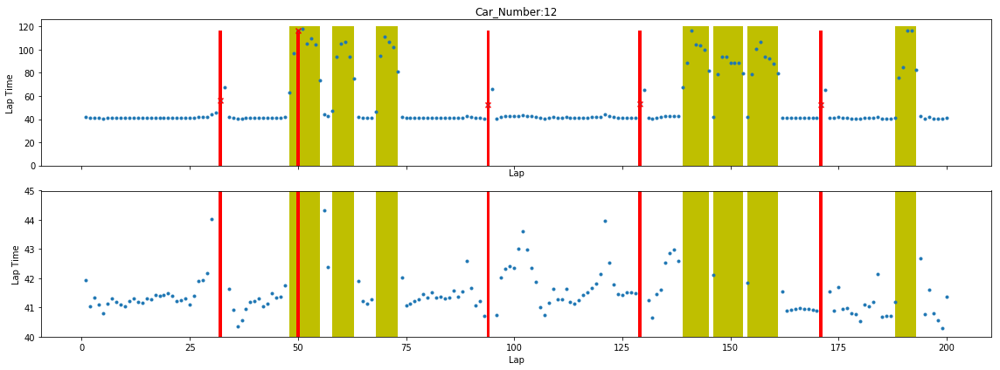
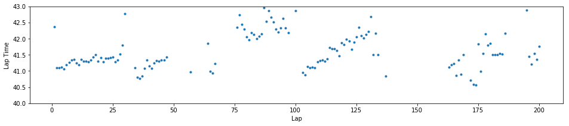
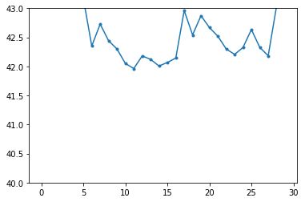

### laptime analysis

answer the questions:

1. any trend in the lap time over laps observable?


# Imports


```python
%matplotlib inline

import pandas as pd
import numpy as np
import matplotlib.pyplot as plt


# to use only one GPU.
# use this on r-001
# otherwise comment
import os
os.environ["CUDA_VISIBLE_DEVICES"]="7"

```

## Load Data


```python
import os
os.getcwd()

```


    '/scratch/hpda/indycar/predictor/notebook/DataAnalysis'


```python
#
# parameters
#
#year = '2017'
year = '2018'
#event = 'Toronto'
event = 'Indy500'

inputfile = '../C_'+ event +'-' + year + '-final.csv'
outputprefix = year +'-' + event + '-'
dataset = pd.read_csv(inputfile)
dataset.info(verbose=True)
```

    <class 'pandas.core.frame.DataFrame'>
    RangeIndex: 18500 entries, 0 to 18499
    Data columns (total 21 columns):
    rank                    18500 non-null int64
    car_number              18500 non-null int64
    unique_id               18500 non-null object
    completed_laps          18500 non-null int64
    elapsed_time            18500 non-null float64
    last_laptime            18500 non-null float64
    lap_status              18500 non-null object
    best_laptime            18500 non-null float64
    best_lap                18500 non-null object
    time_behind_leader      18500 non-null float64
    laps_behind_leade       18500 non-null object
    time_behind_prec        18500 non-null float64
    laps_behind_prec        18500 non-null object
    overall_rank            18500 non-null object
    overall_best_laptime    18500 non-null float64
    current_status          18500 non-null object
    track_status            18500 non-null object
    pit_stop_count          18500 non-null object
    last_pitted_lap         18500 non-null object
    start_position          18500 non-null object
    laps_led                18500 non-null object
    dtypes: float64(6), int64(3), object(12)
    memory usage: 3.0+ MB


```python

```


```python
# make indy car completed_laps dataset
# car_number, completed_laps, rank, elapsed_time, rank_diff, elapsed_time_diff 
def make_cl_data(dataset):

    # pick up data with valid rank
    rankdata = dataset.rename_axis('MyIdx').sort_values(by=['elapsed_time','MyIdx'], ascending=True)
    rankdata = rankdata.drop_duplicates(subset=['car_number', 'completed_laps'], keep='first')

    # resort by car_number, lap
    uni_ds = rankdata.sort_values(by=['car_number', 'completed_laps', 'elapsed_time'], ascending=True)    
    uni_ds = uni_ds.drop(["unique_id", "best_lap", "current_status", "track_status", "lap_status",
                      "laps_behind_leade","laps_behind_prec","overall_rank","pit_stop_count",
                      "last_pitted_lap","start_position","laps_led"], axis=1)
    
    carnumber = set(uni_ds['car_number'])
    print('cars:', carnumber)
    print('#cars=', len(carnumber))
   
    # faster solution , uni_ds already sorted by car_number and lap
    uni_ds['rank_diff'] = uni_ds['rank'].diff()
    mask = uni_ds.car_number != uni_ds.car_number.shift(1)
    uni_ds['rank_diff'][mask] = 0
    
    uni_ds['time_diff'] = uni_ds['elapsed_time'].diff()
    mask = uni_ds.car_number != uni_ds.car_number.shift(1)
    uni_ds['time_diff'][mask] = 0
    
    df = uni_ds[['car_number','completed_laps','rank','elapsed_time','rank_diff','time_diff']]
    
    return df

def make_lapstatus_data(dataset):
    final_lap = max(dataset.completed_laps)
    total_laps = final_lap + 1

    # get records for the cars that finish the race
    completed_car_numbers= dataset[dataset.completed_laps == final_lap].car_number.values
    completed_car_count = len(completed_car_numbers)

    print('count of completed cars:', completed_car_count)
    print('completed cars:', completed_car_numbers)
    
    #pick up one of them
    onecar = dataset[dataset['car_number']==completed_car_numbers[0]]
    onecar = onecar.drop_duplicates(subset=['car_number', 'completed_laps'], keep='first')
    return onecar[['completed_laps','track_status']]
    
```


```python
final_lap = max(dataset.completed_laps)
total_laps = final_lap + 1

# get records for the cars that finish the race
completed_car_numbers= dataset[dataset.completed_laps == final_lap].car_number.values
completed_car_count = len(completed_car_numbers)

print('count of completed cars:', completed_car_count)
print('completed cars:', completed_car_numbers)

#make a copy
alldata = dataset.copy()
dataset = dataset[dataset['car_number'].isin(completed_car_numbers)]
rankdata = alldata.rename_axis('MyIdx').sort_values(by=['elapsed_time','MyIdx'], ascending=True)
rankdata = rankdata.drop_duplicates(subset=['car_number', 'completed_laps'], keep='first')
```

    count of completed cars: 18
    completed cars: [12 20  9 27 28 22 29  1  6 15 66 98  4 88 25 60 64 23]


```python
cldata = make_cl_data(dataset)
#cldata.to_csv(outputprefix + 'completed_laps_diff.csv')

flagdata = make_lapstatus_data(dataset)
#flagdata.to_csv(outputprefix + 'flagstatus.csv')

acldata = make_cl_data(alldata)
#cldata.to_csv(outputprefix + 'all_completed_laps_diff.csv')
```

    cars: {64, 1, 66, 98, 4, 6, 9, 12, 60, 15, 20, 22, 23, 88, 25, 27, 28, 29}
    #cars= 18
    count of completed cars: 18
    completed cars: [12 20  9 27 28 22 29  1  6 15 66 98  4 88 25 60 64 23]
    cars: {1, 3, 4, 6, 7, 9, 10, 12, 13, 14, 15, 17, 18, 19, 20, 21, 22, 23, 24, 25, 26, 27, 28, 29, 30, 32, 33, 59, 60, 64, 66, 88, 98}
    #cars= 33


    /scratch/hpda/anaconda3/envs/predictor/lib/python3.7/site-packages/ipykernel_launcher.py:22: SettingWithCopyWarning: 
    A value is trying to be set on a copy of a slice from a DataFrame
    
    See the caveats in the documentation: http://pandas.pydata.org/pandas-docs/stable/indexing.html#indexing-view-versus-copy
    /scratch/hpda/anaconda3/envs/predictor/lib/python3.7/site-packages/ipykernel_launcher.py:26: SettingWithCopyWarning: 
    A value is trying to be set on a copy of a slice from a DataFrame
    
    See the caveats in the documentation: http://pandas.pydata.org/pandas-docs/stable/indexing.html#indexing-view-versus-copy


### overall view of laptime scatter plots


```python
curcarno = 12
car = acldata[acldata['car_number']==curcarno]
print(car['time_diff'].describe())
#car['time_diff'][:total_laps].plot(marker='.')


```

    count    201.000000
    mean      53.643840
    std       23.085979
    min        0.000000
    25%       41.181000
    50%       41.526500
    75%       52.474600
    max      117.870100
    Name: time_diff, dtype: float64


```python
cols=['completed_laps','rank','car_number','lap_status','track_status',
    'pit_stop_count','current_status','start_position']
colid={key:idx for idx, key in enumerate(cols)}

cardata = rankdata[rankdata['car_number'] == curcarno]

carstatus = [[row[0], row[1],row[2],row[3],row[4],row[5],row[6],row[7]] for row in cardata[
    ['completed_laps','rank','car_number','lap_status','track_status',
    'pit_stop_count','current_status','start_position']].values]
```


```python
fig, axes = plt.subplots(2,sharex=True,figsize=(16,6))
#fig.set_size_inches(15,8)


x = car['completed_laps'][1:].values
y = car['time_diff'][1:].values


pits=[]
yellowflags=[]
lastflag = 'x'
for row in carstatus:
    lap = int(row[colid['completed_laps']])
    
    if row[colid['lap_status']]=='P':
        pits.append(lap)
        
    if row[colid['track_status']]=='Y':
        if lastflag != 'Y':       
            #start
            yellowflags.append(lap)
    else:
        if lastflag == 'Y':       
            #end
            yellowflags.append(lap)        
    lastflag = row[colid['track_status']]
        
#pit lap
pits = np.array(pits)
#start, end lap
yellowflags = np.array(yellowflags).reshape((-1,2))
        
def draw_laptime(ax):
    #yellow flags
    for yflag in yellowflags:
        ax.bar(yflag[0],120, width = yflag[1] - yflag[0], align='edge', color = 'y', zorder=-100)

    #plt.plot(np.arange(laptime.shape[0]), laptime, marker='.')
    ax.scatter(x, y, marker='.')    

    #pit stops    
    ax.scatter(pits, y[pits-1], marker='x', color='r')
    for pit in pits:
        ax.bar(pit,height = y[pits-1], width = .8, align='center', color = 'r', zorder=-100)
    
    #ax.set_xlim((0, 33))
    #ax.set_ylim((0, 201))
    ax.set_xlabel('Lap')
    ax.set_ylabel('Lap Time')

draw_laptime(axes[0])
axes[1].set_ylim((40, 45))
draw_laptime(axes[1])


#ax.set_aspect('equal')
axes[0].set_title('Car_Number:%d'%curcarno)
fig.tight_layout()
fig.savefig(outputprefix + '_laptime-%d.pdf'%curcarno)
```





```python
yellowflags
```


    array([[ 48,  55],
           [ 58,  63],
           [ 68,  73],
           [139, 145],
           [146, 153],
           [154, 161],
           [188, 193]])


```python
pits
```


    array([ 32,  50,  94, 129, 171])


```python
cardata[(cardata['completed_laps']>25) & (cardata['completed_laps']<36)]
```


<div>
<style scoped>
    .dataframe tbody tr th:only-of-type {
        vertical-align: middle;
    }

    .dataframe tbody tr th {
        vertical-align: top;
    }

    .dataframe thead th {
        text-align: right;
    }
</style>
<table border="1" class="dataframe">
  <thead>
    <tr style="text-align: right;">
      <th></th>
      <th>rank</th>
      <th>car_number</th>
      <th>unique_id</th>
      <th>completed_laps</th>
      <th>elapsed_time</th>
      <th>last_laptime</th>
      <th>lap_status</th>
      <th>best_laptime</th>
      <th>best_lap</th>
      <th>time_behind_leader</th>
      <th>...</th>
      <th>time_behind_prec</th>
      <th>laps_behind_prec</th>
      <th>overall_rank</th>
      <th>overall_best_laptime</th>
      <th>current_status</th>
      <th>track_status</th>
      <th>pit_stop_count</th>
      <th>last_pitted_lap</th>
      <th>start_position</th>
      <th>laps_led</th>
    </tr>
    <tr>
      <th>MyIdx</th>
      <th></th>
      <th></th>
      <th></th>
      <th></th>
      <th></th>
      <th></th>
      <th></th>
      <th></th>
      <th></th>
      <th></th>
      <th></th>
      <th></th>
      <th></th>
      <th></th>
      <th></th>
      <th></th>
      <th></th>
      <th></th>
      <th></th>
      <th></th>
      <th></th>
    </tr>
  </thead>
  <tbody>
    <tr>
      <th>2242</th>
      <td>3</td>
      <td>12</td>
      <td>2</td>
      <td>26</td>
      <td>1073.0892</td>
      <td>41.3980</td>
      <td>T</td>
      <td>40.7903</td>
      <td>5</td>
      <td>2.4153</td>
      <td>...</td>
      <td>1.3802</td>
      <td>0</td>
      <td>3</td>
      <td>40.7903</td>
      <td>Active</td>
      <td>G</td>
      <td>0</td>
      <td>0</td>
      <td>3</td>
      <td>0</td>
    </tr>
    <tr>
      <th>2332</th>
      <td>3</td>
      <td>12</td>
      <td>2</td>
      <td>27</td>
      <td>1115.0069</td>
      <td>41.9177</td>
      <td>T</td>
      <td>40.7903</td>
      <td>5</td>
      <td>2.3900</td>
      <td>...</td>
      <td>1.3798</td>
      <td>0</td>
      <td>3</td>
      <td>40.7903</td>
      <td>Active</td>
      <td>G</td>
      <td>0</td>
      <td>0</td>
      <td>3</td>
      <td>0</td>
    </tr>
    <tr>
      <th>2424</th>
      <td>3</td>
      <td>12</td>
      <td>2</td>
      <td>28</td>
      <td>1156.9452</td>
      <td>41.9383</td>
      <td>T</td>
      <td>40.7903</td>
      <td>5</td>
      <td>1.9214</td>
      <td>...</td>
      <td>0.8658</td>
      <td>0</td>
      <td>3</td>
      <td>40.7903</td>
      <td>Active</td>
      <td>G</td>
      <td>0</td>
      <td>0</td>
      <td>3</td>
      <td>0</td>
    </tr>
    <tr>
      <th>2516</th>
      <td>3</td>
      <td>12</td>
      <td>2</td>
      <td>29</td>
      <td>1199.1295</td>
      <td>42.1843</td>
      <td>T</td>
      <td>40.7903</td>
      <td>5</td>
      <td>1.9555</td>
      <td>...</td>
      <td>0.8838</td>
      <td>0</td>
      <td>3</td>
      <td>40.7903</td>
      <td>Active</td>
      <td>G</td>
      <td>0</td>
      <td>0</td>
      <td>3</td>
      <td>0</td>
    </tr>
    <tr>
      <th>2610</th>
      <td>4</td>
      <td>12</td>
      <td>2</td>
      <td>30</td>
      <td>1243.1682</td>
      <td>44.0387</td>
      <td>T</td>
      <td>40.7903</td>
      <td>5</td>
      <td>1.1264</td>
      <td>...</td>
      <td>0.4850</td>
      <td>0</td>
      <td>4</td>
      <td>40.7903</td>
      <td>Active</td>
      <td>G</td>
      <td>0</td>
      <td>0</td>
      <td>3</td>
      <td>0</td>
    </tr>
    <tr>
      <th>2700</th>
      <td>2</td>
      <td>12</td>
      <td>2</td>
      <td>31</td>
      <td>1288.8561</td>
      <td>45.6879</td>
      <td>T</td>
      <td>40.7903</td>
      <td>5</td>
      <td>1.6026</td>
      <td>...</td>
      <td>1.6026</td>
      <td>0</td>
      <td>2</td>
      <td>40.7903</td>
      <td>Active</td>
      <td>G</td>
      <td>0</td>
      <td>0</td>
      <td>3</td>
      <td>0</td>
    </tr>
    <tr>
      <th>2836</th>
      <td>4</td>
      <td>12</td>
      <td>2</td>
      <td>32</td>
      <td>1345.0213</td>
      <td>56.1652</td>
      <td>P</td>
      <td>40.7903</td>
      <td>5</td>
      <td>12.3354</td>
      <td>...</td>
      <td>2.4475</td>
      <td>0</td>
      <td>4</td>
      <td>40.7903</td>
      <td>Active</td>
      <td>G</td>
      <td>1</td>
      <td>20</td>
      <td>3</td>
      <td>0</td>
    </tr>
    <tr>
      <th>3094</th>
      <td>18</td>
      <td>12</td>
      <td>2</td>
      <td>33</td>
      <td>1412.5610</td>
      <td>67.5397</td>
      <td>T</td>
      <td>40.7903</td>
      <td>5</td>
      <td>37.0525</td>
      <td>...</td>
      <td>0.0355</td>
      <td>0</td>
      <td>12</td>
      <td>40.7903</td>
      <td>Active</td>
      <td>G</td>
      <td>1</td>
      <td>20</td>
      <td>3</td>
      <td>0</td>
    </tr>
    <tr>
      <th>3219</th>
      <td>10</td>
      <td>12</td>
      <td>2</td>
      <td>34</td>
      <td>1454.1976</td>
      <td>41.6366</td>
      <td>T</td>
      <td>40.7903</td>
      <td>5</td>
      <td>23.9824</td>
      <td>...</td>
      <td>0.4734</td>
      <td>0</td>
      <td>A</td>
      <td>40.7903</td>
      <td>Active</td>
      <td>G</td>
      <td>1</td>
      <td>20</td>
      <td>3</td>
      <td>0</td>
    </tr>
    <tr>
      <th>3368</th>
      <td>6</td>
      <td>12</td>
      <td>2</td>
      <td>35</td>
      <td>1495.1092</td>
      <td>40.9116</td>
      <td>T</td>
      <td>40.7903</td>
      <td>5</td>
      <td>6.6659</td>
      <td>...</td>
      <td>2.4087</td>
      <td>0</td>
      <td>6</td>
      <td>40.7903</td>
      <td>Active</td>
      <td>G</td>
      <td>1</td>
      <td>20</td>
      <td>3</td>
      <td>0</td>
    </tr>
  </tbody>
</table>
<p>10 rows × 21 columns</p>
</div>


```python
fig, ax = plt.subplots(1,1,figsize=(16,3))
#fig.set_size_inches(15,8)

#ax.set_xlim((0, 33))
ax.set_ylim((40, 43))
ax.set_xlabel('Lap')
ax.set_ylabel('Lap Time')

x = car['completed_laps'][1:].values
y = car['time_diff'][1:].values

#plt.plot(np.arange(laptime.shape[0]), laptime, marker='.')
plt.scatter(x, y, marker='.')
```


    <matplotlib.collections.PathCollection at 0x7f8a080bc9b0>





```python
car = cldata[cldata['car_number']==1]
laps = total_laps
laps = 150
laptime = car['time_diff'][70:100]

plt.plot(np.arange(laptime.shape[0]), laptime, marker='.')
plt.ylim(40,43)
```


    (40, 43)





```python

```


```python
outputprefix
```


    '2018-Indy500-'


```python

```
