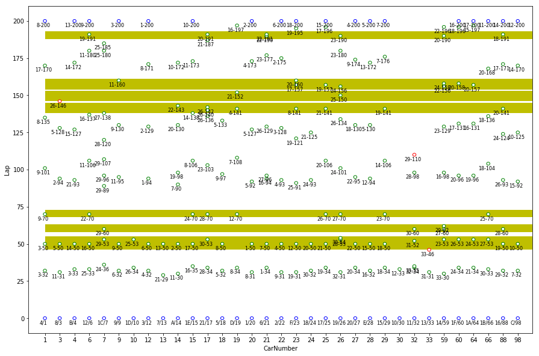
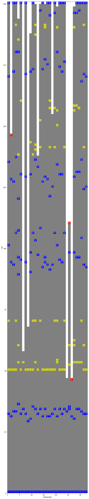

### pitstop analysis

assumption:

1. since all the cars use the same type of tire in indycar series, the average number of laps between pitstop should be similar. the pitstop decision then can be early or late that centered around the mean.

2. influences of pitstops on the change of rank


# Imports


```python
%matplotlib inline

import pandas as pd
import numpy as np
import matplotlib.pyplot as plt
import matplotlib.patches as mpatch

# to use only one GPU.
# use this on r-001
# otherwise comment
import os
os.environ["CUDA_VISIBLE_DEVICES"]="7"

```

## Load Data


```python
import os
os.getcwd()

```


    '/scratch/hpda/indycar/predictor/notebook/DataAnalysis'


```python
#
# parameters
#
#year = '2017'
year = '2018'
#event = 'Toronto'
event = 'Indy500'

inputfile = '../C_'+ event +'-' + year + '-final.csv'
outputprefix = year +'-' + event + '-'
dataset = pd.read_csv(inputfile)
dataset.info(verbose=True)
```

    <class 'pandas.core.frame.DataFrame'>
    RangeIndex: 18500 entries, 0 to 18499
    Data columns (total 21 columns):
    rank                    18500 non-null int64
    car_number              18500 non-null int64
    unique_id               18500 non-null object
    completed_laps          18500 non-null int64
    elapsed_time            18500 non-null float64
    last_laptime            18500 non-null float64
    lap_status              18500 non-null object
    best_laptime            18500 non-null float64
    best_lap                18500 non-null object
    time_behind_leader      18500 non-null float64
    laps_behind_leade       18500 non-null object
    time_behind_prec        18500 non-null float64
    laps_behind_prec        18500 non-null object
    overall_rank            18500 non-null object
    overall_best_laptime    18500 non-null float64
    current_status          18500 non-null object
    track_status            18500 non-null object
    pit_stop_count          18500 non-null object
    last_pitted_lap         18500 non-null object
    start_position          18500 non-null object
    laps_led                18500 non-null object
    dtypes: float64(6), int64(3), object(12)
    memory usage: 3.0+ MB


#### Rank Analysis


```python
alldata = dataset.copy()
rankdata = alldata.rename_axis('MyIdx').sort_values(by=['elapsed_time','MyIdx'], ascending=True)
rankdata = rankdata.drop_duplicates(subset=['car_number', 'completed_laps'], keep='first')
```


```python
rankdata[rankdata['completed_laps']==200]
```


```python
rankdata[rankdata['car_number']==3]
```


```python
def draw_boxview():
    fig, ax = plt.subplots()#1,1,figsize=(8,15))
    fig.set_size_inches(4*2,15*4)

    pits = []
    yflag = []
    #
    # car_number / lap
    #
    for row in result:

        x = carno[int(row[colid['car_number']])]
        y = int(row[colid['completed_laps']])

        if row[colid['lap_status']]=='P':
            #pitid
            pitid = pitno[int(row[colid['car_number']])]
            pitno[int(row[colid['car_number']])] += 1

            # #rank-#carno-#laps-#pitid
            #txt = '#%d\n%d-%d'%(int(row[1]), row[0], pitid)
            txt = '#%d-%d\n%d\n%d-%s'%(int(row[colid['rank']]), row[colid['car_number']],
                                   row[colid['completed_laps']], pitid, row[colid['pit_stop_count']])

            color = 'y' if row[colid['track_status']]=='Y' else 'b'

            if row[colid['current_status']] != 'Active':
                color = 'r'
            pits.append((mpatch.Rectangle((x,y), 1, 1, color = color), txt))
        else:
            #other than pitstop
            if y == 200:
                #completed cars
                txt = '#%d-%d\n%d\n%d-%s'%(int(row[colid['rank']]), row[colid['car_number']],
                                       row[colid['completed_laps']], pitid, row[colid['pit_stop_count']])
                pits.append((mpatch.Rectangle((x,y), 1, 1, color = 'b'), txt))
            elif y == 0:
                #start position
                txt = '#%s-%d'%(row[colid['start_position']], row[colid['car_number']])
                pits.append((mpatch.Rectangle((x,y), 1, 1, color = 'b'), txt))
            else:
                pits.append((mpatch.Rectangle((x,y), 1, 1, color = 'gray'), ''))

    for r in pits:
        rect = r[0]
        ax.add_artist(rect)
        rx, ry = rect.get_xy()
        cx = rx + rect.get_width()/2.0
        cy = ry + rect.get_height()/2.0

        if r[1] == '':
            ax.annotate(r[1], (cx, cy), color='gray', weight='bold', 
                    fontsize=4, ha='center', va='center')
        else:
            ax.annotate(r[1], (cx, cy), color='w', weight='bold', 
                    fontsize=4, ha='center', va='center')

    ax.set_xlim((0, 33))
    ax.set_ylim((0, 201))
    ax.set_ylabel('Lap')
    ax.set_xlabel('CarNumber')

    ax.set_aspect('equal')
    fig.tight_layout()
    fig.savefig(outputprefix + '_pitstop_bycarno_fullview.pdf')
```

### Observation 1

lap status 
    Indicates where the lap was completed
    T = Track, P = Pit lane.
    
track status
    G = Green
    Y = Yellow
    R = Red
    W = White
    K = Checkered
    U = Unflagged (warm up)


```python
#apstatus = rankdata[rankdata['car_number'] == 1]['lap_status']
#ist(lapstatus)

#pitstop_data = rankdata[['completed_laps','rank','car_number','lap_status','track_status']]
pitstop_data = rankdata.copy()
```


```python
#carnumber -> id
xscale=int(100/11)
carno = {}
id = 0
carnumberset = sorted(set(pitstop_data['car_number']))
for car in carnumberset:
    carno[car] = id*xscale
    id += 1

#print cars
print('carnumber:',len(carno))
print(carno)
```

    carnumber: 33
    {1: 0, 3: 9, 4: 18, 6: 27, 7: 36, 9: 45, 10: 54, 12: 63, 13: 72, 14: 81, 15: 90, 17: 99, 18: 108, 19: 117, 20: 126, 21: 135, 22: 144, 23: 153, 24: 162, 25: 171, 26: 180, 27: 189, 28: 198, 29: 207, 30: 216, 32: 225, 33: 234, 59: 243, 60: 252, 64: 261, 66: 270, 88: 279, 98: 288}


```python
def init_carno(xscale):
    carno = {}
    id = 0
    carnumberset = sorted(set(pitstop_data['car_number']))
    for car in carnumberset:
        carno[car] = id*xscale
        id += 1

    #print cars
    print('carnumber:',len(carno))
    print(carno)
    return carno

```


```python
# accumulate on pitstop number for each car
pitno = {}
for car in carno.keys():
    pitno[car] = 1

cols=['completed_laps','rank','car_number','lap_status','track_status',
    'pit_stop_count','current_status','start_position']
colid={key:idx for idx, key in enumerate(cols)}

carstatus = [[row[0], row[1],row[2],row[3],row[4],row[5],row[6],row[7]] for row in pitstop_data[
    ['completed_laps','rank','car_number','lap_status','track_status',
    'pit_stop_count','current_status','start_position']].values]
```


```python
result[0]
```


    [0, 1, 20, 'T', 'G', '0', 'Active', '1']


```python
#draw_boxview
```


```python
#
# plot line/bar chart
#
pits=[]
yellowflags=[]
lastflag = 'x'
for row in carstatus:
    lap = int(row[colid['completed_laps']])
    
    if row[colid['lap_status']]=='P':
        pits.append(lap)
        
    if row[colid['track_status']]=='Y':
        if lastflag != 'Y':       
            #start
            yellowflags.append(lap)
    else:
        if lastflag == 'Y':       
            #end
            yellowflags.append(lap)        
    lastflag = row[colid['track_status']]
        
#pit lap
pits = np.array(pits)
#start, end lap
yellowflags = np.array(yellowflags).reshape((-1,2))

```


```python
yellowflags
```


    array([[ 46,  55],
           [ 58,  63],
           [ 68,  73],
           [138, 145],
           [146, 153],
           [154, 161],
           [188, 193]])


```python
fig, ax = plt.subplots()#1,1,figsize=(8,15))
fig.set_size_inches(15,10)

xscale=int(100/11)  #(200*15)/(10*33)
carno = init_carno(xscale)
    
pits = []
yflag = []
#
# car_number / lap
#
boxsize = 1
for row in result:
    
    x = carno[int(row[colid['car_number']])]
    y = int(row[colid['completed_laps']])
    
    if row[colid['lap_status']]=='P':
        #pitid
        pitid = pitno[int(row[colid['car_number']])]
        pitno[int(row[colid['car_number']])] += 1
        
        # #rank-#carno-#laps-#pitid
        #txt = '#%d\n%d-%d'%(int(row[1]), row[0], pitid)
        #txt = '#%d-%d\n%d\n%d-%s'%(int(row[colid['rank']]), row[colid['car_number']],
        #                       row[colid['completed_laps']], pitid, row[colid['pit_stop_count']])
        #txt = '#%d'%(int(row[colid['rank']]))
        txt = '%d-%d'%(int(row[colid['rank']]),row[colid['completed_laps']])
        #color = 'g' if row[colid['track_status']]=='Y' else 'b'
        color = 'g'
                          
        if row[colid['current_status']] != 'Active':
            color = 'r'
        #pits.append((mpatch.Rectangle((x,y), boxsize, boxsize, color = color), txt))
        pits.append((mpatch.Circle((x,y), boxsize, fc='w',  ec = color), txt))
        #ax.text(x, y, txt, color=color)
    else:
        #other than pitstop
        color = 'b'
        if y == 200:
            #completed cars
            #txt = '#%d-%d\n%d\n%d-%s'%(int(row[colid['rank']]), row[colid['car_number']],
            #                       row[colid['completed_laps']], pitid, row[colid['pit_stop_count']])
            #txt = '#%d'%(int(row[colid['rank']]))
            txt = '%d-%d'%(int(row[colid['rank']]),row[colid['completed_laps']])
            
            pits.append((mpatch.Circle((x,y), boxsize, fc='w', ec = color), txt))
        elif y == 0:
            #start position
            #txt = '#%s-%d'%(row[colid['start_position']], row[colid['car_number']])
            txt = '%s/%d'%(row[colid['start_position']],row[colid['car_number']])
            pits.append((mpatch.Circle((x,y), boxsize, fc='w',  ec = color), txt))
        #else:
        #    pits.append((mpatch.Rectangle((x,y), 1, 1, color = 'gray'), ''))
    
    #ax.text(x, y, txt, color=color)
for yflag in yellowflags:
    ax.barh(yflag[0],33*xscale, height = yflag[1] - yflag[0], align='edge', color = 'y', zorder=-100)
    #ax.barh(yflag[0],33,align='edge', color = 'y', zorder=-100)
    
for r in pits:
    rect = r[0]
    ax.add_artist(rect)
    rx, ry = rect.get_center()
    cx = rx - boxsize*2/2.0
    cy = ry - boxsize*6/2.0

    if r[1] == '':
        ax.annotate(r[1], (cx, cy), color='gray', weight='bold', 
                fontsize=8, ha='center', va='center')
    else:
        ax.annotate(r[1], (cx, cy), color='k',  
                fontsize=8, ha='center', va='center',zorder=100)
  


#ax.set_xlim((0, 33))
ax.set_xlim((-10, 33*xscale))
ax.set_ylim((-10, 210))

x_car = [x*xscale for x in range(len(carno))]
ax.set_xticks(x_car)
ax.set_xticklabels([str(x) for x in carnumberset])

ax.set_ylabel('Lap')
ax.set_xlabel('CarNumber')

#ax.set_aspect('equal')
#fig.tight_layout()
fig.savefig(outputprefix + '_pitstop_bycarno_2.pdf')
```





```python
# detailed figure

carno = init_carno(1)
draw_boxview()
```

    carnumber: 33
    {1: 0, 3: 1, 4: 2, 6: 3, 7: 4, 9: 5, 10: 6, 12: 7, 13: 8, 14: 9, 15: 10, 17: 11, 18: 12, 19: 13, 20: 14, 21: 15, 22: 16, 23: 17, 24: 18, 25: 19, 26: 20, 27: 21, 28: 22, 29: 23, 30: 24, 32: 25, 33: 26, 59: 27, 60: 28, 64: 29, 66: 30, 88: 31, 98: 32}





```python
a = pitstop_data[(pitstop_data['completed_laps']==31) | (pitstop_data['completed_laps']==34)]
a = a[a['car_number'] == 19]
a
```


<div>
<style scoped>
    .dataframe tbody tr th:only-of-type {
        vertical-align: middle;
    }

    .dataframe tbody tr th {
        vertical-align: top;
    }

    .dataframe thead th {
        text-align: right;
    }
</style>
<table border="1" class="dataframe">
  <thead>
    <tr style="text-align: right;">
      <th></th>
      <th>completed_laps</th>
      <th>rank</th>
      <th>car_number</th>
      <th>lap_status</th>
      <th>track_status</th>
    </tr>
    <tr>
      <th>MyIdx</th>
      <th></th>
      <th></th>
      <th></th>
      <th></th>
      <th></th>
    </tr>
  </thead>
  <tbody>
    <tr>
      <th>2742</th>
      <td>31</td>
      <td>12</td>
      <td>19</td>
      <td>T</td>
      <td>G</td>
    </tr>
    <tr>
      <th>3208</th>
      <td>34</td>
      <td>8</td>
      <td>19</td>
      <td>P</td>
      <td>G</td>
    </tr>
  </tbody>
</table>
</div>


```python
outputprefix
```


    '2018-Indy500-'


