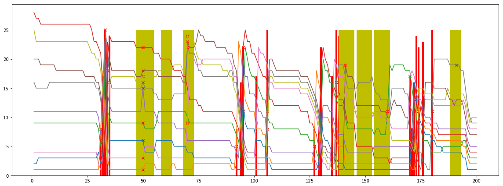

### stage dataset

build a stage dataset with feature extraction


# Imports


```python
%matplotlib inline

import pandas as pd
import numpy as np
import matplotlib.pyplot as plt


# to use only one GPU.
# use this on r-001
# otherwise comment
import os
os.environ["CUDA_VISIBLE_DEVICES"]="7"

```

## Load Data


```python
import os
os.getcwd()

```


    '/scratch/hpda/indycar/predictor/notebook/3.StageDataset'


```python
#
# parameters
#
#year = '2017'
year = '2018'
#event = 'Toronto'
events = ['Phoenix','Indy500','Texas','Iowa','Pocono','Gateway']

```


```python
# make indy car completed_laps dataset
# car_number, completed_laps, rank, elapsed_time, rank_diff, elapsed_time_diff 
def make_cl_data(dataset):

    # pick up data with valid rank
    rankdata = dataset.rename_axis('MyIdx').sort_values(by=['elapsed_time','MyIdx'], ascending=True)
    rankdata = rankdata.drop_duplicates(subset=['car_number', 'completed_laps'], keep='first')

    # resort by car_number, lap
    uni_ds = rankdata.sort_values(by=['car_number', 'completed_laps', 'elapsed_time'], ascending=True)    
    uni_ds = uni_ds.drop(["unique_id", "best_lap", "current_status", "track_status", "lap_status",
                      "laps_behind_leade","laps_behind_prec","overall_rank","pit_stop_count",
                      "last_pitted_lap","start_position","laps_led"], axis=1)
    
    carnumber = set(uni_ds['car_number'])
    print('cars:', carnumber)
    print('#cars=', len(carnumber))
   
    # faster solution , uni_ds already sorted by car_number and lap
    uni_ds['rank_diff'] = uni_ds['rank'].diff()
    mask = uni_ds.car_number != uni_ds.car_number.shift(1)
    uni_ds['rank_diff'][mask] = 0
    
    uni_ds['time_diff'] = uni_ds['elapsed_time'].diff()
    mask = uni_ds.car_number != uni_ds.car_number.shift(1)
    uni_ds['time_diff'][mask] = 0
    
    df = uni_ds[['car_number','completed_laps','rank','elapsed_time','rank_diff','time_diff']]
    
    return df

def make_lapstatus_data(dataset):
    final_lap = max(dataset.completed_laps)
    total_laps = final_lap + 1

    # get records for the cars that finish the race
    completed_car_numbers= dataset[dataset.completed_laps == final_lap].car_number.values
    completed_car_count = len(completed_car_numbers)

    print('count of completed cars:', completed_car_count)
    print('completed cars:', completed_car_numbers)
    
    #pick up one of them
    onecar = dataset[dataset['car_number']==completed_car_numbers[0]]
    onecar = onecar.drop_duplicates(subset=['car_number', 'completed_laps'], keep='first')
    return onecar[['completed_laps','track_status']]
    
```


```python
def load_data(event, year):
    inputfile = '../data/final/C_'+ event +'-' + year + '-final.csv'
    outputprefix = year +'-' + event + '-'
    dataset = pd.read_csv(inputfile)
    #dataset.info(verbose=True)    
    
    final_lap = max(dataset.completed_laps)
    total_laps = final_lap + 1

    # get records for the cars that finish the race
    completed_car_numbers= dataset[dataset.completed_laps == final_lap].car_number.values
    completed_car_count = len(completed_car_numbers)

    print('count of completed cars:', completed_car_count)
    print('completed cars:', completed_car_numbers)

    #make a copy
    alldata = dataset.copy()
    dataset = dataset[dataset['car_number'].isin(completed_car_numbers)]
    rankdata = alldata.rename_axis('MyIdx').sort_values(by=['elapsed_time','MyIdx'], ascending=True)
    rankdata = rankdata.drop_duplicates(subset=['car_number', 'completed_laps'], keep='first')
    
    cldata = make_cl_data(dataset)
    flagdata = make_lapstatus_data(dataset)
    acldata = make_cl_data(alldata)

    return alldata, rankdata, acldata, flagdata
```

### overall view of laptime scatter plots


```python
def get_cardata(curcarno, ycol='time_diff'):
    car = acldata[acldata['car_number']==curcarno]
    #print(car['time_diff'].describe())
    
    cols=['completed_laps','rank','car_number','lap_status','track_status',
    'pit_stop_count','current_status','start_position']
    colid={key:idx for idx, key in enumerate(cols)}

    cardata = rankdata[rankdata['car_number'] == curcarno]

    carstatus = [[row[0], row[1],row[2],row[3],row[4],row[5],row[6],row[7]] for row in cardata[
        ['completed_laps','rank','car_number','lap_status','track_status',
        'pit_stop_count','current_status','start_position']].values]
    
    x = car['completed_laps'][1:].values
    y = car[ycol][1:].values

    pits=[]
    yellowflags=[]
    lastflag = 'x'
    for row in carstatus:
        lap = int(row[colid['completed_laps']])

        if row[colid['lap_status']]=='P':
            pits.append(lap)

        if row[colid['track_status']]=='Y':
            if lastflag != 'Y':       
                #start
                yellowflags.append(lap)
        else:
            if lastflag == 'Y':       
                #end
                yellowflags.append(lap)        
        lastflag = row[colid['track_status']]

    #pit lap
    pits = np.array(pits)
    #start, end lap
    #
    yellowflags = np.array(yellowflags)
    if (yellowflags.shape[0] % 2)==1:
        print('crash?:carno=', curcarno)
        yellowflags = []
    else:
        yellowflags = np.array(yellowflags).reshape((-1,2))    
    
    return car, x, y, pits, yellowflags
```


```python
def draw_laptime(ax, ycol='LapTime'):
    
    ymax = np.max(y)
    
    #yellow flags
    for yflag in yellowflags:
        ax.bar(yflag[0],ymax, width = yflag[1] - yflag[0], align='edge', color = 'y', zorder=-100)

    #plt.plot(np.arange(laptime.shape[0]), laptime, marker='.')
    ax.scatter(x, y, marker='.')    

    #pit stops    
    ax.scatter(pits, y[pits-1], marker='x', color='r')
    for pit in pits:
        ax.bar(pit,height = y[pits-1], width = .8, align='center', color = 'r', zorder=-100)
    
    #ax.set_xlim((0, 33))
    #ax.set_ylim((0, 201))
    ax.set_xlabel('Lap')
    ax.set_ylabel(ycol)
    
def draw_pitstop(ax, pits):
    #pit stops    
    ax.scatter(pits, y[pits-1], marker='x', color='r')
    for pit in pits:
        ax.bar(pit,height = y[pits-1], width = .8, align='center', color = 'r', zorder=-100)

    
def draw_yellowflag(ax,yellowflags):
    ymax = np.max(y)
    #yellow flags
    for yflag in yellowflags:
        ax.bar(yflag[0],ymax, width = yflag[1] - yflag[0], align='edge', color = 'y', zorder=-100)
```

### bulid the dataset


```python
def get_stagedata(TRIM=2):
    """
    input: acldata, rankdata, the whole dataset
    output: stagedata['car_number','stage','start_lap','end_lap','start_rank','end_rank']
    """
    carlist = set(acldata['car_number'])
    data = []
    for curcarno in carlist:
        car = acldata[acldata['car_number']==curcarno]
        #print(car['time_diff'].describe())

        cols=['completed_laps','rank','car_number','lap_status','track_status',
        'pit_stop_count','current_status','start_position']
        colid={key:idx for idx, key in enumerate(cols)}

        cardata = rankdata[rankdata['car_number'] == curcarno]

        carstatus = [[row[0], row[1],row[2],row[3],row[4],row[5],row[6],row[7]] for row in cardata[
            ['completed_laps','rank','car_number','lap_status','track_status',
            'pit_stop_count','current_status','start_position']].values]

        pits=[]
        yellowflags=[]
        lastflag = 'x'
        
        stage = 0
        start_lap = 0
        pit_lap = 0
        pit_in_caution = 0
        for row in carstatus:
            lap = int(row[colid['completed_laps']])
            
            if lap==0:
                #hex2int
                start_rank = int(row[colid['start_position']], 16)     
            
            if row[colid['lap_status']]=='P':
                pits.append(lap)
                end_lap = lap - TRIM
                end_rank = carstatus[end_lap][colid['rank']]
                #add one record
                #stagedata['car_number','stage','start_lap','end_lap','start_rank','end_rank']
                data.append([curcarno,stage,start_lap, end_lap, pit_lap, pit_in_caution, start_rank, end_rank])
                # prepare for the next
                stage += 1
                start_lap = end_lap  # end_lap + 1?
                start_rank = end_rank
                pit_lap = lap  #current is pit lap
                pit_in_caution = 1 if row[colid['track_status']]=='Y' else 0
                

            if row[colid['track_status']]=='Y':
                if lastflag != 'Y':       
                    #start
                    yellowflags.append(lap)
            else:
                if lastflag == 'Y':       
                    #end
                    yellowflags.append(lap)        
            lastflag = row[colid['track_status']]

        #final
        end_lap = carstatus[-1][colid['completed_laps']]
        end_rank = carstatus[-1][colid['rank']]
        #add one record
        #stagedata['car_number','stage','start_lap','end_lap',pit_lap, pit_in_caution,'start_rank','end_rank']
        data.append([curcarno,stage,start_lap, end_lap, pit_lap, pit_in_caution, start_rank, end_rank])
        
        #pit lap
        pits = np.array(pits)
        #start, end lap
        #
        yellowflags = np.array(yellowflags)
        if (yellowflags.shape[0] % 2)==1:
            print('crash?:carno=', curcarno)
            yellowflags = []
        else:
            yellowflags = np.array(yellowflags).reshape((-1,2))  
            
    data = np.array(data)
    #['car_number','stage','start_lap','end_lap',pit_lap, pit_in_caution,'start_rank','end_rank']
    df = pd.DataFrame({'car_number': data[:, 0], 'stage': data[:, 1],'start_lap': data[:, 2],
                      'end_lap': data[:, 3], 'pit_lap': data[:, 4], 'pit_in_caution': data[:, 5],
                       'start_rank': data[:, 6],'end_rank': data[:, 7]})
    return df, data
```


```python
def extract_features(stagedata):
    """
    input: (alldata, rankdata, acldata, flagdata, stage, data)
    
    target
    eventid
    car_number
    stageid
    
    #0, gobal info 
    firststage  ;  1/0    
    pit_in_caution; 1/0
    start_position  ; #
    
    # 0 order of #rank
    start_rank  ;  #rank
    start_rank_ratio; ; #rank/carnum 
    top_pack    ;  top5 1/0 
    bottom_pack  ; bottom5 1/0 
    
    average_rank  ; previous stage
    average_rank_all  ; all previous stages
    
    # 1 order of #rank
    change_in_rank; previous stage
    change_in_rank_all;  all previous stages
    # 2 order of #rank
    rate_of_change; previous stage
    rate_of_change_all;  all previous stages
    
    #neighbors;   
    prev_nb0_change_in_rank
    prev_nb1_change_in_rank
    prev_nb2_change_in_rank
    follow_nb0_change_in_rank
    follow_nb1_change_in_rank
    follow_nb2_change_in_rank
    
    """
    eventid = 0
    cols=['target','eventid','car_number','stageid',
             'firststage','pit_in_caution','start_position',
             'start_rank','start_rank_ratio','top_pack','bottom_pack',
             'average_rank','average_rank_all',
             'change_in_rank','change_in_rank_all','rate_of_change','rate_of_change_all']
             #'prev_nb0_change_in_rank','prev_nb1_change_in_rank','prev_nb2_change_in_rank',
             #'follow_nb0_change_in_rank','follow_nb1_change_in_rank','follow_nb2_change_in_rank']
    colid={key:idx for idx, key in enumerate(cols)}
    
    datacols = ['car_number','stage','start_lap','end_lap','pit_lap', 'pit_in_caution', 'start_rank','end_rank']
    datacolid={key:idx for idx, key in enumerate(datacols)}
    
    
    stagedf = pd.DataFrame([],columns=cols)
    for event in stagedata.keys():
        alldata, rankdata, acldata, flagdata, stage, data = stagedata[event]
        carlist = set(acldata['car_number'])
        laplist = set(acldata['completed_laps'])
        totalcars = len(carlist)
        totallaps = len(laplist)
        
        records = []
        
        laphist = []
        rankhist = []
        rankchghist = []        
        #['car_number','stage','start_lap','end_lap',pit_lap, pit_in_caution, 'start_rank','end_rank']
        for row in data:
            # a new record
            rec={}
            #status, 'start_lap', start a new car
            if row[datacolid['start_lap']] == 0:
                start_position = row[datacolid['start_rank']]
                laphist = []
                rankhist = []
                rankchghist = []
            
            #target 
            rec['target'] = row[datacolid['end_rank']] - row[datacolid['start_rank']]
            
            #features
            rec['eventid'] = eventid
            rec['car_number'] = row[datacolid['car_number']]
            rec['stageid'] = row[datacolid['stage']]
            rec['firststage'] = 0 if row[datacolid['stage']]==0 else 1
            rec['pit_in_caution'] = row[datacolid['pit_in_caution']]
            rec['start_position'] = start_position
            rec['start_rank'] = row[datacolid['start_rank']]
            rec['start_rank_ratio'] = rec['start_rank'] / totalcars
            rec['top_pack'] = 1 if rec['start_rank']<=5 else 0
            #todo, not accurate here
            rec['bottom_pack'] = 1 if rec['start_rank']>=totalcars-5 else 0
            #get from laphist
            if laphist:
                #previous stage
                prev_stage = laphist[-1]
                rec['average_rank'] = np.mean(list(prev_stage['rank']))
                rec['average_rank_all'] = np.mean(rankhist)
            else:
                rec['average_rank'] = rec['start_rank']
                rec['average_rank_all'] = rec['start_rank']
                
            #change in rank
            if rankchghist:
                rec['change_in_rank'] = rankchghist[-1]
                rec['change_in_rank_all'] = np.mean(rankchghist)
            else:
                rec['change_in_rank'] = 0
                rec['change_in_rank_all'] = 0
                
            #rate of change in rank
            if len(rankchghist)>2:
                rec['rate_of_change'] = rankchghist[-1] - rankchghist[-2]
                rec['rate_of_change_all'] = (rankchghist[-1] - rankchghist[0])/(len(rankchghist)-1)
            else:
                rec['rate_of_change'] = 0
                rec['rate_of_change_all'] = 0            
            
            #add one record
            records.append([rec[col] for col in cols])
            
            #update for the new stage
            lapdata = rankdata[(rankdata['car_number']== rec['car_number']) & 
                               (rankdata['completed_laps']>=row[datacolid['start_lap']]) &
                               (rankdata['completed_laps']<row[datacolid['end_lap']])
                              ]
            laphist.append(lapdata)
            rankhist.extend(list(lapdata['rank']))
            rankchghist.append(row[datacolid['end_rank']] - row[datacolid['start_rank']])
          
        # push this event into stage dataframe
        print('eventid=%d, records=%d'%(eventid, len(records)))
        df = pd.DataFrame(records,columns=cols)
        stagedf = pd.concat([stagedf, df])
        
        #for the next new event
        eventid += 1
        
    return stagedf
```

### data analysis


```python
stagedata = {}
traindata = None
for event in events:
    #alldata, rankdata, acldata, flagdata
    stagedata[event] = load_data(event, year)
    
    alldata, rankdata, acldata, flagdata = stagedata[event]
    carlist = set(acldata['car_number'])
    laplist = set(acldata['completed_laps'])
    print('%s: carno=%d, lapnum=%d'%(event, len(carlist), len(laplist)))
    
    stage, data = get_stagedata(4)
    stagedata[event] = (alldata, rankdata, acldata, flagdata, stage, data)
    
    if traindata is None:
        traindata = data
    else:
        traindata = np.vstack((traindata, data))
```

    count of completed cars: 11
    completed cars: [ 1  6 27  9 28  5 20 14 15 22 30]
    cars: {1, 5, 6, 9, 14, 15, 20, 22, 27, 28, 30}
    #cars= 11
    count of completed cars: 11
    completed cars: [ 1  6 27  9 28  5 20 14 15 22 30]
    cars: {1, 4, 5, 6, 9, 10, 12, 14, 15, 18, 19, 20, 21, 22, 23, 26, 27, 28, 30, 32, 59, 88, 98}
    #cars= 23
    Phoenix: carno=23, lapnum=251


    /scratch/hpda/anaconda3/envs/predictor/lib/python3.7/site-packages/ipykernel_launcher.py:22: SettingWithCopyWarning: 
    A value is trying to be set on a copy of a slice from a DataFrame
    
    See the caveats in the documentation: http://pandas.pydata.org/pandas-docs/stable/indexing.html#indexing-view-versus-copy
    /scratch/hpda/anaconda3/envs/predictor/lib/python3.7/site-packages/ipykernel_launcher.py:26: SettingWithCopyWarning: 
    A value is trying to be set on a copy of a slice from a DataFrame
    
    See the caveats in the documentation: http://pandas.pydata.org/pandas-docs/stable/indexing.html#indexing-view-versus-copy


    crash?:carno= 10
    crash?:carno= 19
    count of completed cars: 18
    completed cars: [12 20  9 27 28 22 29  1  6 15 66 98  4 88 25 60 64 23]
    cars: {64, 1, 66, 98, 4, 6, 9, 12, 60, 15, 20, 22, 23, 88, 25, 27, 28, 29}
    #cars= 18
    count of completed cars: 18
    completed cars: [12 20  9 27 28 22 29  1  6 15 66 98  4 88 25 60 64 23]
    cars: {1, 3, 4, 6, 7, 9, 10, 12, 13, 14, 15, 17, 18, 19, 20, 21, 22, 23, 24, 25, 26, 27, 28, 29, 30, 32, 33, 59, 60, 64, 66, 88, 98}
    #cars= 33
    Indy500: carno=33, lapnum=201
    crash?:carno= 3
    crash?:carno= 24
    crash?:carno= 33
    count of completed cars: 9
    completed cars: [ 9 22 27  5 28 15 30 18 10]
    cars: {5, 9, 10, 15, 18, 22, 27, 28, 30}
    #cars= 9
    count of completed cars: 9
    completed cars: [ 9 22 27  5 28 15 30 18 10]
    cars: {1, 3, 4, 5, 6, 7, 9, 10, 12, 14, 15, 18, 19, 20, 21, 22, 23, 25, 26, 27, 28, 30, 47, 55, 57, 59, 60, 68, 73, 83, 88, 98}
    #cars= 32
    Texas: carno=32, lapnum=249
    crash?:carno= 12
    crash?:carno= 19
    count of completed cars: 5
    completed cars: [ 5 21 30  1  6]
    cars: {1, 5, 6, 21, 30}
    #cars= 5
    count of completed cars: 5
    completed cars: [ 5 21 30  1  6]
    cars: {1, 4, 5, 6, 9, 10, 12, 14, 15, 18, 19, 20, 21, 22, 23, 26, 27, 28, 30, 59, 88, 98}
    #cars= 22
    Iowa: carno=22, lapnum=301
    crash?:carno= 28
    count of completed cars: 4
    completed cars: [27 12  9 18]
    cars: {9, 18, 27, 12}
    #cars= 4
    count of completed cars: 4
    completed cars: [27 12  9 18]
    cars: {1, 4, 5, 6, 9, 10, 12, 14, 15, 18, 19, 20, 21, 22, 23, 26, 27, 28, 30, 59, 88, 98}
    #cars= 22
    Pocono: carno=22, lapnum=201
    count of completed cars: 8
    completed cars: [12 27  9 22 26 21  1 10]
    cars: {1, 9, 10, 12, 21, 22, 26, 27}
    #cars= 8
    count of completed cars: 8
    completed cars: [12 27  9 22 26 21  1 10]
    cars: {1, 4, 5, 9, 10, 12, 14, 15, 18, 19, 20, 21, 22, 23, 26, 27, 28, 30, 59, 88, 98}
    #cars= 21
    Gateway: carno=21, lapnum=249
    crash?:carno= 28


```python
df = extract_features(stagedata)
df.head(10)
```

    eventid=0, records=114
    eventid=1, records=225
    eventid=2, records=127
    eventid=3, records=109
    eventid=4, records=126
    eventid=5, records=104


<div>
<style scoped>
    .dataframe tbody tr th:only-of-type {
        vertical-align: middle;
    }

    .dataframe tbody tr th {
        vertical-align: top;
    }

    .dataframe thead th {
        text-align: right;
    }
</style>
<table border="1" class="dataframe">
  <thead>
    <tr style="text-align: right;">
      <th></th>
      <th>target</th>
      <th>eventid</th>
      <th>car_number</th>
      <th>stageid</th>
      <th>firststage</th>
      <th>pit_in_caution</th>
      <th>start_position</th>
      <th>start_rank</th>
      <th>start_rank_ratio</th>
      <th>top_pack</th>
      <th>bottom_pack</th>
      <th>average_rank</th>
      <th>average_rank_all</th>
      <th>change_in_rank</th>
      <th>change_in_rank_all</th>
      <th>rate_of_change</th>
      <th>rate_of_change_all</th>
    </tr>
  </thead>
  <tbody>
    <tr>
      <th>0</th>
      <td>0</td>
      <td>0</td>
      <td>1</td>
      <td>0</td>
      <td>0</td>
      <td>0</td>
      <td>7</td>
      <td>7</td>
      <td>0.304348</td>
      <td>0</td>
      <td>0</td>
      <td>7.000000</td>
      <td>7.000000</td>
      <td>0</td>
      <td>0.000000</td>
      <td>0</td>
      <td>0.000000</td>
    </tr>
    <tr>
      <th>1</th>
      <td>-5</td>
      <td>0</td>
      <td>1</td>
      <td>1</td>
      <td>1</td>
      <td>1</td>
      <td>7</td>
      <td>7</td>
      <td>0.304348</td>
      <td>0</td>
      <td>0</td>
      <td>7.025641</td>
      <td>7.025641</td>
      <td>0</td>
      <td>0.000000</td>
      <td>0</td>
      <td>0.000000</td>
    </tr>
    <tr>
      <th>2</th>
      <td>3</td>
      <td>0</td>
      <td>1</td>
      <td>2</td>
      <td>1</td>
      <td>0</td>
      <td>7</td>
      <td>2</td>
      <td>0.086957</td>
      <td>1</td>
      <td>0</td>
      <td>2.328947</td>
      <td>3.921739</td>
      <td>-5</td>
      <td>-2.500000</td>
      <td>0</td>
      <td>0.000000</td>
    </tr>
    <tr>
      <th>3</th>
      <td>-4</td>
      <td>0</td>
      <td>1</td>
      <td>3</td>
      <td>1</td>
      <td>0</td>
      <td>7</td>
      <td>5</td>
      <td>0.217391</td>
      <td>1</td>
      <td>0</td>
      <td>5.736842</td>
      <td>4.523256</td>
      <td>3</td>
      <td>-0.666667</td>
      <td>8</td>
      <td>1.500000</td>
    </tr>
    <tr>
      <th>4</th>
      <td>0</td>
      <td>0</td>
      <td>1</td>
      <td>4</td>
      <td>1</td>
      <td>1</td>
      <td>7</td>
      <td>1</td>
      <td>0.043478</td>
      <td>1</td>
      <td>0</td>
      <td>3.071429</td>
      <td>4.166667</td>
      <td>-4</td>
      <td>-1.500000</td>
      <td>-7</td>
      <td>-1.333333</td>
    </tr>
    <tr>
      <th>5</th>
      <td>-1</td>
      <td>0</td>
      <td>4</td>
      <td>0</td>
      <td>0</td>
      <td>0</td>
      <td>16</td>
      <td>16</td>
      <td>0.695652</td>
      <td>0</td>
      <td>0</td>
      <td>16.000000</td>
      <td>16.000000</td>
      <td>0</td>
      <td>0.000000</td>
      <td>0</td>
      <td>0.000000</td>
    </tr>
    <tr>
      <th>6</th>
      <td>-3</td>
      <td>0</td>
      <td>4</td>
      <td>1</td>
      <td>1</td>
      <td>1</td>
      <td>16</td>
      <td>15</td>
      <td>0.652174</td>
      <td>0</td>
      <td>0</td>
      <td>15.025641</td>
      <td>15.025641</td>
      <td>-1</td>
      <td>-1.000000</td>
      <td>0</td>
      <td>0.000000</td>
    </tr>
    <tr>
      <th>7</th>
      <td>3</td>
      <td>0</td>
      <td>4</td>
      <td>2</td>
      <td>1</td>
      <td>1</td>
      <td>16</td>
      <td>12</td>
      <td>0.521739</td>
      <td>0</td>
      <td>0</td>
      <td>14.500000</td>
      <td>14.976744</td>
      <td>-3</td>
      <td>-2.000000</td>
      <td>0</td>
      <td>0.000000</td>
    </tr>
    <tr>
      <th>8</th>
      <td>7</td>
      <td>0</td>
      <td>4</td>
      <td>3</td>
      <td>1</td>
      <td>0</td>
      <td>16</td>
      <td>15</td>
      <td>0.652174</td>
      <td>0</td>
      <td>0</td>
      <td>16.887324</td>
      <td>16.166667</td>
      <td>3</td>
      <td>-0.333333</td>
      <td>6</td>
      <td>2.000000</td>
    </tr>
    <tr>
      <th>9</th>
      <td>-1</td>
      <td>0</td>
      <td>4</td>
      <td>4</td>
      <td>1</td>
      <td>0</td>
      <td>16</td>
      <td>22</td>
      <td>0.956522</td>
      <td>0</td>
      <td>1</td>
      <td>10.600000</td>
      <td>15.932773</td>
      <td>7</td>
      <td>1.500000</td>
      <td>4</td>
      <td>2.666667</td>
    </tr>
  </tbody>
</table>
</div>


```python
df.to_csv('stage-%s.csv'%year)
```


```python
stagedata['Indy500'][4].info(verbose=True)
```

    <class 'pandas.core.frame.DataFrame'>
    RangeIndex: 225 entries, 0 to 224
    Data columns (total 8 columns):
    car_number        225 non-null int64
    stage             225 non-null int64
    start_lap         225 non-null int64
    end_lap           225 non-null int64
    pit_lap           225 non-null int64
    pit_in_caution    225 non-null int64
    start_rank        225 non-null int64
    end_rank          225 non-null int64
    dtypes: int64(8)
    memory usage: 14.1 KB


### baselines


```python
# simple model
y = traindata[:,-1] - traindata[:,-2]
acc = np.sum(y==0)
print('acc:', acc/traindata.shape[0])
```

    acc: 0.26583850931677017


```python
stage, data = get_stagedata(6)
```

    crash?:carno= 28


```python
# simple model
y = data[:,-1] - data[:,-2]
acc = np.sum(y==0)
print('acc:', acc/data.shape[0])
```

    acc: 0.25961538461538464


#### simple model, predict with current rank, change=0

trim |  accuracy
--     | --------
2  |  0.15
4  |  0.20
6  |  0.24


```python
stage
```


<div>
<style scoped>
    .dataframe tbody tr th:only-of-type {
        vertical-align: middle;
    }

    .dataframe tbody tr th {
        vertical-align: top;
    }

    .dataframe thead th {
        text-align: right;
    }
</style>
<table border="1" class="dataframe">
  <thead>
    <tr style="text-align: right;">
      <th></th>
      <th>car_number</th>
      <th>stage</th>
      <th>start_lap</th>
      <th>end_lap</th>
      <th>pit_lap</th>
      <th>pit_in_caution</th>
      <th>start_rank</th>
      <th>end_rank</th>
    </tr>
  </thead>
  <tbody>
    <tr>
      <th>0</th>
      <td>1</td>
      <td>0</td>
      <td>0</td>
      <td>53</td>
      <td>0</td>
      <td>0</td>
      <td>3</td>
      <td>4</td>
    </tr>
    <tr>
      <th>1</th>
      <td>1</td>
      <td>1</td>
      <td>53</td>
      <td>114</td>
      <td>59</td>
      <td>0</td>
      <td>4</td>
      <td>4</td>
    </tr>
    <tr>
      <th>2</th>
      <td>1</td>
      <td>2</td>
      <td>114</td>
      <td>171</td>
      <td>120</td>
      <td>0</td>
      <td>4</td>
      <td>5</td>
    </tr>
    <tr>
      <th>3</th>
      <td>1</td>
      <td>3</td>
      <td>171</td>
      <td>232</td>
      <td>177</td>
      <td>1</td>
      <td>5</td>
      <td>5</td>
    </tr>
    <tr>
      <th>4</th>
      <td>1</td>
      <td>4</td>
      <td>232</td>
      <td>248</td>
      <td>238</td>
      <td>0</td>
      <td>5</td>
      <td>7</td>
    </tr>
    <tr>
      <th>5</th>
      <td>4</td>
      <td>0</td>
      <td>0</td>
      <td>52</td>
      <td>0</td>
      <td>0</td>
      <td>18</td>
      <td>17</td>
    </tr>
    <tr>
      <th>6</th>
      <td>4</td>
      <td>1</td>
      <td>52</td>
      <td>107</td>
      <td>58</td>
      <td>0</td>
      <td>17</td>
      <td>18</td>
    </tr>
    <tr>
      <th>7</th>
      <td>4</td>
      <td>2</td>
      <td>107</td>
      <td>164</td>
      <td>113</td>
      <td>0</td>
      <td>18</td>
      <td>14</td>
    </tr>
    <tr>
      <th>8</th>
      <td>4</td>
      <td>3</td>
      <td>164</td>
      <td>174</td>
      <td>170</td>
      <td>1</td>
      <td>14</td>
      <td>16</td>
    </tr>
    <tr>
      <th>9</th>
      <td>4</td>
      <td>4</td>
      <td>174</td>
      <td>240</td>
      <td>180</td>
      <td>1</td>
      <td>16</td>
      <td>14</td>
    </tr>
    <tr>
      <th>10</th>
      <td>4</td>
      <td>5</td>
      <td>240</td>
      <td>246</td>
      <td>246</td>
      <td>0</td>
      <td>14</td>
      <td>16</td>
    </tr>
    <tr>
      <th>11</th>
      <td>5</td>
      <td>0</td>
      <td>0</td>
      <td>53</td>
      <td>0</td>
      <td>0</td>
      <td>8</td>
      <td>9</td>
    </tr>
    <tr>
      <th>12</th>
      <td>5</td>
      <td>1</td>
      <td>53</td>
      <td>114</td>
      <td>59</td>
      <td>0</td>
      <td>9</td>
      <td>9</td>
    </tr>
    <tr>
      <th>13</th>
      <td>5</td>
      <td>2</td>
      <td>114</td>
      <td>175</td>
      <td>120</td>
      <td>0</td>
      <td>9</td>
      <td>12</td>
    </tr>
    <tr>
      <th>14</th>
      <td>5</td>
      <td>3</td>
      <td>175</td>
      <td>220</td>
      <td>181</td>
      <td>1</td>
      <td>12</td>
      <td>11</td>
    </tr>
    <tr>
      <th>15</th>
      <td>5</td>
      <td>4</td>
      <td>220</td>
      <td>246</td>
      <td>226</td>
      <td>0</td>
      <td>11</td>
      <td>15</td>
    </tr>
    <tr>
      <th>16</th>
      <td>9</td>
      <td>0</td>
      <td>0</td>
      <td>54</td>
      <td>0</td>
      <td>0</td>
      <td>1</td>
      <td>1</td>
    </tr>
    <tr>
      <th>17</th>
      <td>9</td>
      <td>1</td>
      <td>54</td>
      <td>114</td>
      <td>60</td>
      <td>0</td>
      <td>1</td>
      <td>1</td>
    </tr>
    <tr>
      <th>18</th>
      <td>9</td>
      <td>2</td>
      <td>114</td>
      <td>171</td>
      <td>120</td>
      <td>0</td>
      <td>1</td>
      <td>2</td>
    </tr>
    <tr>
      <th>19</th>
      <td>9</td>
      <td>3</td>
      <td>171</td>
      <td>232</td>
      <td>177</td>
      <td>1</td>
      <td>2</td>
      <td>1</td>
    </tr>
    <tr>
      <th>20</th>
      <td>9</td>
      <td>4</td>
      <td>232</td>
      <td>248</td>
      <td>238</td>
      <td>0</td>
      <td>1</td>
      <td>3</td>
    </tr>
    <tr>
      <th>21</th>
      <td>10</td>
      <td>0</td>
      <td>0</td>
      <td>55</td>
      <td>0</td>
      <td>0</td>
      <td>12</td>
      <td>7</td>
    </tr>
    <tr>
      <th>22</th>
      <td>10</td>
      <td>1</td>
      <td>55</td>
      <td>113</td>
      <td>61</td>
      <td>0</td>
      <td>7</td>
      <td>7</td>
    </tr>
    <tr>
      <th>23</th>
      <td>10</td>
      <td>2</td>
      <td>113</td>
      <td>171</td>
      <td>119</td>
      <td>0</td>
      <td>7</td>
      <td>6</td>
    </tr>
    <tr>
      <th>24</th>
      <td>10</td>
      <td>3</td>
      <td>171</td>
      <td>219</td>
      <td>177</td>
      <td>1</td>
      <td>6</td>
      <td>4</td>
    </tr>
    <tr>
      <th>25</th>
      <td>10</td>
      <td>4</td>
      <td>219</td>
      <td>248</td>
      <td>225</td>
      <td>0</td>
      <td>4</td>
      <td>8</td>
    </tr>
    <tr>
      <th>26</th>
      <td>12</td>
      <td>0</td>
      <td>0</td>
      <td>56</td>
      <td>0</td>
      <td>0</td>
      <td>4</td>
      <td>2</td>
    </tr>
    <tr>
      <th>27</th>
      <td>12</td>
      <td>1</td>
      <td>56</td>
      <td>114</td>
      <td>62</td>
      <td>0</td>
      <td>2</td>
      <td>2</td>
    </tr>
    <tr>
      <th>28</th>
      <td>12</td>
      <td>2</td>
      <td>114</td>
      <td>171</td>
      <td>120</td>
      <td>0</td>
      <td>2</td>
      <td>1</td>
    </tr>
    <tr>
      <th>29</th>
      <td>12</td>
      <td>3</td>
      <td>171</td>
      <td>225</td>
      <td>177</td>
      <td>1</td>
      <td>1</td>
      <td>1</td>
    </tr>
    <tr>
      <th>...</th>
      <td>...</td>
      <td>...</td>
      <td>...</td>
      <td>...</td>
      <td>...</td>
      <td>...</td>
      <td>...</td>
      <td>...</td>
    </tr>
    <tr>
      <th>74</th>
      <td>27</td>
      <td>1</td>
      <td>55</td>
      <td>117</td>
      <td>61</td>
      <td>0</td>
      <td>3</td>
      <td>3</td>
    </tr>
    <tr>
      <th>75</th>
      <td>27</td>
      <td>2</td>
      <td>117</td>
      <td>171</td>
      <td>123</td>
      <td>0</td>
      <td>3</td>
      <td>4</td>
    </tr>
    <tr>
      <th>76</th>
      <td>27</td>
      <td>3</td>
      <td>171</td>
      <td>248</td>
      <td>177</td>
      <td>1</td>
      <td>4</td>
      <td>2</td>
    </tr>
    <tr>
      <th>77</th>
      <td>28</td>
      <td>0</td>
      <td>0</td>
      <td>53</td>
      <td>0</td>
      <td>0</td>
      <td>5</td>
      <td>5</td>
    </tr>
    <tr>
      <th>78</th>
      <td>28</td>
      <td>1</td>
      <td>53</td>
      <td>110</td>
      <td>59</td>
      <td>0</td>
      <td>5</td>
      <td>6</td>
    </tr>
    <tr>
      <th>79</th>
      <td>28</td>
      <td>2</td>
      <td>110</td>
      <td>166</td>
      <td>116</td>
      <td>0</td>
      <td>6</td>
      <td>3</td>
    </tr>
    <tr>
      <th>80</th>
      <td>28</td>
      <td>3</td>
      <td>166</td>
      <td>167</td>
      <td>172</td>
      <td>1</td>
      <td>3</td>
      <td>3</td>
    </tr>
    <tr>
      <th>81</th>
      <td>28</td>
      <td>4</td>
      <td>167</td>
      <td>173</td>
      <td>173</td>
      <td>1</td>
      <td>3</td>
      <td>19</td>
    </tr>
    <tr>
      <th>82</th>
      <td>30</td>
      <td>0</td>
      <td>0</td>
      <td>58</td>
      <td>0</td>
      <td>0</td>
      <td>13</td>
      <td>11</td>
    </tr>
    <tr>
      <th>83</th>
      <td>30</td>
      <td>1</td>
      <td>58</td>
      <td>120</td>
      <td>64</td>
      <td>0</td>
      <td>11</td>
      <td>5</td>
    </tr>
    <tr>
      <th>84</th>
      <td>30</td>
      <td>2</td>
      <td>120</td>
      <td>175</td>
      <td>126</td>
      <td>0</td>
      <td>5</td>
      <td>9</td>
    </tr>
    <tr>
      <th>85</th>
      <td>30</td>
      <td>3</td>
      <td>175</td>
      <td>247</td>
      <td>181</td>
      <td>1</td>
      <td>9</td>
      <td>9</td>
    </tr>
    <tr>
      <th>86</th>
      <td>59</td>
      <td>0</td>
      <td>0</td>
      <td>-2</td>
      <td>0</td>
      <td>0</td>
      <td>20</td>
      <td>17</td>
    </tr>
    <tr>
      <th>87</th>
      <td>59</td>
      <td>1</td>
      <td>-2</td>
      <td>53</td>
      <td>4</td>
      <td>1</td>
      <td>17</td>
      <td>20</td>
    </tr>
    <tr>
      <th>88</th>
      <td>59</td>
      <td>2</td>
      <td>53</td>
      <td>107</td>
      <td>59</td>
      <td>0</td>
      <td>20</td>
      <td>19</td>
    </tr>
    <tr>
      <th>89</th>
      <td>59</td>
      <td>3</td>
      <td>107</td>
      <td>162</td>
      <td>113</td>
      <td>0</td>
      <td>19</td>
      <td>15</td>
    </tr>
    <tr>
      <th>90</th>
      <td>59</td>
      <td>4</td>
      <td>162</td>
      <td>228</td>
      <td>168</td>
      <td>0</td>
      <td>15</td>
      <td>17</td>
    </tr>
    <tr>
      <th>91</th>
      <td>59</td>
      <td>5</td>
      <td>228</td>
      <td>244</td>
      <td>234</td>
      <td>0</td>
      <td>17</td>
      <td>17</td>
    </tr>
    <tr>
      <th>92</th>
      <td>88</td>
      <td>0</td>
      <td>0</td>
      <td>51</td>
      <td>0</td>
      <td>0</td>
      <td>19</td>
      <td>13</td>
    </tr>
    <tr>
      <th>93</th>
      <td>88</td>
      <td>1</td>
      <td>51</td>
      <td>103</td>
      <td>57</td>
      <td>0</td>
      <td>13</td>
      <td>11</td>
    </tr>
    <tr>
      <th>94</th>
      <td>88</td>
      <td>2</td>
      <td>103</td>
      <td>105</td>
      <td>109</td>
      <td>0</td>
      <td>11</td>
      <td>11</td>
    </tr>
    <tr>
      <th>95</th>
      <td>88</td>
      <td>3</td>
      <td>105</td>
      <td>158</td>
      <td>111</td>
      <td>0</td>
      <td>11</td>
      <td>20</td>
    </tr>
    <tr>
      <th>96</th>
      <td>88</td>
      <td>4</td>
      <td>158</td>
      <td>170</td>
      <td>164</td>
      <td>0</td>
      <td>20</td>
      <td>19</td>
    </tr>
    <tr>
      <th>97</th>
      <td>88</td>
      <td>5</td>
      <td>170</td>
      <td>222</td>
      <td>176</td>
      <td>1</td>
      <td>19</td>
      <td>18</td>
    </tr>
    <tr>
      <th>98</th>
      <td>88</td>
      <td>6</td>
      <td>222</td>
      <td>242</td>
      <td>228</td>
      <td>0</td>
      <td>18</td>
      <td>18</td>
    </tr>
    <tr>
      <th>99</th>
      <td>98</td>
      <td>0</td>
      <td>0</td>
      <td>51</td>
      <td>0</td>
      <td>0</td>
      <td>10</td>
      <td>8</td>
    </tr>
    <tr>
      <th>100</th>
      <td>98</td>
      <td>1</td>
      <td>51</td>
      <td>107</td>
      <td>57</td>
      <td>0</td>
      <td>8</td>
      <td>8</td>
    </tr>
    <tr>
      <th>101</th>
      <td>98</td>
      <td>2</td>
      <td>107</td>
      <td>162</td>
      <td>113</td>
      <td>0</td>
      <td>8</td>
      <td>8</td>
    </tr>
    <tr>
      <th>102</th>
      <td>98</td>
      <td>3</td>
      <td>162</td>
      <td>208</td>
      <td>168</td>
      <td>0</td>
      <td>8</td>
      <td>13</td>
    </tr>
    <tr>
      <th>103</th>
      <td>98</td>
      <td>4</td>
      <td>208</td>
      <td>246</td>
      <td>214</td>
      <td>0</td>
      <td>13</td>
      <td>14</td>
    </tr>
  </tbody>
</table>
<p>104 rows × 8 columns</p>
</div>


### rank in group view


```python
def get_grouprank(carlist, ycol='time_diff'):
    ret = []
    for carno in carlist:
        #car = acldata[acldata['car_number']==carno]
        #x = car['completed_laps'][1:].values
        #y = car[ycol][1:].values
        
        car, x, y, pits, yellowflags = get_cardata(carno,'rank')
        
        ret.append((x,y,pits))
        
    return ret, yellowflags


```


```python
finalgroup = [12, 20, 9, 27, 28, 29, 1, 6, 15]
startgroup = [20, 22, 12, 1, 18, 21, 13, 3, 9, 14]

alldata, rankdata, acldata, flagdata, stage, data = stagedata['Indy500']

finals, yellowflags = get_grouprank(finalgroup,'rank')

fig, axes = plt.subplots(1,figsize=(16,6))
for x, y,pits in finals:
    axes.plot(x,y)
    draw_pitstop(axes, pits)
    
draw_yellowflag(axes,yellowflags)
    
fig.tight_layout()
```





```python
finals
get_grouprank(startgroup,'rank')

fig, axes = plt.subplots(1,figsize=(16,6))
for x, y,pits in finals:
    axes.plot(x,y)
    draw_pitstop(axes, pits)
    
draw_yellowflag(axes,yellowflags)
    
fig.tight_layout()
```

    crash?:carno= 3


### conclusions

+ rank in group view, either the final top 10 group or the start top 10 group, shows relatively stable in non-pit and non-yellowflag area


```python

```
