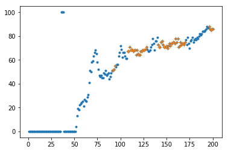

# Imports


```python
%matplotlib inline

import pandas as pd
import numpy as np
import matplotlib.pyplot as plt
import os
import random

```

## Load Data


```python
import os
os.getcwd()

```


    '/scratch/hpda/indycar/predictor/notebook/6.SectionRank'


```python
#
# parameters
#
#year = '2017'
year = '2018'
#event = 'Toronto'
event = 'Indy500'

inputfile = '../data/final/C_'+ event +'-' + year + '-final.csv'
outputprefix = year +'-' + event + '-'
dataset = pd.read_csv(inputfile)
dataset.info(verbose=True)
```

    <class 'pandas.core.frame.DataFrame'>
    RangeIndex: 18500 entries, 0 to 18499
    Data columns (total 21 columns):
    rank                    18500 non-null int64
    car_number              18500 non-null int64
    unique_id               18500 non-null object
    completed_laps          18500 non-null int64
    elapsed_time            18500 non-null float64
    last_laptime            18500 non-null float64
    lap_status              18500 non-null object
    best_laptime            18500 non-null float64
    best_lap                18500 non-null object
    time_behind_leader      18500 non-null float64
    laps_behind_leade       18500 non-null object
    time_behind_prec        18500 non-null float64
    laps_behind_prec        18500 non-null object
    overall_rank            18500 non-null object
    overall_best_laptime    18500 non-null float64
    current_status          18500 non-null object
    track_status            18500 non-null object
    pit_stop_count          18500 non-null object
    last_pitted_lap         18500 non-null object
    start_position          18500 non-null object
    laps_led                18500 non-null object
    dtypes: float64(6), int64(3), object(12)
    memory usage: 3.0+ MB


### The Simulator

simple model without DNF

1. laptime, modeled by average lap time on green laps
2. pitstop, uniform distributed in pit window(10 laps)
3. pitime, modeled by inlap, outlap time


```python
#green laps
alldata = dataset.copy()
carnos = np.sort(list(set(alldata.car_number.values)))
rankdata = alldata.rename_axis('MyIdx').sort_values(by=['elapsed_time','MyIdx'], ascending=True)

# since the flag changes in the middle of a lap, != 'Y' does not work here
#greendata = rankdata[rankdata['track_status']!='Y']
yellow_laps = rankdata[rankdata['track_status']=='Y'].completed_laps.values
green_laps = set(rankdata.completed_laps.values) - set(yellow_laps)
greendata = rankdata[rankdata['completed_laps'].isin(green_laps)]

# car_number, startpos, norm_lap, in_lap, out_lap
statdata = np.zeros((len(carnos), 8))
for idx, car in enumerate(carnos):
        thiscar = greendata[greendata['car_number']==car]
        
        pit_laps = thiscar[thiscar['lap_status']=='P'].completed_laps.values
        in_lap = thiscar[thiscar['completed_laps'].isin(pit_laps)].last_laptime.values
        out_laps = [x+1 for x in pit_laps]
        out_lap = thiscar[thiscar['completed_laps'].isin(out_laps)].last_laptime.values
        
        normal_laps = set(thiscar.completed_laps.values) - set(pit_laps) -set(out_laps)
        _laps = [x if x-1 in normal_laps else -1 for x in normal_laps]
        _laps=np.array(_laps)
        normal_laps = _laps[_laps>0]
        norm_lap = thiscar[thiscar['completed_laps'].isin(normal_laps)].last_laptime.values
        
        #save statistics
        statdata[idx, 0] = car
        startPos = thiscar[thiscar['completed_laps']==1].start_position.values[0]
        statdata[idx, 1] = int(startPos, 16)
        statdata[idx, 2] = np.mean(norm_lap)
        statdata[idx, 3] = np.std(norm_lap)
        statdata[idx, 4] = np.mean(in_lap)
        statdata[idx, 5] = np.std(in_lap)
        statdata[idx, 6] = np.mean(out_lap)
        statdata[idx, 7] = np.std(out_lap)
        
df = pd.DataFrame({'car_number':statdata[:,0].astype(int),'start_position':statdata[:,1].astype(int),'norm_lap_mean':statdata[:,2],'norm_lap_std':statdata[:,3],
                   'in_lap_mean':statdata[:,4],'in_lap_std':statdata[:,5],'out_lap_mean':statdata[:,6],'out_lap_std':statdata[:,7]})        
df.to_csv(outputprefix + 'simulator.csv')
simdf = df.copy()
```


```python
df.head(10)
```


<div>
<style scoped>
    .dataframe tbody tr th:only-of-type {
        vertical-align: middle;
    }

    .dataframe tbody tr th {
        vertical-align: top;
    }

    .dataframe thead th {
        text-align: right;
    }
</style>
<table border="1" class="dataframe">
  <thead>
    <tr style="text-align: right;">
      <th></th>
      <th>car_number</th>
      <th>in_lap_mean</th>
      <th>in_lap_std</th>
      <th>norm_lap_mean</th>
      <th>norm_lap_std</th>
      <th>out_lap_mean</th>
      <th>out_lap_std</th>
      <th>start_position</th>
    </tr>
  </thead>
  <tbody>
    <tr>
      <th>0</th>
      <td>1</td>
      <td>54.339015</td>
      <td>8.424845e-01</td>
      <td>41.743706</td>
      <td>0.766367</td>
      <td>66.104833</td>
      <td>0.730250</td>
      <td>4</td>
    </tr>
    <tr>
      <th>1</th>
      <td>3</td>
      <td>54.281610</td>
      <td>7.251726e-01</td>
      <td>41.611673</td>
      <td>0.676782</td>
      <td>66.911113</td>
      <td>0.401542</td>
      <td>8</td>
    </tr>
    <tr>
      <th>2</th>
      <td>4</td>
      <td>54.295602</td>
      <td>3.190570e-01</td>
      <td>41.946153</td>
      <td>0.770234</td>
      <td>68.036082</td>
      <td>0.729633</td>
      <td>11</td>
    </tr>
    <tr>
      <th>3</th>
      <td>6</td>
      <td>64.027260</td>
      <td>8.913270e-01</td>
      <td>42.018802</td>
      <td>0.778819</td>
      <td>55.488440</td>
      <td>0.238874</td>
      <td>18</td>
    </tr>
    <tr>
      <th>4</th>
      <td>7</td>
      <td>76.500685</td>
      <td>5.074079e+00</td>
      <td>43.346298</td>
      <td>1.081907</td>
      <td>58.039793</td>
      <td>0.983255</td>
      <td>28</td>
    </tr>
    <tr>
      <th>5</th>
      <td>9</td>
      <td>54.458102</td>
      <td>1.106836e+00</td>
      <td>42.022496</td>
      <td>0.701250</td>
      <td>66.476525</td>
      <td>0.545905</td>
      <td>9</td>
    </tr>
    <tr>
      <th>6</th>
      <td>10</td>
      <td>67.298100</td>
      <td>1.421085e-14</td>
      <td>42.409261</td>
      <td>1.136934</td>
      <td>55.727200</td>
      <td>0.000000</td>
      <td>29</td>
    </tr>
    <tr>
      <th>7</th>
      <td>12</td>
      <td>53.857717</td>
      <td>1.671692e+00</td>
      <td>41.485985</td>
      <td>0.776325</td>
      <td>65.957933</td>
      <td>0.901091</td>
      <td>3</td>
    </tr>
    <tr>
      <th>8</th>
      <td>13</td>
      <td>55.341700</td>
      <td>7.105427e-15</td>
      <td>41.927896</td>
      <td>0.640302</td>
      <td>67.616600</td>
      <td>0.000000</td>
      <td>7</td>
    </tr>
    <tr>
      <th>9</th>
      <td>14</td>
      <td>55.449998</td>
      <td>1.114515e+00</td>
      <td>41.540961</td>
      <td>0.629124</td>
      <td>66.876700</td>
      <td>0.556106</td>
      <td>10</td>
    </tr>
  </tbody>
</table>
</div>


```python
# pit window
# the first pit is more reasonable, the pit window should at least to be 7 laps
#
maxpitcnt = max([int(x,16) for x in rankdata.pit_stop_count.values])

for pit in range(1,maxpitcnt):
    pit_laps= np.sort(list(rankdata[(rankdata['pit_stop_count']==('%x'%(pit))) 
                                & (rankdata['lap_status']=='P')].completed_laps.values))
    print('%d:%d, %d'%(pit, min(pit_laps), max(pit_laps)))
    
    
```

    1:29, 36
    2:35, 70
    3:52, 108
    4:60, 141
    5:96, 175
    6:107, 197
    7:120, 196
    8:138, 195
    9:180, 191


#### Simulator


```python
def run_simulator(rankdata, simdf, savemodel='', baselap=0, basemodel=None):
    """
    input: simdf, rankdata
    baselap;  fix output before the startlap 
    basemode;  data[] of a previous run/simulation result
    
    simulator output the same data format as rankdata(C_xxx)
        #rank, car_number, completed_laps,elapsed_time,last_laptime
        #lap_status,track_status, pit_stop_count, last_pitted_lap
    """
    
    #init
    #random.seed(1234)
    random.seed()

    maxlaps = max(set(rankdata.completed_laps.values))
    cols=['rank', 'car_number', 'completed_laps','elapsed_time','last_laptime',
          'lap_status','track_status', 'pit_stop_count', 'last_pitted_lap']
    colid={key:idx for idx, key in enumerate(cols)}

    # fixed pit strategy
    # max laps = 38
    # pit window = 8
    # uniform distribution in [last_pit+38-8, last_pit+38]
    pit_maxlaps = 38
    pit_window = 8
    carnos = np.sort(list(set(simdf.car_number.values)))
    #carnos = simdf.car_number.values
    carid = {key:idx for idx, key in enumerate(carnos)}

    data = np.zeros((len(carnos)*maxlaps, len(cols)))
    #print('maxlaps=%d, data shape=%s'%(maxlaps, data.shape))    
    
    # fixed pit strategy
    # max laps = 38
    # pit window = 8
    # uniform distribution in [last_pit+38-8, last_pit+38]
    for car in carnos:
        curlap = 0
        pit_cnt = 0
        
        #get data from basemodel
        if baselap > 0:
            thiscar_model = basemodel[carid[car] * maxlaps:(carid[car]+1) * maxlaps,:]
            thiscar_pitlaps = np.argwhere(thiscar_model[:,colid['lap_status']]==1) 
            thiscar_pitlaps_idx = 0
            #debug
            #if car == 88:
            #    print('car 88:', thiscar_pitlaps)
        
        while curlap < maxlaps:
            #set the next pit lap
            #uniform in [curlap + ]
            right = curlap + pit_maxlaps
            if right > maxlaps:
                # no need to pitstop
                break
            left = curlap + pit_maxlaps - pit_window
            
            #dynamic 
            if baselap > 0:
                pit_lap = thiscar_pitlaps[thiscar_pitlaps_idx] 
                if pit_lap >= baselap:
                    #wait until pit_lap >= baselap
                    pit_lap = int(random.uniform(left, right))    
                    while pit_lap < baselap:
                        pit_lap = int(random.uniform(left, right))
                else:
                    #use the basemodel
                    thiscar_pitlaps_idx += 1
            else:
                pit_lap = int(random.uniform(left, right))
            
            
            #set it
            data[carid[car] * maxlaps + pit_lap, colid['lap_status']] = 1
            data[carid[car] * maxlaps + pit_lap, colid['pit_stop_count']] = pit_cnt
            data[carid[car] * maxlaps + pit_lap, colid['last_pitted_lap']] = pit_lap + 1

            pit_cnt += 1
            curlap = pit_lap
            
    # simulate the lap time
    # startPenalty = startPosition * 0.11(s)

    for car in carnos:
        last_ispit = 0
        param = simdf[simdf['car_number']==car]
        elapsed_time = param.start_position * 0.11
        
        #get data from basemodel
        if baselap > 0:
            thiscar_model = basemodel[carid[car] * maxlaps:(carid[car]+1) * maxlaps,:]        
        
        for lap in range(maxlaps):
            #use out_lap
            cur_ispit = data[carid[car] * maxlaps + lap, colid['lap_status']]
            if baselap > 0 and lap <= baselap:
                laptime = thiscar_model[lap,colid['last_laptime']]
            else:
                if last_ispit:
                    laptime = random.gauss(param['out_lap_mean'],param['out_lap_std'])
                elif cur_ispit:
                    #use in_lap
                    laptime = random.gauss(param['in_lap_mean'],param['in_lap_std'])
                else:
                    #use norm_lap
                    laptime = random.gauss(param['norm_lap_mean'],param['norm_lap_std'])

            data[carid[car] * maxlaps + lap, colid['last_laptime']] = laptime
            if baselap > 0 and lap <= baselap:
                elapsed_time = thiscar_model[lap,colid['elapsed_time']]
            else:
                elapsed_time += laptime
                
            data[carid[car] * maxlaps + lap, colid['elapsed_time']] = elapsed_time

            data[carid[car] * maxlaps + lap, colid['car_number']] = car
            #start from lap 1
            data[carid[car] * maxlaps + lap, colid['completed_laps']] = lap + 1

            #update and goto next lap
            last_ispit = cur_ispit

    # update the rank
    # carnumber = len(carnos)
    for lap in range(maxlaps):
        elapsed_time = [data[carid[car] * maxlaps + lap, colid['elapsed_time']] for car in carnos]
        indice = np.argsort(elapsed_time)
        rank = np.arange(len(carnos))
        out = np.arange(len(carnos))
        out[indice] = rank + 1
        for car in carnos:
            data[carid[car] * maxlaps + lap, colid['rank']] = int(out[carid[car]])

    #save data
    #rank, car_number, completed_laps,elapsed_time,last_laptime
    #lap_status,track_status, pit_stop_count, last_pitted_lap
    df = pd.DataFrame({'rank': data[:, 0].astype(int), 'car_number': data[:, 1].astype(int),
                       'completed_laps': data[:, 2].astype(int),
                       'elapsed_time': data[:, 3], 'last_laptime': data[:, 4], 
                       'lap_status': [ 'P' if x==1 else 'T' for x in data[:, 5]],
                       'track_status': [ 'G' for x in data[:, 6]],
                       'pit_stop_count': data[:, 7], 'last_pitted_lap': data[:, 8]})
    if savemodel:
        df.to_csv(savemodel)
    
    return df, data
```


```python
df0, data0 = run_simulator(rankdata, simdf)
df1, data1 = run_simulator(rankdata, simdf, '', 100, data0)
```


```python
np.mean(data0[:100,:]==data1[:100,:])
```


    1.0


```python
np.mean(data0[100:,:]==data1[100:,:])
```


    0.8383931623931624


```python
df0[(df0['car_number']==88) & (df0['lap_status']=='P')]
```


<div>
<style scoped>
    .dataframe tbody tr th:only-of-type {
        vertical-align: middle;
    }

    .dataframe tbody tr th {
        vertical-align: top;
    }

    .dataframe thead th {
        text-align: right;
    }
</style>
<table border="1" class="dataframe">
  <thead>
    <tr style="text-align: right;">
      <th></th>
      <th>car_number</th>
      <th>completed_laps</th>
      <th>elapsed_time</th>
      <th>lap_status</th>
      <th>last_laptime</th>
      <th>last_pitted_lap</th>
      <th>pit_stop_count</th>
      <th>rank</th>
      <th>track_status</th>
    </tr>
  </thead>
  <tbody>
    <tr>
      <th>6231</th>
      <td>88</td>
      <td>32</td>
      <td>1370.843156</td>
      <td>P</td>
      <td>68.624514</td>
      <td>32.0</td>
      <td>0.0</td>
      <td>28</td>
      <td>G</td>
    </tr>
    <tr>
      <th>6263</th>
      <td>88</td>
      <td>64</td>
      <td>2756.037393</td>
      <td>P</td>
      <td>64.846933</td>
      <td>64.0</td>
      <td>1.0</td>
      <td>26</td>
      <td>G</td>
    </tr>
    <tr>
      <th>6298</th>
      <td>88</td>
      <td>99</td>
      <td>4259.117143</td>
      <td>P</td>
      <td>66.060212</td>
      <td>99.0</td>
      <td>2.0</td>
      <td>20</td>
      <td>G</td>
    </tr>
    <tr>
      <th>6334</th>
      <td>88</td>
      <td>135</td>
      <td>5817.348909</td>
      <td>P</td>
      <td>66.204121</td>
      <td>135.0</td>
      <td>3.0</td>
      <td>18</td>
      <td>G</td>
    </tr>
    <tr>
      <th>6366</th>
      <td>88</td>
      <td>167</td>
      <td>7200.412543</td>
      <td>P</td>
      <td>66.551938</td>
      <td>167.0</td>
      <td>4.0</td>
      <td>18</td>
      <td>G</td>
    </tr>
  </tbody>
</table>
</div>


```python
df0[df0['completed_laps']==100]
```


<div>
<style scoped>
    .dataframe tbody tr th:only-of-type {
        vertical-align: middle;
    }

    .dataframe tbody tr th {
        vertical-align: top;
    }

    .dataframe thead th {
        text-align: right;
    }
</style>
<table border="1" class="dataframe">
  <thead>
    <tr style="text-align: right;">
      <th></th>
      <th>car_number</th>
      <th>completed_laps</th>
      <th>elapsed_time</th>
      <th>lap_status</th>
      <th>last_laptime</th>
      <th>last_pitted_lap</th>
      <th>pit_stop_count</th>
      <th>rank</th>
      <th>track_status</th>
    </tr>
  </thead>
  <tbody>
    <tr>
      <th>99</th>
      <td>1</td>
      <td>100</td>
      <td>4244.463828</td>
      <td>T</td>
      <td>42.185982</td>
      <td>0.0</td>
      <td>0.0</td>
      <td>6</td>
      <td>G</td>
    </tr>
    <tr>
      <th>299</th>
      <td>3</td>
      <td>100</td>
      <td>4260.723993</td>
      <td>T</td>
      <td>67.384361</td>
      <td>0.0</td>
      <td>0.0</td>
      <td>7</td>
      <td>G</td>
    </tr>
    <tr>
      <th>499</th>
      <td>4</td>
      <td>100</td>
      <td>4281.465969</td>
      <td>T</td>
      <td>41.526644</td>
      <td>0.0</td>
      <td>0.0</td>
      <td>16</td>
      <td>G</td>
    </tr>
    <tr>
      <th>699</th>
      <td>6</td>
      <td>100</td>
      <td>4308.769828</td>
      <td>T</td>
      <td>55.613627</td>
      <td>0.0</td>
      <td>0.0</td>
      <td>19</td>
      <td>G</td>
    </tr>
    <tr>
      <th>899</th>
      <td>7</td>
      <td>100</td>
      <td>4481.546738</td>
      <td>T</td>
      <td>41.431873</td>
      <td>0.0</td>
      <td>0.0</td>
      <td>33</td>
      <td>G</td>
    </tr>
    <tr>
      <th>1099</th>
      <td>9</td>
      <td>100</td>
      <td>4277.404218</td>
      <td>T</td>
      <td>41.856190</td>
      <td>0.0</td>
      <td>0.0</td>
      <td>12</td>
      <td>G</td>
    </tr>
    <tr>
      <th>1299</th>
      <td>10</td>
      <td>100</td>
      <td>4351.255416</td>
      <td>P</td>
      <td>67.298100</td>
      <td>100.0</td>
      <td>2.0</td>
      <td>31</td>
      <td>G</td>
    </tr>
    <tr>
      <th>1499</th>
      <td>12</td>
      <td>100</td>
      <td>4220.949946</td>
      <td>P</td>
      <td>52.878132</td>
      <td>100.0</td>
      <td>2.0</td>
      <td>1</td>
      <td>G</td>
    </tr>
    <tr>
      <th>1699</th>
      <td>13</td>
      <td>100</td>
      <td>4320.740110</td>
      <td>T</td>
      <td>41.470961</td>
      <td>0.0</td>
      <td>0.0</td>
      <td>25</td>
      <td>G</td>
    </tr>
    <tr>
      <th>1899</th>
      <td>14</td>
      <td>100</td>
      <td>4227.893066</td>
      <td>T</td>
      <td>42.146159</td>
      <td>0.0</td>
      <td>0.0</td>
      <td>2</td>
      <td>G</td>
    </tr>
    <tr>
      <th>2099</th>
      <td>15</td>
      <td>100</td>
      <td>4301.992758</td>
      <td>P</td>
      <td>66.480507</td>
      <td>100.0</td>
      <td>2.0</td>
      <td>18</td>
      <td>G</td>
    </tr>
    <tr>
      <th>2299</th>
      <td>17</td>
      <td>100</td>
      <td>4350.879229</td>
      <td>T</td>
      <td>41.108864</td>
      <td>0.0</td>
      <td>0.0</td>
      <td>30</td>
      <td>G</td>
    </tr>
    <tr>
      <th>2499</th>
      <td>18</td>
      <td>100</td>
      <td>4310.195047</td>
      <td>T</td>
      <td>43.248551</td>
      <td>0.0</td>
      <td>0.0</td>
      <td>20</td>
      <td>G</td>
    </tr>
    <tr>
      <th>2699</th>
      <td>19</td>
      <td>100</td>
      <td>4317.392547</td>
      <td>T</td>
      <td>42.806074</td>
      <td>0.0</td>
      <td>0.0</td>
      <td>23</td>
      <td>G</td>
    </tr>
    <tr>
      <th>2899</th>
      <td>20</td>
      <td>100</td>
      <td>4239.389178</td>
      <td>T</td>
      <td>40.578848</td>
      <td>0.0</td>
      <td>0.0</td>
      <td>5</td>
      <td>G</td>
    </tr>
    <tr>
      <th>3099</th>
      <td>21</td>
      <td>100</td>
      <td>4274.497300</td>
      <td>T</td>
      <td>41.991845</td>
      <td>0.0</td>
      <td>0.0</td>
      <td>10</td>
      <td>G</td>
    </tr>
    <tr>
      <th>3299</th>
      <td>22</td>
      <td>100</td>
      <td>4237.274718</td>
      <td>T</td>
      <td>41.863172</td>
      <td>0.0</td>
      <td>0.0</td>
      <td>4</td>
      <td>G</td>
    </tr>
    <tr>
      <th>3499</th>
      <td>23</td>
      <td>100</td>
      <td>4279.597607</td>
      <td>T</td>
      <td>42.449938</td>
      <td>0.0</td>
      <td>0.0</td>
      <td>15</td>
      <td>G</td>
    </tr>
    <tr>
      <th>3699</th>
      <td>24</td>
      <td>100</td>
      <td>4279.240442</td>
      <td>T</td>
      <td>42.388909</td>
      <td>0.0</td>
      <td>0.0</td>
      <td>14</td>
      <td>G</td>
    </tr>
    <tr>
      <th>3899</th>
      <td>25</td>
      <td>100</td>
      <td>4300.147197</td>
      <td>T</td>
      <td>42.717654</td>
      <td>0.0</td>
      <td>0.0</td>
      <td>17</td>
      <td>G</td>
    </tr>
    <tr>
      <th>4099</th>
      <td>26</td>
      <td>100</td>
      <td>4325.282393</td>
      <td>T</td>
      <td>43.499432</td>
      <td>0.0</td>
      <td>0.0</td>
      <td>27</td>
      <td>G</td>
    </tr>
    <tr>
      <th>4299</th>
      <td>27</td>
      <td>100</td>
      <td>4261.428463</td>
      <td>T</td>
      <td>41.275431</td>
      <td>0.0</td>
      <td>0.0</td>
      <td>8</td>
      <td>G</td>
    </tr>
    <tr>
      <th>4499</th>
      <td>28</td>
      <td>100</td>
      <td>4237.249658</td>
      <td>T</td>
      <td>42.804830</td>
      <td>0.0</td>
      <td>0.0</td>
      <td>3</td>
      <td>G</td>
    </tr>
    <tr>
      <th>4699</th>
      <td>29</td>
      <td>100</td>
      <td>4273.322741</td>
      <td>T</td>
      <td>41.139496</td>
      <td>0.0</td>
      <td>0.0</td>
      <td>9</td>
      <td>G</td>
    </tr>
    <tr>
      <th>4899</th>
      <td>30</td>
      <td>100</td>
      <td>4276.773666</td>
      <td>T</td>
      <td>41.287788</td>
      <td>0.0</td>
      <td>0.0</td>
      <td>11</td>
      <td>G</td>
    </tr>
    <tr>
      <th>5099</th>
      <td>32</td>
      <td>100</td>
      <td>4323.305787</td>
      <td>T</td>
      <td>41.000163</td>
      <td>0.0</td>
      <td>0.0</td>
      <td>26</td>
      <td>G</td>
    </tr>
    <tr>
      <th>5299</th>
      <td>33</td>
      <td>100</td>
      <td>4376.795492</td>
      <td>T</td>
      <td>44.604503</td>
      <td>0.0</td>
      <td>0.0</td>
      <td>32</td>
      <td>G</td>
    </tr>
    <tr>
      <th>5499</th>
      <td>59</td>
      <td>100</td>
      <td>4330.115303</td>
      <td>T</td>
      <td>42.073575</td>
      <td>0.0</td>
      <td>0.0</td>
      <td>28</td>
      <td>G</td>
    </tr>
    <tr>
      <th>5699</th>
      <td>60</td>
      <td>100</td>
      <td>4320.026136</td>
      <td>T</td>
      <td>40.900669</td>
      <td>0.0</td>
      <td>0.0</td>
      <td>24</td>
      <td>G</td>
    </tr>
    <tr>
      <th>5899</th>
      <td>64</td>
      <td>100</td>
      <td>4339.772743</td>
      <td>T</td>
      <td>56.854121</td>
      <td>0.0</td>
      <td>0.0</td>
      <td>29</td>
      <td>G</td>
    </tr>
    <tr>
      <th>6099</th>
      <td>66</td>
      <td>100</td>
      <td>4310.354805</td>
      <td>T</td>
      <td>41.815669</td>
      <td>0.0</td>
      <td>0.0</td>
      <td>21</td>
      <td>G</td>
    </tr>
    <tr>
      <th>6299</th>
      <td>88</td>
      <td>100</td>
      <td>4315.308634</td>
      <td>T</td>
      <td>56.191491</td>
      <td>0.0</td>
      <td>0.0</td>
      <td>22</td>
      <td>G</td>
    </tr>
    <tr>
      <th>6499</th>
      <td>98</td>
      <td>100</td>
      <td>4277.945451</td>
      <td>P</td>
      <td>54.015720</td>
      <td>100.0</td>
      <td>2.0</td>
      <td>13</td>
      <td>G</td>
    </tr>
  </tbody>
</table>
</div>


```python
df1[df1['completed_laps']==100]
```


<div>
<style scoped>
    .dataframe tbody tr th:only-of-type {
        vertical-align: middle;
    }

    .dataframe tbody tr th {
        vertical-align: top;
    }

    .dataframe thead th {
        text-align: right;
    }
</style>
<table border="1" class="dataframe">
  <thead>
    <tr style="text-align: right;">
      <th></th>
      <th>car_number</th>
      <th>completed_laps</th>
      <th>elapsed_time</th>
      <th>lap_status</th>
      <th>last_laptime</th>
      <th>last_pitted_lap</th>
      <th>pit_stop_count</th>
      <th>rank</th>
      <th>track_status</th>
    </tr>
  </thead>
  <tbody>
    <tr>
      <th>99</th>
      <td>1</td>
      <td>100</td>
      <td>4244.463828</td>
      <td>T</td>
      <td>42.185982</td>
      <td>0.0</td>
      <td>0.0</td>
      <td>6</td>
      <td>G</td>
    </tr>
    <tr>
      <th>299</th>
      <td>3</td>
      <td>100</td>
      <td>4260.723993</td>
      <td>T</td>
      <td>67.384361</td>
      <td>0.0</td>
      <td>0.0</td>
      <td>7</td>
      <td>G</td>
    </tr>
    <tr>
      <th>499</th>
      <td>4</td>
      <td>100</td>
      <td>4281.465969</td>
      <td>T</td>
      <td>41.526644</td>
      <td>0.0</td>
      <td>0.0</td>
      <td>16</td>
      <td>G</td>
    </tr>
    <tr>
      <th>699</th>
      <td>6</td>
      <td>100</td>
      <td>4308.769828</td>
      <td>T</td>
      <td>55.613627</td>
      <td>0.0</td>
      <td>0.0</td>
      <td>19</td>
      <td>G</td>
    </tr>
    <tr>
      <th>899</th>
      <td>7</td>
      <td>100</td>
      <td>4481.546738</td>
      <td>T</td>
      <td>41.431873</td>
      <td>0.0</td>
      <td>0.0</td>
      <td>33</td>
      <td>G</td>
    </tr>
    <tr>
      <th>1099</th>
      <td>9</td>
      <td>100</td>
      <td>4277.404218</td>
      <td>T</td>
      <td>41.856190</td>
      <td>0.0</td>
      <td>0.0</td>
      <td>12</td>
      <td>G</td>
    </tr>
    <tr>
      <th>1299</th>
      <td>10</td>
      <td>100</td>
      <td>4351.255416</td>
      <td>P</td>
      <td>67.298100</td>
      <td>100.0</td>
      <td>2.0</td>
      <td>31</td>
      <td>G</td>
    </tr>
    <tr>
      <th>1499</th>
      <td>12</td>
      <td>100</td>
      <td>4220.949946</td>
      <td>P</td>
      <td>52.878132</td>
      <td>100.0</td>
      <td>2.0</td>
      <td>1</td>
      <td>G</td>
    </tr>
    <tr>
      <th>1699</th>
      <td>13</td>
      <td>100</td>
      <td>4320.740110</td>
      <td>T</td>
      <td>41.470961</td>
      <td>0.0</td>
      <td>0.0</td>
      <td>25</td>
      <td>G</td>
    </tr>
    <tr>
      <th>1899</th>
      <td>14</td>
      <td>100</td>
      <td>4227.893066</td>
      <td>T</td>
      <td>42.146159</td>
      <td>0.0</td>
      <td>0.0</td>
      <td>2</td>
      <td>G</td>
    </tr>
    <tr>
      <th>2099</th>
      <td>15</td>
      <td>100</td>
      <td>4301.992758</td>
      <td>P</td>
      <td>66.480507</td>
      <td>100.0</td>
      <td>2.0</td>
      <td>18</td>
      <td>G</td>
    </tr>
    <tr>
      <th>2299</th>
      <td>17</td>
      <td>100</td>
      <td>4350.879229</td>
      <td>T</td>
      <td>41.108864</td>
      <td>0.0</td>
      <td>0.0</td>
      <td>30</td>
      <td>G</td>
    </tr>
    <tr>
      <th>2499</th>
      <td>18</td>
      <td>100</td>
      <td>4310.195047</td>
      <td>T</td>
      <td>43.248551</td>
      <td>0.0</td>
      <td>0.0</td>
      <td>20</td>
      <td>G</td>
    </tr>
    <tr>
      <th>2699</th>
      <td>19</td>
      <td>100</td>
      <td>4317.392547</td>
      <td>T</td>
      <td>42.806074</td>
      <td>0.0</td>
      <td>0.0</td>
      <td>23</td>
      <td>G</td>
    </tr>
    <tr>
      <th>2899</th>
      <td>20</td>
      <td>100</td>
      <td>4239.389178</td>
      <td>T</td>
      <td>40.578848</td>
      <td>0.0</td>
      <td>0.0</td>
      <td>5</td>
      <td>G</td>
    </tr>
    <tr>
      <th>3099</th>
      <td>21</td>
      <td>100</td>
      <td>4274.497300</td>
      <td>T</td>
      <td>41.991845</td>
      <td>0.0</td>
      <td>0.0</td>
      <td>10</td>
      <td>G</td>
    </tr>
    <tr>
      <th>3299</th>
      <td>22</td>
      <td>100</td>
      <td>4237.274718</td>
      <td>T</td>
      <td>41.863172</td>
      <td>0.0</td>
      <td>0.0</td>
      <td>4</td>
      <td>G</td>
    </tr>
    <tr>
      <th>3499</th>
      <td>23</td>
      <td>100</td>
      <td>4279.597607</td>
      <td>T</td>
      <td>42.449938</td>
      <td>0.0</td>
      <td>0.0</td>
      <td>15</td>
      <td>G</td>
    </tr>
    <tr>
      <th>3699</th>
      <td>24</td>
      <td>100</td>
      <td>4279.240442</td>
      <td>T</td>
      <td>42.388909</td>
      <td>0.0</td>
      <td>0.0</td>
      <td>14</td>
      <td>G</td>
    </tr>
    <tr>
      <th>3899</th>
      <td>25</td>
      <td>100</td>
      <td>4300.147197</td>
      <td>T</td>
      <td>42.717654</td>
      <td>0.0</td>
      <td>0.0</td>
      <td>17</td>
      <td>G</td>
    </tr>
    <tr>
      <th>4099</th>
      <td>26</td>
      <td>100</td>
      <td>4325.282393</td>
      <td>T</td>
      <td>43.499432</td>
      <td>0.0</td>
      <td>0.0</td>
      <td>27</td>
      <td>G</td>
    </tr>
    <tr>
      <th>4299</th>
      <td>27</td>
      <td>100</td>
      <td>4261.428463</td>
      <td>T</td>
      <td>41.275431</td>
      <td>0.0</td>
      <td>0.0</td>
      <td>8</td>
      <td>G</td>
    </tr>
    <tr>
      <th>4499</th>
      <td>28</td>
      <td>100</td>
      <td>4237.249658</td>
      <td>T</td>
      <td>42.804830</td>
      <td>0.0</td>
      <td>0.0</td>
      <td>3</td>
      <td>G</td>
    </tr>
    <tr>
      <th>4699</th>
      <td>29</td>
      <td>100</td>
      <td>4273.322741</td>
      <td>T</td>
      <td>41.139496</td>
      <td>0.0</td>
      <td>0.0</td>
      <td>9</td>
      <td>G</td>
    </tr>
    <tr>
      <th>4899</th>
      <td>30</td>
      <td>100</td>
      <td>4276.773666</td>
      <td>T</td>
      <td>41.287788</td>
      <td>0.0</td>
      <td>0.0</td>
      <td>11</td>
      <td>G</td>
    </tr>
    <tr>
      <th>5099</th>
      <td>32</td>
      <td>100</td>
      <td>4323.305787</td>
      <td>T</td>
      <td>41.000163</td>
      <td>0.0</td>
      <td>0.0</td>
      <td>26</td>
      <td>G</td>
    </tr>
    <tr>
      <th>5299</th>
      <td>33</td>
      <td>100</td>
      <td>4376.795492</td>
      <td>T</td>
      <td>44.604503</td>
      <td>0.0</td>
      <td>0.0</td>
      <td>32</td>
      <td>G</td>
    </tr>
    <tr>
      <th>5499</th>
      <td>59</td>
      <td>100</td>
      <td>4330.115303</td>
      <td>T</td>
      <td>42.073575</td>
      <td>0.0</td>
      <td>0.0</td>
      <td>28</td>
      <td>G</td>
    </tr>
    <tr>
      <th>5699</th>
      <td>60</td>
      <td>100</td>
      <td>4320.026136</td>
      <td>T</td>
      <td>40.900669</td>
      <td>0.0</td>
      <td>0.0</td>
      <td>24</td>
      <td>G</td>
    </tr>
    <tr>
      <th>5899</th>
      <td>64</td>
      <td>100</td>
      <td>4339.772743</td>
      <td>T</td>
      <td>56.854121</td>
      <td>0.0</td>
      <td>0.0</td>
      <td>29</td>
      <td>G</td>
    </tr>
    <tr>
      <th>6099</th>
      <td>66</td>
      <td>100</td>
      <td>4310.354805</td>
      <td>T</td>
      <td>41.815669</td>
      <td>0.0</td>
      <td>0.0</td>
      <td>21</td>
      <td>G</td>
    </tr>
    <tr>
      <th>6299</th>
      <td>88</td>
      <td>100</td>
      <td>4315.308634</td>
      <td>T</td>
      <td>56.191491</td>
      <td>0.0</td>
      <td>0.0</td>
      <td>22</td>
      <td>G</td>
    </tr>
    <tr>
      <th>6499</th>
      <td>98</td>
      <td>100</td>
      <td>4277.945451</td>
      <td>P</td>
      <td>54.015720</td>
      <td>100.0</td>
      <td>2.0</td>
      <td>13</td>
      <td>G</td>
    </tr>
  </tbody>
</table>
</div>


### run simulation


```python
# total runs, model runs = 80%
runs = 120
modelruns = 100

maxlaps = max(set(rankdata.completed_laps.values))
carnos = np.sort(list(set(simdf.car_number.values)))
carid = {key:idx for idx, key in enumerate(carnos)}

#laps = [100,200]
laps = range(1,201)
#contigency matrix
#<lap, carno, rank> -> count
cmat = np.zeros((len(laps), len(carnos), len(carnos)))
#simulation result 
simretdf = []
#<run, lap, carno> -> rank
simdata = np.zeros((runs, len(laps), len(carnos)))


dfseed,dataseed = run_simulator(rankdata, simdf)
baselap = 50

# run simulator
for run in range(runs):
    #fix the laps before baselap
    df,_ = run_simulator(rankdata, simdf, '', baselap, dataseed)
    simretdf.append(df)
    
    for idx, lap in enumerate(laps):
        data = df[df['completed_laps']==lap][['car_number','rank']].to_numpy()
        for pt in data:
            simdata[run, idx, carid[pt[0]]] = pt[1]
    
    
# build statistics model
for run in range(modelruns):    
    df = simretdf[run]
    
    #save rank@lap100 and rank@lap200
    for idx, lap in enumerate(laps):
        data = df[df['completed_laps']==lap][['car_number','rank']].to_numpy()
        for pt in data:
            cmat[idx, carid[pt[0]], pt[1]-1] += 1
    
print('simulation finished!')

#get the test data
simtestdata = simdata[modelruns-runs:,:,:]
print('sim cmat:', cmat.shape)
print('sim testdata:', simtestdata.shape)
```

    simulation finished!
    ('sim cmat:', (200, 33, 33))
    ('sim testdata:', (20, 200, 33))


```python
#save the simulation result
retfile = outputprefix + 'simulator-run%d.dat'%runs
cmatsave = cmat.reshape((-1, len(carnos)*len(carnos)))
np.savetxt(retfile, cmatsave)

retfile = outputprefix + 'simulator-data%d.dat'%runs
simdatasave = simdata.reshape((-1, len(laps)*len(carnos)))
np.savetxt(retfile, simdatasave)

```

### check the result


```python
#check the result
laps = [1,15,32,50,60, 110,150,200]
#check rank 1@lap100, @lap200
for lap in laps:
    print('rank1@lap',lap, ':', cmat[lap-1,:,0])
    
#print('rank1@lap200:',cmat[1,:,0])
```

    ('rank1@lap', 1, ':', array([  0.,   0.,   0.,   0.,   0.,   0.,   0.,   0.,   0.,   0.,   0.,
             0.,   0.,   0., 100.,   0.,   0.,   0.,   0.,   0.,   0.,   0.,
             0.,   0.,   0.,   0.,   0.,   0.,   0.,   0.,   0.,   0.,   0.]))
    ('rank1@lap', 15, ':', array([  0.,   0.,   0.,   0.,   0.,   0.,   0.,   0.,   0., 100.,   0.,
             0.,   0.,   0.,   0.,   0.,   0.,   0.,   0.,   0.,   0.,   0.,
             0.,   0.,   0.,   0.,   0.,   0.,   0.,   0.,   0.,   0.,   0.]))
    ('rank1@lap', 32, ':', array([  0.,   0.,   0.,   0.,   0.,   0.,   0.,   0.,   0., 100.,   0.,
             0.,   0.,   0.,   0.,   0.,   0.,   0.,   0.,   0.,   0.,   0.,
             0.,   0.,   0.,   0.,   0.,   0.,   0.,   0.,   0.,   0.,   0.]))
    ('rank1@lap', 50, ':', array([  0.,   0.,   0.,   0.,   0.,   0.,   0.,   0.,   0., 100.,   0.,
             0.,   0.,   0.,   0.,   0.,   0.,   0.,   0.,   0.,   0.,   0.,
             0.,   0.,   0.,   0.,   0.,   0.,   0.,   0.,   0.,   0.,   0.]))
    ('rank1@lap', 60, ':', array([ 0.,  0.,  0.,  0.,  0.,  0.,  0., 21.,  0., 65.,  0.,  0.,  0.,
            0.,  0.,  0., 14.,  0.,  0.,  0.,  0.,  0.,  0.,  0.,  0.,  0.,
            0.,  0.,  0.,  0.,  0.,  0.,  0.]))
    ('rank1@lap', 110, ':', array([ 0.,  0.,  0.,  0.,  0.,  0.,  0., 71.,  0., 14.,  0.,  0.,  0.,
            0.,  2.,  0., 13.,  0.,  0.,  0.,  0.,  0.,  0.,  0.,  0.,  0.,
            0.,  0.,  0.,  0.,  0.,  0.,  0.]))
    ('rank1@lap', 150, ':', array([ 0.,  2.,  0.,  0.,  0.,  0.,  0., 72.,  0., 11.,  0.,  0.,  0.,
            0.,  5.,  0., 10.,  0.,  0.,  0.,  0.,  0.,  0.,  0.,  0.,  0.,
            0.,  0.,  0.,  0.,  0.,  0.,  0.]))
    ('rank1@lap', 200, ':', array([ 0.,  1.,  0.,  0.,  0.,  0.,  0., 86.,  0.,  7.,  0.,  0.,  0.,
            0.,  5.,  0.,  1.,  0.,  0.,  0.,  0.,  0.,  0.,  0.,  0.,  0.,
            0.,  0.,  0.,  0.,  0.,  0.,  0.]))


#### check the result of will power


```python
cmat[:,7,0]
```


    array([  0.,   0.,   0.,   0.,   0.,   0.,   0.,   0.,   0.,   0.,   0.,
             0.,   0.,   0.,   0.,   0.,   0.,   0.,   0.,   0.,   0.,   0.,
             0.,   0.,   0.,   0.,   0.,   0.,   0.,   0.,   0.,   0.,   0.,
             0.,   0., 100., 100., 100.,   0.,   0.,   0.,   0.,   0.,   0.,
             0.,   0.,   0.,   0.,   0.,   0.,   0.,   4.,  13.,  19.,  18.,
            22.,  23.,  24.,  25.,  21.,  27.,  26.,  25.,  29.,  31.,  41.,
            51.,  50.,  58.,  59.,  63.,  66.,  68.,  65.,  58.,  52.,  47.,
            46.,  47.,  45.,  45.,  49.,  48.,  51.,  47.,  48.,  49.,  44.,
            46.,  49.,  51.,  51.,  52.,  55.,  54.,  56.,  56.,  63.,  66.,
            72.,  69.,  62.,  66.,  66.,  63.,  61.,  61.,  67.,  67.,  71.,
            68.,  69.,  68.,  67.,  68.,  68.,  64.,  68.,  65.,  64.,  64.,
            67.,  67.,  68.,  68.,  68.,  69.,  71.,  69.,  67.,  67.,  68.,
            71.,  73.,  78.,  74.,  68.,  76.,  76.,  79.,  73.,  71.,  71.,
            75.,  76.,  73.,  71.,  71.,  71.,  72.,  70.,  72.,  74.,  72.,
            74.,  74.,  75.,  75.,  74.,  78.,  75.,  78.,  71.,  72.,  75.,
            73.,  74.,  74.,  73.,  75.,  77.,  73.,  79.,  74.,  70.,  76.,
            77.,  79.,  75.,  77.,  78.,  77.,  79.,  78.,  80.,  82.,  81.,
            82.,  84.,  84.,  84.,  85.,  86.,  88.,  87.,  88.,  86.,  85.,
            86.,  86.])


```python
leader = rankdata[rankdata['rank']==1]
willpower_in_lead = leader[leader['car_number']==12].completed_laps.values
willpower_pred_lead = cmat[:,7,0]
willpower_in_lead
```


    array([ 92,  93,  94, 108, 109, 110, 111, 112, 113, 114, 115, 116, 117,
           118, 119, 120, 121, 122, 123, 124, 125, 126, 127, 128, 141, 142,
           143, 144, 145, 146, 147, 148, 149, 150, 151, 152, 153, 154, 155,
           156, 157, 158, 159, 160, 161, 162, 163, 164, 165, 166, 167, 168,
           169, 170, 196, 197, 198, 199, 200])


```python
willpower_in_lead.astype(int)-1
```


    array([ 91,  92,  93, 107, 108, 109, 110, 111, 112, 113, 114, 115, 116,
           117, 118, 119, 120, 121, 122, 123, 124, 125, 126, 127, 140, 141,
           142, 143, 144, 145, 146, 147, 148, 149, 150, 151, 152, 153, 154,
           155, 156, 157, 158, 159, 160, 161, 162, 163, 164, 165, 166, 167,
           168, 169, 195, 196, 197, 198, 199])


```python
willpower_pred_lead[willpower_in_lead.astype(int)-1]
```


    array([51., 52., 55., 67., 67., 71., 68., 69., 68., 67., 68., 68., 64.,
           68., 65., 64., 64., 67., 67., 68., 68., 68., 69., 71., 73., 71.,
           71., 75., 76., 73., 71., 71., 71., 72., 70., 72., 74., 72., 74.,
           74., 75., 75., 74., 78., 75., 78., 71., 72., 75., 73., 74., 74.,
           73., 75., 88., 86., 85., 86., 86.])


```python
laps = range(1,201)
plt.plot(laps, willpower_pred_lead,'.')
plt.plot(willpower_in_lead, willpower_pred_lead[willpower_in_lead.astype(int)-1],'+')
plt.show()
```





#### performance of the simulator prediction


```python
#model preidction on first 80 simulation results 
laps = range(1,201)
simulator_pred = []
for lap in laps:
    simulator_pred.append(np.argmax(cmat[lap-1,:,0]))
    
simulator_pred = np.array(simulator_pred)
simulator_pred
```


    array([14, 14, 14, 14, 14, 14, 14, 14, 14,  9,  9,  9,  9,  9,  9,  9,  9,
            9,  9,  9,  9,  9,  9,  9,  9,  9,  9,  9,  9,  9,  9,  9,  9,  9,
            9,  7,  7,  7,  9,  9,  9,  9,  9,  9,  9,  9,  9,  9,  9,  9,  9,
            9,  9,  9,  9,  9,  9,  9,  9,  9,  9,  9,  9,  9,  9,  9,  7,  7,
            7,  7,  7,  7,  7,  7,  7,  7,  7,  7,  7,  7,  7,  7,  7,  7,  7,
            7,  7,  7,  7,  7,  7,  7,  7,  7,  7,  7,  7,  7,  7,  7,  7,  7,
            7,  7,  7,  7,  7,  7,  7,  7,  7,  7,  7,  7,  7,  7,  7,  7,  7,
            7,  7,  7,  7,  7,  7,  7,  7,  7,  7,  7,  7,  7,  7,  7,  7,  7,
            7,  7,  7,  7,  7,  7,  7,  7,  7,  7,  7,  7,  7,  7,  7,  7,  7,
            7,  7,  7,  7,  7,  7,  7,  7,  7,  7,  7,  7,  7,  7,  7,  7,  7,
            7,  7,  7,  7,  7,  7,  7,  7,  7,  7,  7,  7,  7,  7,  7,  7,  7,
            7,  7,  7,  7,  7,  7,  7,  7,  7,  7,  7,  7,  7])


```python
#
#  over the groundtruth
#
# test on the latest 20
testruns = runs - modelruns
testret = np.zeros((testruns, len(simulator_pred)))
for run in range(modelruns, runs):
    df = simretdf[run]
    leader = df[df['rank']==1]
    leader = leader.rename_axis('MyIdx').sort_values(by=['completed_laps','MyIdx'], ascending=True)
    ground_truth = []
    for car in leader.car_number.values:
        ground_truth.append(carid[car] )
    ground_truth = np.array(ground_truth)
    
    idx = ((simulator_pred - ground_truth) == 0)
    testret[run-modelruns,:] = idx
#show result    
print('mean rank1 accuracy:', np.mean(testret[:,baselap:]), np.mean(testret[:,baselap:], axis=1))

#check rank1@lap10, fixed prediction
laps = [1,15,32,50,60,110, 150,200]
for lap in laps:
    print('mean rank1@lap',lap, 'accuracy:', np.mean(testret[:,lap-1]))
#print('mean rank1@lap10 accuracy:', np.mean(testret[:,9]))
#print('mean rank1@lap10 accuracy:', np.mean(testret[:,9]))

```

    ('mean rank1 accuracy:', 0.653, array([0.92      , 0.66666667, 0.26      , 0.08666667, 0.76666667,
           0.54      , 0.43333333, 0.94      , 0.95333333, 0.42666667,
           0.78      , 0.91333333, 0.70666667, 0.93333333, 0.57333333,
           0.7       , 0.38666667, 0.95333333, 0.58666667, 0.53333333]))
    ('mean rank1@lap', 1, 'accuracy:', 1.0)
    ('mean rank1@lap', 15, 'accuracy:', 1.0)
    ('mean rank1@lap', 32, 'accuracy:', 1.0)
    ('mean rank1@lap', 50, 'accuracy:', 1.0)
    ('mean rank1@lap', 60, 'accuracy:', 0.5)
    ('mean rank1@lap', 110, 'accuracy:', 0.65)
    ('mean rank1@lap', 150, 'accuracy:', 0.7)
    ('mean rank1@lap', 200, 'accuracy:', 0.7)


```python
    run = modelruns + 2
    df = simretdf[run]
    leader = df[df['rank']==1]
    
    leader = leader.rename_axis('MyIdx').sort_values(by=['completed_laps','MyIdx'], ascending=True)
    
    ground_truth = []
    for car in leader.car_number.values:
        ground_truth.append(carid[car] )
    ground_truth = np.array(ground_truth)
    ground_truth
```


    array([14, 14, 14, 14, 14, 14, 14, 14, 14,  9,  9,  9,  9,  9,  9,  9,  9,
            9,  9,  9,  9,  9,  9,  9,  9,  9,  9,  9,  9,  9,  9,  9,  9,  9,
            9,  7,  7,  7,  9,  9,  9,  9,  9,  9,  9,  9,  9,  9,  9,  9,  9,
            9,  9,  9,  9,  9,  9,  9,  9,  9,  9,  9,  9,  9,  9,  9,  9,  9,
            9,  9,  9,  7,  7,  7,  7, 14, 14, 14, 14, 14, 14, 14, 14, 14,  9,
            9,  9,  9,  9,  9,  9,  9,  9,  9,  9,  9,  9,  9,  9,  9,  9,  9,
            9,  9,  9,  7,  7,  7,  7,  9,  9,  9,  9,  9, 14, 14, 14, 14,  9,
           14, 14, 14, 14, 14, 14,  9,  9,  9,  9,  9,  9,  9,  9,  9,  9,  9,
            9,  9,  7,  7,  7,  7,  7,  7, 14,  9, 14, 14, 14, 14, 14, 14, 14,
           14, 14, 14,  9,  9,  9,  9,  9,  9,  9,  9,  9,  9,  9,  9,  7,  7,
            7,  7,  7,  7,  7,  7,  7,  9,  9,  9,  9,  9,  9,  9,  9,  9,  9,
            9,  9,  9,  9,  9,  9,  9,  9,  9,  9,  9,  9,  9])


```python
leader
```


<div>
<style scoped>
    .dataframe tbody tr th:only-of-type {
        vertical-align: middle;
    }

    .dataframe tbody tr th {
        vertical-align: top;
    }

    .dataframe thead th {
        text-align: right;
    }
</style>
<table border="1" class="dataframe">
  <thead>
    <tr style="text-align: right;">
      <th></th>
      <th>car_number</th>
      <th>completed_laps</th>
      <th>elapsed_time</th>
      <th>lap_status</th>
      <th>last_laptime</th>
      <th>last_pitted_lap</th>
      <th>pit_stop_count</th>
      <th>rank</th>
      <th>track_status</th>
    </tr>
    <tr>
      <th>MyIdx</th>
      <th></th>
      <th></th>
      <th></th>
      <th></th>
      <th></th>
      <th></th>
      <th></th>
      <th></th>
      <th></th>
    </tr>
  </thead>
  <tbody>
    <tr>
      <th>2800</th>
      <td>20</td>
      <td>1</td>
      <td>41.387500</td>
      <td>T</td>
      <td>41.277500</td>
      <td>0.0</td>
      <td>0.0</td>
      <td>1</td>
      <td>G</td>
    </tr>
    <tr>
      <th>2801</th>
      <td>20</td>
      <td>2</td>
      <td>82.824671</td>
      <td>T</td>
      <td>41.437171</td>
      <td>0.0</td>
      <td>0.0</td>
      <td>1</td>
      <td>G</td>
    </tr>
    <tr>
      <th>2802</th>
      <td>20</td>
      <td>3</td>
      <td>123.375633</td>
      <td>T</td>
      <td>40.550962</td>
      <td>0.0</td>
      <td>0.0</td>
      <td>1</td>
      <td>G</td>
    </tr>
    <tr>
      <th>2803</th>
      <td>20</td>
      <td>4</td>
      <td>165.085399</td>
      <td>T</td>
      <td>41.709766</td>
      <td>0.0</td>
      <td>0.0</td>
      <td>1</td>
      <td>G</td>
    </tr>
    <tr>
      <th>2804</th>
      <td>20</td>
      <td>5</td>
      <td>206.835857</td>
      <td>T</td>
      <td>41.750458</td>
      <td>0.0</td>
      <td>0.0</td>
      <td>1</td>
      <td>G</td>
    </tr>
    <tr>
      <th>2805</th>
      <td>20</td>
      <td>6</td>
      <td>247.201862</td>
      <td>T</td>
      <td>40.366004</td>
      <td>0.0</td>
      <td>0.0</td>
      <td>1</td>
      <td>G</td>
    </tr>
    <tr>
      <th>2806</th>
      <td>20</td>
      <td>7</td>
      <td>288.052920</td>
      <td>T</td>
      <td>40.851059</td>
      <td>0.0</td>
      <td>0.0</td>
      <td>1</td>
      <td>G</td>
    </tr>
    <tr>
      <th>2807</th>
      <td>20</td>
      <td>8</td>
      <td>330.623178</td>
      <td>T</td>
      <td>42.570258</td>
      <td>0.0</td>
      <td>0.0</td>
      <td>1</td>
      <td>G</td>
    </tr>
    <tr>
      <th>2808</th>
      <td>20</td>
      <td>9</td>
      <td>372.480097</td>
      <td>T</td>
      <td>41.856918</td>
      <td>0.0</td>
      <td>0.0</td>
      <td>1</td>
      <td>G</td>
    </tr>
    <tr>
      <th>1809</th>
      <td>14</td>
      <td>10</td>
      <td>414.059630</td>
      <td>T</td>
      <td>40.572784</td>
      <td>0.0</td>
      <td>0.0</td>
      <td>1</td>
      <td>G</td>
    </tr>
    <tr>
      <th>1810</th>
      <td>14</td>
      <td>11</td>
      <td>455.393557</td>
      <td>T</td>
      <td>41.333927</td>
      <td>0.0</td>
      <td>0.0</td>
      <td>1</td>
      <td>G</td>
    </tr>
    <tr>
      <th>1811</th>
      <td>14</td>
      <td>12</td>
      <td>496.161778</td>
      <td>T</td>
      <td>40.768221</td>
      <td>0.0</td>
      <td>0.0</td>
      <td>1</td>
      <td>G</td>
    </tr>
    <tr>
      <th>1812</th>
      <td>14</td>
      <td>13</td>
      <td>537.863734</td>
      <td>T</td>
      <td>41.701955</td>
      <td>0.0</td>
      <td>0.0</td>
      <td>1</td>
      <td>G</td>
    </tr>
    <tr>
      <th>1813</th>
      <td>14</td>
      <td>14</td>
      <td>579.365008</td>
      <td>T</td>
      <td>41.501274</td>
      <td>0.0</td>
      <td>0.0</td>
      <td>1</td>
      <td>G</td>
    </tr>
    <tr>
      <th>1814</th>
      <td>14</td>
      <td>15</td>
      <td>620.400435</td>
      <td>T</td>
      <td>41.035427</td>
      <td>0.0</td>
      <td>0.0</td>
      <td>1</td>
      <td>G</td>
    </tr>
    <tr>
      <th>1815</th>
      <td>14</td>
      <td>16</td>
      <td>661.904351</td>
      <td>T</td>
      <td>41.503916</td>
      <td>0.0</td>
      <td>0.0</td>
      <td>1</td>
      <td>G</td>
    </tr>
    <tr>
      <th>1816</th>
      <td>14</td>
      <td>17</td>
      <td>703.852982</td>
      <td>T</td>
      <td>41.948631</td>
      <td>0.0</td>
      <td>0.0</td>
      <td>1</td>
      <td>G</td>
    </tr>
    <tr>
      <th>1817</th>
      <td>14</td>
      <td>18</td>
      <td>744.569354</td>
      <td>T</td>
      <td>40.716373</td>
      <td>0.0</td>
      <td>0.0</td>
      <td>1</td>
      <td>G</td>
    </tr>
    <tr>
      <th>1818</th>
      <td>14</td>
      <td>19</td>
      <td>785.692653</td>
      <td>T</td>
      <td>41.123299</td>
      <td>0.0</td>
      <td>0.0</td>
      <td>1</td>
      <td>G</td>
    </tr>
    <tr>
      <th>1819</th>
      <td>14</td>
      <td>20</td>
      <td>827.550928</td>
      <td>T</td>
      <td>41.858275</td>
      <td>0.0</td>
      <td>0.0</td>
      <td>1</td>
      <td>G</td>
    </tr>
    <tr>
      <th>1820</th>
      <td>14</td>
      <td>21</td>
      <td>868.575586</td>
      <td>T</td>
      <td>41.024658</td>
      <td>0.0</td>
      <td>0.0</td>
      <td>1</td>
      <td>G</td>
    </tr>
    <tr>
      <th>1821</th>
      <td>14</td>
      <td>22</td>
      <td>910.003544</td>
      <td>T</td>
      <td>41.427958</td>
      <td>0.0</td>
      <td>0.0</td>
      <td>1</td>
      <td>G</td>
    </tr>
    <tr>
      <th>1822</th>
      <td>14</td>
      <td>23</td>
      <td>950.790687</td>
      <td>T</td>
      <td>40.787143</td>
      <td>0.0</td>
      <td>0.0</td>
      <td>1</td>
      <td>G</td>
    </tr>
    <tr>
      <th>1823</th>
      <td>14</td>
      <td>24</td>
      <td>992.448708</td>
      <td>T</td>
      <td>41.658021</td>
      <td>0.0</td>
      <td>0.0</td>
      <td>1</td>
      <td>G</td>
    </tr>
    <tr>
      <th>1824</th>
      <td>14</td>
      <td>25</td>
      <td>1034.369256</td>
      <td>T</td>
      <td>41.920547</td>
      <td>0.0</td>
      <td>0.0</td>
      <td>1</td>
      <td>G</td>
    </tr>
    <tr>
      <th>1825</th>
      <td>14</td>
      <td>26</td>
      <td>1075.126678</td>
      <td>T</td>
      <td>40.757422</td>
      <td>0.0</td>
      <td>0.0</td>
      <td>1</td>
      <td>G</td>
    </tr>
    <tr>
      <th>1826</th>
      <td>14</td>
      <td>27</td>
      <td>1116.320390</td>
      <td>T</td>
      <td>41.193712</td>
      <td>0.0</td>
      <td>0.0</td>
      <td>1</td>
      <td>G</td>
    </tr>
    <tr>
      <th>1827</th>
      <td>14</td>
      <td>28</td>
      <td>1157.295232</td>
      <td>T</td>
      <td>40.974842</td>
      <td>0.0</td>
      <td>0.0</td>
      <td>1</td>
      <td>G</td>
    </tr>
    <tr>
      <th>1828</th>
      <td>14</td>
      <td>29</td>
      <td>1198.927595</td>
      <td>T</td>
      <td>41.632363</td>
      <td>0.0</td>
      <td>0.0</td>
      <td>1</td>
      <td>G</td>
    </tr>
    <tr>
      <th>1829</th>
      <td>14</td>
      <td>30</td>
      <td>1239.722268</td>
      <td>T</td>
      <td>40.794673</td>
      <td>0.0</td>
      <td>0.0</td>
      <td>1</td>
      <td>G</td>
    </tr>
    <tr>
      <th>...</th>
      <td>...</td>
      <td>...</td>
      <td>...</td>
      <td>...</td>
      <td>...</td>
      <td>...</td>
      <td>...</td>
      <td>...</td>
      <td>...</td>
    </tr>
    <tr>
      <th>1570</th>
      <td>12</td>
      <td>171</td>
      <td>7249.060186</td>
      <td>T</td>
      <td>41.522449</td>
      <td>0.0</td>
      <td>0.0</td>
      <td>1</td>
      <td>G</td>
    </tr>
    <tr>
      <th>1571</th>
      <td>12</td>
      <td>172</td>
      <td>7301.349656</td>
      <td>P</td>
      <td>52.289470</td>
      <td>172.0</td>
      <td>4.0</td>
      <td>1</td>
      <td>G</td>
    </tr>
    <tr>
      <th>1572</th>
      <td>12</td>
      <td>173</td>
      <td>7367.630743</td>
      <td>T</td>
      <td>66.281087</td>
      <td>0.0</td>
      <td>0.0</td>
      <td>1</td>
      <td>G</td>
    </tr>
    <tr>
      <th>1573</th>
      <td>12</td>
      <td>174</td>
      <td>7409.085000</td>
      <td>T</td>
      <td>41.454257</td>
      <td>0.0</td>
      <td>0.0</td>
      <td>1</td>
      <td>G</td>
    </tr>
    <tr>
      <th>1574</th>
      <td>12</td>
      <td>175</td>
      <td>7451.241500</td>
      <td>T</td>
      <td>42.156500</td>
      <td>0.0</td>
      <td>0.0</td>
      <td>1</td>
      <td>G</td>
    </tr>
    <tr>
      <th>1575</th>
      <td>12</td>
      <td>176</td>
      <td>7493.166341</td>
      <td>T</td>
      <td>41.924841</td>
      <td>0.0</td>
      <td>0.0</td>
      <td>1</td>
      <td>G</td>
    </tr>
    <tr>
      <th>1576</th>
      <td>12</td>
      <td>177</td>
      <td>7534.377299</td>
      <td>T</td>
      <td>41.210958</td>
      <td>0.0</td>
      <td>0.0</td>
      <td>1</td>
      <td>G</td>
    </tr>
    <tr>
      <th>1577</th>
      <td>12</td>
      <td>178</td>
      <td>7575.276790</td>
      <td>T</td>
      <td>40.899491</td>
      <td>0.0</td>
      <td>0.0</td>
      <td>1</td>
      <td>G</td>
    </tr>
    <tr>
      <th>1578</th>
      <td>12</td>
      <td>179</td>
      <td>7616.302127</td>
      <td>T</td>
      <td>41.025337</td>
      <td>0.0</td>
      <td>0.0</td>
      <td>1</td>
      <td>G</td>
    </tr>
    <tr>
      <th>1579</th>
      <td>12</td>
      <td>180</td>
      <td>7657.252448</td>
      <td>T</td>
      <td>40.950321</td>
      <td>0.0</td>
      <td>0.0</td>
      <td>1</td>
      <td>G</td>
    </tr>
    <tr>
      <th>1580</th>
      <td>12</td>
      <td>181</td>
      <td>7698.995524</td>
      <td>T</td>
      <td>41.743076</td>
      <td>0.0</td>
      <td>0.0</td>
      <td>1</td>
      <td>G</td>
    </tr>
    <tr>
      <th>1581</th>
      <td>12</td>
      <td>182</td>
      <td>7741.093315</td>
      <td>T</td>
      <td>42.097791</td>
      <td>0.0</td>
      <td>0.0</td>
      <td>1</td>
      <td>G</td>
    </tr>
    <tr>
      <th>1582</th>
      <td>12</td>
      <td>183</td>
      <td>7783.095282</td>
      <td>T</td>
      <td>42.001967</td>
      <td>0.0</td>
      <td>0.0</td>
      <td>1</td>
      <td>G</td>
    </tr>
    <tr>
      <th>1583</th>
      <td>12</td>
      <td>184</td>
      <td>7823.826959</td>
      <td>T</td>
      <td>40.731677</td>
      <td>0.0</td>
      <td>0.0</td>
      <td>1</td>
      <td>G</td>
    </tr>
    <tr>
      <th>1584</th>
      <td>12</td>
      <td>185</td>
      <td>7864.894051</td>
      <td>T</td>
      <td>41.067093</td>
      <td>0.0</td>
      <td>0.0</td>
      <td>1</td>
      <td>G</td>
    </tr>
    <tr>
      <th>1585</th>
      <td>12</td>
      <td>186</td>
      <td>7907.135223</td>
      <td>T</td>
      <td>42.241172</td>
      <td>0.0</td>
      <td>0.0</td>
      <td>1</td>
      <td>G</td>
    </tr>
    <tr>
      <th>1586</th>
      <td>12</td>
      <td>187</td>
      <td>7949.837609</td>
      <td>T</td>
      <td>42.702385</td>
      <td>0.0</td>
      <td>0.0</td>
      <td>1</td>
      <td>G</td>
    </tr>
    <tr>
      <th>1587</th>
      <td>12</td>
      <td>188</td>
      <td>7991.318038</td>
      <td>T</td>
      <td>41.480429</td>
      <td>0.0</td>
      <td>0.0</td>
      <td>1</td>
      <td>G</td>
    </tr>
    <tr>
      <th>1588</th>
      <td>12</td>
      <td>189</td>
      <td>8033.767427</td>
      <td>T</td>
      <td>42.449389</td>
      <td>0.0</td>
      <td>0.0</td>
      <td>1</td>
      <td>G</td>
    </tr>
    <tr>
      <th>1589</th>
      <td>12</td>
      <td>190</td>
      <td>8075.063711</td>
      <td>T</td>
      <td>41.296284</td>
      <td>0.0</td>
      <td>0.0</td>
      <td>1</td>
      <td>G</td>
    </tr>
    <tr>
      <th>1990</th>
      <td>14</td>
      <td>191</td>
      <td>8116.965243</td>
      <td>T</td>
      <td>41.858794</td>
      <td>0.0</td>
      <td>0.0</td>
      <td>1</td>
      <td>G</td>
    </tr>
    <tr>
      <th>1991</th>
      <td>14</td>
      <td>192</td>
      <td>8158.480819</td>
      <td>T</td>
      <td>41.515576</td>
      <td>0.0</td>
      <td>0.0</td>
      <td>1</td>
      <td>G</td>
    </tr>
    <tr>
      <th>1992</th>
      <td>14</td>
      <td>193</td>
      <td>8200.144175</td>
      <td>T</td>
      <td>41.663356</td>
      <td>0.0</td>
      <td>0.0</td>
      <td>1</td>
      <td>G</td>
    </tr>
    <tr>
      <th>1993</th>
      <td>14</td>
      <td>194</td>
      <td>8241.395798</td>
      <td>T</td>
      <td>41.251623</td>
      <td>0.0</td>
      <td>0.0</td>
      <td>1</td>
      <td>G</td>
    </tr>
    <tr>
      <th>1994</th>
      <td>14</td>
      <td>195</td>
      <td>8282.309325</td>
      <td>T</td>
      <td>40.913527</td>
      <td>0.0</td>
      <td>0.0</td>
      <td>1</td>
      <td>G</td>
    </tr>
    <tr>
      <th>1595</th>
      <td>12</td>
      <td>196</td>
      <td>8323.732666</td>
      <td>T</td>
      <td>40.948054</td>
      <td>0.0</td>
      <td>0.0</td>
      <td>1</td>
      <td>G</td>
    </tr>
    <tr>
      <th>1596</th>
      <td>12</td>
      <td>197</td>
      <td>8364.128874</td>
      <td>T</td>
      <td>40.396208</td>
      <td>0.0</td>
      <td>0.0</td>
      <td>1</td>
      <td>G</td>
    </tr>
    <tr>
      <th>1597</th>
      <td>12</td>
      <td>198</td>
      <td>8404.940229</td>
      <td>T</td>
      <td>40.811355</td>
      <td>0.0</td>
      <td>0.0</td>
      <td>1</td>
      <td>G</td>
    </tr>
    <tr>
      <th>1598</th>
      <td>12</td>
      <td>199</td>
      <td>8445.416791</td>
      <td>T</td>
      <td>40.476562</td>
      <td>0.0</td>
      <td>0.0</td>
      <td>1</td>
      <td>G</td>
    </tr>
    <tr>
      <th>1599</th>
      <td>12</td>
      <td>200</td>
      <td>8486.504684</td>
      <td>T</td>
      <td>41.087893</td>
      <td>0.0</td>
      <td>0.0</td>
      <td>1</td>
      <td>G</td>
    </tr>
  </tbody>
</table>
<p>200 rows × 9 columns</p>
</div>


```python
#
#  over the realrace truth
#
ground_truth = []
leader = rankdata[rankdata['rank']==1]
leader = leader.rename_axis('MyIdx').sort_values(by=['completed_laps','MyIdx'], ascending=True)
for car in leader.car_number.values:
    ground_truth.append(carid[car] )
len(ground_truth)
ground_truth = np.array(ground_truth)
ground_truth
```


    array([14, 14, 14, 14, 14, 14, 14, 14, 14, 14, 14, 14, 14, 14, 14, 14, 14,
           14, 14, 14, 14, 14, 14, 14, 14, 14, 14, 14, 14, 14, 14,  0, 15, 15,
           15, 14, 14, 14, 14, 14, 14, 14, 14, 14, 14, 14, 14, 14, 14, 14, 14,
           13, 13, 13, 13, 13, 14, 14, 14, 14, 14, 14, 14,  9,  9, 14, 14, 14,
           14, 14, 14, 14, 14,  9,  9,  9,  9,  9,  9,  9,  9,  9,  9,  9,  9,
            9,  9,  9,  9,  9, 14, 14,  7,  7,  7, 29, 12, 10, 10, 10, 10, 10,
           10, 10, 10, 10, 13, 13,  7,  7,  7,  7,  7,  7,  7,  7,  7,  7,  7,
            7,  7,  7,  7,  7,  7,  7,  7,  7,  7, 22, 12, 12, 12,  0,  0, 10,
           10, 10, 23, 23, 23,  7,  7,  7,  7,  7,  7,  7,  7,  7,  7,  7,  7,
            7,  7,  7,  7,  7,  7,  7,  7,  7,  7,  7,  7,  7,  7,  7,  7,  7,
            7, 14, 14, 21, 16, 23, 29, 29,  3,  3, 29, 29, 29, 29, 29, 29, 29,
           29, 29, 29, 29, 29, 29, 19, 19, 19,  7,  7,  7,  7,  7])


```python
idx = ((simulator_pred - ground_truth[1:]) == 0)
print(np.mean(idx), np.mean(idx[100:]),np.mean(idx[:50]),np.mean(idx[:100]),np.mean(idx[:150]))
```

    (0.35, 0.56, 0.18, 0.14, 0.3)


```python
# very low accuracy
idx = (simulator_pred - ground_truth[1:]) == 0
simulator_pred[idx]

```


    array([14, 14, 14, 14, 14, 14, 14, 14, 14,  9,  9,  7,  7,  7,  7,  7,  7,
            7,  7,  7,  7,  7,  7,  7,  7,  7,  7,  7,  7,  7,  7,  7,  7,  7,
            7,  7,  7,  7,  7,  7,  7,  7,  7,  7,  7,  7,  7,  7,  7,  7,  7,
            7,  7,  7,  7,  7,  7,  7,  7,  7,  7,  7,  7,  7,  7,  7,  7,  7,
            7,  7])


### conclusion

even such a simple simulator demonstrates the uncertainty of the long term rank distribution.


```python

```
