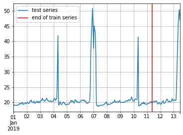
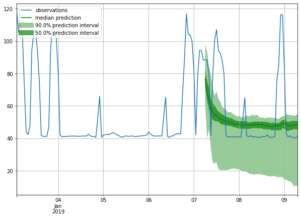
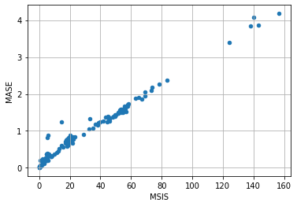

# DeepAR on laptime dataset

laptime dataset
<eventid, carids, laptime (totalcars x totallaps)>


```python
# Third-party imports
%matplotlib inline
import mxnet as mx
from mxnet import gluon
import numpy as np
import pandas as pd
import matplotlib.pyplot as plt
import json
```

## Datasets


```python
import pickle
with open('laptime-2018.pickle', 'rb') as f:
    # The protocol version used is detected automatically, so we do not
    # have to specify it.
    laptime_data = pickle.load(f, encoding='latin1')
```


```python
events = ['Phoenix','Indy500','Texas','Iowa','Pocono','Gateway']
events_id={key:idx for idx, key in enumerate(events)}
```


```python
print(f"events: {events}")
```

    events: ['Phoenix', 'Indy500', 'Texas', 'Iowa', 'Pocono', 'Gateway']


To download one of the built-in datasets, simply call get_dataset with one of the above names. GluonTS can re-use the saved dataset so that it does not need to be downloaded again: simply set `regenerate=False`.


```python
laptime_data[2][2].astype(np.float32)
```


    array([[42.3679, 41.0984, 41.0943, ..., 41.5412, 41.3549, 41.7541],
           [43.295 , 41.2297, 41.2107, ...,  0.    ,  0.    ,  0.    ],
           [45.5445, 41.6044, 41.5238, ..., 42.0267, 42.0092, 41.9617],
           ...,
           [45.0093, 45.0862, 42.926 , ..., 42.0984, 41.6441, 41.7593],
           [44.9733, 43.1084, 42.004 , ..., 42.098 , 41.9995, 41.8993],
           [43.7392, 41.1911, 41.799 , ..., 42.2737, 41.967 , 41.8751]],
          dtype=float32)


```python
from gluonts.dataset.common import ListDataset
prediction_length = 50
freq = "1H"
start = pd.Timestamp("01-01-2019", freq=freq)  # can be different for each time series

train_set = []
test_set = []
#_data: eventid, carids, laptime array
for _data in laptime_data:
    _train = [{'target': x.astype(np.float32), 'start': start} 
            for x in _data[2][:, :-prediction_length]]
    _test = [{'target': x.astype(np.float32), 'start': start} 
            for x in _data[2]]
    train_set.extend(_train)
    test_set.extend(_test)
    


```


```python
# train dataset: cut the last window of length "prediction_length", add "target" and "start" fields
train_ds = ListDataset(train_set, freq=freq)
# test dataset: use the whole dataset, add "target" and "start" fields
test_ds = ListDataset(test_set, freq=freq)
```

In general, the datasets provided by GluonTS are objects that consists of three main members:

- `dataset.train` is an iterable collection of data entries used for training. Each entry corresponds to one time series
- `dataset.test` is an iterable collection of data entries used for inference. The test dataset is an extended version of the train dataset that contains a window in the end of each time series that was not seen during training. This window has length equal to the recommended prediction length.
- `dataset.metadata` contains metadata of the dataset such as the frequency of the time series, a recommended prediction horizon, associated features, etc.


```python
from gluonts.dataset.util import to_pandas
entry = next(iter(train_ds))
train_series = to_pandas(entry)
train_series.plot()
plt.grid(which="both")
plt.legend(["train series"], loc="upper left")
plt.show()
```


```python
entry = next(iter(test_ds))
test_series = to_pandas(entry)
test_series.plot()
plt.axvline(train_series.index[-1], color='r') # end of train dataset
plt.grid(which="both")
plt.legend(["test series", "end of train series"], loc="upper left")
plt.show()
```





```python
print(f"Length of forecasting window in test dataset: {len(test_series) - len(train_series)}")
print(f"Recommended prediction horizon: {prediction_length}")
print(f"Frequency of the time series: {freq}")
```

    Length of forecasting window in test dataset: 50
    Recommended prediction horizon: 50
    Frequency of the time series: 1H


## Training an existing model (`Estimator`)

GluonTS comes with a number of pre-built models. All the user needs to do is configure some hyperparameters. The existing models focus on (but are not limited to) probabilistic forecasting. Probabilistic forecasts are predictions in the form of a probability distribution, rather than simply a single point estimate.

We will begin with GulonTS's pre-built feedforward neural network estimator, a simple but powerful forecasting model. We will use this model to demonstrate the process of training a model, producing forecasts, and evaluating the results.

GluonTS's built-in feedforward neural network (`SimpleFeedForwardEstimator`) accepts an input window of length `context_length` and predicts the distribution of the values of the subsequent `prediction_length` values. In GluonTS parlance, the feedforward neural network model is an example of `Estimator`. In GluonTS, `Estimator` objects represent a forecasting model as well as details such as its coefficients, weights, etc.

In general, each estimator (pre-built or custom) is configured by a number of hyperparameters that can be either common (but not binding) among all estimators (e.g., the `prediction_length`) or specific for the particular estimator (e.g., number of layers for a neural network or the stride in a CNN).

Finally, each estimator is configured by a `Trainer`, which defines how the model will be trained i.e., the number of epochs, the learning rate, etc.


```python
from gluonts.model.deepar import DeepAREstimator
from gluonts.trainer import Trainer
```

    INFO:root:Using GPU


```python
estimator = DeepAREstimator(
    prediction_length=prediction_length,
    context_length=100,
    #use_feat_static_cat=True,
    #cardinality=[
    #    feat_static_cat.cardinality
    #    for feat_static_cat in dataset.metadata.feat_static_cat
    #],
    freq=freq,
    trainer=Trainer(ctx="gpu", 
                    epochs=100, 
                    learning_rate=1e-3, 
                    num_batches_per_epoch=64
                   )
)
```

After specifying our estimator with all the necessary hyperparameters we can train it using our training dataset `dataset.train` by invoking the `train` method of the estimator. The training algorithm returns a fitted model (or a `Predictor` in GluonTS parlance) that can be used to construct forecasts.


```python
predictor = estimator.train(train_ds)
```

    INFO:root:Start model training
    INFO:root:Epoch[0] Learning rate is 0.001
      0%|          | 0/64 [00:00<?, ?it/s]INFO:root:Number of parameters in DeepARTrainingNetwork: 27644
    100%|██████████| 64/64 [00:16<00:00,  3.95it/s, avg_epoch_loss=3.38]
    INFO:root:Epoch[0] Elapsed time 16.197 seconds
    INFO:root:Epoch[0] Evaluation metric 'epoch_loss'=3.378015
    INFO:root:Epoch[1] Learning rate is 0.001
    100%|██████████| 64/64 [00:12<00:00,  5.07it/s, avg_epoch_loss=2.61]
    INFO:root:Epoch[1] Elapsed time 12.636 seconds
    INFO:root:Epoch[1] Evaluation metric 'epoch_loss'=2.606390
    INFO:root:Epoch[2] Learning rate is 0.001
    100%|██████████| 64/64 [00:12<00:00,  5.02it/s, avg_epoch_loss=2.34]
    INFO:root:Epoch[2] Elapsed time 12.744 seconds
    INFO:root:Epoch[2] Evaluation metric 'epoch_loss'=2.344826
    INFO:root:Epoch[3] Learning rate is 0.001
    100%|██████████| 64/64 [00:12<00:00,  5.04it/s, avg_epoch_loss=2.19]
    INFO:root:Epoch[3] Elapsed time 12.706 seconds
    INFO:root:Epoch[3] Evaluation metric 'epoch_loss'=2.194165
    INFO:root:Epoch[4] Learning rate is 0.001
    100%|██████████| 64/64 [00:12<00:00,  5.09it/s, avg_epoch_loss=2.05]
    INFO:root:Epoch[4] Elapsed time 12.585 seconds
    INFO:root:Epoch[4] Evaluation metric 'epoch_loss'=2.045113
    INFO:root:Epoch[5] Learning rate is 0.001
    100%|██████████| 64/64 [00:12<00:00,  5.08it/s, avg_epoch_loss=2]   
    INFO:root:Epoch[5] Elapsed time 12.588 seconds
    INFO:root:Epoch[5] Evaluation metric 'epoch_loss'=1.996826
    INFO:root:Epoch[6] Learning rate is 0.001
    100%|██████████| 64/64 [00:12<00:00,  5.09it/s, avg_epoch_loss=1.89]
    INFO:root:Epoch[6] Elapsed time 12.578 seconds
    INFO:root:Epoch[6] Evaluation metric 'epoch_loss'=1.893952
    INFO:root:Epoch[7] Learning rate is 0.001
    100%|██████████| 64/64 [00:12<00:00,  5.09it/s, avg_epoch_loss=1.89]
    INFO:root:Epoch[7] Elapsed time 12.579 seconds
    INFO:root:Epoch[7] Evaluation metric 'epoch_loss'=1.892786
    INFO:root:Epoch[8] Learning rate is 0.001
    100%|██████████| 64/64 [00:12<00:00,  5.10it/s, avg_epoch_loss=1.94]
    INFO:root:Epoch[8] Elapsed time 12.557 seconds
    INFO:root:Epoch[8] Evaluation metric 'epoch_loss'=1.935253
    INFO:root:Epoch[9] Learning rate is 0.001
    100%|██████████| 64/64 [00:12<00:00,  5.10it/s, avg_epoch_loss=1.76]
    INFO:root:Epoch[9] Elapsed time 12.550 seconds
    INFO:root:Epoch[9] Evaluation metric 'epoch_loss'=1.759071
    INFO:root:Epoch[10] Learning rate is 0.001
    100%|██████████| 64/64 [00:12<00:00,  5.11it/s, avg_epoch_loss=1.78]
    INFO:root:Epoch[10] Elapsed time 12.532 seconds
    INFO:root:Epoch[10] Evaluation metric 'epoch_loss'=1.778523
    INFO:root:Epoch[11] Learning rate is 0.001
    100%|██████████| 64/64 [00:12<00:00,  4.99it/s, avg_epoch_loss=1.68]
    INFO:root:Epoch[11] Elapsed time 12.817 seconds
    INFO:root:Epoch[11] Evaluation metric 'epoch_loss'=1.680441
    INFO:root:Epoch[12] Learning rate is 0.001
    100%|██████████| 64/64 [00:12<00:00,  5.06it/s, avg_epoch_loss=1.73]
    INFO:root:Epoch[12] Elapsed time 12.639 seconds
    INFO:root:Epoch[12] Evaluation metric 'epoch_loss'=1.732296
    INFO:root:Epoch[13] Learning rate is 0.001
    100%|██████████| 64/64 [00:12<00:00,  5.08it/s, avg_epoch_loss=1.8] 
    INFO:root:Epoch[13] Elapsed time 12.602 seconds
    INFO:root:Epoch[13] Evaluation metric 'epoch_loss'=1.799063
    INFO:root:Epoch[14] Learning rate is 0.001
    100%|██████████| 64/64 [00:12<00:00,  5.08it/s, avg_epoch_loss=1.71]
    INFO:root:Epoch[14] Elapsed time 12.605 seconds
    INFO:root:Epoch[14] Evaluation metric 'epoch_loss'=1.705926
    INFO:root:Epoch[15] Learning rate is 0.001
    100%|██████████| 64/64 [00:12<00:00,  5.09it/s, avg_epoch_loss=1.57]
    INFO:root:Epoch[15] Elapsed time 12.571 seconds
    INFO:root:Epoch[15] Evaluation metric 'epoch_loss'=1.565141
    INFO:root:Epoch[16] Learning rate is 0.001
    100%|██████████| 64/64 [00:12<00:00,  5.05it/s, avg_epoch_loss=1.57]
    INFO:root:Epoch[16] Elapsed time 12.668 seconds
    INFO:root:Epoch[16] Evaluation metric 'epoch_loss'=1.567484
    INFO:root:Epoch[17] Learning rate is 0.001
    100%|██████████| 64/64 [00:12<00:00,  5.00it/s, avg_epoch_loss=1.52]
    INFO:root:Epoch[17] Elapsed time 12.813 seconds
    INFO:root:Epoch[17] Evaluation metric 'epoch_loss'=1.519432
    INFO:root:Epoch[18] Learning rate is 0.001
    100%|██████████| 64/64 [00:12<00:00,  5.04it/s, avg_epoch_loss=1.71]
    INFO:root:Epoch[18] Elapsed time 12.708 seconds
    INFO:root:Epoch[18] Evaluation metric 'epoch_loss'=1.712675
    INFO:root:Epoch[19] Learning rate is 0.001
    100%|██████████| 64/64 [00:12<00:00,  5.04it/s, avg_epoch_loss=1.59]
    INFO:root:Epoch[19] Elapsed time 12.695 seconds
    INFO:root:Epoch[19] Evaluation metric 'epoch_loss'=1.591405
    INFO:root:Epoch[20] Learning rate is 0.001
    100%|██████████| 64/64 [00:12<00:00,  5.06it/s, avg_epoch_loss=1.5] 
    INFO:root:Epoch[20] Elapsed time 12.647 seconds
    INFO:root:Epoch[20] Evaluation metric 'epoch_loss'=1.499138
    INFO:root:Epoch[21] Learning rate is 0.001
    100%|██████████| 64/64 [00:12<00:00,  5.05it/s, avg_epoch_loss=1.51]
    INFO:root:Epoch[21] Elapsed time 12.673 seconds
    INFO:root:Epoch[21] Evaluation metric 'epoch_loss'=1.513628
    INFO:root:Epoch[22] Learning rate is 0.001
    100%|██████████| 64/64 [00:12<00:00,  5.05it/s, avg_epoch_loss=1.44]
    INFO:root:Epoch[22] Elapsed time 12.681 seconds
    INFO:root:Epoch[22] Evaluation metric 'epoch_loss'=1.437571
    INFO:root:Epoch[23] Learning rate is 0.001
    100%|██████████| 64/64 [00:12<00:00,  5.05it/s, avg_epoch_loss=1.53]
    INFO:root:Epoch[23] Elapsed time 12.667 seconds
    INFO:root:Epoch[23] Evaluation metric 'epoch_loss'=1.527633
    INFO:root:Epoch[24] Learning rate is 0.001
    100%|██████████| 64/64 [00:12<00:00,  5.06it/s, avg_epoch_loss=1.42]
    INFO:root:Epoch[24] Elapsed time 12.652 seconds
    INFO:root:Epoch[24] Evaluation metric 'epoch_loss'=1.419529
    INFO:root:Epoch[25] Learning rate is 0.001
    100%|██████████| 64/64 [00:12<00:00,  5.06it/s, avg_epoch_loss=1.48]
    INFO:root:Epoch[25] Elapsed time 12.648 seconds
    INFO:root:Epoch[25] Evaluation metric 'epoch_loss'=1.478000
    INFO:root:Epoch[26] Learning rate is 0.001
    100%|██████████| 64/64 [00:12<00:00,  5.06it/s, avg_epoch_loss=1.37]
    INFO:root:Epoch[26] Elapsed time 12.644 seconds
    INFO:root:Epoch[26] Evaluation metric 'epoch_loss'=1.371749
    INFO:root:Epoch[27] Learning rate is 0.001
    100%|██████████| 64/64 [00:12<00:00,  5.06it/s, avg_epoch_loss=1.3] 
    INFO:root:Epoch[27] Elapsed time 12.648 seconds
    INFO:root:Epoch[27] Evaluation metric 'epoch_loss'=1.299125
    INFO:root:Epoch[28] Learning rate is 0.001
    100%|██████████| 64/64 [00:12<00:00,  5.06it/s, avg_epoch_loss=1.29]
    INFO:root:Epoch[28] Elapsed time 12.640 seconds
    INFO:root:Epoch[28] Evaluation metric 'epoch_loss'=1.294671
    INFO:root:Epoch[29] Learning rate is 0.001
    100%|██████████| 64/64 [00:12<00:00,  5.08it/s, avg_epoch_loss=1.43]
    INFO:root:Epoch[29] Elapsed time 12.610 seconds
    INFO:root:Epoch[29] Evaluation metric 'epoch_loss'=1.429533
    INFO:root:Epoch[30] Learning rate is 0.001
    100%|██████████| 64/64 [00:12<00:00,  5.07it/s, avg_epoch_loss=1.45]
    INFO:root:Epoch[30] Elapsed time 12.635 seconds
    INFO:root:Epoch[30] Evaluation metric 'epoch_loss'=1.445550
    INFO:root:Epoch[31] Learning rate is 0.001
    100%|██████████| 64/64 [00:12<00:00,  5.06it/s, avg_epoch_loss=1.34]
    INFO:root:Epoch[31] Elapsed time 12.653 seconds
    INFO:root:Epoch[31] Evaluation metric 'epoch_loss'=1.343227
    INFO:root:Epoch[32] Learning rate is 0.001
    100%|██████████| 64/64 [00:12<00:00,  5.06it/s, avg_epoch_loss=1.29]
    INFO:root:Epoch[32] Elapsed time 12.655 seconds
    INFO:root:Epoch[32] Evaluation metric 'epoch_loss'=1.287817
    INFO:root:Epoch[33] Learning rate is 0.001
    100%|██████████| 64/64 [00:12<00:00,  5.05it/s, avg_epoch_loss=1.34]
    INFO:root:Epoch[33] Elapsed time 12.685 seconds
    INFO:root:Epoch[33] Evaluation metric 'epoch_loss'=1.344902
    INFO:root:Epoch[34] Learning rate is 0.001
    100%|██████████| 64/64 [00:12<00:00,  5.05it/s, avg_epoch_loss=1.29]
    INFO:root:Epoch[34] Elapsed time 12.675 seconds
    INFO:root:Epoch[34] Evaluation metric 'epoch_loss'=1.291077
    INFO:root:Epoch[35] Learning rate is 0.001
    100%|██████████| 64/64 [00:12<00:00,  5.05it/s, avg_epoch_loss=1.31]
    INFO:root:Epoch[35] Elapsed time 12.678 seconds
    INFO:root:Epoch[35] Evaluation metric 'epoch_loss'=1.307088
    INFO:root:Epoch[36] Learning rate is 0.001
    100%|██████████| 64/64 [00:12<00:00,  5.05it/s, avg_epoch_loss=1.24]
    INFO:root:Epoch[36] Elapsed time 12.666 seconds
    INFO:root:Epoch[36] Evaluation metric 'epoch_loss'=1.238068
    INFO:root:Epoch[37] Learning rate is 0.001
    100%|██████████| 64/64 [00:12<00:00,  5.06it/s, avg_epoch_loss=1.24]
    INFO:root:Epoch[37] Elapsed time 12.641 seconds
    INFO:root:Epoch[37] Evaluation metric 'epoch_loss'=1.241484
    INFO:root:Epoch[38] Learning rate is 0.001
    100%|██████████| 64/64 [00:12<00:00,  5.07it/s, avg_epoch_loss=1.36]
    INFO:root:Epoch[38] Elapsed time 12.636 seconds
    INFO:root:Epoch[38] Evaluation metric 'epoch_loss'=1.356067
    INFO:root:Epoch[39] Learning rate is 0.001
    100%|██████████| 64/64 [00:13<00:00,  4.91it/s, avg_epoch_loss=1.29]
    INFO:root:Epoch[39] Elapsed time 13.039 seconds
    INFO:root:Epoch[39] Evaluation metric 'epoch_loss'=1.289091
    INFO:root:Epoch[40] Learning rate is 0.001
    100%|██████████| 64/64 [00:13<00:00,  4.89it/s, avg_epoch_loss=1.33]
    INFO:root:Epoch[40] Elapsed time 13.082 seconds
    INFO:root:Epoch[40] Evaluation metric 'epoch_loss'=1.333625
    INFO:root:Epoch[41] Learning rate is 0.001
    100%|██████████| 64/64 [00:13<00:00,  4.87it/s, avg_epoch_loss=1.22]
    INFO:root:Epoch[41] Elapsed time 13.149 seconds
    INFO:root:Epoch[41] Evaluation metric 'epoch_loss'=1.222448
    INFO:root:Epoch[42] Learning rate is 0.001
    100%|██████████| 64/64 [00:13<00:00,  4.90it/s, avg_epoch_loss=1.25]
    INFO:root:Epoch[42] Elapsed time 13.071 seconds
    INFO:root:Epoch[42] Evaluation metric 'epoch_loss'=1.248929
    INFO:root:Epoch[43] Learning rate is 0.001
    100%|██████████| 64/64 [00:13<00:00,  4.89it/s, avg_epoch_loss=1.34]
    INFO:root:Epoch[43] Elapsed time 13.082 seconds
    INFO:root:Epoch[43] Evaluation metric 'epoch_loss'=1.340403
    INFO:root:Epoch[44] Learning rate is 0.001
    100%|██████████| 64/64 [00:13<00:00,  4.91it/s, avg_epoch_loss=1.16]
    INFO:root:Epoch[44] Elapsed time 13.045 seconds
    INFO:root:Epoch[44] Evaluation metric 'epoch_loss'=1.160799
    INFO:root:Epoch[45] Learning rate is 0.001
    100%|██████████| 64/64 [00:13<00:00,  4.90it/s, avg_epoch_loss=1.23]
    INFO:root:Epoch[45] Elapsed time 13.068 seconds
    INFO:root:Epoch[45] Evaluation metric 'epoch_loss'=1.231907
    INFO:root:Epoch[46] Learning rate is 0.001
    100%|██████████| 64/64 [00:13<00:00,  4.90it/s, avg_epoch_loss=1.18]
    INFO:root:Epoch[46] Elapsed time 13.058 seconds
    INFO:root:Epoch[46] Evaluation metric 'epoch_loss'=1.179567
    INFO:root:Epoch[47] Learning rate is 0.001
    100%|██████████| 64/64 [00:13<00:00,  4.89it/s, avg_epoch_loss=1.23]
    INFO:root:Epoch[47] Elapsed time 13.085 seconds
    INFO:root:Epoch[47] Evaluation metric 'epoch_loss'=1.232872
    INFO:root:Epoch[48] Learning rate is 0.001
    100%|██████████| 64/64 [00:13<00:00,  4.90it/s, avg_epoch_loss=1.15]
    INFO:root:Epoch[48] Elapsed time 13.068 seconds
    INFO:root:Epoch[48] Evaluation metric 'epoch_loss'=1.154558
    INFO:root:Epoch[49] Learning rate is 0.001
    100%|██████████| 64/64 [00:13<00:00,  4.91it/s, avg_epoch_loss=1.17]
    INFO:root:Epoch[49] Elapsed time 13.024 seconds
    INFO:root:Epoch[49] Evaluation metric 'epoch_loss'=1.172505
    INFO:root:Epoch[50] Learning rate is 0.001
    100%|██████████| 64/64 [00:13<00:00,  4.89it/s, avg_epoch_loss=1.21]
    INFO:root:Epoch[50] Elapsed time 13.082 seconds
    INFO:root:Epoch[50] Evaluation metric 'epoch_loss'=1.206906
    INFO:root:Epoch[51] Learning rate is 0.001
    100%|██████████| 64/64 [00:12<00:00,  4.94it/s, avg_epoch_loss=1.17]
    INFO:root:Epoch[51] Elapsed time 12.962 seconds
    INFO:root:Epoch[51] Evaluation metric 'epoch_loss'=1.170696
    INFO:root:Epoch[52] Learning rate is 0.001
    100%|██████████| 64/64 [00:12<00:00,  4.93it/s, avg_epoch_loss=1.18]
    INFO:root:Epoch[52] Elapsed time 12.991 seconds
    INFO:root:Epoch[52] Evaluation metric 'epoch_loss'=1.177135
    INFO:root:Epoch[53] Learning rate is 0.001
    100%|██████████| 64/64 [00:12<00:00,  4.93it/s, avg_epoch_loss=1.13]
    INFO:root:Epoch[53] Elapsed time 12.995 seconds
    INFO:root:Epoch[53] Evaluation metric 'epoch_loss'=1.134075
    INFO:root:Epoch[54] Learning rate is 0.001
    100%|██████████| 64/64 [00:12<00:00,  4.92it/s, avg_epoch_loss=1.11]
    INFO:root:Epoch[54] Elapsed time 12.997 seconds
    INFO:root:Epoch[54] Evaluation metric 'epoch_loss'=1.112609
    INFO:root:Epoch[55] Learning rate is 0.001
    100%|██████████| 64/64 [00:13<00:00,  4.89it/s, avg_epoch_loss=1.1] 
    INFO:root:Epoch[55] Elapsed time 13.090 seconds
    INFO:root:Epoch[55] Evaluation metric 'epoch_loss'=1.103867
    INFO:root:Epoch[56] Learning rate is 0.001
    100%|██████████| 64/64 [00:12<00:00,  4.93it/s, avg_epoch_loss=1.07]
    INFO:root:Epoch[56] Elapsed time 12.992 seconds
    INFO:root:Epoch[56] Evaluation metric 'epoch_loss'=1.071250
    INFO:root:Epoch[57] Learning rate is 0.001
    100%|██████████| 64/64 [00:13<00:00,  4.89it/s, avg_epoch_loss=1.14]
    INFO:root:Epoch[57] Elapsed time 13.089 seconds
    INFO:root:Epoch[57] Evaluation metric 'epoch_loss'=1.135085
    INFO:root:Epoch[58] Learning rate is 0.001
    100%|██████████| 64/64 [00:13<00:00,  4.91it/s, avg_epoch_loss=1.11]
    INFO:root:Epoch[58] Elapsed time 13.048 seconds
    INFO:root:Epoch[58] Evaluation metric 'epoch_loss'=1.105498
    INFO:root:Epoch[59] Learning rate is 0.001
    100%|██████████| 64/64 [00:13<00:00,  4.91it/s, avg_epoch_loss=1.12]
    INFO:root:Epoch[59] Elapsed time 13.025 seconds
    INFO:root:Epoch[59] Evaluation metric 'epoch_loss'=1.121227
    INFO:root:Epoch[60] Learning rate is 0.001
    100%|██████████| 64/64 [00:13<00:00,  4.91it/s, avg_epoch_loss=1.1] 
    INFO:root:Epoch[60] Elapsed time 13.026 seconds
    INFO:root:Epoch[60] Evaluation metric 'epoch_loss'=1.104830
    INFO:root:Epoch[61] Learning rate is 0.001
    100%|██████████| 64/64 [00:13<00:00,  4.91it/s, avg_epoch_loss=1.14]
    INFO:root:Epoch[61] Elapsed time 13.034 seconds
    INFO:root:Epoch[61] Evaluation metric 'epoch_loss'=1.137950
    INFO:root:Epoch[62] Learning rate is 0.001
    100%|██████████| 64/64 [00:13<00:00,  4.92it/s, avg_epoch_loss=1.06]
    INFO:root:Epoch[62] Elapsed time 13.016 seconds
    INFO:root:Epoch[62] Evaluation metric 'epoch_loss'=1.057860
    INFO:root:Epoch[63] Learning rate is 0.001
    100%|██████████| 64/64 [00:13<00:00,  4.88it/s, avg_epoch_loss=1.11]
    INFO:root:Epoch[63] Elapsed time 13.117 seconds
    INFO:root:Epoch[63] Evaluation metric 'epoch_loss'=1.113700
    INFO:root:Epoch[64] Learning rate is 0.001
    100%|██████████| 64/64 [00:13<00:00,  4.92it/s, avg_epoch_loss=1.07]
    INFO:root:Epoch[64] Elapsed time 13.008 seconds
    INFO:root:Epoch[64] Evaluation metric 'epoch_loss'=1.070297
    INFO:root:Epoch[65] Learning rate is 0.001
    100%|██████████| 64/64 [00:13<00:00,  4.92it/s, avg_epoch_loss=1.12]
    INFO:root:Epoch[65] Elapsed time 13.002 seconds
    INFO:root:Epoch[65] Evaluation metric 'epoch_loss'=1.121460
    INFO:root:Epoch[66] Learning rate is 0.001
    100%|██████████| 64/64 [00:13<00:00,  4.92it/s, avg_epoch_loss=1.02]
    INFO:root:Epoch[66] Elapsed time 13.015 seconds
    INFO:root:Epoch[66] Evaluation metric 'epoch_loss'=1.018388
    INFO:root:Epoch[67] Learning rate is 0.001
    100%|██████████| 64/64 [00:13<00:00,  4.92it/s, avg_epoch_loss=1.02]
    INFO:root:Epoch[67] Elapsed time 13.015 seconds
    INFO:root:Epoch[67] Evaluation metric 'epoch_loss'=1.020584
    INFO:root:Epoch[68] Learning rate is 0.001
    100%|██████████| 64/64 [00:13<00:00,  4.91it/s, avg_epoch_loss=1.02]
    INFO:root:Epoch[68] Elapsed time 13.029 seconds
    INFO:root:Epoch[68] Evaluation metric 'epoch_loss'=1.023520
    INFO:root:Epoch[69] Learning rate is 0.001
    100%|██████████| 64/64 [00:13<00:00,  4.89it/s, avg_epoch_loss=1.14]
    INFO:root:Epoch[69] Elapsed time 13.086 seconds
    INFO:root:Epoch[69] Evaluation metric 'epoch_loss'=1.136521
    INFO:root:Epoch[70] Learning rate is 0.001
    100%|██████████| 64/64 [00:13<00:00,  4.92it/s, avg_epoch_loss=1.1] 
    INFO:root:Epoch[70] Elapsed time 13.014 seconds
    INFO:root:Epoch[70] Evaluation metric 'epoch_loss'=1.096209
    INFO:root:Epoch[71] Learning rate is 0.001
    100%|██████████| 64/64 [00:13<00:00,  4.89it/s, avg_epoch_loss=1.07]
    INFO:root:Epoch[71] Elapsed time 13.089 seconds
    INFO:root:Epoch[71] Evaluation metric 'epoch_loss'=1.071089
    INFO:root:Epoch[72] Learning rate is 0.001
    100%|██████████| 64/64 [00:13<00:00,  4.90it/s, avg_epoch_loss=1.06]
    INFO:root:Epoch[72] Elapsed time 13.055 seconds
    INFO:root:Epoch[72] Evaluation metric 'epoch_loss'=1.064737
    INFO:root:Epoch[73] Learning rate is 0.001
    100%|██████████| 64/64 [00:13<00:00,  4.92it/s, avg_epoch_loss=1.07]
    INFO:root:Epoch[73] Elapsed time 13.020 seconds
    INFO:root:Epoch[73] Evaluation metric 'epoch_loss'=1.071883
    INFO:root:Epoch[74] Learning rate is 0.001
    100%|██████████| 64/64 [00:12<00:00,  4.93it/s, avg_epoch_loss=1.08]
    INFO:root:Epoch[74] Elapsed time 12.976 seconds
    INFO:root:Epoch[74] Evaluation metric 'epoch_loss'=1.081991
    INFO:root:Epoch[75] Learning rate is 0.001
    100%|██████████| 64/64 [00:13<00:00,  4.92it/s, avg_epoch_loss=1.04]
    INFO:root:Epoch[75] Elapsed time 13.015 seconds
    INFO:root:Epoch[75] Evaluation metric 'epoch_loss'=1.041715
    INFO:root:Epoch[76] Learning rate is 0.001
    100%|██████████| 64/64 [00:13<00:00,  4.91it/s, avg_epoch_loss=0.982]
    INFO:root:Epoch[76] Elapsed time 13.035 seconds
    INFO:root:Epoch[76] Evaluation metric 'epoch_loss'=0.981973
    INFO:root:Epoch[77] Learning rate is 0.001
    100%|██████████| 64/64 [00:12<00:00,  4.94it/s, avg_epoch_loss=1.16]
    INFO:root:Epoch[77] Elapsed time 12.950 seconds
    INFO:root:Epoch[77] Evaluation metric 'epoch_loss'=1.161485
    INFO:root:Epoch[78] Learning rate is 0.001
    100%|██████████| 64/64 [00:13<00:00,  4.87it/s, avg_epoch_loss=1.03]
    INFO:root:Epoch[78] Elapsed time 13.132 seconds
    INFO:root:Epoch[78] Evaluation metric 'epoch_loss'=1.026125
    INFO:root:Epoch[79] Learning rate is 0.001
    100%|██████████| 64/64 [00:13<00:00,  4.91it/s, avg_epoch_loss=0.998]
    INFO:root:Epoch[79] Elapsed time 13.045 seconds
    INFO:root:Epoch[79] Evaluation metric 'epoch_loss'=0.997934
    INFO:root:Epoch[80] Learning rate is 0.001
    100%|██████████| 64/64 [00:12<00:00,  4.94it/s, avg_epoch_loss=1.03]
    INFO:root:Epoch[80] Elapsed time 12.967 seconds
    INFO:root:Epoch[80] Evaluation metric 'epoch_loss'=1.031292
    INFO:root:Epoch[81] Learning rate is 0.001
    100%|██████████| 64/64 [00:13<00:00,  4.91it/s, avg_epoch_loss=0.979]
    INFO:root:Epoch[81] Elapsed time 13.044 seconds
    INFO:root:Epoch[81] Evaluation metric 'epoch_loss'=0.979460
    INFO:root:Epoch[82] Learning rate is 0.001
    100%|██████████| 64/64 [00:12<00:00,  4.94it/s, avg_epoch_loss=0.983]
    INFO:root:Epoch[82] Elapsed time 12.966 seconds
    INFO:root:Epoch[82] Evaluation metric 'epoch_loss'=0.982980
    INFO:root:Epoch[83] Learning rate is 0.001
    100%|██████████| 64/64 [00:13<00:00,  4.91it/s, avg_epoch_loss=1.02]
    INFO:root:Epoch[83] Elapsed time 13.031 seconds
    INFO:root:Epoch[83] Evaluation metric 'epoch_loss'=1.021079
    INFO:root:Epoch[84] Learning rate is 0.001
    100%|██████████| 64/64 [00:12<00:00,  4.93it/s, avg_epoch_loss=0.986]
    INFO:root:Epoch[84] Elapsed time 12.985 seconds
    INFO:root:Epoch[84] Evaluation metric 'epoch_loss'=0.986066
    INFO:root:Epoch[85] Learning rate is 0.001
    100%|██████████| 64/64 [00:13<00:00,  4.87it/s, avg_epoch_loss=0.994]
    INFO:root:Epoch[85] Elapsed time 13.132 seconds
    INFO:root:Epoch[85] Evaluation metric 'epoch_loss'=0.993517
    INFO:root:Epoch[86] Learning rate is 0.001
    100%|██████████| 64/64 [00:13<00:00,  4.89it/s, avg_epoch_loss=1.03]
    INFO:root:Epoch[86] Elapsed time 13.092 seconds
    INFO:root:Epoch[86] Evaluation metric 'epoch_loss'=1.029971
    INFO:root:Epoch[87] Learning rate is 0.001
    100%|██████████| 64/64 [00:13<00:00,  4.90it/s, avg_epoch_loss=1.07]
    INFO:root:Epoch[87] Elapsed time 13.058 seconds
    INFO:root:Epoch[87] Evaluation metric 'epoch_loss'=1.066935
    INFO:root:Epoch[88] Learning rate is 0.001
    100%|██████████| 64/64 [00:13<00:00,  4.91it/s, avg_epoch_loss=1]    
    INFO:root:Epoch[88] Elapsed time 13.032 seconds
    INFO:root:Epoch[88] Evaluation metric 'epoch_loss'=1.000541
    INFO:root:Epoch[89] Learning rate is 0.001
    100%|██████████| 64/64 [00:13<00:00,  4.91it/s, avg_epoch_loss=0.96] 
    INFO:root:Epoch[89] Elapsed time 13.033 seconds
    INFO:root:Epoch[89] Evaluation metric 'epoch_loss'=0.960288
    INFO:root:Epoch[90] Learning rate is 0.001
    100%|██████████| 64/64 [00:13<00:00,  4.88it/s, avg_epoch_loss=0.99] 
    INFO:root:Epoch[90] Elapsed time 13.106 seconds
    INFO:root:Epoch[90] Evaluation metric 'epoch_loss'=0.990336
    INFO:root:Epoch[91] Learning rate is 0.001
    100%|██████████| 64/64 [00:13<00:00,  4.91it/s, avg_epoch_loss=0.991]
    INFO:root:Epoch[91] Elapsed time 13.037 seconds
    INFO:root:Epoch[91] Evaluation metric 'epoch_loss'=0.990809
    INFO:root:Epoch[92] Learning rate is 0.001
    100%|██████████| 64/64 [00:13<00:00,  4.91it/s, avg_epoch_loss=1.06]
    INFO:root:Epoch[92] Elapsed time 13.048 seconds
    INFO:root:Epoch[92] Evaluation metric 'epoch_loss'=1.061840
    INFO:root:Epoch[93] Learning rate is 0.001
    100%|██████████| 64/64 [00:13<00:00,  4.87it/s, avg_epoch_loss=0.912]
    INFO:root:Epoch[93] Elapsed time 13.154 seconds
    INFO:root:Epoch[93] Evaluation metric 'epoch_loss'=0.911806
    INFO:root:Epoch[94] Learning rate is 0.001
    100%|██████████| 64/64 [00:13<00:00,  4.88it/s, avg_epoch_loss=1.01]
    INFO:root:Epoch[94] Elapsed time 13.104 seconds
    INFO:root:Epoch[94] Evaluation metric 'epoch_loss'=1.014793
    INFO:root:Epoch[95] Learning rate is 0.001
    100%|██████████| 64/64 [00:13<00:00,  4.90it/s, avg_epoch_loss=1.03]
    INFO:root:Epoch[95] Elapsed time 13.063 seconds
    INFO:root:Epoch[95] Evaluation metric 'epoch_loss'=1.026064
    INFO:root:Epoch[96] Learning rate is 0.001
    100%|██████████| 64/64 [00:13<00:00,  4.92it/s, avg_epoch_loss=1]    
    INFO:root:Epoch[96] Elapsed time 13.018 seconds
    INFO:root:Epoch[96] Evaluation metric 'epoch_loss'=1.003084
    INFO:root:Epoch[97] Learning rate is 0.001
    100%|██████████| 64/64 [00:13<00:00,  4.90it/s, avg_epoch_loss=1.07]
    INFO:root:Epoch[97] Elapsed time 13.065 seconds
    INFO:root:Epoch[97] Evaluation metric 'epoch_loss'=1.071293
    INFO:root:Epoch[98] Learning rate is 0.001
    100%|██████████| 64/64 [00:12<00:00,  5.03it/s, avg_epoch_loss=0.922]
    INFO:root:Epoch[98] Elapsed time 12.736 seconds
    INFO:root:Epoch[98] Evaluation metric 'epoch_loss'=0.922112
    INFO:root:Epoch[99] Learning rate is 0.001
    100%|██████████| 64/64 [00:12<00:00,  5.06it/s, avg_epoch_loss=0.926]
    INFO:root:Epoch[99] Elapsed time 12.654 seconds
    INFO:root:Epoch[99] Evaluation metric 'epoch_loss'=0.925586
    INFO:root:Loading parameters from best epoch (93)
    INFO:root:Final loss: 0.9118057815358043 (occurred at epoch 93)
    INFO:root:End model training


With a predictor in hand, we can now predict the last window of the `dataset.test` and evaluate our model's performance.

GluonTS comes with the `make_evaluation_predictions` function that automates the process of prediction and model evaluation. Roughly, this function performs the following steps:

- Removes the final window of length `prediction_length` of the `dataset.test` that we want to predict
- The estimator uses the remaining data to predict (in the form of sample paths) the "future" window that was just removed
- The module outputs the forecast sample paths and the `dataset.test` (as python generator objects)


```python
from gluonts.evaluation.backtest import make_evaluation_predictions
```


```python
forecast_it, ts_it = make_evaluation_predictions(
    dataset=test_ds,  # test dataset
    predictor=predictor,  # predictor
    num_samples=100,  # number of sample paths we want for evaluation
)
```

First, we can convert these generators to lists to ease the subsequent computations.


```python
forecasts = list(forecast_it)
tss = list(ts_it)
```

We can examine the first element of these lists (that corresponds to the first time series of the dataset). Let's start with the list containing the time series, i.e., `tss`. We expect the first entry of `tss` to contain the (target of the) first time series of `dataset.test`.


```python
# first entry of the time series list
ts_entry = tss[0]
```


```python
len(ts_entry)
```


    300


```python
# first 5 values of the time series (convert from pandas to numpy)
np.array(ts_entry[-10:]).reshape(-1,)
```


    array([20.7475, 20.6298, 20.6314, 24.5113, 32.4792, 39.4054, 45.9202,
           48.6567, 50.498 , 47.0774], dtype=float32)


```python
# first entry of dataset.test
dataset_test_entry = next(iter(test_ds))
```


```python
# first 5 values
dataset_test_entry['target'][-10:]
```


    array([20.7475, 20.6298, 20.6314, 24.5113, 32.4792, 39.4054, 45.9202,
           48.6567, 50.498 , 47.0774], dtype=float32)


```python
len(tss[0])
```


    300


```python
forecasts[0].samples.shape
```


    (100, 50)


```python
# Indy500 Car 12 WillPower
ts_entry = tss[52]
ts_entry
```


<div>
<style scoped>
    .dataframe tbody tr th:only-of-type {
        vertical-align: middle;
    }

    .dataframe tbody tr th {
        vertical-align: top;
    }

    .dataframe thead th {
        text-align: right;
    }
</style>
<table border="1" class="dataframe">
  <thead>
    <tr style="text-align: right;">
      <th></th>
      <th>0</th>
    </tr>
  </thead>
  <tbody>
    <tr>
      <th>2019-01-01 00:00:00</th>
      <td>41.923801</td>
    </tr>
    <tr>
      <th>2019-01-01 01:00:00</th>
      <td>41.035999</td>
    </tr>
    <tr>
      <th>2019-01-01 02:00:00</th>
      <td>41.333900</td>
    </tr>
    <tr>
      <th>2019-01-01 03:00:00</th>
      <td>41.091801</td>
    </tr>
    <tr>
      <th>2019-01-01 04:00:00</th>
      <td>40.790298</td>
    </tr>
    <tr>
      <th>...</th>
      <td>...</td>
    </tr>
    <tr>
      <th>2019-01-09 03:00:00</th>
      <td>41.606899</td>
    </tr>
    <tr>
      <th>2019-01-09 04:00:00</th>
      <td>40.795799</td>
    </tr>
    <tr>
      <th>2019-01-09 05:00:00</th>
      <td>40.564602</td>
    </tr>
    <tr>
      <th>2019-01-09 06:00:00</th>
      <td>40.303501</td>
    </tr>
    <tr>
      <th>2019-01-09 07:00:00</th>
      <td>41.365101</td>
    </tr>
  </tbody>
</table>
<p>200 rows × 1 columns</p>
</div>


The entries in the `forecast` list are a bit more complex. They are objects that contain all the sample paths in the form of `numpy.ndarray` with dimension `(num_samples, prediction_length)`, the start date of the forecast, the frequency of the time series, etc. We can access all these information by simply invoking the corresponding attribute of the forecast object.


```python
# first entry of the forecast list
forecast_entry = forecasts[52]
```


```python
forecast_entry.samples[0,:]
```


    array([72.80842 , 69.332695, 62.04818 , 67.71171 , 67.10379 , 66.27764 ,
           64.141335, 60.934483, 59.286076, 56.983303, 56.20644 , 55.74435 ,
           53.95893 , 53.987076, 53.64106 , 52.75332 , 51.91867 , 52.68782 ,
           52.92183 , 52.65779 , 52.799366, 52.49073 , 52.177876, 51.799263,
           50.559402, 51.404587, 52.88023 , 51.658024, 51.525146, 50.79471 ,
           49.005238, 49.848175, 49.907703, 50.639656, 51.363567, 51.007694,
           51.541912, 51.018326, 50.98353 , 51.372066, 52.73908 , 52.343307,
           53.891075, 52.996723, 52.700813, 52.525417, 55.04868 , 53.367107,
           53.148537, 52.962154], dtype=float32)


```python
print(f"Number of sample paths: {forecast_entry.num_samples}")
print(f"Dimension of samples: {forecast_entry.samples.shape}")
print(f"Start date of the forecast window: {forecast_entry.start_date}")
print(f"Frequency of the time series: {forecast_entry.freq}")
```

    Number of sample paths: 100
    Dimension of samples: (100, 50)
    Start date of the forecast window: 2019-01-07 06:00:00
    Frequency of the time series: 1H


We can also do calculations to summarize the sample paths, such computing the mean or a quantile for each of the 48 time steps in the forecast window.


```python
print(f"Mean of the future window:\n {forecast_entry.mean}")
print(f"0.5-quantile (median) of the future window:\n {forecast_entry.quantile(0.5)}")
```

    Mean of the future window:
     [76.00856  67.83441  63.543575 58.913208 55.893764 54.085716 53.238514
     50.89628  49.97925  49.72604  48.927567 48.543022 48.142776 47.922173
     47.57655  46.97278  46.56728  46.420177 46.28126  46.14638  45.89657
     45.985714 45.95298  45.53467  45.70061  45.86399  45.896786 46.055702
     45.918602 45.937218 45.8192   45.735703 45.455154 45.175537 45.088226
     44.97646  44.826874 44.93771  44.765884 44.76799  45.421265 46.06271
     46.39361  45.573196 45.123165 45.253555 45.392284 45.429203 45.544273
     45.582985]
    0.5-quantile (median) of the future window:
     [76.813995 68.59848  63.073284 58.73838  56.03943  54.65309  53.957222
     53.077095 51.70155  51.689217 51.07521  50.656654 50.151585 49.958664
     49.613926 48.947388 48.57514  48.861813 48.56279  48.36752  48.108803
     48.338882 48.467613 48.15746  48.364826 48.303413 48.48604  48.606926
     48.306488 48.490265 48.69403  48.28106  47.77956  47.849888 47.690823
     47.436718 47.360893 47.98573  47.605385 47.855556 48.32768  48.99197
     49.164604 48.804283 47.93383  47.855495 48.100925 47.99309  48.420376
     48.287292]


`Forecast` objects have a `plot` method that can summarize the forecast paths as the mean, prediction intervals, etc. The prediction intervals are shaded in different colors as a "fan chart".


```python
def plot_prob_forecasts(ts_entry, forecast_entry):
    plot_length = 150 
    prediction_intervals = (50.0, 90.0)
    legend = ["observations", "median prediction"] + [f"{k}% prediction interval" for k in prediction_intervals][::-1]

    fig, ax = plt.subplots(1, 1, figsize=(10, 7))
    ts_entry[-plot_length:].plot(ax=ax)  # plot the time series
    forecast_entry.plot(prediction_intervals=prediction_intervals, color='g')
    plt.grid(which="both")
    plt.legend(legend, loc="upper left")
    plt.show()
```


```python
plot_prob_forecasts(ts_entry, forecast_entry)
```





We can also evaluate the quality of our forecasts numerically. In GluonTS, the `Evaluator` class can compute aggregate performance metrics, as well as metrics per time series (which can be useful for analyzing performance across heterogeneous time series).


```python
from gluonts.evaluation import Evaluator
```


```python
evaluator = Evaluator(quantiles=[0.1, 0.5, 0.9])
agg_metrics, item_metrics = evaluator(iter(tss), iter(forecasts), num_series=len(test_ds))
```

    Running evaluation: 100%|██████████| 153/153 [00:01<00:00, 136.39it/s]


Aggregate metrics aggregate both across time-steps and across time series.


```python
print(json.dumps(agg_metrics, indent=4))
```

    {
        "MSE": 208.25882206998622,
        "abs_error": 52741.943125247955,
        "abs_target_sum": 199653.72583007812,
        "abs_target_mean": 26.098526252297795,
        "seasonal_error": 8.391928687631866,
        "MASE": 0.9449751246295858,
        "sMAPE": 0.6834115387171916,
        "MSIS": 29.61345820746453,
        "QuantileLoss[0.1]": 32164.61981688702,
        "Coverage[0.1]": 0.3166013071895425,
        "QuantileLoss[0.5]": 52741.942853717366,
        "Coverage[0.5]": 0.6555555555555557,
        "QuantileLoss[0.9]": 52488.89576866955,
        "Coverage[0.9]": 0.8138562091503267,
        "RMSE": 14.431175353032968,
        "NRMSE": 0.552949818450473,
        "ND": 0.2641670868197858,
        "wQuantileLoss[0.1]": 0.1611020264368208,
        "wQuantileLoss[0.5]": 0.2641670854597782,
        "wQuantileLoss[0.9]": 0.26289965564350126,
        "mean_wQuantileLoss": 0.2293895891800334,
        "MAE_Coverage": 0.15276688453159049
    }


Individual metrics are aggregated only across time-steps.


```python
item_metrics.head()
```


<div>
<style scoped>
    .dataframe tbody tr th:only-of-type {
        vertical-align: middle;
    }

    .dataframe tbody tr th {
        vertical-align: top;
    }

    .dataframe thead th {
        text-align: right;
    }
</style>
<table border="1" class="dataframe">
  <thead>
    <tr style="text-align: right;">
      <th></th>
      <th>item_id</th>
      <th>MSE</th>
      <th>abs_error</th>
      <th>abs_target_sum</th>
      <th>abs_target_mean</th>
      <th>seasonal_error</th>
      <th>MASE</th>
      <th>sMAPE</th>
      <th>MSIS</th>
      <th>QuantileLoss[0.1]</th>
      <th>Coverage[0.1]</th>
      <th>QuantileLoss[0.5]</th>
      <th>Coverage[0.5]</th>
      <th>QuantileLoss[0.9]</th>
      <th>Coverage[0.9]</th>
    </tr>
  </thead>
  <tbody>
    <tr>
      <th>0</th>
      <td>NaN</td>
      <td>85.594541</td>
      <td>195.395462</td>
      <td>1160.060303</td>
      <td>23.201206</td>
      <td>3.313522</td>
      <td>1.179382</td>
      <td>0.138635</td>
      <td>36.802547</td>
      <td>52.939587</td>
      <td>0.00</td>
      <td>195.395462</td>
      <td>0.28</td>
      <td>278.587965</td>
      <td>0.74</td>
    </tr>
    <tr>
      <th>1</th>
      <td>NaN</td>
      <td>0.012137</td>
      <td>5.683897</td>
      <td>0.000000</td>
      <td>0.000000</td>
      <td>10.103680</td>
      <td>0.011251</td>
      <td>2.000000</td>
      <td>0.031420</td>
      <td>0.439886</td>
      <td>0.06</td>
      <td>5.683897</td>
      <td>1.00</td>
      <td>2.479465</td>
      <td>1.00</td>
    </tr>
    <tr>
      <th>2</th>
      <td>NaN</td>
      <td>92.025225</td>
      <td>192.796631</td>
      <td>1154.123413</td>
      <td>23.082468</td>
      <td>3.311920</td>
      <td>1.164259</td>
      <td>0.132587</td>
      <td>38.194831</td>
      <td>50.332346</td>
      <td>0.00</td>
      <td>192.796616</td>
      <td>0.46</td>
      <td>290.411660</td>
      <td>0.74</td>
    </tr>
    <tr>
      <th>3</th>
      <td>NaN</td>
      <td>77.917026</td>
      <td>183.765839</td>
      <td>1158.099121</td>
      <td>23.161982</td>
      <td>2.953296</td>
      <td>1.244480</td>
      <td>0.131091</td>
      <td>39.758721</td>
      <td>51.463104</td>
      <td>0.00</td>
      <td>183.765831</td>
      <td>0.22</td>
      <td>266.978768</td>
      <td>0.78</td>
    </tr>
    <tr>
      <th>4</th>
      <td>NaN</td>
      <td>128.029111</td>
      <td>293.140045</td>
      <td>1112.931152</td>
      <td>22.258623</td>
      <td>2.855165</td>
      <td>2.053401</td>
      <td>0.306900</td>
      <td>69.138602</td>
      <td>177.879180</td>
      <td>0.08</td>
      <td>293.140047</td>
      <td>0.46</td>
      <td>344.048212</td>
      <td>0.82</td>
    </tr>
  </tbody>
</table>
</div>


```python
item_metrics.plot(x='MSIS', y='MASE', kind='scatter')
plt.grid(which="both")
plt.show()
```





```python

```
